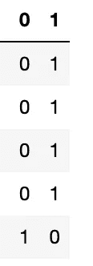

# 虚拟变量陷阱深入！

> 原文：<https://medium.datadriveninvestor.com/dummy-variable-trap-in-depth-8b562131dd58?source=collection_archive---------13----------------------->

## 本博客旨在解释与虚拟变量相关的问题，即虚拟变量陷阱。从问题的来源/起点到问题的解决方案，将涵盖与虚拟变量陷阱相关的所有内容。

Source: [Aditya Chinchure](https://unsplash.com/@adityachinchure) via Unsplash

数据科学是当今最热门和最受欢迎的领域，要成为一名数据科学家，了解数据预处理是至关重要的，因为它是数据科学领域的一个重要组成部分。

> **在做数据预处理的同时，每次都要做“特征工程”。“虚拟变量陷阱”是特征工程中出现的问题。**

现在，话虽如此，让我们开始这篇博客&首先，让我们谈谈虚拟变量陷阱的起源。

# 虚拟变量陷阱的来源！

这是因为多重共线性。如果数据集中存在多重共线性，那么肯定会出现哑变量陷阱。

如果你不知道多重共线性，我想请你浏览下面提到的关于多重共线性的博客，它将涵盖关于它的一切。

 [## 深潜多重共线性！

### 这个博客旨在解释多重共线性的概念，这是非常重要的数据预处理，这是…

harshitdawar.medium.com](https://harshitdawar.medium.com/deep-dive-multicollinearity-7737754aae03) 

# 什么是虚拟变量陷阱？

在这种情况下，所有虚拟变量/独热编码特征都用于训练模型。在这种情况下，由于多重共线性，使用所有虚拟变量训练的模型将不会提供准确的结果，或者可以说训练的模型将是有缺陷的。

## 例如:

让我们考虑一些数据集的“性别”特征，它默认包含两个值，即男性和女性。在对其进行一次热编码或生成虚拟变量后，将获得 2 列，其中一列对应于男性，另一列对应于女性。根据数据集中人员的性别，每列将包含值 0 或 1。

数据集将如下所示:

**Gender column after One-Hot-Encoding!**

由于数据集中存在多重共线性，因此会出现虚拟变量陷阱。

可以清楚地看到，如果一列值为 0，则另一列值为 1，反之亦然。因为一列的值可以很容易地用于预测另一列的值，所以当这种类型的数据集用于训练模型时，模型的基础算法将计算数据集的每一列/特征的权重。

 [## 一瞬间学会数据科学！？数据驱动的投资者

### 在我之前的职业生涯中，我是一名训练有素的古典钢琴家。还记得那些声称你可以…

www.datadriveninvestor.com](https://www.datadriveninvestor.com/2020/07/23/learn-data-science-in-a-flash/) 

由于一个列/特征的值可以使用另一个列/特征来计算，这就是为什么计算每个列/特征的权重会增加模型输出的混乱/误差。

> 由于每个特征的权重存在于模型的基础算法的等式中，所以每次模型预测输出时，该输出中都会有较高的误差。这就是为什么它被称为虚拟变量陷阱。模型在生成输出时陷入误差项。

# 虚拟变量陷阱的解决方案！

**为了解决虚拟变量陷阱的问题，必须从数据集中移除任何一个热编码特征。**

例如:在上面的数据集中，在对性别特征进行一次热编码后生成了两列，应该删除其中的任何一列，以解决伪变量陷阱的问题。

> 移除一列可解决虚拟变量陷阱，因为移除列后，多重共线性(虚拟变量陷阱的来源)将从数据集中消除。

***我希望我的文章用所有深刻的概念和解释来解释与主题相关的每一件事。非常感谢你花时间阅读我的博客&，增加你的知识。如果你喜欢我的作品，那么我请求你为我的博客&鼓掌，关注我的*** [***中***](https://harshitdawar.medium.com/)***&***[***GitHub***](https://www.github.com/HarshitDawar55)***！***

**访问专家视图—** [**订阅 DDI 英特尔**](https://datadriveninvestor.com/ddi-intel)