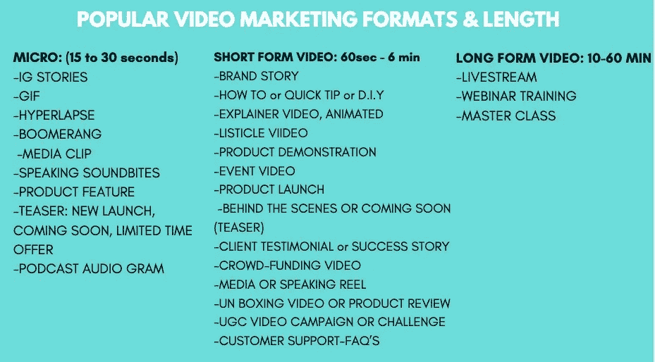
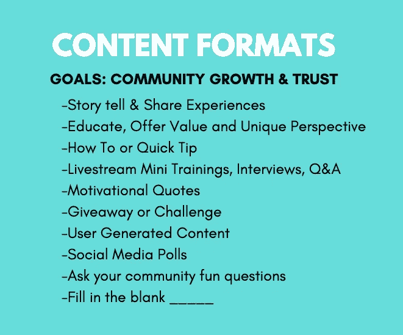
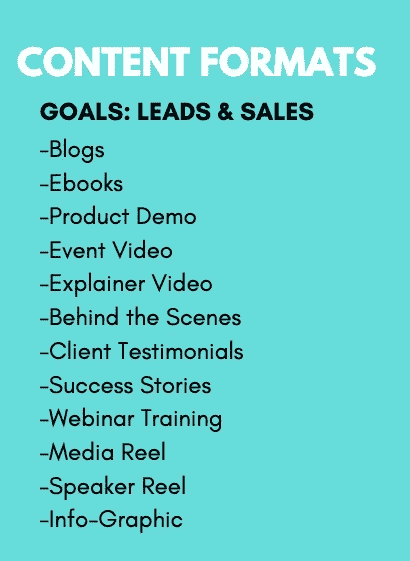
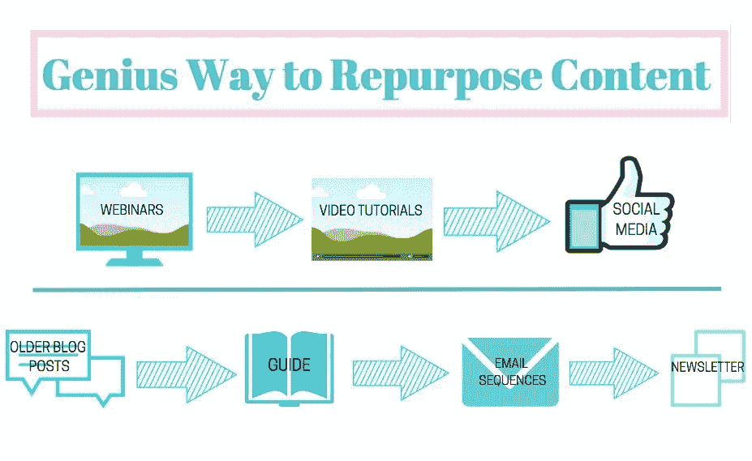

# 发电机给他们的市场通电

> 原文：<https://medium.datadriveninvestor.com/dynamos-electrify-their-markets-c6f4019864db?source=collection_archive---------21----------------------->

## 在线专家将生产力提升到最高水平

“就像沙漏中的沙子，我们的生活也是如此。”不管时间过得是慢还是快，成功的营销者都会抓住时机。

[丽贝卡·拉迪切](https://twitter.com/RebekahRadice/)咬下并管理几天、几周或几个月的时间，以保持领先。呆在家里无所事事是不可取的。

作为营销绩效策略师和[的联合创始人 BRIL。LA](https://bril.la/) 是一家女性所有的客户体验设计公司，拉迪切依靠动态的社交媒体和内容日历战略。由此，她产生了引人入胜、值得点击的标题。

千禧一代专家、全球发言人和 LinkedIn 讲师切尔西·克罗斯特(Chelsea Krost )在 Krost 的#MillennialTalk Twitter 聊天中采访了拉迪切，谈论了社交媒体的所有事情，包括战略、内容、销售流程、工具和更多生产力技巧。

 [## 在 280 个字符或更少的字符中导航混乱

### 战略性地思考，以便在事情变糟时做好准备

medium.com](https://medium.com/datadriveninvestor/navigating-turmoil-in-280-characters-or-less-1043c9207789) 

即使世界看起来像是服用了类固醇的危机管理，一个全面的社交媒体策略也应该将灾难考虑在内。

“开始网上交流，”克罗斯特说。“如果你习惯于参加现场活动，现在你会花更多的时间在社交媒体上。每天花点时间在你的目标受众所在的平台上。

“创作与当前环境相关的内容，”她说。“人们花更多的时间在网上消化内容。这是接触更多人的好机会。即使你还没有赚钱，[分享价值，形成*关系*](https://medium.com/@JKatzaman/marketing-is-not-relationship-at-first-sight-4d0d6a3d966e?source=friends_link&sk=65cfab2ffba13dea993303f600b4b7f8) 。”

知道没有人是孤独的，你会感到安慰。

“每个人都在一起经历孤立和不确定性，”克罗斯特说。“我喜欢看到每个人在社交媒体甚至国家广播电视上的内容都是真实的、真实的、真实的。是时候变得更有人情味——更有亲和力了。”

拉迪切说，调整社交媒体策略会考虑到这些更新:

*   音调
*   消息
*   语境
*   内容
*   时机

# **创新资源**

“现在不是在社交媒体上保持沉默的时候，”拉迪切说。“更新你的策略，以满足你的观众的需求。

“现场视频互动增加了 50%以上，”她说。“当你的观众通过观看视频来提高技能、学习新的爱好、获得收入、确定你可以教授、指导和培养什么时。使用视频分享信息。做一个资源。”

内容可以在每个阶段和每个渠道建立信任。例如，拉迪切看到了这些阶段:

*   陌生人
*   游客
*   领导
*   客户
*   促进者

“在每个阶段，创建一个符合意图的内容计划——他们需要什么，”拉迪切说。

“这是一个难以置信的困难时期，”她说。“这是非常不稳定的，涉及到太多的恐惧。你的生意有起有落，你过得怎么样？”

 [## 危机管理在“飞机”上飞行真相

### 公共关系和新闻业可以挽救声誉

medium.com](https://medium.com/datadriveninvestor/crisis-management-flies-on-plane-truth-7bec6139921) 

在危机中，把[自动化放在次要位置](https://becominghuman.ai/business-automation-is-not-automatic-7157210953af?source=friends_link&sk=8a6d967a81be48b56a2b2e21324e38fc)。这是一个强调价值的时候了。不要冒险张贴对重大事件不敏感的内容。

拉迪切提出了成功的社交媒体内容战略的七个要素:

*   追踪你的起点
*   了解你的受众
*   选择社交网络
*   成为宝贵的资源
*   建立节奏、语调和声音
*   创建一致的时间表
*   做一个网络专家

然后根据这些目标编写高质量的社交媒体内容:

*   推动交通
*   引起注意
*   创建对话
*   鼓励行动

“你写得越多，你就变得越好，”拉迪切说。“你做得越好，你创造的动力就越大。势头越猛，机会越多。

“我已经更新了我的[*【11 个有效社交媒体商业计划的基本要素】*](https://rebekahradice.com/effective-social-media-business-plan/) ”她说。“虽然社会战略没有放之四海而皆准的解决方案，但只要计划得当，你就能取得成功。”

# **让他们想要更多**

克罗斯特列举了她自己的社交媒体战略方法:

*   定义明确的目标，如认知、名单构建、销售和参与。
*   定义你的目标受众。
*   创建内容库—静态和视频—并保持一致性。
*   把每一部分内容都想象成一次迷你训练。
*   给出一口大小的价值，并在你的行动号召中争取更多。

"*思考*:你的目标是什么？"克罗斯特说。“如果你创作内容是为了最终吸引和转化你的观众，那么在规划内容时你需要一个策略。

“提供内容后你带人去哪里？”她说。“例如，你心中有没有产品或服务？你将如何推动他们实现这一目标，比如登陆页面、网络研讨会、电子邮件漏斗等？”

 [## 策略在第一步行动前就形成了

### 答案在于理解你的兔子

medium.com](https://medium.com/datadriveninvestor/strategy-gels-before-the-first-move-2fad198008d5) 

Krost 推荐了以下工具来创建和执行社交媒体战略:

*   [Canva](https://twitter.com/canva/) 用于图形创作
*   [营销视频的 Animoto](https://twitter.com/Animoto/)
*   [Hootsuite](https://twitter.com/hootsuite/) 作为调度工具
*   [plan only](https://twitter.com/planoly/)作为 Instagram 日程安排工具
*   [BuzzSumo](https://twitter.com/BuzzSumo/) 用于内容研究

视频是最受关注的内容之一。它在喧嚣中脱颖而出，尤其是在混乱中。拉迪切认为这七种社交媒体内容表现最好:

*   拥有
*   报告的
*   实时
*   教育的
*   增进的
*   对话的
*   媒体

“每个网络都是不同的，”拉迪切说。"根据观众的胃口和兴趣进行测试，找出最有效的方法."

她考虑了这些因素:

*   活着还是快死了
*   博客帖子
*   网络研讨会
*   电子书
*   个案研究
*   特别报告
*   工作簿和下载
*   播客
*   清单或操作指南
*   视频指南

“从娱乐性的视觉效果到现场视频，发挥创造力，创造出你的完美组合，”拉迪切说。“我使用像 [Anchor](https://twitter.com/anchor/) 这样的工具将播客重新制作成视频。这使得分享一个短片和突出一个重要部分变得互动和容易。”

# **个人解决方案**

Krost 对突出内容的偏好侧重于特定平台上的最佳格式:

*   LinkedIn 和 Twitter:仅博客文章、视频、图形和文本。
*   Instagram Feed:微博、视频、出色的视觉效果形成了一个有凝聚力的 Feed。
*   Instagram 故事:原生视频，民意调查，报价，幕后。少了点结构化，多了点俏皮。

在公认的“文本图形”中，Krost 拥有按长度细分的流行视频营销格式:

*   微视频:15 到 30 秒
*   短片:一至六分钟
*   长视频:10 分钟到 1 小时

对于品牌认知度和社区增长来说，用户生成的内容与其草根出身有很大影响。品牌冠军是终极的、亲密的影响者。

“建立品牌和社区的内容把你的客户和他们的决策阶段放在第一位，”拉迪切说。“这就是数字营销传道者 Avinash Kaushik 所说的‘看、想、做、关心’。”

“通过这一点，消费者可以看到你提供的东西，思考各种选择，互动和联系，并关心你的解决方案，”她说。“将正确的内容与正确的意图结合起来。”

 [## 公司啦啦队员对你赞不绝口

### 敬业的员工向公众宣传他们的公司

blog.markgrowth.com](https://blog.markgrowth.com/company-cheerleaders-shout-your-praises-b0b24ca1014c) 

这带来了意识:

*   你如何帮助和解决问题
*   你是谁，你做什么，你帮助谁
*   感言、故事和成果

社区了解更多信息:

*   发生了什么，接下来会发生什么
*   在幕后
*   常见问题解答

Krost 编制了内容格式，以探索品牌意识和社区增长是什么时候的目标。

[包含销售线索磁铁](https://blog.markgrowth.com/lead-magnets-attractive-ways-to-get-your-foot-in-the-door-2005d8be6f96?source=friends_link&sk=486e392d0e5fa857a8efc14adaae5512)的内容将会吸引读者想要了解更多关于公司产品和服务的信息——让潜在客户成为达成交易的人。

“一个明确的社交销售过程给了你的潜在客户确定性，自然会引导他们找到解决方案，”拉迪切说，并举例说明了从对话到转化的过程:

*   个案研究
*   产品演示
*   详细指南
*   量身定制的研讨会

# **给出明确的数值**

“神话是更多的流量等于更多的转换，但事实并非总是如此，”拉迪切说。“如果你想让你的观众采取行动，就要创造有价值且意图明确的内容。这有助于潜在客户在做出购买决定时摆脱困境。”

在人们被编入电子邮件列表后，一个精心制作的欢迎系列广告可能有助于推动他们购买，这取决于货币价值。

 [## 电子邮件的力量来自数据|数据驱动的投资者

### 如果安静的周末过后，收件箱看起来异常的满，那可能不是你的想象。研究表明，周一…

www.datadriveninvestor.com](https://www.datadriveninvestor.com/2020/04/20/emails-power-surges-from-data/) 

“这绝对是关键，”拉迪切说。“你的培育电子邮件活动需要考虑很多。正确的邮件文案会让读者从感兴趣转变为准备采取行动。”

Krost 还拥有有效的内容格式，可用于潜在客户开发和销售。

视觉内容决定了第一印象，但如果没有相关的文本作为支持，这是一种浪费。

“出色的视觉效果会吸引你的观众，”拉迪切说。“出色的文案让他们不断回来购买更多。简单地说，视觉内容是你成败的关键。复制传递了强烈的第一印象。两者都支持你的品牌、声音、个性和转化能力。

“如果你想吸引你的观众，让字幕容易理解，”她说。"你的内容可读性越强，就越容易参与其中并采取行动."

拉迪切通过[海明威应用](https://twitter.com/HemingwayApp/)运行所有内容，以保持内容醒目、清晰明了。她争取八年级阅读水平分数。

“我父亲给我的一些最好的建议是像和你最好的朋友交谈一样写作，”拉迪切说。“我们把写作方式弄得太复杂了。[和人说话](https://medium.com/datadriveninvestor/your-story-starts-with-the-spoken-word-5b86ce1dcf2f?source=friends_link&sk=acc2b149ce2ac35af7133943230377e2)，不要冲着他们说话

克罗斯特同意这一评估。

她说:“个人更喜欢视觉效果，而不是文案。”。“在帖子和标题中考虑与你所在行业的趋势相关的优质图片和*关键词*总是有益的。标签也是如此。

# **学会步伐**

对于那些纠结于时间管理的人来说，划出时间进行批量写作，但不要过度。安排合理的休息。

“当谈到创建一个批量库时，首先要考虑哪些内容是常青树，”Krost 说。“你现在能创作出哪些内容能持续更长时间？常青树内容对*视频*来说很棒。”

 [## 常青树发芽新生命

### 接受旧的内容，让它重生

medium.com](https://medium.com/datadriveninvestor/evergreens-sprout-new-life-c41810f6b654) 

测试内容的最好方法之一是在出版前让其他人阅读，而不是专业作家。普通人会阅读最终产品，他们的意见对理智检查最重要。

“注意数据，”拉迪切说。“有了它，你就能看到你的观众有什么共鸣。”

这是她要追踪的三个关键绩效指标:规模、有效性和效率。

“创建一个跟踪、测量和迭代的系统，”拉迪切说。"这成为一个可重复和可持续的增长过程."

她遵循这些方法，在社交媒体上获得了成功:

*   打造你的品牌。
*   精心准备你的信息。
*   确立你的声音和语气。
*   找到你的观众。
*   分享价值。
*   进行互动。
*   先给予再索取。
*   感兴趣。
*   有求必应。
*   提供一条清晰的前进道路。

“给你的内容策略至少三个月的时间来测试、跟踪、完善和重复，”Krost 说。"[社交倾听](https://www.datadriveninvestor.com/2019/02/26/social-media-listening-keeps-you-plugged-in/)并在此过程中众包来自你的观众的反馈。"

为了帮助在不同平台和社交媒体渠道分享多样化的内容，偶尔休息一下，回顾一下你最近和长期写的东西。你是在重复自己还是在墨守成规地写作？

“一天只有这么多时间，”克罗斯特说。“没有必要为每个渠道重新发明轮子。通过将内容转换成与每个频道的人口统计数据相呼应的各种格式，使内容多样化。”

# **管理工具**

有了战略在手，社交媒体就不得不争论一番。

“从内容创作到日常事务，知道如何管理社交媒体可能会令人困惑，”拉迪切说。有一些她日常使用的工具:

*   [土坯火花](https://twitter.com/AdobeSpark/)
*   [Agorapulse](https://twitter.com/Agorapulse/)
*   [体式](https://twitter.com/asana/)
*   [品牌 24](https://twitter.com/brand24/)
*   [BuzzSumo](https://twitter.com/BuzzSumo/)
*   [Commun.it](https://twitter.com/commun_it/)
*   [Droplr](https://twitter.com/droplr/)
*   [光线摄影狐狸](https://twitter.com/PhotofoxApp/)
*   [顺风](https://twitter.com/TailwindApp/)

 [## 重新审视内容

### 及时是所有社交媒体渠道的最佳实践

medium.com](https://medium.com/datadriveninvestor/take-a-fresh-look-at-content-1d08cb6763c) 

拉迪切的日常行动计划回答了这些问题:

*   你正在采取什么行动？
*   这个行动发生在哪里？
*   你什么时候执行这个动作？
*   为什么这个行动很重要？
*   *该行动如何*支持整体战略？

根据 Krost 的需求，以下是她最喜欢的社交媒体管理工具:

*   链接:[链接树](https://twitter.com/Linktree_/)
*   剪辑: [Adobe Lightroom](https://twitter.com/Lightroom/) ， [Adobe Photoshop](https://twitter.com/Photoshop/) ， [PicsArt](https://twitter.com/PicsArtStudio/) ， [CutStory](https://twitter.com/CutStory/)
*   视频: [Animoto](https://twitter.com/Animoto/) ， [GIPHY](https://twitter.com/GIPHY/)
*   客户资源管理和名单建立: [Mailchimp](https://twitter.com/Mailchimp/)
*   计划和跟踪: [Hootsuite](https://twitter.com/hootsuite/)

**关于作者**

吉姆·卡扎曼是拉戈金融服务公司的经理，曾在空军和联邦政府的公共事务部门工作。你可以在[推特](https://twitter.com/JKatzaman)、[脸书](https://www.facebook.com/jim.katzaman)和 [LinkedIn](https://www.linkedin.com/in/jim-katzaman-33641b21/) 上和他联系。