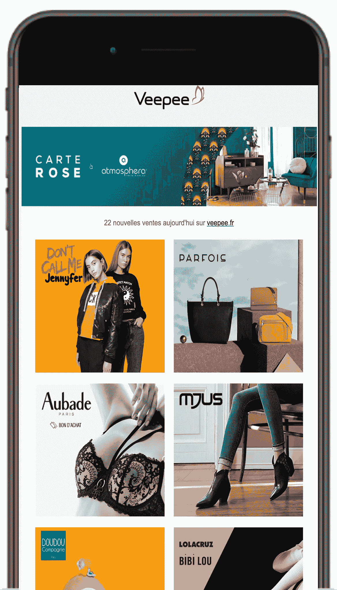
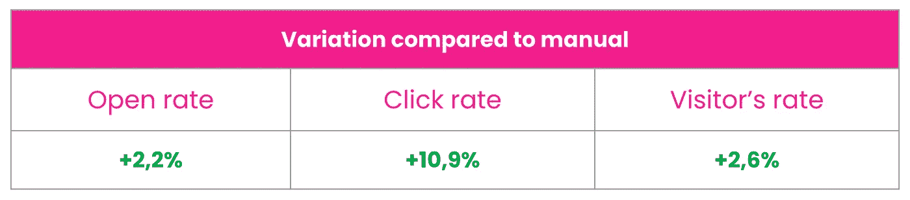

# 电子邮件营销没有死亡

> 原文：<https://medium.datadriveninvestor.com/e-mail-marketing-is-not-dead-24ee2ec1c5c?source=collection_archive---------16----------------------->

## 当你添加个性化，它仍然是一个发电站。

Photo by [Stefano Pollio](https://unsplash.com/@stefanopollio?utm_source=medium&utm_medium=referral) on [Unsplash](https://unsplash.com?utm_source=medium&utm_medium=referral)

你们中的大多数人可能听过下面的陈述。

> 电子邮件营销基本上是垃圾邮件，肯定没有人值得阅读你的电子邮件广告。

然而，在我工作的公司(电子商务行业)，它仍然是业务的最大驱动力。让我们来看看我为什么以及如何仍然相信电子邮件营销的不同方式。

1.  **是个人**。有人与你分享了他们的电子邮件地址，所以在那个特定的时刻，存在着基本的信任。如果你能建立一个与他们相关的个人信息/提议，你就有机会建立最初的信任。
2.  **是你的**。一些数字营销者似乎高估了影响者和付费广告，而忽视了与你的社区直接联系的价值。平台拥有“你的受众”,并将最终影响你的投资回报和预算。你培育的电子邮件列表是你一个人的。
3.  **电子邮件免中间人费用**。构建优秀的内容和增加个性化既不是免费的，也不便宜。一旦你可以用你自己的相关数据来塑造内容，运行 A/B 测试，你就可以从最初的投资中不断提高投资回报率。

一封电子邮件的成本不会在黑色星期五期间变得更贵，也不会在脸书或谷歌推出新功能/活动时让你的竞争对手抢先一步。

让我用一个具体的例子来分享我们的方法。

到目前为止，我们最大的业务驱动因素是什么？

> **日常邀请邮件**。根据国家的不同，大约 40%的购买归因于日常电子邮件的点击。

由于我们是一家专注于闪购的电子商务商店，我们希望每天通过通知用户我们在网上发布的新交易来邀请他们。

> 这并不是每个行业的最佳实践，所以尽量使你的电子邮件数量与你的商业模式相一致，但最重要的是，与你的社区及其期望相一致！

就像法国这样的单一市场，我们每天早上都在谈论 1000 万封电子邮件。所有这些都是为每位顾客量身定制的。

每个人的标题、品牌选择和选择顺序都不一样。基于过去的购买、最近的访问行为和您过去的搜索。我们还研究了可比较的集群和人物角色，以了解当您没有与我们假设您会进行交互的内容进行交互时，您可能会对哪些内容感兴趣。

我们不断更新处理这种个性化的算法。我们从对人物角色的手动调整发展到自我训练算法(机器学习)。上个月 10 和 11 版本之间发生了什么？

Picture screenshot by the author

基本上，我们通过标题定制提高了打开率，通过优化每个成员的交易排序提高了点击率。

对我们来说，日常邀请并不是新的电子邮件。这不是一个新系统，个性化已经达到版本 11。然而，每个月，我们都会学到一些新的东西，并能加以改进。玩不同的标题，调整每个国家甚至一个更大的国家的地区的发送时间，并根据人物调整邮件的长度？所有的一切！

但是电子邮件只是收集在垃圾邮件或促销文件夹中！？

*我们经历过名单注销吗？*当然。每月有 2%的稳定注册率会退出电子邮件。我们建立会员获取系统，有机地扩大我们的名单，并改善我们的产品，以提高口碑广告。

*以这样的日成交量，我们会经历开盘价下降吗？*当然。当我们看到开放或互动随着时间的推移而下降时，我们每周或仅针对特定品牌自动提出调整建议。

在 Gmail 中创建促销文件夹对结果有影响吗？当然。最初，我们看到开盘率有所下降。然后，我们调整了我们的时间安排，以确保在您所有促销活动的早上进行的单次刷卡不包括我们的电子邮件，方法是为每位客户进行适当的时间安排。

*我们是否看到了人口统计学上的差异？当然可以。在加入我们的社区之初，不同代人甚至不同性别之间对日常邮件的看法是不同的。我们着重于不同的讲故事模式来解释我们的商业模式和我们的其他选择，以跟上我们的产品。*

年轻一代选择安装我们的原生应用，对推送通知反应更好。

(目前)少数人只想要移动网络体验，对任何通知或电子邮件通信都持否定态度。

这很好；它促使我们在没有外部诱因的情况下，在客户旅程中寻找优化。我们注意到的是，通过脸书/谷歌广告，这些广告也很贵。他们通常对广告怀有敌意。对我们来说，挑战在于向他们提供符合他们标准和期望的产品和体验，而不是找到“更好”的方式来满足他们。

## 大家讨论一下吧！

我真的对你关于电子邮件营销在你自己的营销组合中的可行性的观点很感兴趣，所以请在评论中告诉我你的想法！