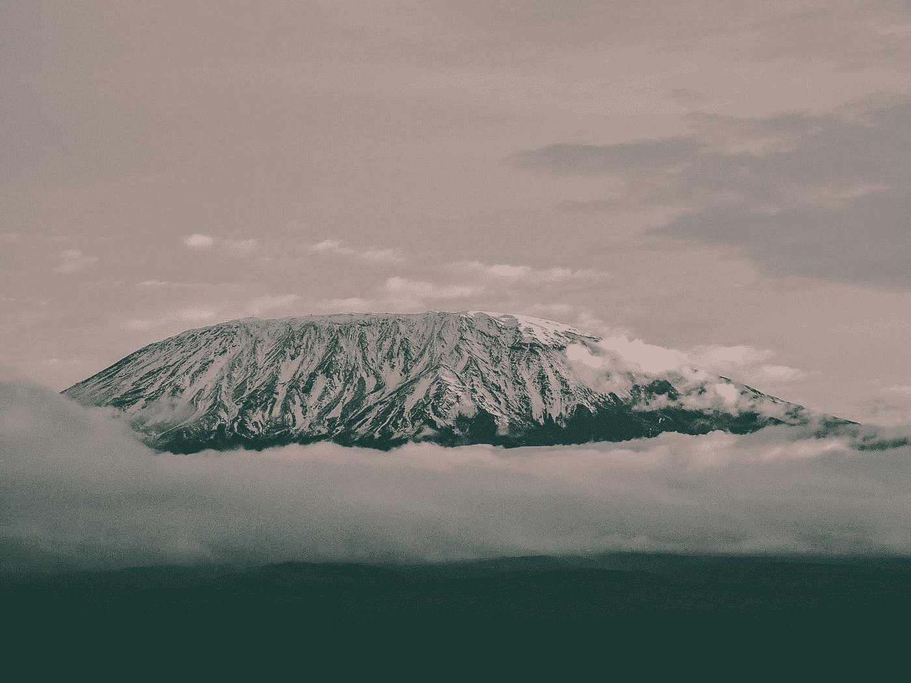
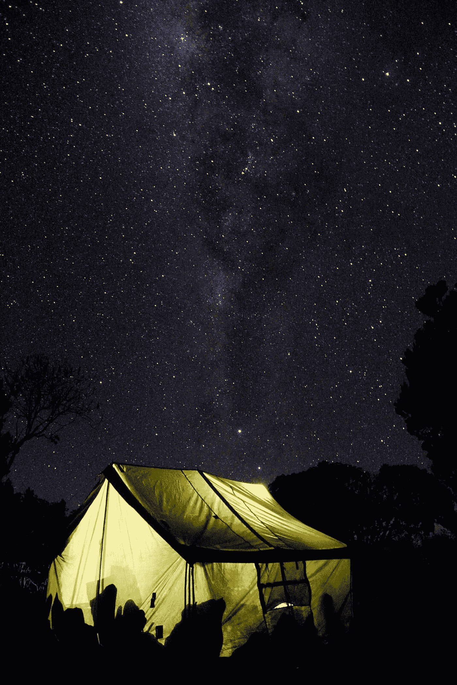

# 莫希的清晨

> 原文：<https://medium.datadriveninvestor.com/early-morning-in-moshi-186020f936ac?source=collection_archive---------4----------------------->

Photo by [Harshil Gudka](https://unsplash.com/@hgudka97?utm_source=medium&utm_medium=referral) on [Unsplash](https://unsplash.com?utm_source=medium&utm_medium=referral)

## 乞力马扎罗山中心，离马查姆门不远

我坐在宽敞的餐厅里，一位身材高挑的当地妇女穿着斯特拉马里斯酒店员工喜欢穿的彩色蓝色衬衫，默默地拖着地板。早上 6 点左右没有人。昨晚一群人从山上下来，他们筋疲力尽，正在睡觉。今天会有更多的人出发，他们都很兴奋，目光明亮，对成功充满信心。

我在乞力马扎罗山搬运工援助项目(KPAP)呆了三天之后，昨天回到了这里，这是一个非营利性组织，旨在确保搬运工在山上的福利和安全。今天早上，在 Machame Gate(最受欢迎的上山路线),大约有 100 名男女将再次带上他们的工具包(个人拥有的登山装备),希望得到搬运工的工作。

 [## 摔倒不是失败。

### 你只有在放弃的时候才会失败。每个英雄都会倒下，我们活着就是为了失败者出现的时刻；上升到…

www.datadriveninvestor.com](https://www.datadriveninvestor.com/2019/01/17/falling-isnt-failing/) 

他们中的一些人可能每天挣相当于 5.00 美元的美元，这是一项极其艰苦的劳动，要在长达 9 天的时间里将 55 磅重的东西拖上山。登山者和搬运工使用的大约 44 磅的装备，以及大约 11 磅左右他们自己的个人物品。如果他们幸运的话，这是如果，他们可能会为他们的麻烦赚几美元的小费。

KPAP 是这样一个组织，它通过邀请登山公司成为合作伙伴公司，最大限度地确保这些搬运工不仅赚取乞力马扎罗山利益相关者在 2015 年商定的最低工资(2 万坦桑尼亚先令，或每天约 8.65 美元)，而且还享受你我作为登山者想当然的同样的安全条件。这将包括不漏水的帐篷，良好的床单，足够的空间在晚上睡觉而不会感觉像沙丁鱼一样，在寒冷的天气里各种身体部位挂在帐篷门外，以及一天三次充足、健康的食物来补充艰苦的攀登和下降。

更不用说好鞋、暖和的羽绒服、好手套、雨具、帽子、太阳镜、内衣了。你和我可能会说，那不言而喻。但是搬运工可以不用。KPAP 合作伙伴公司同意确保他们的搬运工和我们一样装备齐全(他们有一个针对新手搬运工的可靠的装备租借计划)。KPAP 希望使乞力马扎罗成为公平和道德对待所有搬运工的首要山区。

在乞力马扎罗山工作的大约 2 万名搬运工中，到目前为止，略多于三分之一，即大约 7500 人，受到 KPAP 伙伴公司条件的保护。这是一个很好的开始。他们知道的原因是，通过这些伙伴公司完成的每一次基利攀登都有一名经过 KPAP 训练的调查搬运工随行。搬运工在纸上或电话上做了大量的笔记，然后将整个行程完整地报告给 KPAP。

在过去的两天里，我花了很多时间观看和聆听那些全面的报道。它们包括验证旅行中有多少人(导游和人的比例也由公园管理局决定)和搬运工的数量，这是由被拖上山的总重量决定的。然后，报告深入探讨了相关条件的细节:你是如何得到报酬的，多少，你是通过导游或公司代表还是通过银行得到报酬的，下山后多久，小费是多少，小费是否透明(换句话说，所有搬运工是否准确知道登山者给了多少钱，金额是否用斯瓦希里语和英语公布？)，帐篷条件，睡觉条件，还有食物。该公司是否检查了搬运工的装备，每个人必须携带多少行李，行李是在门口称重还是在门口称重(另一个公园要求)，甚至对搬运工的行为发表评论。如果人们被辱骂，或者一个搬运工试图欺骗，或者一个向导隐藏了金融交易:这个列表非常详细。

KPAP 的每个合作公司都要接受这种审查，原因有几个。他们获得非常详细的信息，这些信息可能表明员工或设备问题，或者潜在的行为问题。这些公司认识到，当搬运工收入丰厚，他们的健康受到保护，山上的条件良好时，登山者就能更好地确保旅途安全，船员也快乐健康。这还不是全部。这些公司根据他们自己设计的从小费到帐篷等一切事物的重要性评分。每年两次，在每个登山季节之后，他们会收到一个总分，需要达到至少 85%的绩效水平才能继续作为合作伙伴公司。(这个地区有两个登山季节:从 12 月中旬到 3 月底，然后是 6 月到 10 月)。这个分数是致力于正确治疗的伙伴公司的骄傲，也是致力于乞力马扎罗山道德冒险的登山者的一个很好的卖点。

这种内部洞察力和衡量不仅对合作公司的成功至关重要，对坦桑尼亚乞力马扎罗山的旅游业也是如此。因为越来越多精明的登山者不仅想知道他们的支持团队获得公平的工资和良好的待遇，还想知道那些带他们进行这项挑战性攀登的人是否处于最佳状态。这不仅仅是公平的问题。这是一个巨大的安全隐患。

然而，许多搬运工可能没有这些工作条件。

一年中第一个较短的季节大约从 12 月中旬开始，到 3 月下旬结束，这个季节现在是它的最后一个月。昨天早上，我站在 Machame 门口与搬运工交谈，在许多情况下，他们从几英里外来到山上找工作。有些人睡在商店的地板上。在一个案例中，一名男子在找到工作之前一直住在大门附近，在他的案例中，他很幸运有一个住在附近的兄弟，他可以提供食物和睡觉的地方。不是每个人都这么幸运。

他们的故事常常令人心碎。有些人上个赛季可能爬了两三次，通常每天能得到 3-7 美元。他们的小费很少。这些人——男男女女的搬运工——要养家糊口。这个地区除了农业没有其他工作，也没有政府失业援助计划。

有一个人在这个季节已经来到这个大门十次了，但仍然没有完成任何攀登工作。他把包放在门口，以避免每次来回搬运，但现在包放在了他的背上。他会回去种田，他说，深感失望。提供的压力铭刻在他疲惫的脸上。

在过去的几天里，我和搬运工聊过天，他们的帐篷在下雨的时候会漏水，或者他们一天只能吃到*一顿饭。不仅仅是一顿饭，而且薪水很低，小费也有限。然而，他们工作的绝望性质可以迫使搬运工接受这样可怕的标准。*

其他等待工作的人解释了他们与非 KPAP 伙伴公司攀登的性质。传统上对待搬运工的文化正在改变，尽管速度很慢。在西方我们可能认为理所当然的工人权利的概念，在这里仍然是一个新概念。例如，每个搬运工应该根据旅途中有多少登山者以及多少搬运工而得到公平的小费。

两名搬运工在坦桑尼亚的烈日下等待工作，他们解释说他们的小费有限。小费在补偿工资上涨方面起着重要的作用，它提供了适当的生活工资来补充工资数额。许多人给导游小费时以为他/她会公平分配，但事实可能并非如此。

这就是为什么小费透明度，KPAP 合作伙伴公司绩效的一个关键方面，在他们的评分中占很大比重。即使你来自一个小费不是文化的一部分的国家(比如我今天遇到的一位荷兰绅士，他颇有力量地说他“讨厌整个给小费的过程”)，理解小费是整个攀登成本的一部分也是很重要的。你和我需要为他们做计划，并且知道我们留出的小费是他们总收入的一个非常重要的部分，也是 KPAP 报告中的一个重要统计数据。甚至那位荷兰绅士也说，当他和他的同伴每人多给搬运工 10 美元时，他们是多么高兴。你可以理解为什么。

今天早上，我和两位年轻的伦敦人聊了聊，他们刚刚吃完早餐。他们今天将与 KPAP 合作公司一起上山，这是他们安全旅行和沿途乐趣的最佳保证。他们得到了很好的照顾，因为作为 KPAP 的合作伙伴，该公司不仅同意这些标准，还同意让一名 KPAP 调查搬运工随行。女孩们兴奋不已，我毫不怀疑她们会做得很好。

# 根据 KPAP 的记录，去年，该组织确保了约 55000 名搬运工的安全攀登。

这是一个惊人数量的生命受到适当的程序保护。这些搬运工也支持并帮助确保数千名登山者的安全。

Photo by [Tom Cleary](https://unsplash.com/@tcleary12?utm_source=medium&utm_medium=referral) on [Unsplash](https://unsplash.com?utm_source=medium&utm_medium=referral)

如果你是一名登山者，或者想去坦桑尼亚攀登这座雄伟的山峰，我强烈建议你做几件事:

1.  留在斯特拉马里斯(这是一个完整的故事，但请注意，这里的利润支持整个学校的孤儿和贫困儿童，所以另一个伟大的故事，敬请关注)。你会爱上这里的:食物和房间都棒极了，这正是你在艰难攀登后想要休息的地方。
2.  总是要求你的攀岩装备是一家 [KPAP 合作公司](https://kiliporters.org/what-we-do/)。要查看调查期间要问的问题列表，请参见:

 [## 在乞力马扎罗山做一个聪明的消费者

### 让你变得安全和聪明的好问题

medium.com](https://medium.com/age-of-awareness/be-a-smart-consumer-on-kilimanjaro-82164a21e1a9) 

3.带上足够的小费(请提前向你的攀岩公司了解相关信息)

4.要知道，通过做这些事情，你不仅为自己的安全做出了贡献，也为整个社区的健康和福利做出了贡献，这些人致力于确保你安全地攀登，爬得很高，回来时脸上带着微笑，而且对那些带你登上非洲屋脊的辛勤工作的男男女女也是如此。