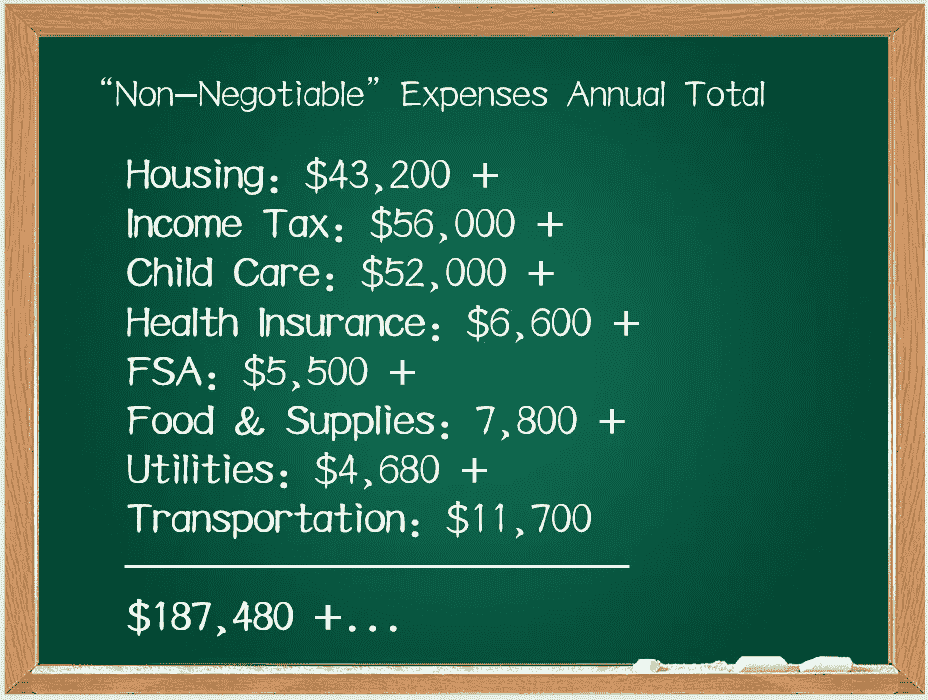
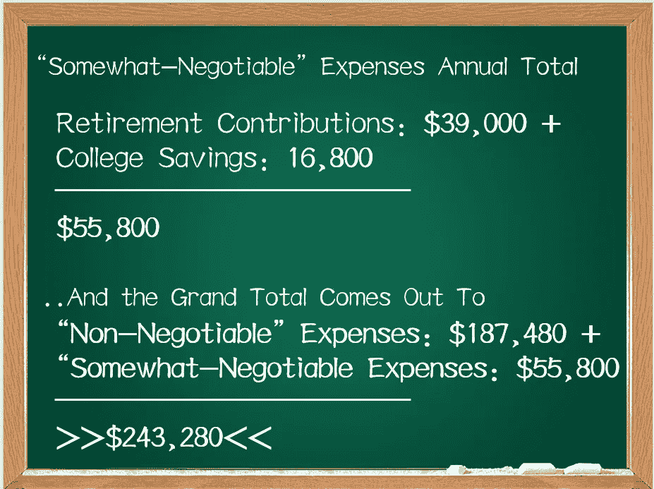

# 年收入 243，000 美元来支付基本费用。不是你吗？那么，我们面临的是权衡取舍。

> 原文：<https://medium.datadriveninvestor.com/earning-243-000-a-year-to-cover-the-basics-ddfefafda5df?source=collection_archive---------9----------------------->

## 中产阶级的故事

## 年收入 243，000 美元会让你感到手头拮据吗？在美国大都市地区抚养两个孩子的成本令人沮丧，答案可能只是“是的”。

2017 年，我和妻子参加了一项越来越受欢迎的旧金山活动:*为我们的生活奔跑，寻找更低的生活成本。我们搬到科罗拉多州的丹佛，组建了一个家庭。我是一个很有自知之明的人，我意识到，和加州的其他人一起搬到这里，我们帮助抬高了许多成本，我将和你一起经历这些。为了这篇文章的目的，我想请你把对我们选择的任何敌意放在一边，纵容这位被挤出湾区的加州人思考在今天的美国中产阶级取得成功意味着什么。*

我在整个 2020 年都在听政治竞选活动，有很多关于“主街”、郊区和中产阶级化的谈论——所有这些都经常与中产阶级一词互换。我开始想知道“中产阶级”是什么意思，因为一个共同的定义似乎难以捉摸。中上，中上，中下？它是基于收入、财富、文化还是教育——也许所有这些的结合？缺乏共同的定义和由此产生的基准数据让我感到不满意，弄不清我自己为成功所做的努力是如何与同“类”的其他人相叠加的。

我希望对这个问题有所了解。

事实证明，谈论金钱是一个敏感的话题，如果不是禁区的话。在我的朋友们*会*敞开心扉的情况下，我了解到我们本质上都面临着同样的焦虑，试图适应中产阶级的生活方式，更令人痛苦的是，新冠肺炎疫情今年经常给我们带来的:休假、彻底裁员或减薪。

所以，我决定用我自己对这个话题的专注，通过写这篇文章来引发一场对话。这里的方法是采取一种自下而上的方法，为假设的(上层)中产阶级家庭建立共同支出，得出一个收入数字来说明一个观点。

在查看了抚养一个家庭的总成本后，我将我认为不可协商的费用(住房、州/联邦所得税负债、儿童保育、健康保险、食品、公用事业和交通)和多少可协商的费用(退休和孩子的大学储蓄)进行了分解。

年薪 243，000 美元是多了还是少了？如果你挣得没那么多，你会面临怎样的取舍？这要由你来评估。但是我想出了一些让你思考的方法:

**“不可转让”费用**

H **ousing [$43，200]:** 很明显这里会有很多变化。但让我们假设一套购买价格为 80 万美元的房子有 30 年的固定抵押贷款。尽管利率处于历史低位，但我们不能忘记拥有的全部成本——本金、**I**利息、房地产轴和风险、保险……或 PITI。3600 美元/月。

I**n 应纳税额【56，000 美元】:**剔除本文标题中的工资，假设税率为 30%是合理的。这将收入者的有效联邦税级加上州所得税捆绑在一起。4682 美元/月。

C **儿童看护[52，000 美元]:** 如果你有两个工作的父母，如果你没有朋友或家庭成员可以在孩子上公立学校之前照顾他们，你就要为此付出代价——毫不夸张地说。为了给两个年幼的孩子提供日托，可以选择使用基于中心的护理或支付保姆或互惠生的家庭护理费用。虽然我在这篇文章的比较信息中找到了一些安慰，但我可以根据第一手经验说，这里列出的平均成本，至少在我所在的地区，比文章中报道的要高。我在这里的例子中使用的成本反映了我所在的丹佛市场中与父母的多次交谈；平均每年 4 万美元。然而，如果你碰巧在地下支付(没有人**这么做，只是为了争论起见)这笔费用是用税后钱支付的……所以在我们的例子中，它实际上花费你 30%以上，使这成为 52，000 美元的年度费用。4333 美元/月。**

健康保险[6600 美元]: 假设你有一个雇主赞助的健康计划，那些补贴的保费仍然会迅速增加。它们是用税前美元支付的，所以是……550 美元/月。

灵活消费账户[5500 美元]:哦，你真的想使用你的雇主赞助计划中的服务吗？你需要达到你的免赔额，支付共付额，并通过作为你计划的一部分的共同保险门槛。用税前美元支付这些款项是很好的(心理上的胜利，坚持系统！)但更多的是自掏腰包。这是不可能的。一个家庭的两个成员每人可以向灵活支出账户(FSA)缴纳 2750 美元，所以让我们继续，并在国税局设定的 2020 年限额内最大化这些缴款，总计 5500 美元。你会需要的，尤其是有两个小孩的时候。458 美元/月。

F **食品和家居用品【7800 美元】:**你喜欢吃吗？我也是。在 Covid 时代，我们在家里做了很多。以至于我会为这一类别每月拨款 500 美元，用于每周在家吃 21 顿正餐。这 6000 美元的支出是用税后资金支付的，所以加上 30%，这实际上最终会让你每年花费 7800 美元。650 美元/月。

U **tilities [$4，680]:** 是的，这段时间在家里呆的时间很长。相应地，我们正在消耗更多的能源和资源在家里取暖、制冷和做饭。这一类别包括天然气、电力、水和高速互联网。我认为这一套每月 300 美元。如果用税后收入来支付，每年 3600 美元的成本就是 4680 美元。390 美元/月。

T **运输[11，700 美元]:** 这一类别可能会有很多变化。但是让我们假设你正在为至少一辆汽车支付汽车贷款，为两辆汽车支付保险，并在一年中为两辆汽车支付汽油费用。出于预算的目的，让我们称之为 750 美元/月。这 9000 美元的支出，是用税后资金支付的，实际上花了你 11700 美元。975 美元/月。

这给我们留下了什么？快速运行总计:

**“有些可商量”的费用(但它们是真的吗？)**

R 所以现在，作为个人，我们要开始比赛存足够的钱让自己过上舒适的晚年。2020 年，美国国税局将员工缴费上限设定为家庭中每个人 19500 美元。让我们计划用税前美元最大化这个(另一个心理胜利！)来规划我们的未来，减轻今天的所得税负担。对于这一类别，我们的预算是每月 3250 美元。

C **大学储蓄[16，800 美元]:** 令人沮丧的是，15 年后，你将在[花费 182，000 美元到 414，000 美元获得一个四年制学位](https://www.northwesternmutual.com/life-and-money/how-much-college-will-cost-in-5-10-and-15-years/)。帮助你的孩子以尽可能少的债务毕业不是很好吗？你当然可以开始向 529 大学储蓄计划(或其他年金类型的选择)缴款来达到这个目标。见鬼，你感觉很慷慨——让我们的目标是，在 2035 年，当他们进入大一时，每个孩子都能得到 20 万美元。做一些简单的计算，并假设 3%的年回报率，你会看到 1400 美元/月(700 美元/月/孩子)。

对于那些在家跟踪的人来说:

> 因此，在这个例子中，我们希望以每年 243，280 美元的收入来支持这种中上阶层的生活方式。回到上面关于“中产阶级”定义及其含义的讨论，这个数字对你来说可能低得可笑或高得不可及。

诚然，你的生活方式可能与我上面描述的场景不同，这取决于你所代表的“中产阶级”的版本——把这作为一个框架，并在某些领域进行替换，以反映你的风格。

虽然我们应该向上流动，但似乎我们可能在倒退。我所经历的成本在未来肯定不会减少。有理由预计，为我们目前的生活方式提供资金只会变得越来越昂贵。也许我们的收入潜力会保持下去……但也许不会，只会引起越来越多的焦虑来维持下去。

为了给你的生活方式提供基本生活资金，你会做出什么样的取舍？由于新冠肺炎，你的工作和存款最近可能消失了——为了尽你所能保持平衡，你还做了什么？