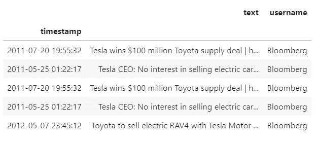

# 为 NLP 从 Twitter 上轻松抓取股市新闻标题

> 原文：<https://medium.datadriveninvestor.com/easily-scrape-stock-market-news-headlines-from-twitter-for-nlp-223ece5761cd?source=collection_archive---------2----------------------->

## 使用现有的 python 包快速抓取各种股票的带日期标签的市场新闻标题。


今天的股票市场波动很大；卡在历史上最长的牛市和永无止境的厄运和绝望的新闻循环之间。这种市场环境产生了相当多的对头条价格高度敏感的股票。

[](https://www.datadriveninvestor.com/2020/02/02/the-best-way-to-use-stock-market-correlations/) [## 利用股市相关性的最佳方式|数据驱动的投资者

### 当阿尔弗雷德·温斯洛·琼斯开创了世界上第一个“对冲”基金(后来“d”被去掉了)时，他让其他投资者大吃一惊…

www.datadriveninvestor.com](https://www.datadriveninvestor.com/2020/02/02/the-best-way-to-use-stock-market-correlations/) 

在这篇文章中，我将介绍我从主要的市场新闻 twitter 账户中建立一个熊猫数据框架的步骤。这些步骤旨在帮助您执行 NLP 技术，如主题建模和情感分析，并最终与股票价格数据相结合，制定基于新闻/事件的交易策略。

# 该过程

1.  在 Twitter 上搜索包含股票代码(TSLA)和公司名称(特斯拉)的新闻标题。
2.  将抓取的推文转换成熊猫数据帧。
3.  清理文本，删除“停用字词”，并转换为 ngrams。

# 第一步:清理推特

使用[这个包](https://pypi.org/project/twitterscraper/) ( [文档](https://github.com/taspinar/twitterscraper))获取历史推文比使用 Twitter API 要容易得多。首先，我们将从终端安装它，然后运行高级 twitter 搜索，并将结果输出到一个 json 文件中:

```
pip install twitterscrapertwitterscraper "$TSLA OR Tesla from:wsj OR from:reuters OR from:business OR from:cnbc OR from:RANsquawk OR from:wsjmarkets" -o tsla_tweets.json -l 10000
```

首先在 [Twitter 高级搜索](https://twitter.com/search-advanced?lang=en)上构建查询，然后复制并粘贴到上面的代码中会有所帮助。作为参考，-o 命名您的输出文件，而-l 限制一个会话中抓取的 tweets 的数量。

如果一切顺利，您应该有一个 json 文件，其中包含几千条多年前的 tweets。如果愿意，也可以在查询中指定日期范围。

# 步骤 2:转换为数据帧

一旦我们有了输出 json 文件，我们就可以打开 Jupyter Notebook 并开始研究和清理文本。

在下面的代码中，我们将转换为 dataframe，将索引转换为 datetime，删除重复的 tweet，只保留每条 tweet 的文本和来源:

```
import pandas as pddf_orig = pd.read_json(‘tesla_tweets.json’, encoding=’utf-8')
df = df_orig.copy()df = df[['timestamp', 'text', 'username']]df.set_index(pd.to_datetime(df['timestamp']), inplace=True)
df.drop(columns='timestamp', inplace=True)df.drop_duplicates(subset=['text'], keep=False, inplace=True)
```



# 步骤 3:清理并转换为“ngrams”

现在我们已经将每条 tweet 放在一个数据帧中，我们可以构建一个函数来清理文本并将其转换为“ngrams”；一个 NLP 术语，仅指数量为“n”的有序字的元组。比如“特斯拉做电动汽车”这句话，有 3 个 bi-gram(n = 2)；“特斯拉制造”、“制造电动”、“电动汽车”。与简单地将句子分成单个单词相比，使用双单词元组可以让我们保留更多的上下文。

我们需要为下面的函数安装和导入一些 NLP 包，以及 regex。

```
import nltk
nltk.download('stopwords')
from nltk.corpus import stopwords
from nltk.util import ngrams
from stop_words import get_stop_words
import redef generate_clean_ngrams(tweet_text, n):

    # create list of stop words from two different libraries
    stop_words = list(stopwords.words('english')) +\
                 list(get_stop_words('en'))

    # identify numbers to later remove words with numbers
    pattern = '[0-9]'

    # convert words to lower case
    tweet_text = tweet_text.lower()

    # replace special characters with a space
    tweet_text = re.sub(r'[^a-zA-Z0-9\s]', ' ', tweet_text)

    # replace numbers with string 'http' to later remove both links 
    # and words with numbers in one line
    tweet_text = re.sub(pattern, 'http', tweet_text)

    tokens = [token for token in tweet_text.split(' ') 
              if token != '' 
              and token not in stop_words 
              and 'http' not in token]

    output = list(ngrams(tokens, n))

    return output
```

上面的函数代表了对令牌化的探索性尝试，在部署之前可能需要进一步的定制。抽查你的输出，确保你得到了你需要的结果。这里有一个例子:

## 之前:

```
'Tesla plans up to $1.15 billion capital raise to cut risk http://bloom.bg/2noEGIM\xa0pic.twitter.com/64AHh3i5fm'
```

## 之后:

```
[('tesla', 'plans'),
 ('plans', 'billion'),
 ('billion', 'capital'),
 ('capital', 'raise'),
 ('raise', 'cut'),
 ('cut', 'risk')]
```

对我们的第一次尝试来说还不错。当 NLP 试图完美地“修剪”你的文本时，它会变得很棘手，并且它会花很长时间来完成许多步骤。

# 后续步骤

在投入多个小时来改进我的 NLP 预处理结果之前，我决定在我的 tweets 语料库中的大约 14，000 个二元模型上创建虚拟变量，以实现一些探索性的数据分析。如果有有希望的结果，我可以回去改进在帖子前面展示的功能。

请继续关注第 2 部分！