# 用 Python 和 Numpy 轻松实现决策树

> 原文：<https://medium.datadriveninvestor.com/easy-implementation-of-decision-tree-with-python-numpy-9ec64f05f8ae?source=collection_archive---------0----------------------->

## 关于这种流行算法的简单而快速的阅读！

决策树是许多数据科学家最重要的算法之一，他们几乎每天都要适应 Xgboost 和其他基于树的算法。理解这种机器学习算法的基本思想和实现是至关重要的，以便建立更准确和更高质量的模型。在本文中，我将尝试用 Python 解释和实现基本的决策树分类器算法。我将使用著名的[虹膜数据集](https://scikit-learn.org/stable/modules/generated/sklearn.datasets.load_iris.html)来训练和测试模型。我们可以开始了吗？

Source [niko photos](https://unsplash.com/@niko_photos), via [unsplash](https://unsplash.com/photos/tGTVxeOr_Rs) (CC0)

**准备虹膜数据集**

让我们加载数据集并显示数据帧的前几行。

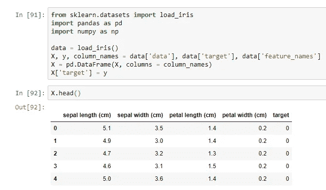

我还将展示数据的配对图。这可以通过 [seaborn.pairplot](https://seaborn.pydata.org/generated/seaborn.pairplot.html) 函数来完成。

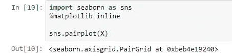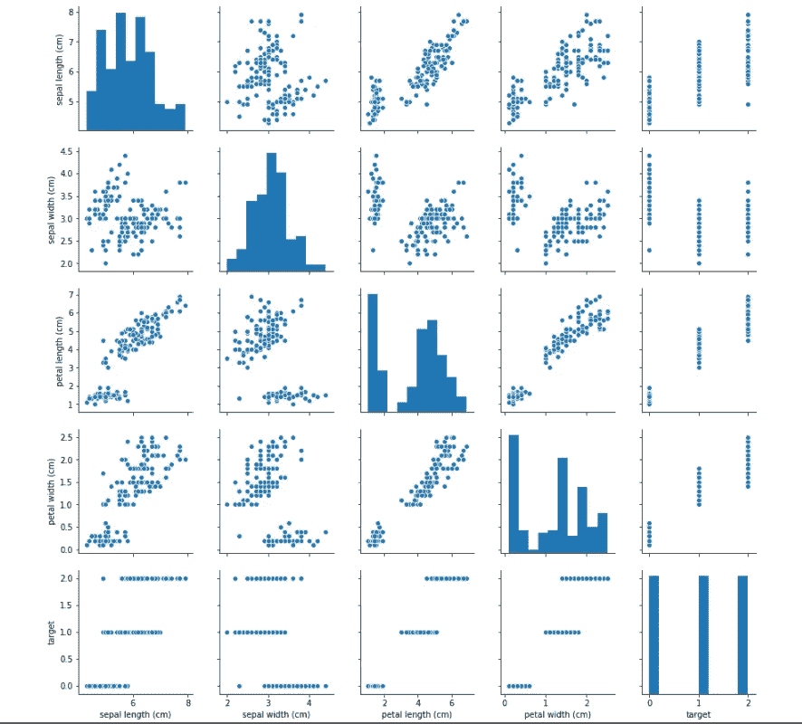

在 pairplots 上，你可以看到“花瓣长度”和“花瓣宽度”变量很好地分离了目标特征。

 [## 认知计算——一套被广泛认为是……

### 作为它的用户，我们已经习惯了科技。这些天几乎没有什么是司空见惯的…

www.datadriveninvestor.com](https://www.datadriveninvestor.com/2020/02/19/cognitive-computing-a-skill-set-widely-considered-to-be-the-most-vital-manifestation-of-artificial-intelligence/) 

最后，让我们将数据分成训练和测试部分。

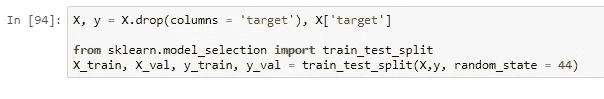

现在，当数据集准备好了，让我们转到决策树模型背后的理论和直觉。

**决策树算法背后的直觉**

在本文中，我将使用 CART 模型来构建决策树，这个模型不是别的，而是一个简单的二叉树，就像这样:

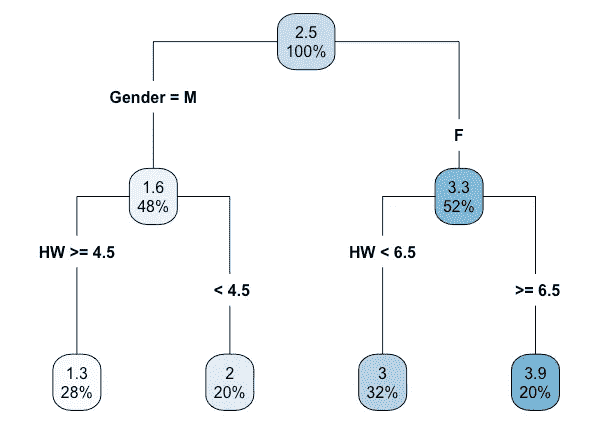

[apa.org](https://www.apa.org/science/about/psa/2018/04/classification-regression-trees)

训练一个简单的决策树模型的想法非常简单。在构建每个树节点时，我们执行算法，用以下伪代码表示:

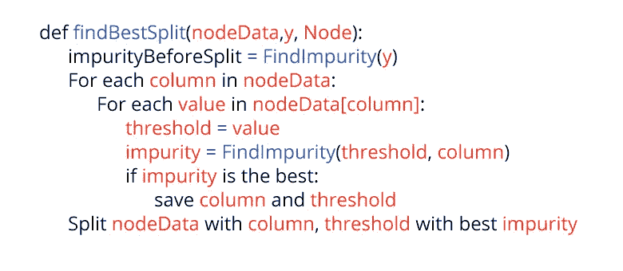

我们将按照这个算法递归地向我们的树添加新的节点，直到我们满足一个停止标准。在我的实现中，我将使用以下停止规则: **max_depth** ， **min_samples_in_leaf** ， **min_samples_split** 。

示例:

***max _ depth = 3***—树深度不能大于 3

***min _ samples _ in _ leaf = 2***—一个树节点不能少于 2 个样本。

***min _ samples _ split = 2***—树节点中不能少于 2 个样本，我们在寻找最佳分裂列和阈值时。

如你所见，每一步我都在计算**杂质**值，那是什么？在本次实施中，我将使用**基尼系数**进行计算，计算公式如下:

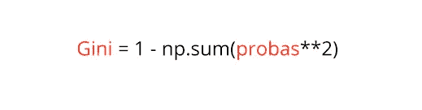

**probas** 这里可以定义如下:

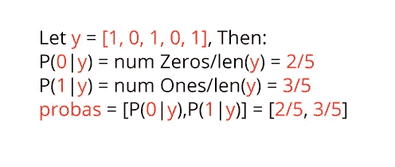

最后，为了在上面的伪代码中执行**find infinity**函数，我应该执行以下操作:

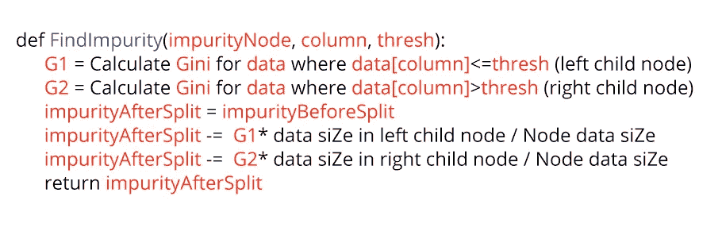

我在这里做的是根据给定的阈值和列分割数据，我计算左右子节点的 **G1** 和 **G2** 。你可能已经注意到，在上面的伪代码中，我已经计算了 Split 之前的**impurity**值。在这个函数中，我们将使用它来计算 **impurityAfterSplit** 值。

所以，总而言之，所有的训练程序，下面的函数将为我们训练一个决策树。

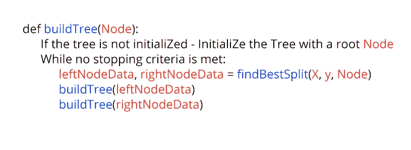

现在，当我解释了购物车决策树的直觉后，让我们用 Python 和 Numpy 实现它！

**用 Python 和 Numpy 实现决策树**

让我们首先创建两个类，一个用于决策树中的节点，另一个用于决策树本身。

我们的节点类将如下所示:

对于决策树类，我现在将创建一个框架，我们将继续填充它。

让我们首先实现 **gini** 和 **nodeProbas** 方法，到目前为止我已经在我的伪代码中很好地解释了它们。这里没什么特别的:

calcImpurity 函数只是这两个函数的包装器。我们首先计算 nodeProbas，然后将它们传递给基尼函数，这可以编码如下:

现在，是时候编写 **calcBestSplit** 函数了。如上所述，我在这里所做的就是查看所有的对(列，来自数据[列]的值)，对于每个这样的对，我计算信息增益，最后只选择具有最佳信息增益的对。

知道了如何在一个节点中找到最佳分裂，让我们实现构建决策树本身的函数。这里，我用一个根节点初始化树，然后递归地将数据分成左右两个子节点，直到满足我们的一个停止标准。

这里的 **Fit** 方法很简单，我只需要初始化根节点并运行 **buildDT** 函数。

最后一步是实现预测方法。当一个对象 **x** 在每一步到达树的根节点时，它与计算的(**列**，**阈值**)节点值进行比较，直到它以如下方式到达根节点:

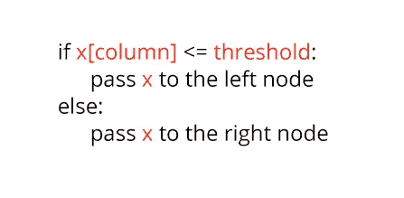

总而言之，对于一个对象，预测看起来如下:

为了计算所有对象的预测，我们只需要遍历它们，并对每个对象调用 **predictSample** 函数。

看起来这就是我们简单的决策树模型所需的所有代码。让我们用[sk learnings 的决策树分类器](http://sklearn.tree.DecisionTreeClassifier)来测试一下。

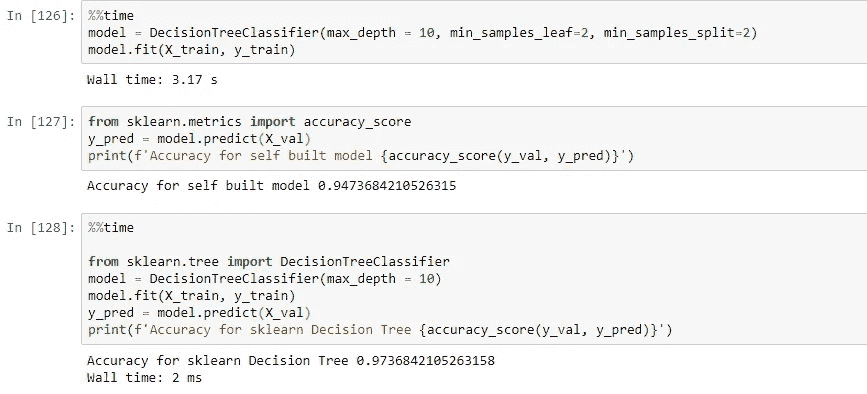

如你所见，Sklearns 的实现不仅更快，因为他们的树构建过程更有效，而且 Sklearns 模型的准确性更高。总而言之，对于一个简单的决策树实现来说，这并不坏！你可以在下面找到整个 Jupyter 笔记本。感谢您的阅读:)

**你可以在我的** [**网站**](http://artkulakov.com) 上查看其他帖子