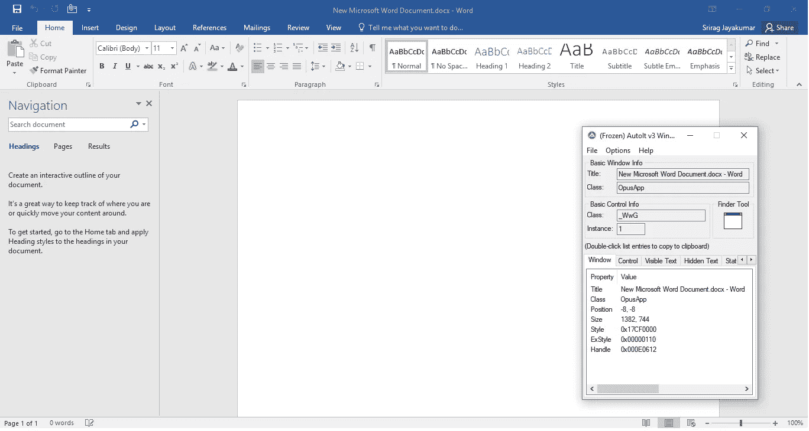

# 简单的 PDF 到 Word 转换

> 原文：<https://medium.datadriveninvestor.com/easy-pdf-to-word-conversion-254f12704617?source=collection_archive---------11----------------------->

使用名为 PyAutoIt 的开源 python 库创建一个简单的 PDF 到 Word 转换器，并利用 MS Word 的能力将 PDF 转换为 Word。


Photo by [Clément H](https://unsplash.com/@clemhlrdt?utm_source=medium&utm_medium=referral) on [Unsplash](https://unsplash.com?utm_source=medium&utm_medium=referral)

## 嘿！！！但是不是有很多网站让你做同样的事情吗？！！

我知道你一定和我有同样的想法，是的，有很多网站可以让你达到同样的目的，但这种方法更适合像我这样的 IT 专业人士，他们被严格禁止在网上上传重要的官方文件，这违反了信息安全。

## 要求:

1.  PyAutoIt 库
2.  MS Word (2013 或以上版本)
3.  [自动窗口信息工具](https://www.autoitscript.com/site/autoit/downloads/)(稍后解释)

## PyAutoIt 是什么？！？

AutoIt v3 是一种免费的脚本语言，旨在自动化 Windows GUI 和通用脚本。它使用模拟击键、鼠标移动和窗口/控件操作的组合，以一种其他语言不可能或不可靠的方式自动化任务。PyAuoIt 是 AutoIt 的 python 版本。

你可以在这里了解更多:【https://www.autoitscript.com】T4

# 我们开始吧！

## 装置

您可以通过 pip 安装 [**PyAutoIt**](https://pypi.org/project/PyAutoIt/)

```
pip install PyAutoIt
```

## 主代码

```
import autoit
import glob 
program='Winword.EXE' 
pdf_files=glob.glob('pdf/*.pdf') 
for pdf in pdf_files:    
    autoit.run(program+' '+pdf)    
    autoit.win_wait_active("[CLASS:OpusApp]",100)    
    autoit.send("{F12}")    
    autoit.win_wait_active("Save As",20)    
    autoit.control_click("Save As",'Button8')    
    autoit.win_close("[CLASS:OpusApp]") 
```

第一步:你需要找到微软 Word 的 Winword.exe 路径。这主要位于 C:/Program files/Microsoft Office 中。

第二步:把所有的 pdf 文件放在一个文件夹中，并在 glob 中提供路径。

第三步:执行代码。

这里你可能想知道为什么类名是 OpusApp，为什么有一个 button 8。这就是自动窗口信息工具发挥作用的地方。



如前所述，autoit 用于自动化 windows GUI，每个应用程序窗口都有自己的类名。这可以使用自动窗口信息工具找到。

希望这将派上用场，因为它节省了购买 adobe pro 软件，有一个内置的 pdf 到 word 的转换器很多钱。

## 参考资料:

*   [https://www.autoitscript.com/](https://www.autoitscript.com/)

代码可以在我的 [**GitHub**](https://github.com/sriragjayakumar/Pdf-2-Word/tree/master/Pdf-2-Word) 页面上找到，包括在服务器上部署的代码。一定要去看看！