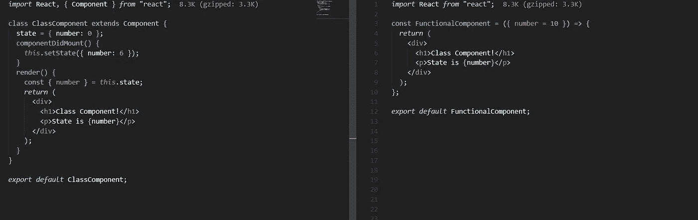
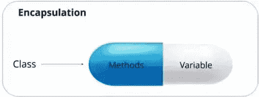
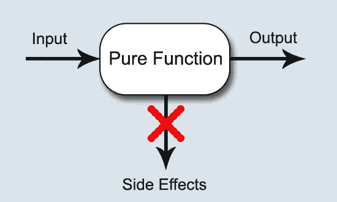

# 简单易学的反应钩

> 原文：<https://medium.datadriveninvestor.com/easy-to-learn-react-hooks-7db7763608f5?source=collection_archive---------4----------------------->

## 前端

## 以 useEffect()为例


Photo by [Grant Durr](https://unsplash.com/@blizzard88?utm_source=unsplash&utm_medium=referral&utm_content=creditCopyText) on [Unsplash](https://unsplash.com/s/photos/hook?utm_source=unsplash&utm_medium=referral&utm_content=creditCopyText)

我已经写了关于[反应最佳实践](https://towardsdatascience.com/react-best-practices-804def6d5215)的文章。我提到过，React 钩子编写有状态的功能组件。现在大部分 react 框架比如 react-i18next，Material-UI 等等都是鼓励使用 React 钩子的。但是，最近我开始意识到 React 钩子非常有用。React 钩子是在 React v16.08 之后引入的，这里我将非常简单容易地描述 React 钩子。这是我的第 34 篇中型文章。

# 两套 React API

以前只有一套 React API，现在有两套:类 API 和基于函数的钩子 API。任何组件都可以由一个类或一个钩子来编写。下面是如何编写这个类。

我们来看看钩子的编写方式，也就是函数。

这两种写法效果完全一样。新手自然会问:“我该用哪个 API？”

[官方推荐](https://reactjs.org/docs/hooks-faq.html#should-i-use-hooks-classes-or-a-mix-of-both)使用钩子(函数)代替类。因为钩子更简洁，代码更少，所以用起来“更轻”，而类则“更重”。而且钩子是函数，更符合 React 的函数性质。

下面是类组件(左)和功能组件(右)的代码量对比。对于复杂的组件，差别就更大了。



但是钩子的灵活性太大，新手理解不了。很多人一知半解，很容易写出乱七八糟、不可维护的代码。最好使用类。因为类有很多强制性的语法约束，所以不容易搞砸。

# 类和函数的区别

严格来说，类组件和功能组件是有区别的。不同的编写方法代表不同的编程方法。



**类是数据和逻辑的封装。**换句话说，组件的状态和操作方法封装在一起。如果选择了编写的类型，就应该在同一个类中编写相关的数据和操作。


[https://upload.wikimedia.org/wikipedia/commons/thumb/3/3b/Function_machine2.svg/1200px-Function_machine2.svg.png](https://upload.wikimedia.org/wikipedia/commons/thumb/3/3b/Function_machine2.svg/1200px-Function_machine2.svg.png)

**一般来说，函数应该只做一件事，就是返回值。**如果你有多个操作，每个操作都应该写成一个单独的函数。而且，数据的状态要和操作方法分开。按照这个理念，React 的功能组件应该只做一件事:返回组件的 HTML 代码，没有其他功能。

以下面的功能组件为例。

这个函数只做一件事，就是根据输入参数返回组件的 HTML 代码。这种只进行简单数据计算(转换)的函数在函数式编程中称为**“纯函数”**。

# 有什么副作用？

看到这里，你可能会有一个疑问:如果纯函数只能进行数据计算，那些不涉及计算的操作(比如生成日志、存储数据、改变应用状态等)应该放在哪里？)被写？



[https://functionalprogrammingcsharp.com/images/posts/pure-functions.jpg](https://functionalprogrammingcsharp.com/images/posts/pure-functions.jpg)

计算那些与数据无关的运算的函数式编程叫做“次生效应”**(副作用)**。如果一个函数直接包含产生副作用的运算，那么它就不再是一个纯函数，我们称之为不纯函数。

只有通过纯函数内部的间接手段(即通过其他函数调用)，才能包含副作用。

# 钩子的作用

说了半天，到底什么是钩子？总之，**钩子就是 React 功能组件的副作用解决方案，用来给功能组件引入副作用。**函数组件的体应该只用于返回组件的 HTML 代码，其他所有操作(副作用)都必须通过钩子引入。

既然有这么多副作用，那就有很多种挂钩。React 为许多常见操作(副作用)提供了特殊的挂钩。

*   `useState()`:保存状态
*   `useContext()`:保存上下文
*   `useRef()`:保存参考
*   …

以上这些钩子，都是特定副作用的介绍而`useEffect()` **是钩子**的常见副作用。找不到对应挂钩的时候可以用。其实从名字就能看出来，和副作用有直接关系。


[https://dev.to/swapnadeepmohapatra/useeffect-react-hooks-25fb](https://dev.to/swapnadeepmohapatra/useeffect-react-hooks-25fb)

# `useEffect()`的用法

`useEffect()`本身就是一个函数，由 React 框架提供，可以在功能组件内部调用。

例如，我们希望组件加载后，页面标题(`document.title`)会随之改变。然后，改变网页标题的操作是组件的副作用，是`useEffect()`实现的。

上例中，`useEffect()`参数是一个函数，是要完成的副作用(改变页面标题)。组件加载后，React 将执行这个函数。

`useEffect()`的作用是指定一个副作用函数，每次渲染组件时自动执行。组件首次加载到网页 DOM 后，副作用函数也会被执行。

# useEffect()的第二个参数

有时候，我们不希望`useEffect()`执行每一次渲染。这时，我们可以用它的第二个参数用一个数组来指定副作用函数的依赖关系。只有当依赖关系改变时，才会再次执行渲染。

在上面的例子中，`useEffect()`第二个参数是一个数组，它指定了第一个参数(副作用函数)的依赖关系(`props.name`)。只有当变量改变时，副作用功能才会被执行。

如果第二个参数是一个空数组，这意味着副作用参数没有任何依赖关系。所以组件加载到 DOM 后副作用函数只会执行一次，后续组件会重新渲染，不会再执行。这是合理的，因为副作用不依赖于任何变量，所以无论那些变量如何变化，副作用函数的执行结果都不会改变，所以运行一次就够了。

# useEffect()的目的

只要是副作用，都可以用`useEffect()`介绍。其常见用途如下。

*   数据提取
*   事件监控或订阅(设置订阅)
*   改变 DOM(改变 DOM)
*   输出日志(记录)

下面是一个从远程服务器获取数据的例子。

在上面的例子中，`useState()`用于生成一个状态变量(`data`)来保存采集到的数据；`useEffect()`在副作用函数内部，有一个异步函数从服务器异步获取数据。得到数据后，使用`setData()`触发器组件重新渲染。

由于数据采集只需要执行一次，`useEffect()`上面例子的第二个参数是一个空数组。

# useEffect()的返回值

加载组件时会产生副作用，因此当卸载组件时，可能需要清除这些副作用。

`useEffect()`允许返回一个函数，该函数在组件卸载时执行，以清除副作用。如果你不需要清理`useEffect()`的副作用，你不需要返回任何值。

```
useEffect(() => {
  const subscription = props.source.subscribe();
  *return* () => {
    subscription.unsubscribe();
  };
}, [props.source]);
```

在上面的例子中，`useEffect()`加载组件时订阅一个事件，并返回一个清理函数，卸载组件时取消订阅。

在实际使用中，由于副作用函数默认执行每一次渲染，因此清理函数不仅会在组件卸载时执行一次，还会在副作用函数重新执行之前执行一次，以清理上一次渲染效果的副作用。

# useEffect()注意点

使用`useEffect()`有一点需要注意。如果有多个副作用，应该调用多个`useEffect()`,而不是组合在一起写。

上面的例子是错误的。副作用功能中有两个定时器。他们没有血缘关系。其实是两个不相关的副作用，不应该写在一起。正确的做法是把它们分别写成两个`useEffect()`。

# 结论

我的大多数社交媒体朋友都建议我写 React hooks，因为他们想轻松理解它们。在这里，我用基本的 Javascript 概念写了一些钩子，并以`useEffect()`为例。

新年快乐🎉

快乐编码😎

**访问专家视图—** [**订阅 DDI 英特尔**](https://datadriveninvestor.com/ddi-intel)