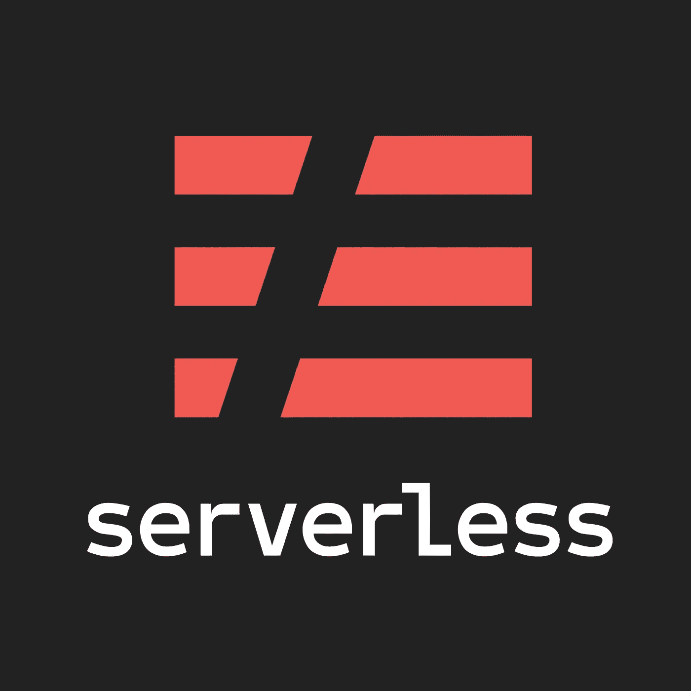
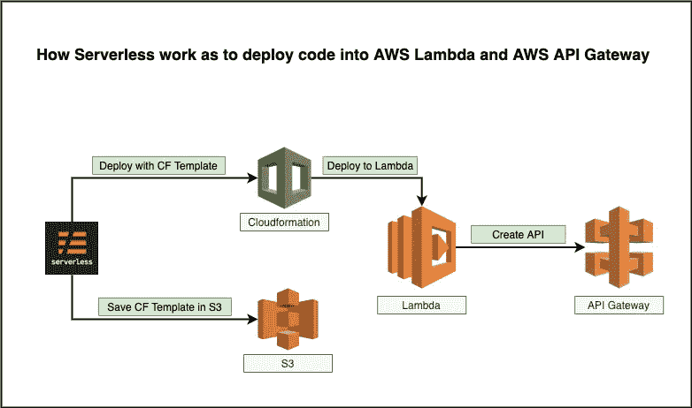

# 使用无服务器框架部署 Lambda 和 API 网关的简单方法

> 原文：<https://medium.datadriveninvestor.com/easy-way-to-deploy-lambda-and-api-gateway-with-serverless-framework-51c33e2290d1?source=collection_archive---------2----------------------->

将 Lambda 功能无缝部署到 AWS Cloud 的方法有很多，比如 SAM template、CodeDeploy、Cloudformation、Terraform、Serverless 等等。其中，今天我要用无服务器框架来部署 Lambda 和 API Gateway。如果你是无服务器框架的新手，请点击链接[https://serverless.com/framework/docs](https://serverless.com/framework/docs/)阅读它的文档。

> 无服务器框架可以帮助你用更少的开销和成本构建无服务器应用。它为开发、部署、测试、保护和监控您的无服务器应用程序提供了强大的统一体验。



image source: [https://serverless.com](https://serverless.com/)

如上所述，使用无服务器部署 Lambda 函数有点容易与 SAM、CodeDeploy 等进行比较。如果您是 nodejs 开发人员，使用无服务器框架将 NodeJS 功能部署到 AWS Lambda 非常容易。

请查看下图，无服务器框架如何将您的 nodejs 应用程序部署到 AWS Lambda。



好了，现在我将展示如何将我的 nodejs 应用程序部署到 AWS Lambda。

1.  **先用 NPM 安装无服务器框架。**

```
npm i serverless
```

**2。创建 hello world nodejs 函数，文件名为 index.js**

```
const express = require('express')
const serverless = require('serverless-http')
const app = express()
app.get('/', async (req, res, next) => {
  res.status(200).send('Hello World!')
})
module.exports.server = serverless(app)
```

**3。创建 AWS 凭证**

```
sls config credentials --provider aws --key ACCESS_KEY --secret SECRET_KEY
```

*PS:对于无服务器，你可以在* ***无服务器*** *或者****SLS****之间随便用。*

**4。创建 serverless.yml 文件，与 index.js 文件放在同一个文件夹下**

**4.1 我先创建 Lambda 函数及其配置。**

```
functions: 
  app:
    handler: index.handler
    events:
      - http: 
          method: any
          path: /{proxy+}
          cors: true
```

4.2 我将配置它的 Lambda 函数内存、运行时和 IAM 角色。好，Lambda 函数将 CRUD 到 DynamoDB 表中，并访问 S3 桶。

```
provider:
  name: aws
  runtime: nodejs8.10
  stage: dev
  region: ap-southeast-1
  memorySize: 128
  iamRoleStatements:
    - Effect: Allow
      Action:
        - dynamodb:*
      Resource: "arn:aws:dynamodb:ap-southeast-1:*:*"
    - Effect: Allow
      Action:
        - s3:*
      Resource: 
        - arn:aws:s3:::mybucket/*
        - arn:aws:s3:::mybucket
    - Effect: Allow
      Action:
        - lambda:InvokeFunction
      Resource: "*"
```

我将创建 AWS API 网关来与 Lambda 函数集成，并创建自定义 main。

请记住，自定义域 URL 将是[api.ppshein.com](http://api.ppshein.com)，在将 nodejs 功能部署到 AWS Lambda 之前，我们必须首先在 AWS ACM 中为该域创建 SSL 证书。

```
custom:
  customDomain:
    domainName: api.ppshein.com
    basePath: ''
    stage: ${self:provider.stage}
    createRoute53Record: true
```

到目前为止，我的 **serverless.yml** 文件已经完成，现在我要将 nodejs 应用程序部署到 AWS Lambda。当我创建自定义域名时，我需要在 AWS 中用这样的无服务器框架创建自定义域，

```
serverless create_domain
```

至少需要 25 或 30 分钟。之后，我将把我的 nodejs 应用程序部署到 AWS Lambda，如下所示:

```
serverless deploy
```

一旦部署完毕，你将能够使用 cURL 或 Postman 测试 API。

[下载完成的 Git URL](https://gist.github.com/ppshein/ad37c0379b6b0c69409ea21ade7d7f8c)

[](https://www.datadriveninvestor.com/2019/02/25/6-alternatives-to-the-yahoo-finance-api/) [## 雅虎财经 API |数据驱动投资者的 6 种替代方案

### 长期以来，雅虎金融 API 一直是许多数据驱动型投资者的可靠工具。许多人依赖于他们的…

www.datadriveninvestor.com](https://www.datadriveninvestor.com/2019/02/25/6-alternatives-to-the-yahoo-finance-api/)