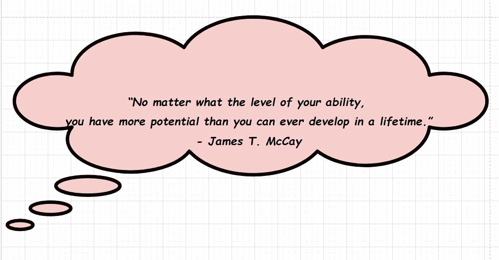
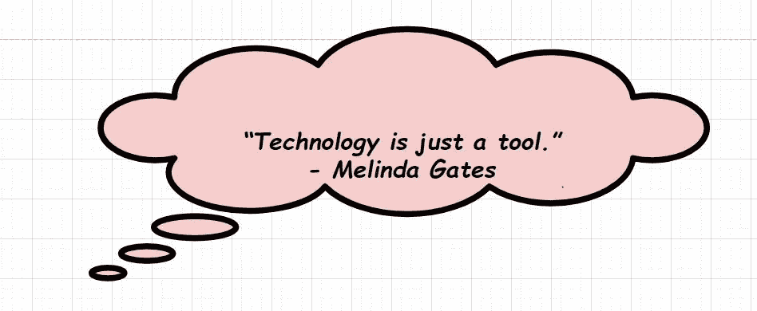

# 吃掉那只青蛙(布莱恩·特雷西)

> 原文：<https://medium.datadriveninvestor.com/eat-that-frog-brian-tracy-eb7f10478f15?source=collection_archive---------4----------------------->

Eat That Frog

> 注意:-这本书最多需要你 2-3 个小时来完成。本书的作者布莱恩·特雷西让它变得简单明了。这本书由 21 章组成，每一章都有学习和更多的学习。

我会试着让这篇文章像书上写的那样，简单明了。

首先，为什么这本书的名字叫“*吃那个 Fr* og”？

 [## 健身房 10 年的 10 条人生经验|数据驱动的投资者

### 走错一步，他们就会掉下去。两位登山者优雅地回到了地面。他们在那里…

www.datadriveninvestor.com](https://www.datadriveninvestor.com/2020/02/03/10-life-lessons-from-10-years-in-the-gym/) 

作者布莱恩·特雷西把青蛙比作我们最大、最重要的任务，也是我们如果不做点什么就最有可能拖延的任务。如果我们每天早上做的第一件事是吃一只活青蛙，我们就可以满足地度过这一天，因为知道这可能是一天中发生的最糟糕的事情。

Galileo

作者提请注意这个简单的事实，他说:

> “能够专心致志地完成最重要的任务，并把它做好，圆满完成，是人生获得巨大成功、成就、尊重、地位和幸福的关键。”

本书主要集中在*生产力*、*绩效*，并以简单直白的方式淋浴 21 种方法和技术的输出。
而所有这些方法、技术、策略都是实用的、经过验证的、见效快的。没有冗长的故事或理论，只是简单的练习。我们可以立即采取的非常具体的行动，以便在工作中获得更好、更快的结果。“ ***行动*** ”，这本书围绕这个词展开，因为说到底，只有行动才重要。

21_skills

有一小段话，我认为相当重要:

## “做决定要养成完成任务的习惯。训练自己一遍又一遍地实践你将要学习的原则，直到它们变成自动的。坚定地支持你做的每一件事，直到这个习惯被锁定，成为你性格中永久的一部分。”

# 1.摆餐具

Napoleon Hill

*   明确你的目标和目的。含糊、混乱和模糊的思维导致拖延。
*   在纸上写下你的目标
*   确定完成目标的最后期限和清单

> 你的目标越大，越清晰，你对实现目标就越兴奋。

# 2.提前计划每一天

Alan Lakein

*   *6P 公式:适当的事先规划可防止绩效不佳*
*   每天做计划(几乎不需要 10-12 分钟)
*   列一个总清单，写下你想做的所有事情，然后列每月清单，每周清单，每天清单
*   这些列出来的事情会培养一种积极的前进动力
*   10/90 法则:把 10%的时间用于计划，把 90%的时间用于完成任务。

# 3.将 80/20 法则应用于所有事情

Johann Wolfgang

> 80/20 法则:如果你有 10 件事情要做，其中两件会比其他 8 件加起来更有价值。这是维尔弗雷多·帕累托写的帕累托原理

*   大多数人让自己忙于最不重要的 80%。“琐碎的很多”，对结果贡献很小。
*   你每天能做的最有价值的任务往往是最困难和最复杂的。但是完成后的回报是巨大的。
*   在你开始工作之前，问这个:
    **“*这个任务是在我活动的前 20%还是在后 80%* ？”**

> 规则-抵制诱惑，先清理小事情

*   **时间管理是真正的生活管理**
*   你在重要和不重要之间做出选择的能力是你在生活和工作中成功的关键决定因素

# 4.考虑后果

Orison Swett

*   任何任务或活动的潜在后果都是决定一项任务对你和你的公司有多重要的关键因素。

> **长期思考改善短期决策**

*   你对未来的意图越清晰，这种清晰对你当下所做的事情的影响就越大。

> 强制效率法则说:
> “永远没有足够的时间去做所有的事情，但总有足够的时间去做最重要的事情。”

***歌德:“只有从事，头脑才会发热。开始吧，工作就会完成。”***

# 5.练习创造性拖延

*   高绩效和低绩效的区别很大程度上取决于他们选择拖延什么。

> 沃伦·巴菲特:“我只是对目前对我来说不是绝对重要的事情说不”

*   回顾你的职责和责任，找出那些耗时的任务和活动，你可以放弃而不会有实际损失

> 问问你自己:“如果我没有这样做，知道我现在知道什么，我今天会再次开始做吗？”

# 6.不断使用 ABCDE 方法

William Mathews

*   (在纸上)列出你第二天要做的所有事情
*   在你清单上的每一项旁边标上 A，B，C，D，E，A 是非常重要的任务
*   如果你有一个以上的“A”任务，按 A1，A2，A3，..
    ( **A1** 是所有青蛙中最大最丑的)
    ( **B** 是你应该做的任务(蝌蚪)
*   **当 A 任务未完成时，不要做 B 任务**
    *当一只大青蛙坐在那里时，不要被蝌蚪分散注意力*。]

> 确定你的 A1 任务是达到更高成就水平的跳板。

# 7.关注关键成果领域

Norman Vincent

*   最重要的问题: ***“为什么我在工资单上？”***

> 清晰是必不可少的:高绩效的起点是确定你工作的关键结果领域

*   给自己一个等级，等级应该在 1-10 之间(1-最低，10-最高)
*   给自己打分后应该回答的问题:
    **Q1。你的强势和弱势在哪里？
    Q2。你在哪里取得优异的成绩？
    Q3。你在哪里表演不足？**
*   糟糕的表现会导致拖延
*   **不要为你的弱点辩护，而是要清楚地发现它们，并设定一个目标，制定一个计划，让自己变得非常擅长。**

> 最大的问题之一:
> “如果我以一种出色的方式发展并实践了哪一项技能，它会对我的职业生涯产生最大的积极影响？”

# 8.应用三定律

Roosevelt

*   3 您执行的核心任务包含了您对企业或组织贡献的大部分价值。

> 贡献与回报成正比

*   快速列表法:在 30 秒内，写下你现在生活中最重要的 3 个目标？
*   尝试在以下每个方面给自己打一个 1-10 分的分数:
    *I .健康/健身
    II .关系/家庭
    三。财务/职业目标*
    (它会显示你需要改进的地方)
*   时间管理不仅仅是把事情做完，它还能腾出时间来做你个人生活中能给你带来最大快乐和满足感的事情。

> “重要的是工作时间的质量，重要的是在家时间的数量。”

> 平衡工作生活和家庭是一个永无止境的过程。我们必须明白这一点。

# 9.开始前做好充分准备

James McCay

*   创造一个舒适的工作空间
*   提前准备好一切
*   韦恩·格雷兹基: ***“你不拍的镜头，你百分之百会错过。”***
*   迈出第一步，拿起第一个项目，完成它

# 10.一次拿一桶

Samuels

> 在院子里很难；但是一寸一寸都不在话下！

# 11.提升你的关键技能

Mandino

*   不足、无能和缺乏信心也是拖延的支柱

帕特·莱利:

> 任何时候你停止努力变得更好，你注定会变得更糟

*   持续学习是任何领域成功的最低要求。
*   致力于成为你所在领域最有知识和能力的人之一。
*   你可以把开车的时间变成学习的时间。

# 12.确定你的关键制约因素

Graham Bell

*   找出阻碍你实现你想要实现的目标的一个主要制约因素。
*   ***Q1。是什么阻碍了你？***
*   ***Q2。是什么决定了你实现目标的速度？***
*   ***Q3。是什么决定了你从现在的地方到你想去的地方的速度？***
*   ***Q4。是什么阻止或阻碍你去吃那些真正有所作为的青蛙呢？***
*   **Q5*。为什么你还没有达到你的目标？***
*   审视自己，问以下问题:
    ***Q1。是什么让我退缩了？(诚实地深入审视自己，找出限制因素)
    Q2。是什么决定了我获得想要的结果的速度？***

# 13.给自己施加压力

Thomas Edison

*   掌控你的生活，把压力只放在你自己身上
*   领导这个领域，把自己视为榜样
*   把早一点出发，多一点努力工作，多一点熬夜作为一种游戏
*   总是做比你得到的报酬更多的事情，创造想象中的截止日期
*   成功人士给自己压力，让自己表现出高水平

> **快速完成任务的习惯会让你长高**

# 14.激励自己行动起来

*   你解释发生在你身上的事情的方式决定了你的感受
*   “**我喜欢自己**”、“**我能行**”——对自己说，并养成经常说这句话的习惯

## “你永远不应该和别人分享你的问题，因为 80%的人根本不在乎这些问题，另外 20%的人会很高兴你首先找到了这些问题。”——艾德·福尔曼

*   在每一个困难中寻找有价值的教训，在每一个问题中寻找解决方法
*   不断思考和谈论他们的目标
*   乐观创造了更大的控制感和个人力量

> “你成为什么样的人，大部分时间你都是怎么想的。”

# 15.技术是一个可怕的主人

Mohandas Gandhi

*   当我们屈服于不断交流的强迫性需求时，技术就成了敌人。
*   调查分析:*人们每天查看手机 45-80 次*
*   对你的邮件应用 80/20 规则，取消垃圾邮件或最不重要的邮件
*   授权自己删除所有与重要目标和关系无关的邮件。
*   作者在回复邮件时提出了一个非常重要的观点:
    ***“我意识到，仅仅因为有人给我发邮件，并不意味着他们拥有我生活的一部分。”***

> 如果真的很重要，会有人告诉你的。

# 16.技术是一个很好的仆人

Melinda Gates

*   要做更多价值更高的事情，你必须停止做价值更低的事情。
*   分割你的交流渠道，这样只有青蛙才能跳进你的专注城堡
*   在你的日历上安排大量的时间来完成任务，就像约会一样。
*   技术是你的仆人，而不是主人

# 17.集中你的注意力

Krishnamurti

*   集中注意力是高绩效的关键
*   不断回复短信、电子邮件和电话会对你的大脑产生负面影响，缩短你的注意力持续时间。

> 我们混淆了“多任务处理”和“任务转移”

*   互联网中断后，大约需要 17 分钟，你才能将全部注意力转移到工作上，继续工作
*   不间断地工作 90 分钟，不要分心，然后休息 10-15 分钟。重复两次。

# 18.把任务分成若干小块

Orison Swett

*   任务看起来很大，令人生畏，导致拖延。
*   *意大利腊肠片*将大任务切成小块，然后吃一片“意大利腊肠卷”的方法。
*   你吃的青蛙越大，你感受到的个人力量和能量就越大。
*   通过开始和完成任务的一小部分，你会有动力开始和完成另一部分。
*   咬一口你的青蛙，然后休息或做其他事情。

# 19.创造大量的时间

Nido Qubein

*   为特定的活动/任务安排一个固定的时间段。
*   为集中精力的工作创造时间段
*   利用旅行和过渡时间，也就是通常所说的“*时间礼物*，来完成小块大块的任务。
*   保持专注于你负责的最重要的结果。

# 20.培养紧迫感

Napolean

*   **心流** :- *我们在高度持续的活动水平下工作的精神状态。为了实现它，培养一种紧迫感。*
*   你的洞察力和直觉会引导你，指引你在正确的时间做正确的事，说正确的话
*   你的动作越快，你就越觉得要做得更快
*   你走得越快，你获得的经验越多，你学得越多，你就变得越有能力
*   现在就做&回去工作——对自己一遍又一遍地说

# 21.单独处理每项任务

James Allen

*   长期的努力和专注的工作会取得巨大的成就
*   选择你最重要的任务，开始做它，集中精力独自完成它
*   自律是关键。
    ***“让自己在该做的时候做该做的事的能力，不管你觉得喜欢不喜欢。”***
*   一旦你开始了你最重要的工作，拒绝停止，直到工作完成。

# 结论:

*   养成每天第一件事就是吃青蛙的习惯
*   下定决心每天实践这些原则，直到它们成为你的第二天性

**我这边就这样！！！**

我希望你喜欢这篇文章，并从中学到一些东西。评论你的想法，你的批评，你的欣赏，任何事情。谢谢你的时间，请鼓掌鼓励我写更多。
不断学习，不断成长。

如果你已经达到这一点，你可以访问我的 [***个人资料***](https://medium.com/@asishraz) 看看我的其他文章，让我知道，你觉得怎么样。最近在复习《IKIGAI》这本书，点击 [***这里***](https://medium.com/datadriveninvestor/ikigai-the-japanese-secret-to-a-long-and-happy-life-471a2efa3e47) 阅读。

## 再次感谢你，请继续阅读，因为这是让你的生活充实的最终方式。

> 永远不要放弃，永远不要放弃！！！
> ☺
> -加雷博编码器

**访问专家视图—** [**订阅 DDI 英特尔**](https://datadriveninvestor.com/ddi-intel)