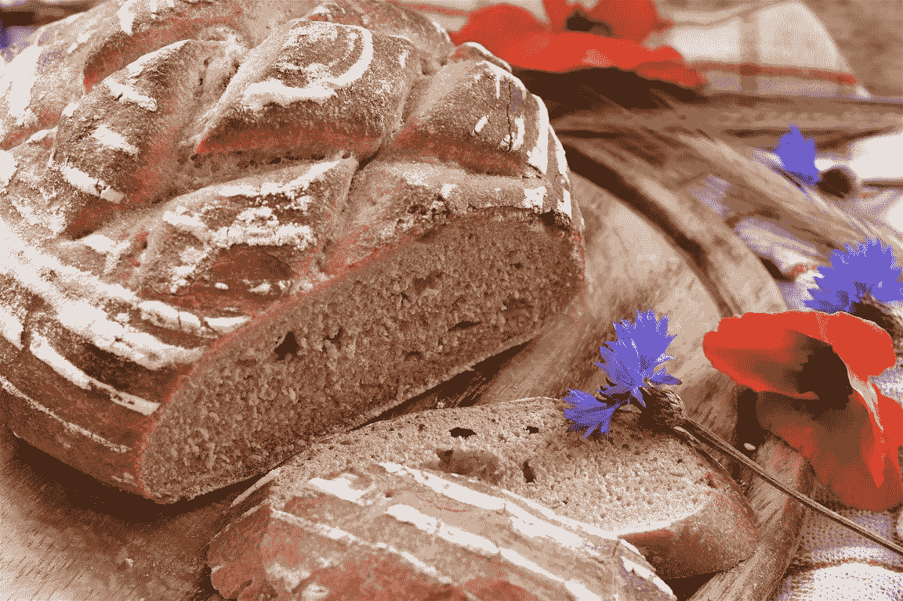
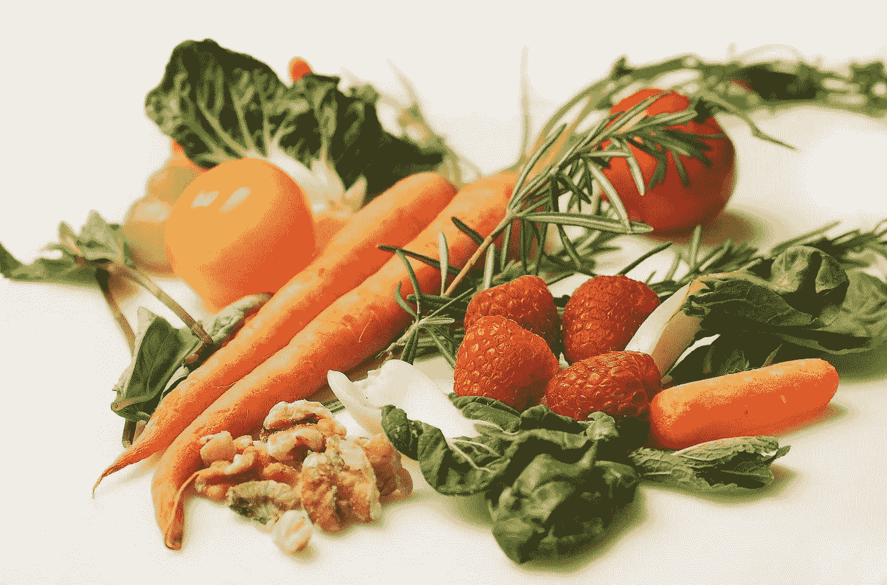
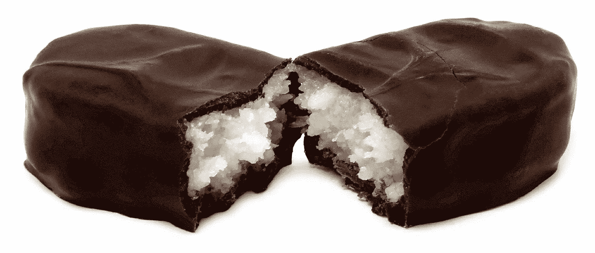
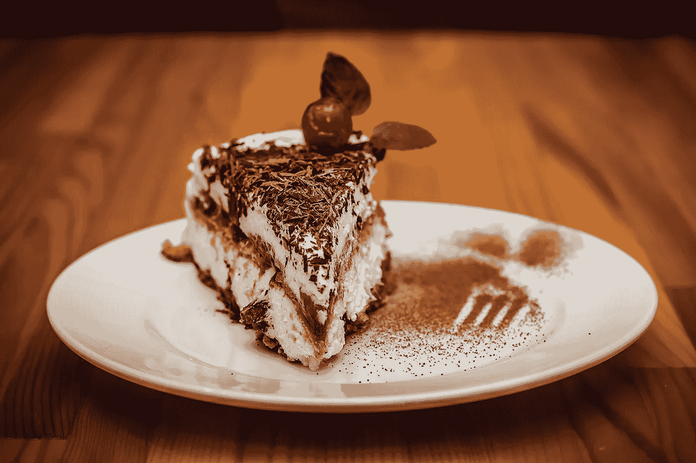

# 吃饭是为了活着，活着不是为了吃饭

> 原文：<https://medium.datadriveninvestor.com/eat-to-live-not-live-to-eat-3fed0cf2070b?source=collection_archive---------10----------------------->

Image by [Detlef Klein](https://pixabay.com/users/detlefklein-2701256/) from [Pixabay](https://pixabay.com/photos/beef-steak-steak-grilled-2427434/)

对于很多在社交上认识我的人来说，我是一个贪吃的人。在派对上，我会选择大块牛排、双层汉堡和重复的甜点。我从来没有在意过什么特定的饮食。我想吃什么就吃什么，想吃多少就吃多少。一位亲密的家庭成员是营养和减肥方面的权威，他最近评论说我有非常健康的饮食习惯。这怎么可能呢？

我分享我的生活方式，因为它们似乎对我有用。由于轻微的残疾，我从未对体育运动感兴趣。我不经常锻炼。我身高 5 英尺 8 英寸，体重稳定在 156 磅左右，根据[专家](https://www.bannerhealth.com/staying-well/health-and-wellness/fitness-nutrition/ideal-weight)的说法，这对于我的体型来说是一个健康的体重。在节日盛宴期间，有几天，它会跳到接近 160 磅，但当它达到 154 磅时，我感觉最舒服。我到了 68 岁，没有持续的严重健康问题。无论是身体上还是精神上，我还是觉得和 20 多岁的时候一样。我知道这不会永远持续下去，但与此同时，我享受其中的每一分钟。

我正在分享我保持苗条和健康的方法，虽然我不是专家。一些读者可能会发现我外行的观察很有帮助和启发，但请保持怀疑，因为对我有效的可能不适合其他人。

# 贫穷的好处

我的祖父母是农民和工匠。他们做艰苦的体力工作，这需要良好的营养。由于食物价格昂贵，为了生存，他们发展出尽可能少吃以获得所需的策略。高热量食物，如肉类和脂肪，是根据一个人的体力劳动量按比例配给的。用餐时间非常严格，间隔三四个小时。尽管食物匮乏，但没有人挨饿。

在我的童年时期，食物仍然很贵，很难买到；因此，尽管我们的城市生活方式，我的父母保留了他们在成长过程中学到的大部分规则。他们特别要求我们在去学校之前吃一顿营养丰富的早餐。他们试图总是在同一时间吃晚餐和夜宵。我母亲坚决不让我们在饭前吃甜食。她推断，吃完零食后，我们就不会吃那么多晚餐，不久之后就会吃更多的零食。糖果不会给我们所需的营养。

Image by [RitaE](https://pixabay.com/users/ritae-19628/) from [Pixabay](https://pixabay.com/photos/bread-wheat-rye-raw-raw-dough-5306304/)

我通勤去高中，偶尔在镇上呆久一点，晚饭后回家。在这些情况下，我经常错过晚餐，因为快餐，正如我们现在所知，当时在波兰是不存在的。我很快意识到，在跳过一顿饭后，在很短的时间内，我的饥饿感非常令人讨厌，但随后它消退了，给我一种空腹的幸福感觉。而且，这让我提高了警惕。我感到精力充沛；我的思维似乎更加敏锐，我更倾向于承担那些我宁愿推迟的任务。我当时开玩笑说，一点点饥饿触发了我的返祖本能，调动我的大脑和身体去寻找食物。很快，我注意到在那个阶段，我更有创造力，效率更高。

# 高热量食物是好的

由于当时波兰食物匮乏，医生建议人们在饱餐一顿后，应该躺下至少 20 分钟，最好是 40 分钟，什么也不要做，但不要睡着。这样，身体可以将所有的资源用于消化。这背后的逻辑是，我们的身体是一台将食物转化为我们运作所需能量的机器。在我们的饮食习惯中，我们需要让这种食物加工机制尽可能高效。特别是，如果我们的血液循环忙于食物消化，它就不能为我们的肌肉或大脑提供氧气。饱餐一顿后放松可以让我们的身体更快地消化食物，为我们的身体提供稍后进行高强度体力或脑力工作所需的营养。

我们应该只吃高热量的食物。对于低热量的食物，我们需要更多或更少营养的食物。我们的身体需要更多的能量来消化大量无用的食物。吃高热量食物的人可以将这些能量用于生产或享受生活。有了高热量、有营养的膳食，我们有机会学习身体信号来抑制我们的食欲。这样，我可以想吃什么就吃什么，当我想吃的时候，因为不用我想，当我的身体有足够的营养时，它就会抑制我的渴望。

这对于一个主要食用低热量食物的人来说几乎是不可能的。那个人需要吃更多的低热量食物来获得同样的能量。那么这个人就需要更多的食物，这样身体就可以消化更多的无用食物。消化额外食物所需的资源无法用于其他脑力或体力任务。主要吃低热量食物的人有较少的可用能量来活跃精神和身体；因此，他们容易发胖。

在她的电视节目中，奥普拉·温弗瑞推荐了许多低热量食物，但同时也在宣传结肠镜检查。我曾经开玩笑说，这是有联系的，因为我们的身体在消化低热量食物时需要更努力地工作，增加了消化道疾病的风险。

 [## 人工智能模型将如何延长人类寿命

### 你认为你能活多久？你的答案大概在 70 岁到 100 岁之间。如果我告诉你…

www.datadriveninvestor.com](https://www.datadriveninvestor.com/2019/07/22/how-ai-models-will-lengthen-the-human-lifespan/) 

# 动物的本能

我想起了一个来自动物园的关于黑猩猩的电视节目，那是我十几岁时看的。饲养员正在往笼子里扔苹果。类人猿在咬它们，然后把它们扔回去。解说员解释说黑猩猩并不饿；因此，他们只吃营养丰富的种子，把剩下的苹果扔掉。对我来说这听起来很明显，因为我已经很特别了，当我吃苹果时，我也吃它的种子。我记得在某处读到过这些种子的营养价值。但是黑猩猩是怎么知道的呢？

几年后，我在电视上看到一篇来自苏联科学家一项有趣实验的报道。他们从非洲丛林中引进了几只野生黑猩猩，并在夏季的三个月里，将它们放在靠近芬兰边境的北部湖泊的一个森林小岛上。从几个观察站，科学家试图找出这些动物如何适应一个完全陌生的环境，特别是，他们如何找到食物。开始时，黑猩猩吃了一些香蕉，但不够饱。正如科学家所料，类人猿尝试了许多野生水果。令人惊讶的是，类人猿不吃有毒的浆果。他们咬了一口，然后吐出来，再也没有尝过。渐渐地，被限制在岛上的黑猩猩对生长在那里的一种树木的叶子产生了兴趣。到夏末，这些树叶成了它们的主食。不幸的是，我不记得那是什么树了。科学家们仔细观察了那棵树，发现直到 19 世纪末，对于俄罗斯北部的贫困农民来说，用那棵树的叶子做的汤是夏天的主要食物。再问一次，黑猩猩是怎么发现的？

我记得大概就在那时，一天晚上，我母亲发现我在厨房里漫无目的地闲逛。她问我是否饿了，因为她知道我胃口很大。她的问题让我意识到我不介意吃点零食。我不喜欢她的任何建议。我最后拿了一个大胡萝卜作为奖励。她评论说我有“那些奇怪的口味”

Image by [Deborah Breen Whiting](https://pixabay.com/users/dbreen-1643989/) from [Pixabay](https://pixabay.com/photos/vegetables-carrot-food-healthy-1085063/)

我将这些奇怪的味道与黑猩猩的本能行为联系起来，黑猩猩知道种子的营养价值，可以教会自己避免吃有毒的浆果，可以检测出它们以前不知道的树上叶子的营养价值。

开玩笑地，我开始说我喜欢吃什么就吃什么，因为我猿类的本能告诉我什么适合我。渐渐地，我意识到除了大牛排、双层汉堡和糖果，我对几乎所有种类的水果和蔬菜都产生了浓厚的兴趣。我仍然喜欢吃胡萝卜作为零食，但它也可以是黄瓜、萝卜或芹菜杆。对于我的正餐，我总是把蔬菜作为配菜。我爱卷心菜；我有吃某种莴苣的近乎上瘾的倾向。我很想吃鳄梨或橄榄。我喜欢西红柿。苹果、梨和香蕉是我开车时最喜欢的零食。至于零食，在办公桌前，我会吃各种干果、坚果和种子。此外，我喜欢黑巧克力，有一些喜欢的饼干，糖果和糕点。我从未对薯片和其他类似的零食产生过兴趣。

# 到处都是糖

在我的童年，我们都在茶和咖啡里加糖。我十八九岁的时候，有人建议不加糖的咖啡味道更好。我们试了试，很快我们家所有人都停止了在茶和咖啡中加糖。我们的决定可能会受到当时波兰市场上新品种茶和咖啡的影响。在那之前，我们只能买到一种茶和一种咖啡。有了糖，我们就不能尽情享受新的口味。

在美国生活了 35 年后，波兰食物对我来说只是众多民族食物中的一种。但是，我更喜欢欧洲的糖果和糕点。它们是甜，但是仍然有各种口味的丰富性。除了几个明显的例外，美国的大多数糕点和糖果只是无味但色彩丰富的大块糖。一些巧克力棒是一个值得注意的例外。近年来，我在一些商店里发现了更多美味的馅饼和饼干。

Image by [skeeze](https://pixabay.com/users/skeeze-272447/) from [Pixabay](https://pixabay.com/photos/chocolate-bounty-coconut-candy-bar-524749/)

我提出这个问题是因为，一段时间以来，媒体将美国的肥胖归咎于糖。通过仔细观察，我意识到，就像糕点一样，我不太喜欢含糖高的苏打水，我发现任何含糖量高的食物都不那么美味。我也注意到美国人更喜欢非常甜的水果。我现在能买到的萝卜很少有我年轻时记得的那种独特的辣味。它们尝起来像是虚无，带着一点甜味。我对专家认为糖会让人上瘾的观点持怀疑态度。我的经验表明，关键在于培养对各种口味的渴望。因此，甜味只存在于糖果中，而不存在于其他地方。

我注意到小孩子甚至不愿意捡从 piata 上掉下来的便宜糖果。此外，我注意到当我给“不给糖就捣蛋”的人波兰糖果时，他们很兴奋，而当第二年我忘记在波兰商店买糖果，最后一分钟在当地超市买时，他们明显感到失望。我们可以希望市场会注意到这一点。

在大学期间，我注意到在有压力的情况下，尤其是有点饿的时候，我会变得焦虑。我了解到，在压力下，我的身体燃烧更多的糖，如果我最近没有吃东西，我可能会有一个过低的糖水平，从而进一步增加我的焦虑，使病情恶化。作为补救措施，我总是随身携带糖果、饼干或高糖、高热量的巧克力点心。

这并不意味着每个人在压力下都应该吃甜食。每个人都应该更好地了解他们的身体是如何工作的，并相应地调整他们的饮食。目标是尽可能避免药物治疗。谷歌医生可以是一个良好的开端，但任何重大的健康决定都值得咨询家庭医生。

# 在混乱中维持秩序

我的工作和家庭日程安排不允许我像我的祖父母那样规律饮食。我的日子从来都不一样，但我试图用同样的方式开始。不管我的日程安排如何，我总是在同一时间起床并吃早餐。差不多 40 年了，我的早餐都是一样的，一碗老式燕麦片加全脂牛奶。郑重声明，很多人用的是冷牛奶；我用热牛奶，相信我的身体不应该用它的能量来加热我的食物。

在周末，我们经常吃一顿更精致的家庭早餐；旅行时，我吃任何地方和环境允许的食物。即使我错过了午餐，这碗燕麦粥也能让我一整天都精神抖擞。当我开始这顿早餐时，我意识到我的祖父在一天的辛勤工作之前给马喂燕麦。最近，我注意到营养学家在许多复杂昂贵的膳食中推广燕麦。我还是保持简单便宜。

午餐，我更喜欢在家准备的普通三明治。如果在外面工作，我会从家里带一个三明治。它更简单，更便宜，花费的时间更少。我避免在下午 6 点后吃太多东西。如果我回家晚了，即使饿了，我也喜欢吃便餐。但是，在外出的晚上，如果食物不错，我会允许自己大吃一顿。那天晚上我可能睡得不是很好，但接下来的一两天，我可以很容易地不吃饭，只吃几个苹果和一块巧克力。这样，在几乎空着肚子的情况下，我不是很饿，但充满了活力。

# 吃饭是为了活着，活着不是为了吃饭

对我来说，吃是我需要做的事情，以实现我的生活兴趣和愿望。被吸引到一些迷人的事物中，我可能会忘记饥饿。即使我同意做一些工作是出于支付账单的需要，而不是出于我真正的兴趣，我也会尽我所能去完成它，就好像我的生命依赖于它一样。如果我最终参加了一个我不愿意参加的活动，我会把这看作是一个学习新东西的机会。

Image by [pastel100](https://pixabay.com/users/pastel100-7141960/) from [Pixabay](https://pixabay.com/photos/dessert-cake-tiramisu-food-sweet-3331009/)

正如我前面提到的，我不经常锻炼。但即使坐在电脑前写作，每隔几分钟我也会起身在房间里走来走去，思绪跳跃。当一家人坐在电视机前时，我是第一个渴望从厨房拿任何人可能需要的东西的人。我很少思考就做了；这是我的动物本能促使我伸展身体，走几步。几年前，我在手机上安装了一个健康应用程序。我注意到，即使在一个安静的日子里，当我花大部分时间在电脑上时，仅仅是在我们的小房子周围踱步，我每天大约走一英里。我不经常散步，但喜欢远离繁忙街道的长距离散步。

在我的童年，我的父母形成了我的饮食习惯和一般的生活态度。我用自己最少的努力获得了健康的身体和快乐的天性。我接受并合理化了父母教给我的东西。一个与肥胖作斗争的人可以从我的经历中得出结论，专注于饮食可能不是减肥的最佳方式。找到一种保持活跃的方式，做我们喜欢的事情，可能是第一步。看到一份我们可能更愿意离开但不得不保留的工作的光明面，可能是另一个问题。此外，拥有一份兼职，无论是兼职还是爱好，都能让我们的生活更加精彩。这样，吃就不会成为一种潜意识的奖励，因为我们觉得自己缺乏应得的感激。目标是吃任何能享受生活的东西，而不是通过吃来享受生活。我们吃饭是为了活着，而活着不是为了吃饭。

*原载于 2020 年 9 月 9 日*[*【https://www.datadriveninvestor.com】*](https://www.datadriveninvestor.com/2020/09/09/eat-to-live-not-live-to-eat/)*。*

**访问专家视图—** [**订阅 DDI 英特尔**](https://datadriveninvestor.com/ddi-intel)