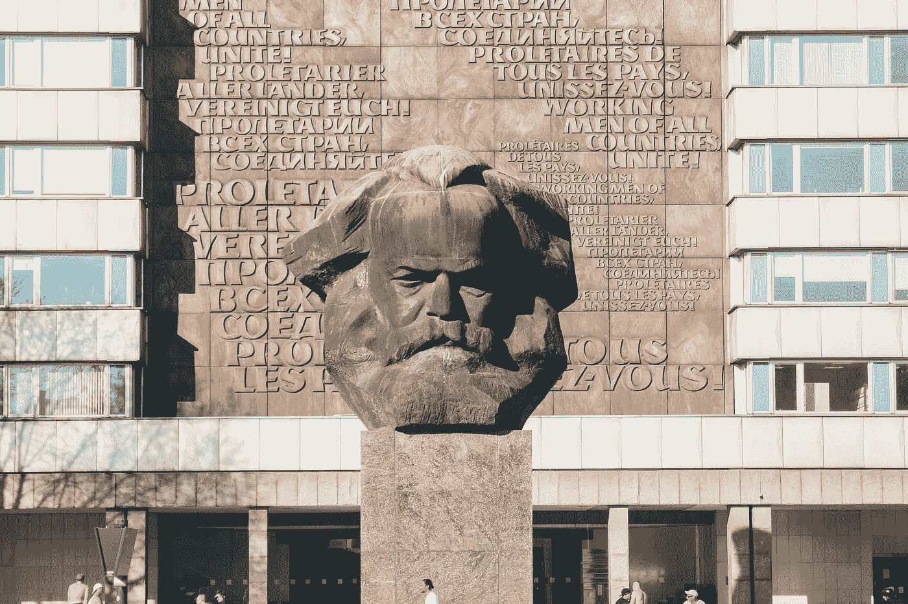

# 当今世界的经济学马克思主义

> 原文：<https://medium.datadriveninvestor.com/economic-marxism-in-todays-world-dc545eb2f1b7?source=collection_archive---------3----------------------->

## 情节曲折的古典自由主义经济学及其在当今世界的表现

Photo by [Maximilian Scheffler](https://unsplash.com/@schefflermaximilian?utm_source=medium&utm_medium=referral) on [Unsplash](https://unsplash.com?utm_source=medium&utm_medium=referral)

1759 年，亚当·斯密在《道德情操论》中引入了“看不见的手”的概念。在斯密 1776 年的著作《T2 国富论》中，关于劳动分工的革命性观点被提出。

史密斯最著名的例子是用大头针。

> 他断言，如果十八个**专业**任务中的每一个都分配给特定的工人，十个工人每天可以生产 48000 个图钉。平均生产效率:每个工人每天 4，800 根针。但是如果没有劳动分工，一个工人每天能生产哪怕一根针都是幸运的……([**亚当·斯密**](https://www.econlib.org/library/Enc/bios/Smith.html) ，出自*简明经济学百科全书)。*

一个更简单的例子是汽车。想象一个人试图从零开始制造一辆汽车。只是让一些人在引擎上工作，其他人在挡风玻璃上工作，其余的人在轮胎上工作不是更容易吗？使用这种方法，产量可以显著增加。

# 专业化:古典自由经济学的灯塔

好处不止于此——劳动分工还会导致专业化。这意味着，既然现在有人专注于制造某些产品的组件，他们在工作中会变得更有效率，并找到节省时间、精力和金钱的新方法。

这进一步延伸到国家，并主张国家应该专门从事他们更擅长的事情，并与其他国家进行贸易，以获得他们原本可以生产的东西。

在这个系统中，技术不断被创造，生产力不断提高。随着更多的商品被生产出来，劳动力继续工作同样的时间，国内生产总值不可避免地会上升。

# 马克思主义:亚当·斯密的延续

然而，这有几个问题。首先，假设有无限的资源是不正确的。我们的生产力增长方式是不可持续的。这就是卡尔·马克思的切入点。

马克思主义是一种解释我们的金融体系和社会结构的方法，它是从自由主义经济学中扩展出来的。亚当·斯密认为专业化最终会导致人类劳动的单调——但他相信这最终会被自由市场所弥补。马克思认为，生产力和技术的提高最终会取代对劳动力的需求，并造成失业。更多的劳动者争夺更紧张的工作会压低工资，并创造困难的条件。

那么，如果不流向劳动者，生产力会流向哪里呢？马克思说，资本所有者通过少付工资和过度劳动获得了“剩余劳动”。马克思相信劳动价值论，认为某物的价值基于生产它所用的必要劳动时间。在这种情况下，资本家不支付工人劳动所产生的全部价值，他们只支付必要的部分

尽管自由市场的拥护者们宣称，马克思认为资本主义是非常低效的。资本主义声称是最有效率的体系，但有一种观点认为，它不会给社会带来最佳的分配和结果。马克思把这归功于资本所有者，他们拥有所有生产资料，但不做任何实际劳动。

资本主义继续在生产率和效率方面取得进步，但因为有少数人拥有资本，这些额外的利润进入了资本所有者的手中，而不是工人的手中。这再加上技术取代工作导致的劳动力需求下降，为收入不平等性的不断加剧创造了完美的配方。最糟糕的是，社会的大多数人无法利用正在生产的资源。资源利用严重不足，效率低下。

包括亚当·斯密在内的许多支持资本主义的人会认为，资本的所有者(富人)会在效率上花费更多，并不断想要更多的商品。霍布森在他的《帝国主义》一书中反驳了这一点，他说“富人永远不会聪明到花足够的钱来防止生产过剩”(霍布森 89)。马克思和许多试图实施马克思主义的人，如弗拉基米尔·列宁，都认同这一观点。

**总而言之，在资本主义制度下，我们的利润率在下降，还有大量未被充分利用和浪费的资源。**

# 马克思主义是一种合理的经济模式吗？

基于古典自由主义经济学，马克思主义使用所有相同的前提，但得出不同的结论。这个结论很重要，因为它说资本主义不会导致对社会完全有益的结果。

一个很好的衡量标准是劳动力参与率。2000 年，这一比例约为 67%，而现在为 61.7% (BLS.gov)。这表明工作明显减少，生产力和技术明显提高，因为 2000 年我们的国内生产总值[是 10.25 万亿，而 2018 年是 20.54 万亿](https://fred.stlouisfed.org/series/GDP)。

史密斯、马克思和霍布森关于技术和生产将变得更加专业化并减少劳动力的假设是正确的。

关于资本主义影响的下一个假设是有利于富裕阶层的大规模生产资源的利用不足。

> “在美国，食物浪费估计占食物供应的 30-40%(美国农业部)。

但奇怪的是，

> “2019 年，34.9%收入低于联邦贫困线的家庭粮食不安全”(美国农业部)。

这使得马克思主义作为一种理论似乎更有道理。我们有大规模的农业生产，但我们看到某个货币阶层的人很难获得这些基本资源。类似的比较也适用于整个经济中的药品和其他重要商品。马克思主义简单地说，我们将过度生产商品，许多人将无法获得这些商品。这是低效的，因为我们在浪费资源，而这些资源本可以分配给需要的人。

然而，必须考虑到，美国有办法应对资本主义的不良影响，并保持高需求。一百多年来，美国一直存在农民问题。他们的工资相对较低，没有动力呆在家里种田。为了解决这个问题，美国烧毁和破坏农产品，以保持对农民的需求，并让他们得到更多的报酬。政府还向农民发放补贴，让他们留在这个行业。然而，农业占美国经济的 1%,资源利用不足和低需求在其他行业更难解决。

考虑到所有这些，经济学马克思主义似乎是解释世界的坚实尝试(它不同于马克思主义，只是解释我们当前经济的一种方法)。无论如何，在这种想法下，当前的世界是不可持续的，我们最终将耗尽可以利用的资本。

> “用霍布森借用詹姆斯·穆勒的话说，帝国主义是‘上层阶级户外救济的庞大系统’收入的再分配将使生产要素得到更有利可图的利用”(肯尼思·华尔兹)。

很明显，马克思和霍布森提出了一种社会主义形式作为补救措施。但是，我们如何在不导致苏联遭受的灾难性的威权社会主义的情况下，获得一个好的制度呢？社会主义的民主和自由主义制度可能是关键——但那是完全不同的话题。