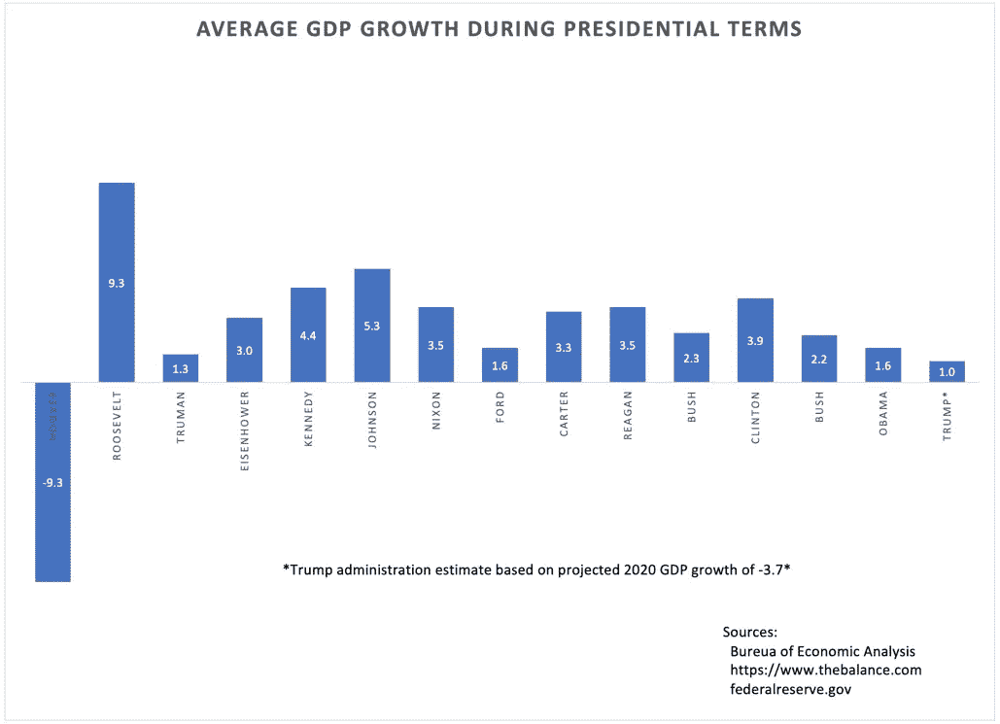
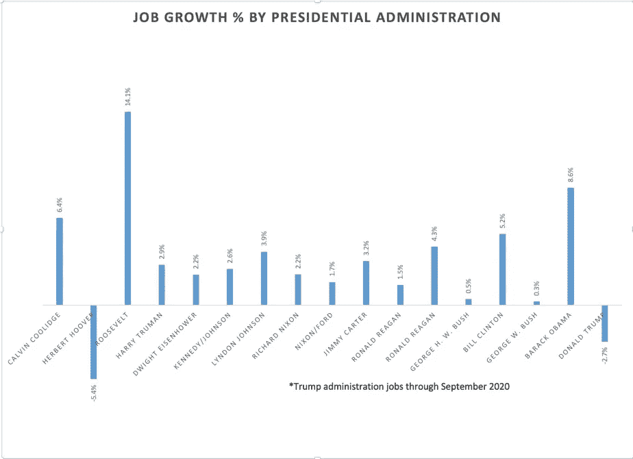
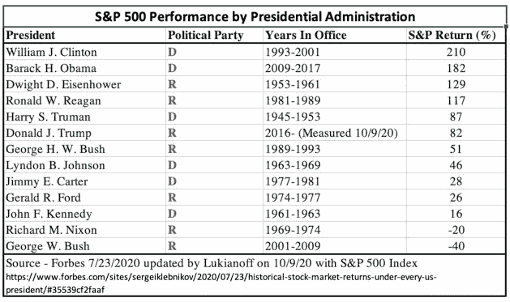

# 总统的经济表现

> 原文：<https://medium.datadriveninvestor.com/economic-performance-by-president-2942d967739e?source=collection_archive---------7----------------------->

每一届政府都面临独特的挑战，但都是用同样的标准来衡量的

Average GDP Growth by Administration from the Bureau of Economic Analysis (Chart by InDataTruth)

虽然这个选举周期在许多层面上感觉不同，但有一点没有不同，那就是政客们总是试图将自己任期内发生的大事归功于自己，并否认对发生的任何坏事负有责任。总统任期内的经济状况一直是选举中最大的决定因素之一，但是总统对经济到底有多大的控制力呢？总统能在多大程度上影响美联储的货币政策和国会的财政政策，这些行动只是在不可阻挡的经济周期和意想不到的世界事件的边缘进行管理吗？

不管公平与否，每位总统都要对其执政期间的 GDP 增长和就业创造记录负责，并以同样的方式进行衡量。历史记录了经济记录，尽管有竞选宣传和党派扭曲，数字就是数字，它们将被如此记录。人们会争论他们是否值得受到审视或表扬，但这些数字就是事实。过去的 100 年充满了战争、疾病、金融崩溃和各种各样的危机，以及至少 4 次推动经济动力方向的大宗商品超级周期。每一位总统面对的不可控力量都比可控力量多，但不管是运气还是技巧和领导能力——历史通过不断变化的轶事记录了一些比另一些更成功的人——但也不可逆转地通过数字记录。

 [## 忽略特朗普|数据驱动的投资者

### 通常，7 月 4 日是烧烤或逃离城市的日子。随着第一轮新冠肺炎…

www.datadriveninvestor.com](https://www.datadriveninvestor.com/2020/07/02/ignore-trump/) 

特朗普总统和他的媒体机器非常有效地延续了历史上任何一位总统都无法匹敌的历史性特朗普经济的神话。毫无疑问，这是他连任计划的支柱，也是他计划中的遗产，但迄今为止，数据并不支持这个故事。随着我们进入他第一个任期的最后四周，如果唐纳德·特朗普未能赢得连任，历史记录将不会记录一位领导经济繁荣的总统。当然，疫情已经对 2020 年的经济造成了严重损害，但即使他在疫情之前的 GDP 数据(2.5)也会使他在胡佛政府以来的总统排名中排名倒数第三，并且他的预计 GDP 数据(不包括疫情)会使他与老布什并列。抛开一厢情愿不谈，疫情是存在的，GDP 影响预计将导致 4 年平均 GDP 仅为 1%。如果特朗普输掉选举，没有机会改善经济记录，他的经济遗产将是仅次于赫伯特·胡佛(Herbert Hoover)的最差 GDP 增长表现。

**创造就业&保存**

Job Growth by Administration (source Federal Reserve Economic Data) Chart by InDataTruth

创造就业是总统比更广泛的经济更有影响力的事情，但它受到政治哲学和形成跨党派协议以及与州和地方政府良好合作的能力的限制。就像美联储在金融市场崩溃时成为“最后的买家”，联邦政府可以成为“最后的雇主”，在劳动力市场陷入低谷时创造就业机会。罗斯福在大萧条时期使用这一工具，通过投资大规模基础设施项目让人们工作。这需要在国会进行政治说服，获得公众支持，并与州和地方政府合作，但其效果是直接增加就业机会，为经济注入工资，并引入新的能源、交通、通信和商业资源，这将有助于推动经济走向未来。当然，许多读到这些话的人——以及当时许多人高呼社会主义！但事实是，至少 100 年来，每一届政府都干预“自由”市场以影响经济结果，但他们的方法是由他们的哲学和观点指导的，即什么指标是最重要的，什么行动将推动他们。供应学派的狂热者宣称，更低的税收和更少的监管将为所有人带来更多的就业和繁荣——因此它成为每次金融危机的解药，但就业随着这些行动而滞后，有时根本不会实现。在政治光谱的另一端，支付给失业者的款项有助于人们保持偿付能力，这些款项很快就会重新进入经济，但这并不等同于创造就业机会和投资于经济的未来。一个政治上务实的政府，面对一个正在摧毁经济的疫情，会看到创造数百万临时工作的机会，也许是通过国防生产法案为测试和跟踪工人或 PPE 设备制造商创造的机会。然而，由于特朗普政府的哲学和意识形态立场，实施了以流动性为重点的供应方经济刺激方法，没有考虑临时联邦就业计划。当然，这并不意味着政府没有大规模干预自由市场。总之，到目前为止，联邦政府已经花费了超过 6 万亿美元，通过财政和货币行动来支撑经济免受疫情的负面影响，并可能再花费至少 2 万亿美元。很难做出一个可信的论点，即拥有整个美国债务市场的联邦政府(就像它现在通过美联储所做的那样)在某种程度上不如创建一个联邦测试与跟踪计划(或其他联邦就业计划)那么“社会主义”。但这些是本届政府做出的选择，这些数字是由于他们做出的选择而产生的。当然，尽管供应方方法在短期内并未对推动就业数据起到太大作用，但大规模现金注入却推动了唐纳德·特朗普(Donald Trumps)最喜欢的指标——股市。

股票市场:衡量经济增长还是资产价格膨胀？

Chart Sourced from InDataTruth

股票市场不是衡量经济健康程度的标准。它也不能衡量该经济体中公民的财富。[最富有的 20%的家庭拥有 93%的股票](https://www.visualcapitalist.com/composition-of-wealth/)，所以它充其量只是衡量一小部分人的财富和一个经济指标，但不是国家经济健康的晴雨表。强劲的经济有利于上市公司，因此也有利于股票市场——但资产价格也会受到通胀、流动性、过度投机和低利率的影响。2020 年美联储对债务市场前所未有的大规模干预为最大的公司创造了近乎无限的流动性和借贷潜力。这是特朗普政府和他的美联储主席选择集中精力应对 2020 年经济危机的地方，客观上，这有助于支撑总统最关心的措施，即股市。尽管经济仍在挣扎，但标准普尔 500 指数大致回到了疫情之前的水平，尽管采取了非常措施，但即使川普在股市的表现也没有达到他自我吹嘘的水平。事实上，即使在过去几个月里由数万亿美元支撑的这一指标中，特朗普与自 1945 年以来任职的其他 12 位总统相比，排名第六。

唐纳德·特朗普(Donald Trump)不是第一个，当然也不会是最后一个美化自己政绩的政治家，但他能够让“伟大的特朗普经济”的信息持续下去的有效性令人震惊。也许是他夸张的大胆，或者是他的追随者惊人的忠诚，或者是新闻网致力于支持他的现实扭曲场。无论是什么情况，事实都将超越幻觉，如果特朗普今年 11 月未能赢得第二个任期，他的记录将看起来非常接近这些图表上的排名。

[https://www . the balance . com/GDP-growth-by-presidents-highs-lows-averages-4801102 #平均年增长率最高和最低的总统](https://www.thebalance.com/gdp-growth-by-president-highs-lows-averages-4801102#presidents-with-the-best-and-worst-average-annual-growth)

[https://apps.bea.gov/itable/index.cfm](https://apps.bea.gov/itable/index.cfm)

 [## 可视化商品超级周期

### 许多人都会同意，全球转向电动汽车(EV)是实现无碳未来的重要一步…

www.visualcapitalist.com](https://www.visualcapitalist.com/what-is-a-commodity-super-cycle/) 

## 访问专家视图— [订阅 DDI 英特尔](https://datadriveninvestor.com/ddi-intel)