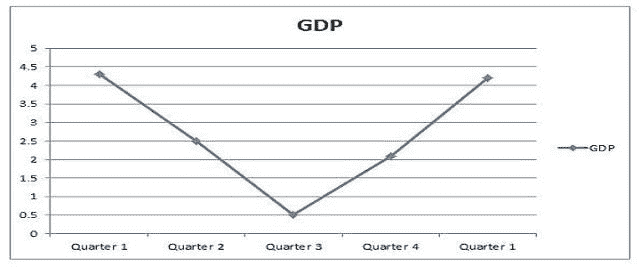

# 新冠肺炎危机后的经济复苏

> 原文：<https://medium.datadriveninvestor.com/economic-recovery-after-covid-19-crisis-c9d43c062078?source=collection_archive---------24----------------------->

*封锁后我们可以见证的经济复苏类型*

距离中华人民共和国有史以来第一例新型冠状病毒病例记录已经过去了将近半年。在这一过程中，世界上有几个角落见证了一系列意想不到的场景，这些场景直接或间接地影响了智人的正常生活。

新冠肺炎已经夺去了 60.2 万人的生命，全球感染人数超过 1400 万。该曲线在未来一个月左右没有显示出放缓的迹象。由于这种病毒传染性很强，政府不得不在各自的国家实施严格的封锁。

这导致公司收入损失，人们开始失业。许多公司已经申请破产，而许多公司已经请求政府救助。帮助维持当前的危机。正如一位智者所说，乌云背后总有一线光明。一些国家的疫情似乎有所减缓，当局正在逐步开放经济。

政府提出了许多不同的方法，如建立一个泡沫等。但问题是，经济如何从当前的危机中复苏？上述问题在经济学中有答案。

根据理论，经济复苏有三种方式，但在现代经济学中，有五种方式。

# 1.复苏呈“V”形——

“V”形回收是一种非常常见和基本的回收形式。在这种类型的复苏中，经济收缩到某一点，并在该点后反弹。

如上图所示，GDP 下降持续到第三季度，但在此之后，我们会看到某种程度的复苏，在接下来的几周内，经济会回到以前的水平。这种复苏类似于英文字母 V，这就是为什么它被称为“V”形复苏。

这种复苏的最大例子是 2008-2009 年金融危机。

从以上数字可以看出，随着 2008 年危机的出现，世界 GDP 有所下降，但在 2010 年我们看到了复苏。

## **为什么我们可能会看到“V”形复苏**

在当前经济危机的情况下，我们可能会看到 V 型复苏，因为目前的衰退是由于受尊敬的政府实施封锁而发生的。

由于市场需求下降，企业的经济产出已经下降，随着需求恢复，企业可以开始盈利，经济可以开始复苏。

## **为什么我们可能看不到 V 型复苏**

恢复前冠状病毒时代的需求可能还不够。随着全球各地的人们失业，许多企业都出现了历史性的亏损。

因此，仅仅是需求和供给不能解决当前的危机。各国对中国的态度也将在经济复苏中发挥重要作用。中东和南海附近的动荡会极大地影响曲线的结构。

# 2.复苏呈“W”形——

“W”型经济复苏只是“V”型经济复苏的延伸。这种类型的复苏通常发生在不确定的经济情景中。经济复苏后立即再次下滑。

如上图所示，经济下滑，但在短暂增长后，又再次下滑。这种复苏的最大例子是大萧条。

就冠状病毒而言，只有当我们面临第二波感染时，我们才能见证“W”型复苏。在这种情况下，政府不得不再次施加限制，这可能导致“W”型复苏。

“W”型复苏的另一个机会是战争。如果世界面临另一场战争，那么我们也可以见证“W”型复苏，但曲线上的第二次下降将取决于战争的严重性。鉴于目前的世界局势，我们不能完全忽略这两种情况。

# 3.复苏呈“U”形——

“U”型复苏与“V”型复苏相反。危机过后，经济不会反弹。经济需要一段时间来恢复，这导致了“U”形。在它的经济中，这可能需要比平常更长的时间，这个阶段可能持续 2 个季度或更长时间。

“U”型经济出现的几率很低。因为这个世界已经变得非常有竞争力，而且以目前的世界人口。世界经济可能不会面临 U 型复苏，但许多公司和行业可能会面临。这些行业包括酒店业和旅游业等。在这种情况下，我们可能看不到太多的需求，至少在几个季度或更长时间内，我们可能会看到低需求。

# 4.复苏呈“嗖嗖”状——

“嗖嗖”形状的回收或更普遍的称为“L”形状的回收是非常基本的回收类型。在这种情况下，当经济下滑时，复苏阶段比通常情况下更长，在某些情况下可能需要半年或更长时间才能恢复到以前的水平。

我们见证了 20 世纪早期和中期的“嗖嗖”状复苏，与当前的经济状况相比，那时的经济还没有发展和全球化。目前，经济是开放和竞争的。因此“L”形是费力的。

# 5.复苏的“反向平方根”形状——

当经济从放缓中复苏，但未能达到之前的水平时，可能会出现反向平方根型复苏。在这种情况下，经济顶部的水平远远低于前一个高点。

如图所示，经济无法达到初始水平。这可能是因为消费者行为的品味、习惯或偏好发生了重大变化。在这种情况下，实际的恢复时间可能长达几年。

这种复苏的机会非常低，但一些行业可以向我们展示这种复苏，如航空业等。

# 结论

冠状病毒已经严重影响了我们的经济。这种类型的衰退提出了新的问题，并促使经济学家打破常规来应对这种局面。

尽管我觉得还有一个问题我们可能很快就会面临，那就是中国和其他国家之间的紧张关系。末日时钟在午夜前差不多 100 秒，北京有意识地安抚他国土地。

我们只能希望这次侵略不会引发任何类似战争的情况，在目前的情况下战争只能造成浩劫。

*原载于 2020 年 8 月 11 日*[*【https://onkarjadhavv.blogspot.com】*](https://onkarjadhavv.blogspot.com/2020/08/economic-recovery-after-covid-19-crisis.html)*。*