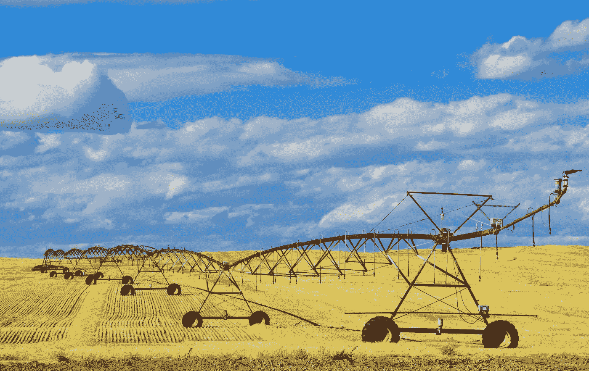

# 人工智能经济学:农业

> 原文：<https://medium.datadriveninvestor.com/economics-of-ai-agriculture-7c363b3ae3eb?source=collection_archive---------2----------------------->

## 人工智能如何(重新)塑造农业经济

Photo by [Peter Gonzalez](https://unsplash.com/@truefriend865?utm_source=medium&utm_medium=referral) on [Unsplash](https://unsplash.com?utm_source=medium&utm_medium=referral)

## 整体情况

全球农业是一个价值 5 万亿美元的产业。人工智能(AI)正在彻底改变这个行业的每一步——从整地和播种到将产品送到餐桌。人工智能技术正在提高生产和供应链的生产率，并大幅降低成本。

全球人工智能在农业领域的市场价值目前估计为[8.522 亿美元](https://www.psmarketresearch.com/market-analysis/artificial-intelligence-in-agriculture-market)。仅在未来十年，这一价值预计将增长 10 倍以上，每年超过 80 亿美元。截至 2020 年，人工智能正在影响全球[约 7000 万农民](https://www.researchgate.net/publication/331859717_The_Economics_of_Applications_of_Artificial_Intelligence_and_Machine_Learning_in_Agriculture)。在这场技术竞赛中，北美显然处于领先地位。

## 提高生产率和降低成本

人工智能驱动的信息技术正在提高从工业规模到个体农场水平的生产力。甚至小农场主也从人工智能的进步中受益。据日本一位农民报道，由于采用了信息技术来监控农场生产的各个方面，他的番茄农场的生产率提高了 15%。

数据分析和信息技术的使用也对非洲产生了巨大影响。据报道，仅在一年之内，肯尼亚西部的玉米产量就从每个农民平均 6 袋增加到 9 袋(每袋 90 公斤)。

自动化大大提高了生产率，降低了生产成本。草莓丰收就是一个经典的例子。一个机器人能以 8 英亩/天的速度摘草莓。同样的收获量每天需要 30 个人。这意味着时间的大量节省和劳动力成本的显著降低。

杂草是农产品的主要敌人。在全球范围内，杂草造成的损失估计在[430 亿美元](https://hackernoon.com/understanding-the-impact-of-artificial-intelligence-on-agriculture-agc63xs6)。仅在印度，T4 每年就有价值 110 亿美元的农产品因杂草而受损。机器人等人工智能技术由计算机视觉算法提供动力，并经过训练，可以识别杂草并在场上消灭它们。与传统的杂草处理相比，这些[机器人使用的除草剂减少了 90%,成本降低了 30%](https://interestingengineering.com/9-robots-that-are-invading-the-agriculture-industry?ref=hackernoon.com)。因此，这也节省了大量资金。

我举了几个例子来说明人工智能是如何通过提高生产率和降低生产成本来影响农业的。但这只是冰山一角。人工智能在农业(或一般人工智能)中的经济学研究仍处于初级阶段，需要更多的研究来赶上人工智能在农业领域的应用步伐。

通过[媒体](https://medium.com/@mab.datasc)保持联系，或者你可以在 [Twitter](https://twitter.com/DataEnthus) 和 [LinkedIn](https://www.linkedin.com/in/mab-alam/) 上关注我。