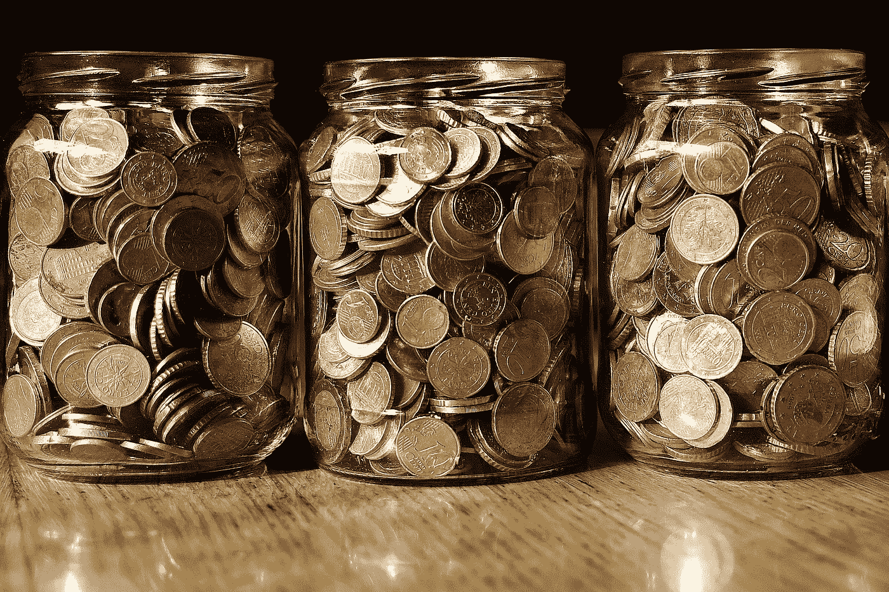

# 经济学家已经计算出在紧急情况下你需要存多少钱——这比你想象的要少得多

> 原文：<https://medium.datadriveninvestor.com/economists-have-calculated-how-much-you-have-to-save-in-an-emergency-it-is-much-less-than-you-81461f1b91e7?source=collection_archive---------14----------------------->

(Picture from Franz W. on pixabay.com)

一般来说，理财专家建议家庭总是要存一笔储蓄。其背后的想法非常有意义:留出的钱应该有助于度过经济困难时期，或者在意想不到的维修(如汽车或洗衣机的维修)到期时可用。

据美国新闻频道美国消费者新闻与商业频道报道，理财顾问因此同意每个家庭都应该存一些钱，但是储蓄的水平是有争议的。在某些情况下，专家建议节省高达 15000 美元——这远远超出了家庭或低收入人群的承受能力。

 [## 艺术、科学和梦想的共同本质|数据驱动的投资者

### 人类的梦想是强大和无限的。这种形而上学的思想世界可能是最持久的，并且是存在的…

www.datadriveninvestor.com](https://www.datadriveninvestor.com/2020/06/18/common-substance-of-art-science-and-dreams/) 

# 2467 美元足够度过经济困难时期

出于这个原因，经济学家艾米丽·加拉格尔和豪尔赫·萨巴特再次进行了计算，并得出了一个应该让许多人感到惊讶的结果。在他们的报告“家庭储蓄决策的经验法则:使用阈值回归的估计”中，他们解释并计算了为什么，特别是低收入家庭不需要如此高的储蓄。

这项研究表明，2467 美元足以度过更糟糕的金融时期和紧急情况。

为了进行计算，他们纳入了来自收入和项目参与调查的数据，并研究了 70，000 多个低收入家庭的财务信息。在这种情况下，低收入人群是指那些收入低于贫困线 200%的人，这影响了美国大约 30%的人口。

# 随着金额的增加，储蓄变得不那么有效

数据显示，大多数美国公民在紧急情况下甚至没有 400 美元可用。欧洲的情况也类似。根据 2018 年辉煌研究的“德国应急储备”研究，34%的德国人无法在不产生债务的情况下拿出 500 欧元用于突然发生的支出。

研究人员发现，即使是最小的储蓄也能降低低收入家庭最终陷入贫困的风险(例如，如果他们失去工作，无力支付房租)，但储蓄超过 2467 美元就不再有效。

# 个人费用必须考虑在内

虽然计算结果仅涉及低收入家庭，但专家们认为，特定的储蓄金额也应同样适用于中高收入人群，因为他们通常比经济薄弱的家庭更有可能用自己的收入来弥补危机。

然而，科学家们也强调，在省钱的时候，应该考虑个人购买或成本。此外，设定的数目不应该成为进一步节省的障碍。科学家说，如果你朝着某个特定的目标努力，或者想存更多的钱，你不应该让结果阻止你。不要说 2467 美元是最优节省。

如果你想了解更多关于如何有效省钱的知识，你可能应该读一下我写的关于采访我的一个节俭的朋友的文章。

英俊的约翰尼

**访问专家视图—** [**订阅 DDI 英特尔**](https://datadriveninvestor.com/ddi-intel)