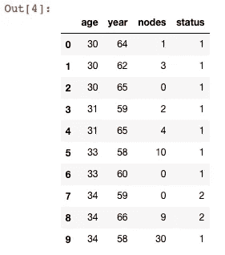
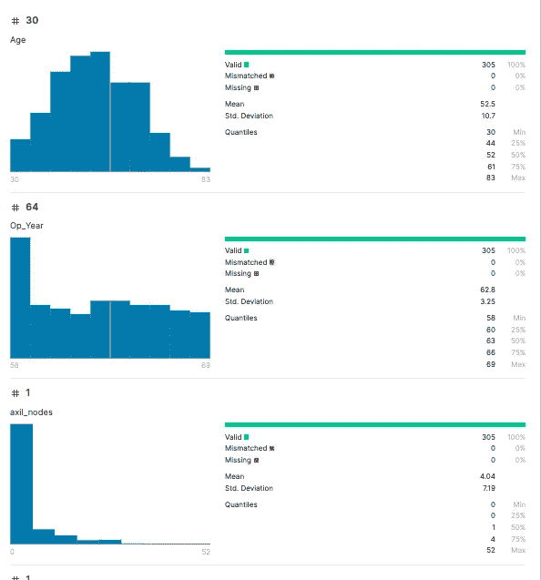
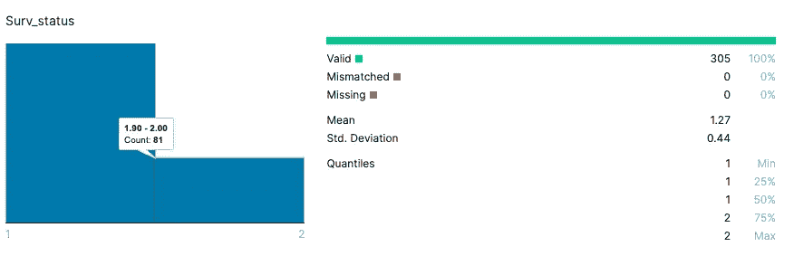
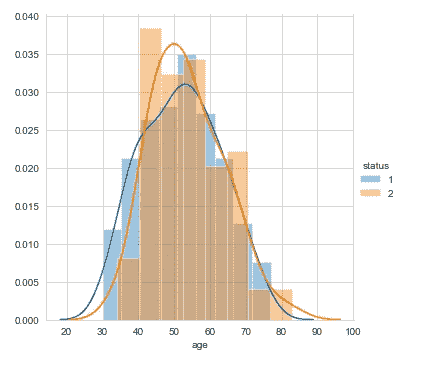
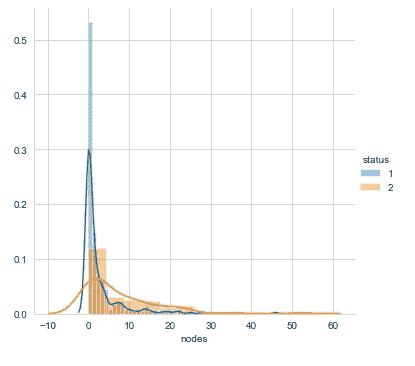
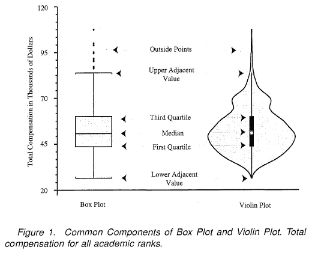

# EDA |探索性数据分析|始终倾听并理解数据所说的内容。

> 原文：<https://medium.datadriveninvestor.com/eda-exploratory-data-analysis-always-listen-and-understand-what-data-says-2604df57c2bb?source=collection_archive---------3----------------------->

> 要想在这个领域变得令人敬畏，你必须理解数据给画面带来的神奇。
> 
> ——塔潘(是我说的，但这是真的。)


Photo by [Mika Baumeister](https://unsplash.com/@mbaumi?utm_source=medium&utm_medium=referral) on [Unsplash](https://unsplash.com?utm_source=medium&utm_medium=referral)

让我们深入了解一下数据给我们带来了什么，得出了什么结论，以及这些结论如何让我们的模型和预测变得更好。


没错。在探索性数据分析中有三样东西，

1.  听或看(数据有哪些)
2.  理解(理解数据，如果数据很棒，或者我们需要做一些操作让它变得很棒。)
3.  Act(使制作数据的操作变好。)

## 我们在做 EDA 的时候首先要看到需要处理什么样的数据。

如果没有，你总是会得到数字或分类数据(比如一个图像数据，我们必须把图像转换成数字形式)。

其中一个奇怪的是，如果一列中的数据只有 1，2，3 个值，那么这些就不再是连续值，现在更像是分类值。让我告诉你你将实时面对多少类型的这些群体。


> **数字:**

我知道我们都知道，我们从第一节课就知道了，这是我们的数字系统，0，1，2，3…对于数字类型，我们将得到两种类型。

1.  **连续变量:**这些数据是连续的，并且有意义，因为一个数据可以是来自其他数据的<或>。例如:员工的工资、年龄、身高。
2.  **离散数字变量:**这是特定事物的计数总和，例如，员工有多少辆车，员工在年度评估中得了多少分。

> **分类:**

这是在收集数据时理解数据的一种非常简单的方法，如果我们可以添加关于数据的任何规范，这将在与其他数据进行比较时给我们带来很大的洞察力。

举个例子，给你一个任务，在花园里找到一朵花，找到它的最大信息是什么？1.这花有四片花瓣。这是一朵白色的花。当然，你会寻找一朵白色的花，它有 4 片花瓣。

一些类型的分类变量类型:

1.  **序数范畴变量:**这是它维持秩序的范畴。比如喜欢你的《脸书邮报》或者你的书的评分。在分类值保持某种顺序的任何地方，它的顺序分类值。
2.  **名词性范畴变量:**这是它从不维持秩序的地方，比如花的颜色，因为白色不是>或<那么任何颜色，它是一种独特的颜色，就像一个人的性别是男是女。

我们已经看到了我们将获得什么样的数据，现在让我们看看如何处理以及在这样做的同时我们可以收集什么样的洞察力。

## 探索:


Photo by [Diane Helentjaris](https://unsplash.com/@dhelentjaris?utm_source=medium&utm_medium=referral) on [Unsplash](https://unsplash.com?utm_source=medium&utm_medium=referral)

所以为了探索，我们需要一个数据集！..所以在这篇文章中，我选择了一个简单的数据集。即[哈伯曼的生存数据集。](https://www.kaggle.com/gilsousa/habermans-survival-data-set)

首先，我们必须加载数据集。这一次，我们将使用 Pandas lib 来完成，计算将使用 Numpy lib 来完成，而数据可视化将使用 Matpolib lib 来完成。

```
**import** **numpy** **as** **np**               *# Lib for Mathmetical Calculations*
**import** **pandas** **as** **pd**              *# Lib for Data analysis*
**import** **matplotlib.pyplot** **as** **plt**  *# Lib for Ploting data in graphs*
**import** **seaborn** **as** **sns**            *# same as matplot lib but more beautiful and simple*
```

为了加载数据，我们必须使用 Pandas 的 read_csv()方法。

```
habermanDF = pd.read_csv('haberman.csv')
habermanDF.head(10)
```



这些数据包含年龄、年份、节点、状态..正如列所说，它有 4 列，即年龄、年份、节点和状态。只要试着理解你总是处理什么数据，因为这些是数据集的列描述。

```
*# age    -   Patients age at the time of operation*
*# year   -   On Which Year patients got operation (like if 64 -- value clould be like 1964)*
*# nodes  -   Positive axillary nodes detected* 
*# status -   Class 1 - Who live more then 5 yrs or more and Class 2 - Couldn't make it, less the*
```



这是一个基本的描述，你可以在 Kaggle 中找到。因此，如果我们可以在这里看到每个特征的最小值-最大值，以及任何缺失的数据，均值和标准差。偏差。

或者我们可以用名为 describe()的函数来查看这些数据。

```
habermanDF.describe()
```


```
habermanDF.info()
```


**我们如何检查缺失的数据？**

```
habermanDF.isnull().sum()
```

**你是否发现了缺失的数据？**

## 一些有用的状态信息:



*   81 人在 5 年后死亡，224 人(305–81)存活。

## **我们来看看节点和年龄有没有关系。**

问:淋巴结会增加 wrt 年龄吗？

每次做这些数据你都可以问这样的问题，这将有助于你更好地理解数据。

```
sns.set_style("white");
sns.FacetGrid(habermanDF, hue="status", height=4).map(plt.scatter, "age", "nodes").add_legend();
plt.show();
```


观察:

*   看起来，不管年龄大小，越来越多的人的淋巴结少于 15 个左右。
*   所以年龄在这里不起任何作用。

这里有一个很棒的函数叫做 pairpolt，它将绘制出所有彼此相关的特性。

```
sns.set_style("whitegrid");
sns.pairplot(habermanDF, hue="status", height=2);
plt.show()
```


## 我们来看看年龄和地位有没有关系。

问:年龄对生存状态有影响吗？

```
sns.FacetGrid(habermanDF, hue="status", height=5) \
   .map(sns.distplot, "age") \
   .add_legend();
plt.show();
```



观察结果:

*   对于年龄特征，类别 1 和类别 2 有很大的重叠区域。所以我们可以说年龄对于生存来说无关紧要。
*   但是从 40 岁到 60 岁，死亡人数比其他人多。

## 节点呢

问:节点有什么要说的？

```
sns.FacetGrid(habermanDF, hue="status", height=5) \
   .map(sns.distplot, "nodes") \
   .add_legend();
plt.show();
```



观察结果:

*   在 0 附近有一个高峰..它是蓝色的，意味着拥有 0 个节点的人可能有机会活得更久。

这些操作被称为单变量分析。

## 绘制 PDF 和 CDF:

PDF:概率密度函数:-如果我们简单地把它。*概率每次取某一点的概率。*

CDF:累积密度函数:-如果我们简单地把它。*累计是低于它的任何事物的总概率。*


从这里[你可以更好的回答自己。](https://www.quora.com/What-is-the-difference-between-a-CDF-and-a-PDF#:~:text=always%20right%20continuous.-,Basically%20CDF%20gives%20P(X%20x)%2C%20where%20X%20is,function%20below%20the%20point%20x.&text=PDF%20of%20a%20continuous%20random,(say%20x)%20is%200.)

只是绘制节点和年龄，wrt 状态的 pdf 和 CDF。

```
*# PDF, CDF, firt creating status*
habermanDF_1 = habermanDF.loc[habermanDF["status"] == 1]
habermanDF_2 = habermanDF.loc[habermanDF["status"] == 2]*# Survived Patients nodes*
counts, bin_edges = np.histogram(habermanDF_1['nodes'], bins=10, 
                                 density = **True**)
pdf = counts/(sum(counts))
print(pdf);
print(bin_edges)

*#compute CDF*
cdf = np.cumsum(pdf)
plt.plot(bin_edges[1:],pdf)
plt.plot(bin_edges[1:], cdf)

*# Not Survived Patients nodes*
counts, bin_edges = np.histogram(habermanDF_2['nodes'], bins=10, 
                                 density = **True**)
pdf = counts/(sum(counts))
print(pdf);
print(bin_edges)

*#compute CDF*
cdf = np.cumsum(pdf)
plt.plot(bin_edges[1:],pdf)
plt.plot(bin_edges[1:], cdf)

*# Survived Patients age*
counts, bin_edges = np.histogram(habermanDF_1['age'], bins=10, 
                                 density = **True**)
pdf = counts/(sum(counts))
print(pdf);
print(bin_edges)

*#compute CDF*
cdf = np.cumsum(pdf)
plt.plot(bin_edges[1:],pdf)
plt.plot(bin_edges[1:], cdf)

*# Not Survived Patients age*
counts, bin_edges = np.histogram(habermanDF_2['age'], bins=10, 
                                 density = **True**)
pdf = counts/(sum(counts))
print(pdf);
print(bin_edges)

*#compute CDF*
cdf = np.cumsum(pdf)
plt.plot(bin_edges[1:],pdf)
plt.plot(bin_edges[1:], cdf)

plt.show();
```


## 百分点和分位数。我们在 Kaggle 信息页面上看到的。

```
*#Median, Quantiles, Percentiles, IQR.*
print("**\n**Medians:")
print(np.median(habermanDF_1["nodes"]))
print(np.median(habermanDF_2["nodes"]))

print("**\n**Quantiles:")
print(np.percentile(habermanDF_1["nodes"],np.arange(0, 100, 25)))
print(np.percentile(habermanDF_2["nodes"],np.arange(0, 100, 25)))

print("**\n**90th Percentiles:")
print(np.percentile(habermanDF_1["nodes"],90))
print(np.percentile(habermanDF_2["nodes"],90))

**from** **statsmodels** **import** robust
print ("**\n**Median Absolute Deviation")
print(robust.mad(habermanDF_1["nodes"]))
print(robust.mad(habermanDF_2["nodes"]))
```


## 箱线图:

一种比柱状图或任何其他图表更能展示信息的图表，因此在数据分析中经常使用。


> 箱线图是一种通过四分位数以图形方式描绘数字数据组的方法。

基本上，它告诉你最小值，最大值，中间值，异常值，四分位数..一切来自一个情节。所以才这么牛逼。

## 让我们来看看节点。箱形图

```
sns.boxplot(x='status',y='nodes', data=habermanDF)
plt.show()
```


观察结果:

*   对于第 1 类(幸存下来的)大多数人有节点 0。由于他们的中线和中线是相同的，所以更多(50%)存活下来的人有 0 个淋巴结。
*   对于 2 班(没有幸存下来)来说，他们的中位数在 4 左右。75%大约是 11，所以节点 4 到 11 的人死亡。
*   但这并不能证明如果病人没有淋巴结，他就能存活。导致类 2 最小值有 as 0 个节点
*   上帝保佑有没有人幸存下来，或者这是一个人类的错误，作为一个离群值。

## 所以我们来看看年龄。箱形图

```
sns.boxplot(x='status',y='age', data=habermanDF)
plt.show()
```


观察结果:

*   年龄最小的 30 岁，最大的 80 岁以上
*   存活和未存活的中位数基本相似，这意味着年龄对存活没有太大影响。
*   最年轻的病人大约 34 岁，最大的病人是所有病人中最大的。

## 小提琴情节:

这些图非常类似于箱形图，但优点是我们也可以绘制分布图。



## 让我们来看看节点。小提琴情节

```
sns.violinplot(x="status", y="nodes", data=habermanDF, size=5)
plt.show()
```


观察结果:

*   这里没有更大的差异。只是很高兴看到两个情节在一起。
*   只有一点，虽然幸存的人和没幸存的人在淋巴结上没有太大的区别。因为两个图形峰值都是 0 到 5

## 等高线图:

二元函数的等高线是一条曲线，沿着这条曲线，函数有一个常值，因此这条曲线连接了具有相同值的点


## 让我们来看看节点。小提琴情节

```
sns.jointplot(x="nodes", y="age", data=habermanDF_1, kind="kde")
plt.show()
```


观察:

*   你还能说什么..更暗的地方靠近节点 0，年龄在 48-68 岁之间
*   山谷清楚地展示了幸存的人

## 所以我们来看看年龄。小提琴情节

```
sns.jointplot(x="nodes", y="age", data=habermanDF_2, kind="kde")
plt.show()
```


观察:

*   我不会说一个巨大的变化，但节点的范围增加了，这不仅意味着人
*   有 0 -10 个淋巴结死亡，但也有 20 个以上的淋巴结死亡，而存活的人则没有这种情况。

下面是如何对数据集进行 EDA 的方法。还有很多其他的图表要做..像 3d 图形，地图绘图。

在下一篇博客中，我将展示新冠肺炎数据集上的 EDA，在那里你也可以看到这些其他的图。


如果你喜欢这篇文章，请一定要鼓掌。请关注我的 Github 和我的 medium 个人资料上的更多项目和文章。

[](https://github.com/tapanKumarPatro) [## tapanKumarPatro -概述

### 在 GitHub 上注册你自己的个人资料，这是托管代码、管理项目和构建软件的最佳地方…

github.com](https://github.com/tapanKumarPatro) [](https://medium.com/@tapankumarpatro05) [## Tapan Kumar Patro -中等

### 阅读塔潘·库马尔·帕特罗在媒介上的作品。机器学习工程师、软件工程师@ Atmecs Technologies…

medium.com](https://medium.com/@tapankumarpatro05) 

不要忘记查看 Android 应用程序开发深度学习项目的端到端部署。

[](https://medium.com/analytics-vidhya/end-to-end-deep-learning-based-app-af67d4008550) [## 基于深度学习的端到端 app。

### 聪明烹饪

medium.com](https://medium.com/analytics-vidhya/end-to-end-deep-learning-based-app-af67d4008550) 

谢了。如有任何疑问，请留言。