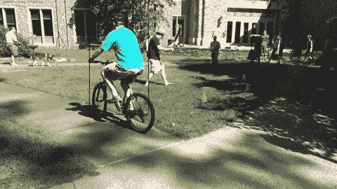
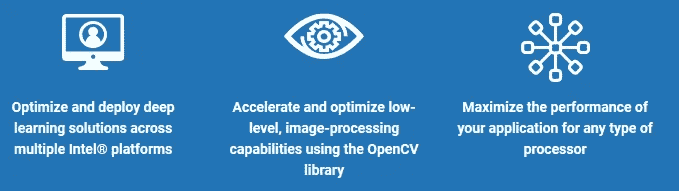
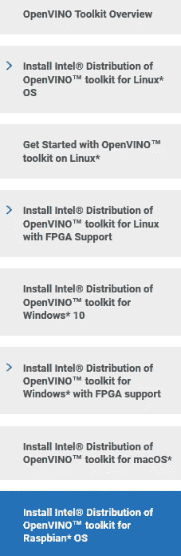
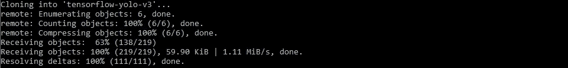
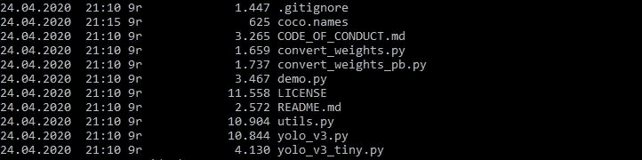
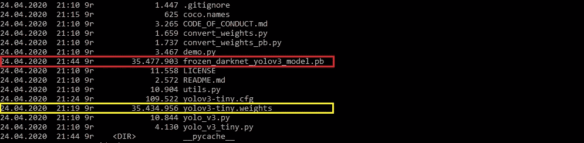
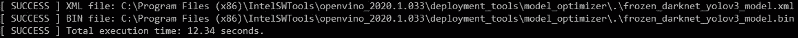
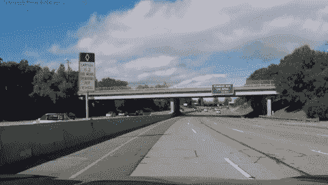
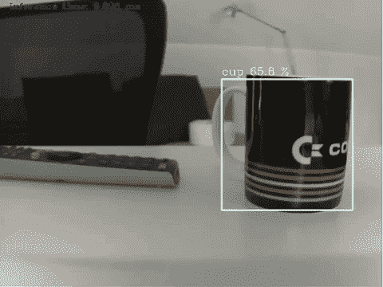

# 边缘人工智能——边缘的计算机视觉推理

> 原文：<https://medium.datadriveninvestor.com/edge-ai-computer-vision-inference-on-the-edge-part-2-2-aaddfae870f0?source=collection_archive---------2----------------------->

卡斯滕·莫宁博士

Object detection on video frames using YOLOv3-tiny on a Raspberry Pi with an Intel Neural Compute Stick 2\. Input video source: [CAMPUS dataset](https://bitbucket.org/merayxu/multiview-object-tracking-dataset/src/master/) for multi-view object tracking [1]

这是关于在边缘上运行人工智能应用的两部分系列的最后一部分，特别是在英特尔神经计算棒 2 加速的 Raspberry Pi 3 上运行计算机视觉推理。

看看[第 1 部分](https://medium.com/datadriveninvestor/edge-ai-computer-vision-on-the-edge-dfa4ad604651)获取:

1.  edge AI 硬件加速器和开发板选项概述，
2.  关于如何将带有板载摄像头的 Raspberry Pi 配置为 edge AI 就绪设备的指南，
3.  关于如何在 Raspberry Pi 上安装英特尔 OpenVINO toolkit 的指南，例如，在您的笔记本电脑上安装，以便为在 Raspberry Pi 上执行计算机视觉推理做好准备。

第二部分建立在步骤 2 和 3 的基础上。虽然第 1 部分以运行在 Raspberry Pi 上的 OpenVINO 人脸检测演示应用程序结束，但本文将讨论在这样的边缘设备上开发您自己的计算机视觉定制解决方案。更具体地说，我将带您在一个 Raspberry Pi 上完成 YOLOv3-tiny 对象检测模型的定制实现，如第 1 部分所述。(关于 YOLOv3 物体探测模型的细节可以在[这里](https://towardsdatascience.com/yolo-v3-object-detection-53fb7d3bfe6b)找到。)但是，首先，让我们仔细看看开源的英特尔 OpenVINO 工具包，特别是用于 Raspbian 操作系统的 OpenVINO 工具包[。🗹](https://docs.openvinotoolkit.org/latest/openvino_docs_install_guides_installing_openvino_raspbian.html)

**英特尔 OpenVINO 工具包**

引用官方 OpenVINO toolkit 文档:“open vino toolkit 是一个全面的工具包，用于快速开发模拟人类视觉的应用程序和解决方案。基于卷积神经网络(CNN)，该工具包扩展了英特尔硬件上的 CV 工作负载，最大限度地提高了性能。”

OpenVINO toolkit high-level capabilities (Source: [OpenVINO](https://docs.openvinotoolkit.org/))

进一步来说，该工具包:

*   “在边缘实现基于 CNN 的深度学习推理
*   支持在英特尔 CPU、英特尔集成显卡、英特尔 FPGA、英特尔神经计算棒 2 和采用英特尔 m ovidius VPUs 的英特尔视觉加速器设计上的异构执行
*   通过易于使用的计算机视觉函数库和预先优化的内核加快上市时间
*   包括对计算机视觉标准的优化调用，包括 OpenCV 和 OpenCL。"

除其他外，这意味着该工具包特别适合在边缘设备上开发计算机视觉推理应用，如通过采用英特尔 Movidius VPU 的英特尔 Neural Compute Stick 2 USB 加速器棒增强的 Raspberry Pi。

⚡如果你可能想知道:“OpenVINO”代表“开放视觉推理和神经网络优化”，表明它的深度学习计算机视觉重点。⚡

OpenVINO 工具包的主要元素包括:

*   模型优化器，
*   推理机和
*   开放式模型动物园。

模型优化器采用在 Caffe、TensorFlow、MXNet、Kaldi 或 ONNX 框架中预训练的深度学习计算机视觉模型，并将它们转换为 OpenVINO 中间表示(IR)，这是一种使用在边缘设备上运行的推理引擎针对模型执行优化的简化模型表示。推理引擎使用一个通用的 API 为 CPU 和 GPU 以及 VPU 硬件加载和推断这些 IR 文件。

[开放模型动物园](https://software.intel.com/content/www/us/en/develop/tools/openvino-toolkit/pretrained-models.html)提供免费下载的预训练模型，可用于加速开发过程，而不必首先训练自己的模型，然后需要使用模型优化器将其转换为中间表示，然后才能用于所考虑的边缘设备上的推理引擎。

当不使用来自开放模型动物园的预训练模型时，使用 OpenVINO 工具包在边缘部署深度学习模型的典型工作流如下所示。

Typical workflow for deploying a deep learning model using the OpenVINO toolkit (Source: [OpenVINO](https://docs.openvinotoolkit.org/latest/_docs_IE_DG_Introduction.html))

因此，开放模型 Zoo 模型的优势在于已经被转换为 OpenVINO 中间表示，但是中间表示是什么呢？

IR 描述了输入模型的结果，该输入模型已经在以下一种或多种技术的帮助下针对边缘推断进行了优化:

*   量化，即模型权重和偏差的数值精度的降低，
*   模型层融合，即将多个模型层合并为一个，
*   冻结，即删除仅对模型训练有用的元数据和操作(仅在 TensorFlow 模型的情况下)。

当然，您也可以完全自由地使用其他来源的模型。不过，这些必须经过 OpenVINO 工作流程的第二步。也就是说，您必须将模型优化器应用于输入模型，以生成其推理优化的 IR。

一旦 IR 生成，它的。xml(优化模型拓扑)和。bin(优化的模型权重和偏差)文件可以被输入到在边缘设备上运行的 OpenVINO 推理引擎中，以便在边缘设备上进行性能优化的推理。

事实上，在这个由两部分组成的博客系列的第 1 部分中的人脸检测示例中，我们已经以简单的方式完成了这个工作流程:我们从开放模型动物园下载了一个预先训练好的人脸检测模型。更具体地说，由于 OpenVINO Model Downloader 在用于 Raspbian OS 的 OpenVINO toolkit 中不可用，我们将 IR 文件手动下载到 Raspberry Pi 上，并将它们输入到推理引擎中，用于在输入图像上生成边界框。

我们现在将采取稍微更具挑战性的路线，通过模型优化器将预训练的公共模型，YOLOv3 [2]的“微小”版本，转换成 IR。这就引出了一个关键点:由于 OpenVINO 推理引擎代表了用于 Raspbian OS 的 OpenVINO 工具包中唯一的 OpenVINO 主元素，所以模型转换需要在 Raspberry Pi 环境之外完成，例如，在您的主机上，这意味着您也需要在您的主机上安装 OpenVINO。在 OpenVINO [Linux](https://docs.openvinotoolkit.org/latest/_docs_install_guides_installing_openvino_linux.html) 、 [macOS](https://docs.openvinotoolkit.org/latest/_docs_install_guides_installing_openvino_macos.html) 和 [Windows](https://docs.openvinotoolkit.org/latest/_docs_install_guides_installing_openvino_windows.html) 安装指南的帮助下，这应该不是太大的挑战。

⚡对于 Windows 的 OpenVINO toolkit，您可以不使用 Microsoft Visual Studio 和 CMake 安装步骤，因为在下面，我们将只使用模型优化器。但是，如果您想在 Windows 机器上安装完整的 OpenVINO，当然强烈建议您完成所有的安装步骤。⚡

现在，您已经为在您的 Raspberry Pi 上定制实现 YOLOv3-tiny [2]模型做好了准备。

**将预训练的 YOLOv3-tiny 模型转换为 OpenVINO 中间表示**

在您的主机上安装 OpenVINO 之后，让我们生成 YOLOv3-tiny 模型的 IR。YOLOv3-tiny 的网络架构针对低性能设备进行了执行优化，但代价是降低了预测精度:它只使用了 19 个卷积层，而不是标准 YOLOv3 模型的 53 个卷积层。因此，它的执行效率比标准 YOLOv3 模型高得多，但准确性也低得多，平均精度(mAP)为 33.1% ，而标准 YOLOv3 模型的 mAP 值为 51–57%。

为了将 YOLOv3-tiny 模型转换为 IR 格式，我们将主要遵循 OpenVINO [指南来转换 YOLO 模型](https://docs.openvinotoolkit.org/latest/_docs_MO_DG_prepare_model_convert_model_tf_specific_Convert_YOLO_From_Tensorflow.html)。

**第一步**:克隆下面的 GitHub 库，得到一个基于 TensorFlow 的 YOLOv3-tiny 实现。

⚡原则上，您也可以使用任何其他基于 TensorFlow 的 YOLOv3-tiny 模型实现，但当您尝试使用以下步骤将其转换为中间表示时，可能会遇到困难。⚡

`git clone [https://github.com/mystic123/tensorflow-yolo-v3.git](https://github.com/mystic123/tensorflow-yolo-v3.git)`

YOLOv3 repository cloning

**第二步**:下载一组类标签，例如以 [coco.names](https://raw.githubusercontent.com/pjreddie/darknet/master/data/coco.names) 的形式，其中包括 80 个常见的对象类，从人到汽车和动物，或者提供您自己的一组您想要使用 YOLOv3-tiny 进行推理的类标签，前提是 YOLOv3-tiny 已经对您选择的类进行了预训练。

YOLOv3 repository contents and coco.names file

**步骤 3** :下载预先训练好的 [YOLOv3-tiny 权重](https://pjreddie.com/media/files/yolov3-tiny.weights)，或者自己训练 YOLOv3-tiny 并使用得到的模型权重。

Pre-trained YOLOv3-tiny weights (yellow) and the frozen model definition (red)

**步骤 4** :将 YOLOv3 模型转换为协议缓冲文件格式(。pb)以获得用于推断的简化的，即“冻结的”模型定义。

`python convert_weights_pb.py --class_names coco.names --data_format NHWC --weights_file yolov3-tiny.weights --tiny`

statemenet 末尾的`--tiny`参数指示转换器生成 YOLOv3-tiny 版本的冻结张量流图。

**步骤 5** :将冻结的模型定义转换为 IR 格式。在此步骤之前，不要忘记执行位于`$OPENVINO_INSTALL_DIR/bin/`中的 OpenVINO `setupvars`环境设置脚本。

`python mo_tf.py --input_model frozen_darknet_yolov3_model.pb --tensorflow_use_custom_operations_config <path/>yolo_v3_tiny.json --batch 1 --generate_deprecated_IR_V7`

其中`yolo_v3_tiny.json`模型配置文件的 OpenVINO `<path/>`应该是这样的:

`$OPENVINO_INSTALL_DIR/deployment_tools/model_optimizer/extensions/front/tf/`

⚡`--generate_deprecated_IR_V7` 参数强制模型优化器生成旧的 IR 版本 7。这是由于在第 1 部分的[中已经提到的与 IR 版本 10 相关的](https://medium.com/datadriveninvestor/edge-ai-computer-vision-on-the-edge-dfa4ad604651)[兼容性错误](https://software.intel.com/en-us/node/849460)。如果不使用这个参数，您转换的模型将在推断过程中失败，并显示一些难以处理的错误消息。⚡

⚡如果你想使用你转换的模型运行 OpenVINO 演示，请注意你可能需要添加`--reverse_input_channel`选项，因为 OpenVINO 演示通常期望颜色通道是 BGR 而不是通常的 RGB 顺序。参考官方 OpenVINO 演示文档，查看演示的具体输入要求。⚡

结果，我们得到了边优化的 YOLOv3-tiny 网络拓扑(.xml)以及权重和偏差项(。bin) IR 文件。

YOLOv3-tiny Intermediate Representation files

为了测试生成的 IR 文件的有效性，您可能需要在您的主机上运行 open vino[object detection yolo v3 demo](https://docs.openvinotoolkit.org/latest/_demos_python_demos_object_detection_demo_yolov3_async_README.html)。在这种情况下，请考虑上面的`--reverse_input_channel`评论。

样本输入视频的结果如下所示。[正如在使用 YOLOv3-tiny 进行推断时所预期的那样](https://pjreddie.com/darknet/yolo/)，帧速率很容易在非边缘设备上达到接近实时的推断，代价是部分相当差的汽车检测和边界框精度。

要结束这个准备阶段，只需将 IR 文件传输到您的 Raspberry Pi。🗹

这让我们将转换后的 YOLOv3-tiny 模型合并到一个在 Raspberry Pi 上运行的定制开发的应用程序中。

**边缘上使用 YOLOv3-tiny 的物体检测应用**

我们的应用程序由三个主要元素组成，一般来说，它们代表了大多数基于 OpenVINO 的 edge 应用程序:

*   推理机模型加载
*   基于应用程序的输入处理和推理请求
*   基于 App 的推理结果和输出处理

这反映在我们的 Raspberry PI 应用程序的以下代码结构中:

1.  用于将 IR 加载到推理引擎并执行推理的助手类
2.  由视频和摄像机输入预处理、帧提取和推理以及视频输出处理组成的核心例程
3.  yolov 3-微型模型参数化类

我们将使用推理引擎 API 的 Python 包装器。代码库可以在 GitHub 的[这里](https://github.com/cm230/Computer-Vision-On-The-Edge)找到。关于 YOLO 推理处理的元素在很大程度上与例如来自 [OpenVINO YOLO 橱窗](https://docs.openvinotoolkit.org/latest/omz_demos_python_demos_object_detection_demo_yolov3_async_README.html)的`object_detection_demo_yolov3_async.py`内的相应部分一致。因此，为了简单明了，在下面，我只讨论特定于 OpenVINO 的元素。

先来快速看一下 Python `class YoloParams`形式的 YOLOv3-tiny 参数化。它的值对应于最初的[暗网参数化，](https://github.com/pjreddie/darknet/blob/master/cfg/yolov3-tiny.cfg)所以原则上这并不奇怪。然而，选择“正确的”锚定值集(第 9–10 行)既是一门科学，也是一门艺术，此处使用的特定锚定值集可能不是下面进一步考虑的特定对象检测场景的最佳选择。所以，如果你也对 YOLO 锚的参数选择感到疑惑，请看这里的。

由助手`class Network`提供的特定于 OpenVINO 的方法在这个由两部分组成的博客系列的上下文中更加相关:`load_model`方法实例化了推理引擎核心类的一个对象，`IECore`(下面的第 24 行)。这个类在支持的设备之间提供了一个抽象层，隐藏了任何设备细节。因此，该类的方法通常期望实际使用的设备作为参数，这就是为什么设备参数包含在参数列表`load_model`中的原因。由于我们将英特尔神经计算棒 2 作为推理设备，因此该参数的默认值被设置为“MYRIAD”。

之前创建的红外文件形式的 yolo v3-微小物体检测模型被读入一个`IENetwork`物体(第 29 行)。`IENetwork`类支持读取和操作模型参数，如批量大小、数值精度、模型形状和各种层属性。该功能用于将批量大小设置为 1(第 31 行)，因为我们将一次对一帧执行推断。通过查看模型的输入拓扑，在第 33 行中也断言了这个单一输入需求。如果成功，模型的可执行版本在第 36 行被实例化，并被加载到无数设备中用于推断。最后，第 39–40 行在`IENetwork`对象的帮助下为模型输入和输出层创建可迭代对象。

⚡:由于我们正在处理各种各样的设备，为了保持简单，我选择了反对对不支持的网络层进行通常的安全检查，这在使用 CPU 设备进行视觉推断时是需要的:由于进入 IR 文件生成的模型优化器预处理是设备不可知的，所以优化的神经网络可能包含不被正在使用的特定设备 CPU 支持的层。因此，在进行基于 CPU 的推断之前，需要检查是否有任何不支持的层，并且如果遇到不支持的层，实际上将退出进一步的处理，以防止任意结果或系统崩溃。由于上述代码行也支持基于 CPU 的推理，如果您想使用 Raspberry Pi 的 CPU 而不是英特尔 Neural Compute Stick 2 来试验推理，请查看，例如，`object_detection_demo_yolov3_async.py`了解所需的额外层支持相关代码行。⚡

就`class Network`中的其他方法而言，`get_input_shape`方法使用`IENetwork`对象返回模型输入层的形状。

方法`async_inference`获取一个输入请求 ID，并为该请求执行异步推断。因为我们没有进行真正的异步处理，而是一次将一帧推送到推理引擎，所以请求 ID 被设置为 0。真正的异步处理需要为不同的推理请求使用不同的 id，将额外的帧推送到推理引擎，同时它可能仍然在处理以前的请求。然后，这些差异请求 id 允许区分各种推断结果，并执行单独需要的进一步处理。

由于我们正在执行异步处理，`wait`方法支持在尝试检索任何推理结果之前等待该过程完成。请注意，这个状态检查需要参考正确的请求 ID 来完成，因此，在本例中为 0。

方法`extract_output`然后返回由针对可执行网络的推理请求生成的推理输出。请求索引需要再次设置为 0，以引用正确的推理请求。 [wait 函数的 value -1](https://docs.openvinotoolkit.org/2018_R5/_ie_bridges_python_docs_api_overview.html) 确保一旦流程完成就返回状态。它有效地阻止了处理，直到超时或者结果可用，无论哪一个先出现。

由于各种与 OpenVINO 相关的助手方法已被排除在外，因此视频推断核心例程`infer_video`的讨论将留在 [GitHub 存储库](https://github.com/cm230/Computer-Vision-On-The-Edge)的 tinyYOLOv3.py 文件中，该文件使用助手方法获取视频或摄像机输入，以便生成屏幕和视频文件推断结果。

`infer_video`的 OpenVINO 相关初始化内容包括借助`Network class`(下面第 7 行)的推理机初始化，接着是模型的输入形状检索(第 18 行)。

`net`对象随后用于对一个单独的预处理视频帧发起异步推理请求(下面的第 3 行),并在等待异步推理完成后(第 8 行),使用`extract_output`助手方法检索推理结果(第 9 行)。然后，该输出被解析为适用于 YOLOv3 模型的情况。

⚡为了稍后将推断结果写入视频中，在`infer_video`方法中，我使用了 OpenCV VideoWriter 类和一个。avi 输出文件扩展名和 MP42 编解码器:`codec = cv2.VideoWriter_fourcc("M","P","4","2").`为特定设备设置寻找编解码器和文件扩展名的“正确”组合可能有些令人沮丧。例如，参见 Pyimagesearch 的 Adrian Rosebrock 撰写的[这篇文章](https://www.pyimagesearch.com/2016/02/22/writing-to-video-with-opencv/)。它为您提供了一些提示，告诉您对于您的特定设置，哪些组合可能是有效的。此外，它建议在您的 Raspberry Pi 上安装用于 FFMPEG 的 Python 绑定。这在我的情况下相当有效。然而事实上。安装 FFMPEG 库后，avi 文件扩展名与 MP42 编解码器的组合适用于我的设置，但这并不意味着它也适用于您的设置，您可能会发现自己不得不经历许多组合，直到获得有效的视频输出。⚡

⚡请注意，`infer_video`方法还利用 Pyimagesearch 的 [imutils 包中的 video 包来计算处理管道支持的每秒帧数(FPS)。⚡](https://www.pyimagesearch.com/2015/02/02/just-open-sourced-personal-imutils-package-series-opencv-convenience-functions/)

我们现在准备在 Raspberry Pi 上测试我们的应用程序，使用 MP4 输入视频和 Raspberry Pi 的板载摄像头场景。

对于 MP4 输入文件，下面的命令启动应用程序，读入输入文件，生成一个屏幕窗口，以检测到的对象周围的边界框的形式显示推理结果，包括相应的标签，并将这些结果写入。avi 输出文件:

`python tinyYOLOv3.py --m "frozen_darknet_yolov3_model.xml" --i "test_video.mp4" --l "coco.names"`

在这里，您可能需要添加模型的特定路径、输入视频和类标签文件参数。所用测试文件[1]的输出视频如下所示。由于英特尔神经计算棒 2 的帮助，Raspberry Pi 管理着大约 3 FPS 的可观帧速率。如果没有这个硬件加速器，处理速度会慢得像爬行一样，因为 Raspberry Pi CPU 大部分时间都在解码 MP4 输入。不出所料，YOLOv3-tiny 模型的性能优势是以较低的对象检测准确性为代价的:虽然人和自行车被检测得相当好，但其他对象如狗和球根本没有被检测到。

Object detection on video frames using YOLOv3-tiny on a Raspberry Pi with an Intel Neural Compute Sitck 2\. Input video source: [CAMPUS dataset](https://bitbucket.org/merayxu/multiview-object-tracking-dataset/src/master/) for multi-view object tracking [1]

当涉及到对实时摄像机输入的推断时，launch 命令看起来非常相似，当然，除了没有提供输入视频文件之外，因此应用程序默认为摄像机输入处理，即:

`python tinyYOLOv3.py --m "frozen_darknet_yolov3_model.xml" --l "coco.names"`

同样，您可能需要添加模型和类标签文件参数的特定路径。帧速率增加到 4 到 5 FPS 之间。这是因为 MP4 输入文件处理被计算要求较低的相机馈送处理所取代。类似于输入视频场景，诸如遥控器和咖啡杯之类的某些物体被相当可靠地检测到，而例如办公椅根本没有被检测到。

根据应用场景的不同，这些相对较低的精度可能就足够了。如果不是这样，也可以使用更精确但通常执行效率较低的型号，如 [MobileNet](https://docs.openvinotoolkit.org/latest/omz_models_public_mobilenet_ssd_mobilenet_ssd.html) 单次检测器。🗹

Object detection on camera frames using YOLOv3-tiny on a Raspberry Pi with an Intel Neural Compute Stick 2

**结束了。**

在[第 1 部分](https://medium.com/datadriveninvestor/edge-ai-computer-vision-on-the-edge-dfa4ad604651)中，从概述 Edge AI 硬件加速器和开发板以及 Raspberry Pi 配置和英特尔 OpenVINO 安装指南开始，包括一个对象检测演示应用，我们已经成功地定制实现了一个基于 YOLOv3-tiny 的对象检测应用，该应用在配备英特尔神经计算棒 2 的 Raspberry Pi edge 设备上处理视频文件或摄像头输入。代码库可以在 [GitHub](https://github.com/cm230/Computer-Vision-On-The-Edge) 上找到。

尽管英特尔 OpenVINO 软件包有些复杂，但总体而言，它代表了一种在边缘设备上实现人工智能应用的出色而简单的方式，尤其是在利用开放模型动物园中预先训练和转换的模型时。

由于这些相当近期的发展，边缘人工智能应用场景的领域已经开放，不胜枚举，例如，从智能家居或智能无人机设备到手势识别和基于视觉传感器的自动化场景。所需要的只是相对低成本的设备，如树莓 Pi 和硬件加速器、免费的 OpenVINO 库、一些想象力和一点点毅力。

**参考文献** 【1】徐玉燕，刘小玲，秦，朱少春，“基于场景的跨视角人物跟踪方法”，人工智能大会，2017

[2] J .雷德蒙和 a .法尔哈迪，“约洛夫 3:增量改进”，技术报告，arXiv:1804.02767，2018 年 4 月