# 边缘人工智能-边缘的计算机视觉-第 1/2 部分

> 原文：<https://medium.datadriveninvestor.com/edge-ai-computer-vision-on-the-edge-dfa4ad604651?source=collection_archive---------1----------------------->

卡斯滕·莫宁博士

Image by Lenin Estrade on pexels.com

如果网络连接不可用，或者网络延迟不足，或者出于监管、隐私和安全考虑需要本地处理，或者，事实上，所有这些方面的组合都存在，那么今天的标准基于云的人工智能方法就不是一个选项。

边缘 AI，即使用本地获得的数据在具有很少或没有网络连接的“边缘”上本地执行的 AI 计算，在这些环境下代表了可行的替代方案，其受制于所考虑的边缘设备的计算和数据处理限制。全球整体边缘计算市场，其中支持机器人、自动驾驶车辆、无人机、个性化智能手机和本地化医疗成像应用的边缘人工智能是一个重要元素，[估计到 2023 年将增长到 1.12 万亿美元](https://www.forbes.com/sites/cognitiveworld/2020/04/16/edge-ai-is-the-future-intel-and-udacity-are-teaming-up-to-train-developers/#47973ad268f2)。

 [## 修复摄影|数据驱动的投资者

### 汤姆·津伯洛夫在转向摄影之前曾在南加州大学学习音乐。作为一个…

www.datadriveninvestor.com](https://www.datadriveninvestor.com/2019/03/22/fixing-photography/) 

理由足够看一看如何在边缘 AI 领域入门的东西。受[1][2][3]的启发，我将演示如何使用开源[英特尔 OpenVINO](https://docs.openvinotoolkit.org/) 库和[英特尔神经计算棒 2](https://software.intel.com/en-us/neural-compute-stick) 在商用边缘设备 Raspberry Pi 上进行对象检测。这是两篇系列文章中的第一篇文章，

1.  概述 edge AI 硬件加速器和开发板选项，
2.  指导您使用板载摄像头将 Raspberry Pi 配置为 edge AI 就绪设备
3.  演示如何在 Raspberry Pi 上安装英特尔 OpenVINO，例如，在您的笔记本电脑上安装，为使用 Raspberry Pi 执行近实时计算机视觉推理做好准备。

第一篇文章是独立的。预计需要投入大约三个小时来完成端到端的工作。之后，您将拥有一个计算机视觉推理就绪的边缘设备，即，您将为(近)实时对象检测、图像分割、人体姿势估计、人脸或场景文本识别等用例的实施做好一切准备。在边缘。同样独立的 [**第二篇**](https://medium.com/@technoidsblog/edge-ai-computer-vision-inference-on-the-edge-part-2-2-aaddfae870f0) 展示了其中一个用例的基于 Python 的实现，可在 [GitHub](https://github.com/cm230/Computer-Vision-On-The-Edge) 上获得。🗹

因此，让我们来看看主流专用硬件加速器和 Edge AI 定制开发的主板选项。

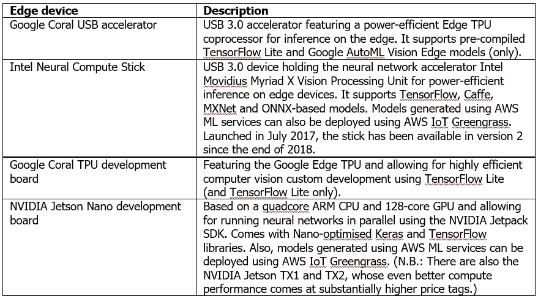

Device options for computer vision application development on the edge

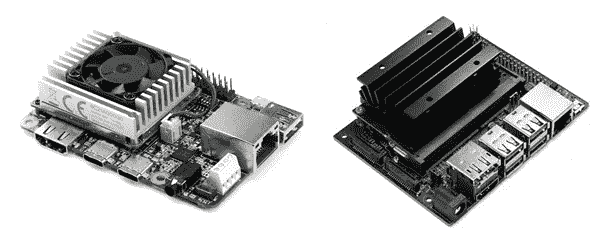

Google Coral TPU (left) and NVIDIA Jetson Nano development boards (right)

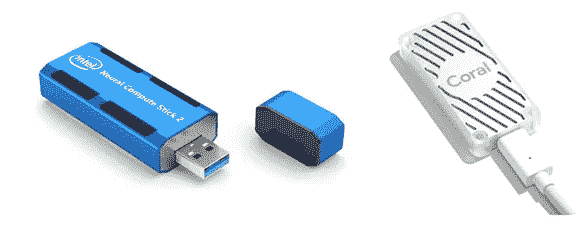

Intel NCS2 and Google Coral USB computer vision inference accelerators

出于本文的目的，我们将重点关注一款 Raspberry Pi 3 型号，该型号配备了一个板载摄像头和一个英特尔神经计算棒 2 (NCS2)。Raspberry Pi 3 CPU 的工作频率为 1.4 GHz，内存为 1 GB。尽管这些性能数据对于这种设备来说可能相当可观，但它们使得运行最先进的计算机视觉应用程序变得不可行。这就是诸如 Google Coral 或 Intel NCS2 等协处理器的用武之地。引用英特尔官方产品规格:“英特尔 NCS2 构建于英特尔 m ovidius Myriad X VPU 之上，具有 16 个可编程 shave 内核和一个专用神经计算引擎，用于深度神经网络推理的硬件加速。”它的功耗大约为 1 瓦。也就是说，它使树莓派上最先进的基于深度学习的计算机视觉*推理*成为现实命题。

⚡请注意，这些加速器主要用于计算机视觉*推理*，也就是说，它们不用于边缘设备上的模型训练。然而，通过边缘的*迁移学习*对预训练的深度学习模型进行再训练，也就是微调，代表了[明显的可能性](https://coral.ai/docs/edgetpu/retrain-classification/)。⚡

除了 NCS2，为了保持简单，我建议你购买一个树莓 Pi 3 型号 B+入门套件。它通常配备所有必要的零件，不包括板载摄像头，但包括预装在附带的 microSD 卡上的 NOOBS 和拉斯比安操作系统。这将为您省去(轻微的)麻烦，您需要单独购买各种零碎的东西，然后将 Raspbian 操作系统映像下载/刷新到 microSD 卡上，使 Raspberry Pi 可引导。与单独购买零件相比，这种优势的代价是整体成本更高。如果选择不使用入门套件，请点击这里的[获取 NOOBS/拉斯比安操作系统安装指南。](https://www.youtube.com/watch?v=PijX8GDco-g)

raspberry pi 3 型号 B+仅带有一个 USB 2.0 端口，因此当它与支持 USB 3.0 的 NCS2 一起使用时，性能会有所下降。我没有测试这一点，但这篇文章中的例子应该也可以工作，实际上甚至更快，如果你手头有一个 Raspberry Pi 4，它带有 USB 3.0。⚡

总的来说，在撰写本文时，这个硬件设置将出现在:

*   ~€ 70，用于树莓 Pi 3 型号 B+入门套件
*   ~€ 28，用于兼容树莓 Pi 3 型号 B+的车载相机
*   ~€ 70，用于英特尔 NCS2

Device setup: Raspberry Pi 3 Model B+ with 1080p HD camera module, universal power supply 2.5 A, 16GB microSD card and Intel Neural Compute Stick 2

假设您的 Raspberry Pi 和 NCS2 硬件设置已完成🗹，接下来我们将执行以下步骤。

1.  配置您的 Raspberry Pi
2.  安装车载摄像头模块
3.  为 Raspbian 操作系统安装 OpenVINO 工具包
4.  使用样本对象检测模型执行面部检测

# **1。配置您的树莓 Pi**

您可以打开终端会话并直接在您的 Raspberry Pi 上工作，或者在您的 Raspberry Pi 上启用 SSH 或 VNC，然后从您的主机建立到 Pi 的远程连接。在 Pi 上使用`ifconfig`命令获取其 IP 地址。

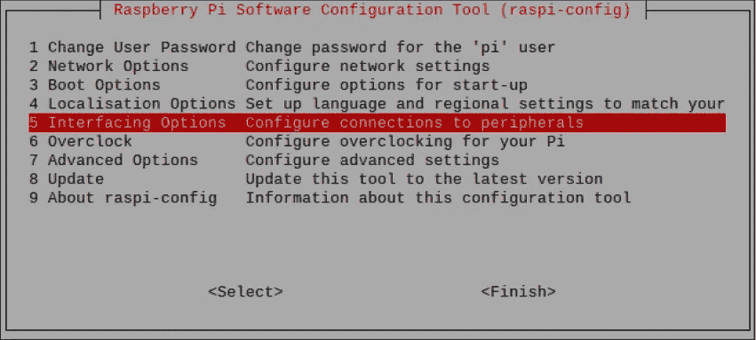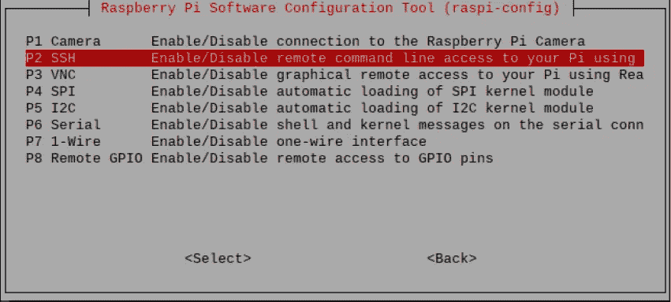

Enabling SSH or VNC remote access on your Raspberry Pi

为了安全起见，在阅读完本文后计划进行自定义开发时，可以打开一个终端会话并编辑相应的配置文件条目，将 Raspberry Pi 的交换分区大小从默认值 100 MB 增加到 1，024 MB。(我们使用 nano 作为选择的文本编辑器来修改 dphys-swapfile，但是您当然可以使用任何替代的文本编辑器。)

`sudo nano /etc/dphys-swapfile`

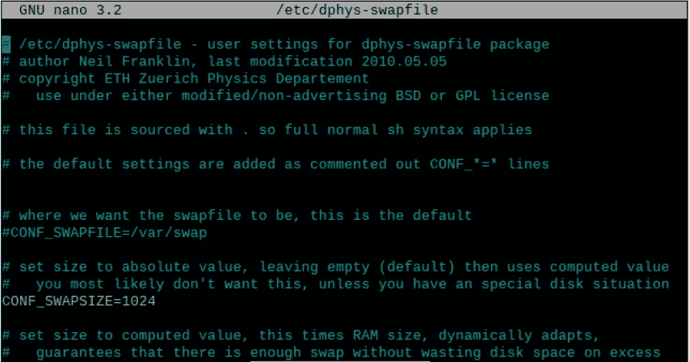

Editing the Raspberry Pi’s swap partition configuration file

运行`free -h`命令应该可以确认新的交换文件大小为 1 GB。

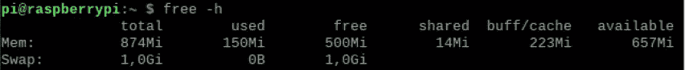

Checking the Raspberry Pi’s swap partition size increase from 100 MB to 1 GB

最后，您可能希望在终端会话中使用`sudo apt-get update && sudo apt-get upgrade`来确保您的 Raspberry Pi 完全是最新的，然后重启系统。

就 Raspberry Pi 配置而言，这就剩下板载摄像头模块的安装了。🗹

# **2。安装车载摄像头模块**

从终端打开 Raspberry Pi 配置工具，输入`sudo raspi-config`并在“接口选项”对话框中选择“启用摄像头”。

Activating the Raspberry Pi’s camera functionality

接下来，例如，参见[这里的](https://www.youtube.com/watch?v=VzYGDq0D1mw)正确地将您的相机模块物理连接到 Raspberry Pi 板，然后重新启动系统。开机后，打开终端会话，输入`sudo modprobe bcm2835-v4l2`激活相机。

现在你应该能够分别使用`raspistill`和`raspivid`命令通过相机拍摄静态图像和录制视频。另请参见[此处](http://projects.raspberrypi.org/en/projects/getting-started-with-picamera/2)的简单分步指南，包括如何更改图像设置等其他信息。

为了避免每次启动 Raspberry Pi 时都必须执行`modprobe`命令，将 bcm2835-v4l2 形式的相机模块包含在默认列表中，如下所示，然后重新启动系统。🗹

`sudo nano /etc/modules`

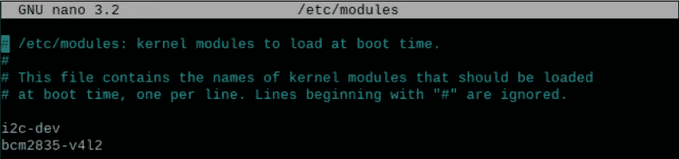

Adding the camera module for automatic availability after Raspberry Pi boot-up

# **3。为 Raspbian 操作系统安装 OpenVINO 工具包**

通过[这个 OpenVINO 下载网站](https://download.01.org/opencv/2020/openvinotoolkit/)将最新版本的“OpenVINO toolkit for Raspbian OS”下载到您的 Raspberry Pi 上。在此站点中，查找类似以下内容的文件名:

`l_openvino_toolkit_runtime_raspbian_p_<version>.tgz`

例如，在撰写本文时，最新的 OpenVINO for Raspbian 版本为:2020.1.023

⚡为了在这个阶段保持事情的简单，我将在这个两贴系列的第二贴中更详细地介绍 OpenVINO 工具包、它的元素以及用于深度学习模型部署的典型 OpenVINO 工作流。⚡

与其 Linux 版本不同，OpenVINO for Raspbian 下载没有软件安装程序，因此您必须遵循英特尔相当简单的官方“[Install open vino toolkit for Raspbian OS](https://docs.openvinotoolkit.org/latest/_docs_install_guides_installing_openvino_raspbian.html)”指南来完成许多手动安装步骤。但是，请特别注意:

*   事实上，强烈推荐永久设置所需环境变量的“可选”步骤，即包括此步骤:
    `echo "source /opt/intel/openvino/bin/setupvars.sh" >> ~/.bashrc`

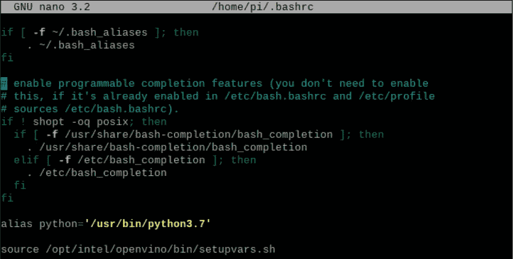

Including the OpenVINO environment setup step at Raspberry boot-up

*   以下步骤经常被遗漏，但是，正如官方安装指南中指出的，使用 NCS2 执行推理需要借助
    `sh /opt/intel/openvino/install_dependencies/install_NCS_udev_rules.sh`准备好相关的 USB 依赖项
*   在撰写本文时，树莓 Pi 的 OpenVINO 预计至少是 Python 3.5。万一你的树莓派需要 Python 更新(这里以 Python 3.5.6 为例):
    `wget https://www.python.org/ftp/python/3.5.6/Python-3.5.6.tgz`
    `sudo tar zxf Python-3.5.6.tgz`
    `cd Python-3.5.6`
    `sudo ./configure`
    `sudo make -j4`
    `sudo make altinstall`

这完成了初始设置，现在可以将 NCS2 插入 Raspberry Pi USB 插槽。您可能想要运行`lsusb`命令来检查它的可用性。🗹

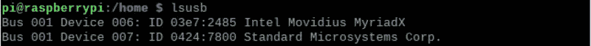

Intel Neural Compute Stick is installed and ready to use

# **4。使用样本对象检测模型执行面部检测**

现在，您可以在我们的 edge 设备 Raspberry Pi 上运行 OpenVINO 玩具示例了。我们将运行 Python 版本的 OpenVINO 安装指南的人脸检测展示。

⚡:为了便于说明，在下面，我不使用虚拟工作环境。如果你计划开发多个项目，我建议你这样做，比如以 Ian Bicking 的 [virtualenv](https://virtualenv.pypa.io/en/latest/) 的形式，实现项目隔离，从而避免库冲突之类的。⚡

与其他平台的 OpenVINO toolkit 版本不同，Raspbian OS 的 OpenVINO toolkit 仅限于 OpenVINO 推理引擎，不包括 OpenVINO 模型下载器。手动下载预先训练的人脸检测模型权重和偏差(。bin 文件)及其网络拓扑结构(。xml 文件)，导航到您的`/home/pi/models`文件夹并执行:

`wget --no-check-certificate [https://download.01.org/opencv/2019/open_model_zoo/R3/20190905_163000_models_bin/face-detection-adas-0001/FP16/face-detection-adas-0001.bin](https://download.01.org/opencv/2019/open_model_zoo/R3/20190905_16300_models_bin/face-detection-adas-0001/FP16/face-detection-adas-0001.bin)`

`wget --no-check-certificate [https://download.01.org/opencv/2019/open_model_zoo/R3/20190905_163000_models_bin/face-detection-adas-0001/FP16/face-detection-adas-0001.xml](https://download.01.org/opencv/2019/open_model_zoo/R3/20190905_16300_models_bin/face-detection-adas-0001/FP16/face-detection-adas-0001.bin)`

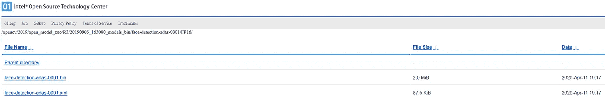

Location of pre-trained face detection model weights (.bin) and network topology (.xml)

⚡请务必下载 2019 版的人脸检测模型。这是由于最新的 OpenVINO for Raspbian OS toolkit(2020.01)的一个[已知的不兼容性](https://software.intel.com/en-us/node/849460)，这是由其新的中间表示格式 v10 引起的。⚡

上面下载了一个预先训练好的基于 MobileNet 的[4]人脸检测模型，该模型获取一个输入图像并产生一个输出图像，该输出图像以在输入图像中检测到的所有人脸周围的边界框为特征。

多亏了 OpenVINO 演示应用程序，我们在这个阶段不需要为[输入图像预处理和类似的事情](https://docs.openvinotoolkit.org/latest/_models_intel_face_detection_adas_0001_description_face_detection_adas_0001.html)而烦恼，但是当我们在本博客系列的[第二篇文章](https://medium.com/@technoidsblog/edge-ai-computer-vision-inference-on-the-edge-part-2-2-aaddfae870f0)中开发我们自己的定制解决方案时，我们会继续做这件事。

例如，要测试人脸检测模型，只需使用 Raspberry Pi 相机拍摄一张自己的静态图像，然后将文件传递给模型，以便在 NCS2 的帮助下进行本地推理。

Sample input faces by Ryan McGuire on pixabay.com

假设您的测试文件(这里:image.jpg)位于`/home/pi/models/`目录中:

`python /opt/intel/openvino/inference_engine/samples/python/object_detection_sample_ssd/object_detection_sample_ssd.py -m /home/pi/models/face-detection-adas-0001.xml -d MYRIAD -i /home/pi/models/image.jpg`

这将 MobileNet [4]人脸检测模型传递给 OpenVINO 单镜头检测器样本应用程序，指示它使用 MYRIAD，即 NCS2 协处理器，对输入图像进行视觉推断。

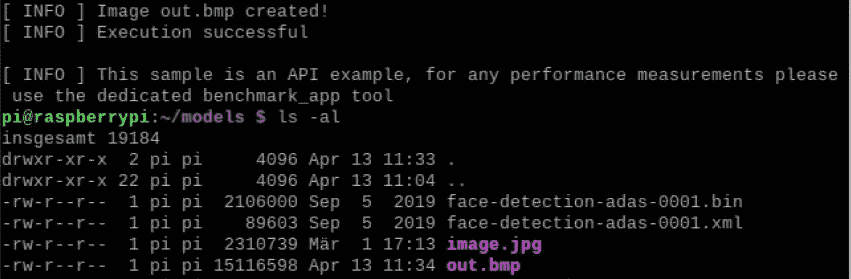

Application of MobileNet [4] face detection model to image.jpg resulting in out.bmp

因此，您将在`/home/pi/models`目录中找到一个名为 out.bmp 的输出图像，它在输入图像中检测到的所有人脸周围显示了边界框。🗹

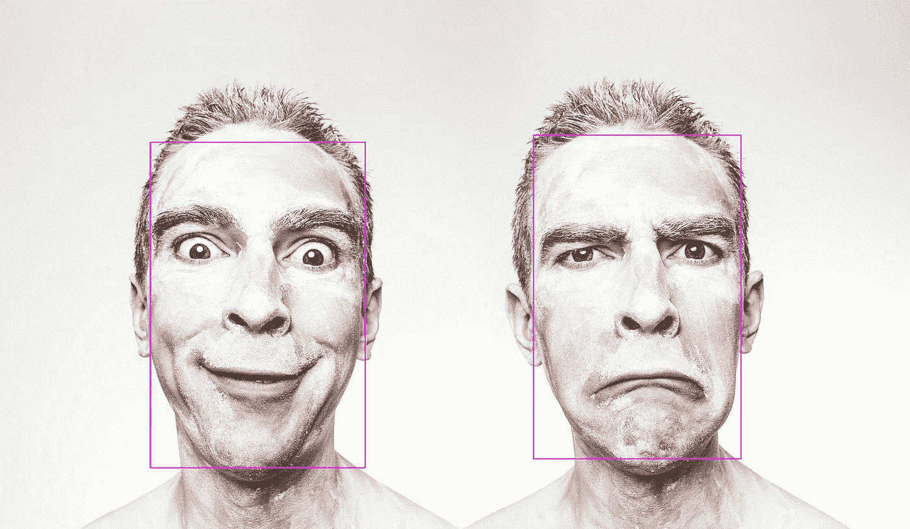

Output image with facial bounding boxes produced by face detection test run

这就是真正的意义所在。在阅读了两篇博客系列的第一篇独立文章之后，您已经成功地将 Raspberry Pi 设置为能够执行近实时计算机视觉推理的边缘人工智能设备。这开启了整个计算机视觉领域的边缘人工智能用例实现可能性的整个领域，可以说是最成熟的人工智能应用领域。在这个双帖系列的第二帖中，我们演示了这一点。更具体地说，我们完成了基于 YOLOv3 的[5](近)实时对象检测应用程序的定制开发，该应用程序在 Edge AI 就绪的 Raspberry Pi 上本地运行。

**参考资料**
【1】a .艾伦，[开始使用英特尔神经计算棒 2 和树莓派](https://www.hackster.io/news/getting-started-with-the-intel-neural-compute-stick-2-and-the-raspberry-pi-6904ccfe963)，博客，2019 年 4 月

[2] S. Boyce，[使用英特尔神经计算棒在 Raspberry Pi 上实现人工智能](https://hackaday.com/2019/01/31/ai-on-raspberry-pi-with-the-intel-neural-compute-stick/)，博客，2019 年 1 月

[3] A. Rosebrock 等人，Raspberry Pi for Computer Vision-Hacker Bundle，PyImageSearch，2020

[4] A. G. Howard 等，MobileNets:用于移动视觉应用的高效卷积神经网络，arXiv:1704.04861，2017 年 4 月

[5] J .雷德蒙和 a .法尔哈迪，“约洛夫 3:增量改进”，技术报告，arXiv:1804.02767，2018 年 4 月