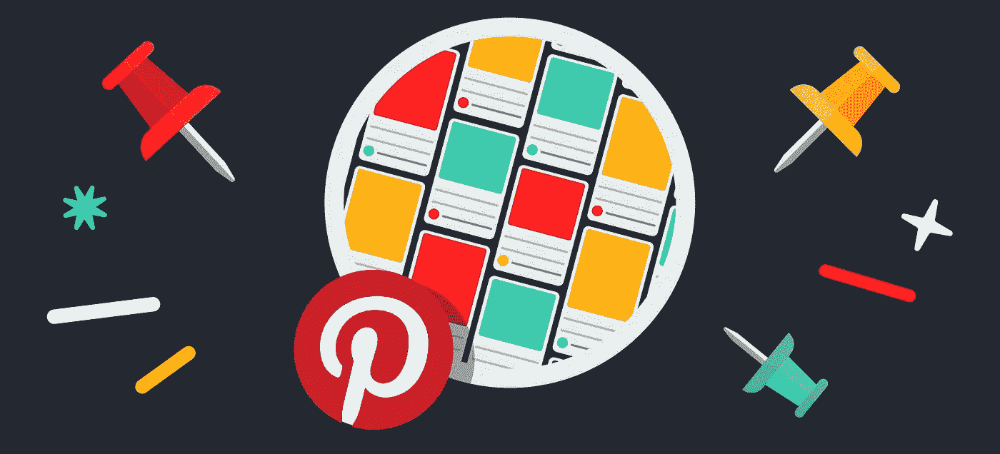
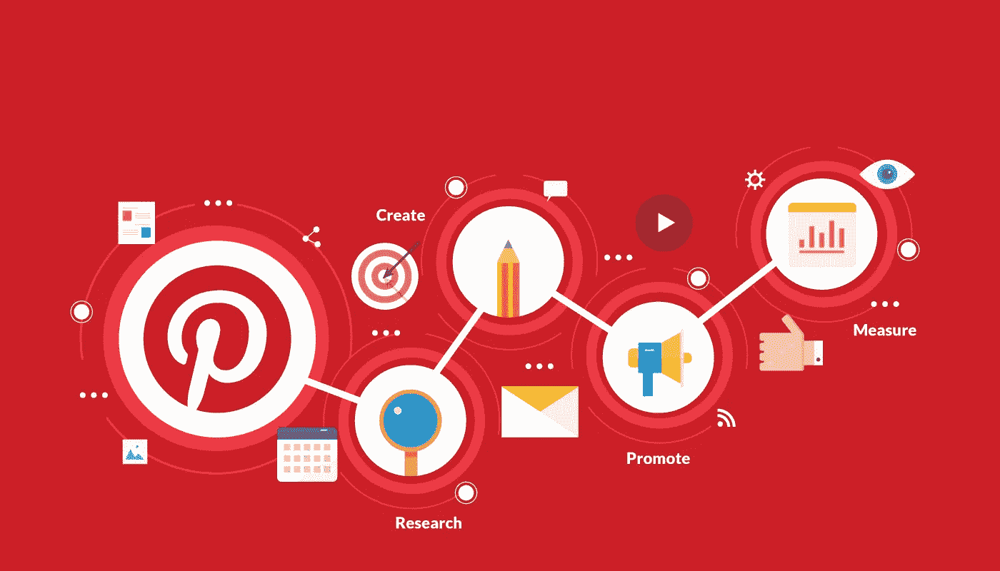
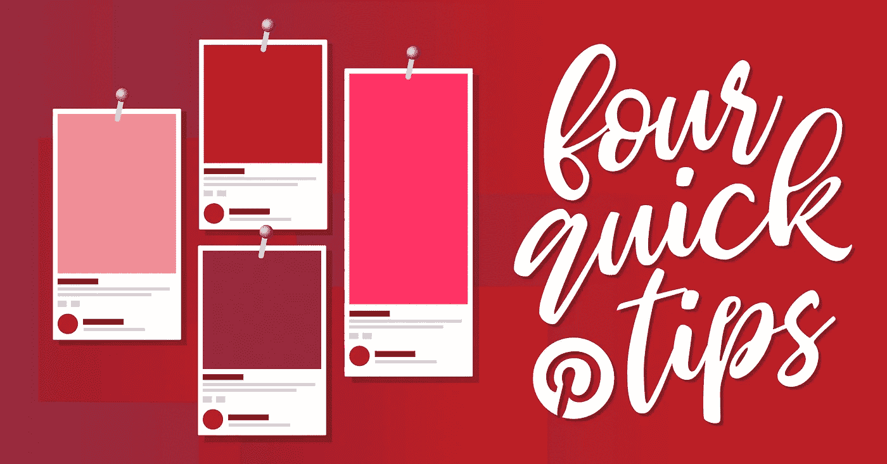
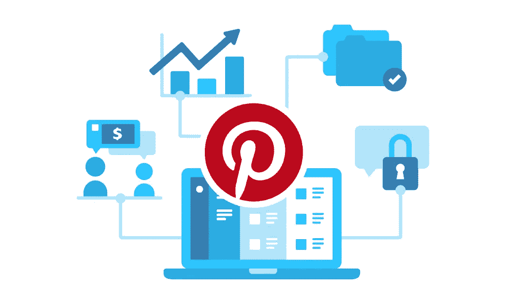

# 在 Pinterest 上销售的有效方法

> 原文：<https://medium.datadriveninvestor.com/effective-ways-to-sell-on-pinterest-c46eb313d022?source=collection_archive---------19----------------------->

你的企业可以在 Pinterest 这个图片分享社交平台上销售的有效方法。这篇文章解释了使用 Pinterest 做生意的有效方法。

作为一个允许人们分享、保存和管理内容的平台，Pinterest 对营销人员来说是一个改善业务的绝佳机会。随着用户超过 1 亿，企业可以与使用这个社交媒体平台的许多人接触，以发现、分享、保存和做其他有趣的事情。

这是一个非常重要的社交分享媒体，使用这个平台可以帮助你的企业实现很多好处。例如，您可以实现以下目标:

*   提高您业务的可见性
*   推广你的产品/服务
*   接触新客户
*   创造销售和潜在客户
*   与对你的行业有影响力的人联系
*   展示你企业的创造性
*   收集客户和潜在客户的反馈
*   与您的关键客户建立更牢固的关系

您可以放心地将它用于任何其他商业用途。但是要实现这个平台提供的好处，你需要采用正确的策略。在下面找到一些有助于在这个平台上推广你的业务的方法。

## 确保你和其他人交往

像任何其他营销方法一样，要使这种营销方法成功，客户参与是非常必要的。每当你的追随者在你的大头针上留下评论，确保你回复他们。甚至你可以像推特一样把东西重新钉在你的板上。除此之外，如果你有什么有趣的东西与你的追随者分享，你可以喜欢大头针并留下评论。

## 别上你的东西，鼓励别人

确保你没有远离你的网站内容。您可以创建一个名为“我们的产品”或类似名称的插接板。在你的网站上使用“钉住”按钮也是有帮助的，因为它让你的追随者更容易钉住你的东西。

## 利用丰富的引脚

与普通 pin 几乎相似，富 pin 具有一些独特的功能，例如它允许用户向 pin 本身添加信息。您可以在丰富的 pin 中添加电话号码、地址、地图、描述、可用性和其他信息。丰富的 pin 可以确保 pin 用户可以在 pin 上加载信息。

## 提升的引脚

作为一个商业实体，你可以在这个平台上购买广告，这些广告被称为促销广告。根据营销目标，如客户参与、建立知名度和增加网站流量，你可以在 Pinterest 上购买广告。通过锁定相关的关键词、地点和兴趣，你可以把你的大头针放在更有可能购买你的产品的观众面前。

## 使用关键字

当人们使用这个平台来研究他们想要购买的东西时，你可以使用你正在用于搜索引擎优化、社交媒体营销、电子邮件营销等的关键词。你甚至可以使用其他关键字。但是在这个平台上使用关键字之前要做适当的研究。

## 小心使用视觉效果

当谈到用户保存在插接板上的视觉效果时，他们有一定的偏好。当你创建图钉并使用你网站上的图片作为图钉时，你需要仔细考虑。建议使用宽高比为 2:3 的图像，并且至少应为 600 x 900 像素。当你给用户视觉上的兴趣时，他们更有可能锁定你的内容。

# 感谢您阅读这篇文章。随时欢迎反馈。如果你喜欢它，请点击拍手按钮，并分享这篇文章。

你可以在[Github](https://github.com/tejamaddimsetty)&[LinkedIn](http://www.linkedin.com/in/tejmaddimsetty)上联系我

[Tej Maddimsetty](https://medium.com/@tejmaddimsetty)