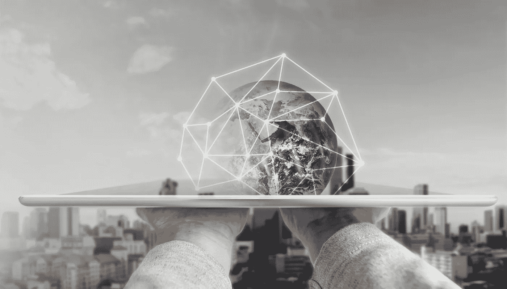
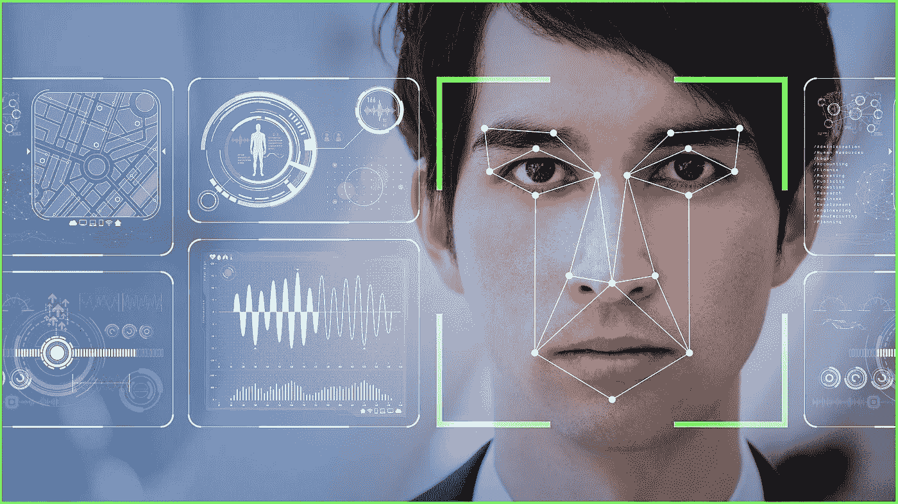
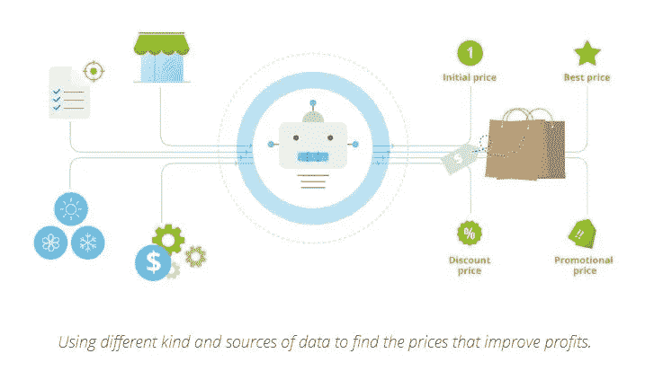
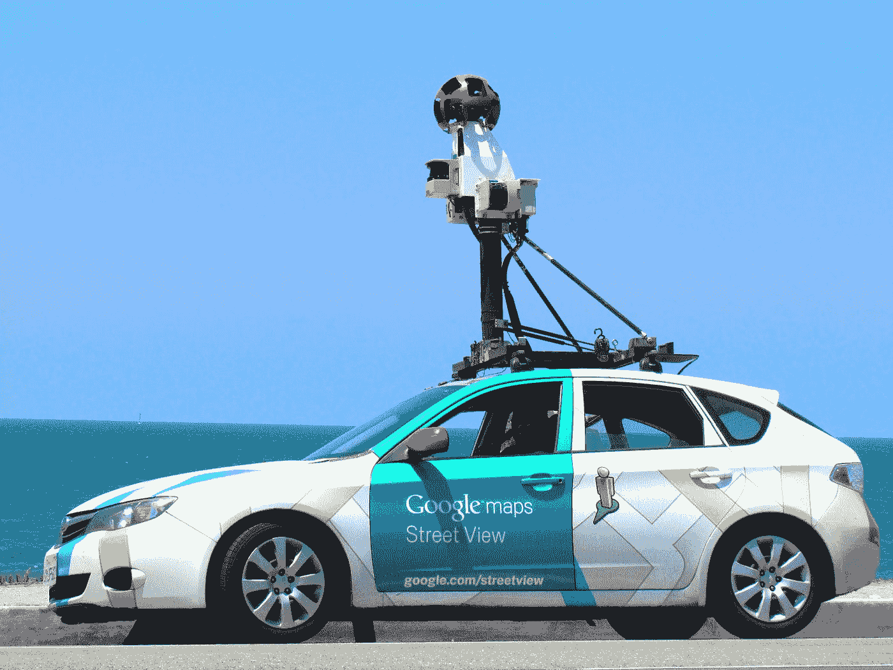
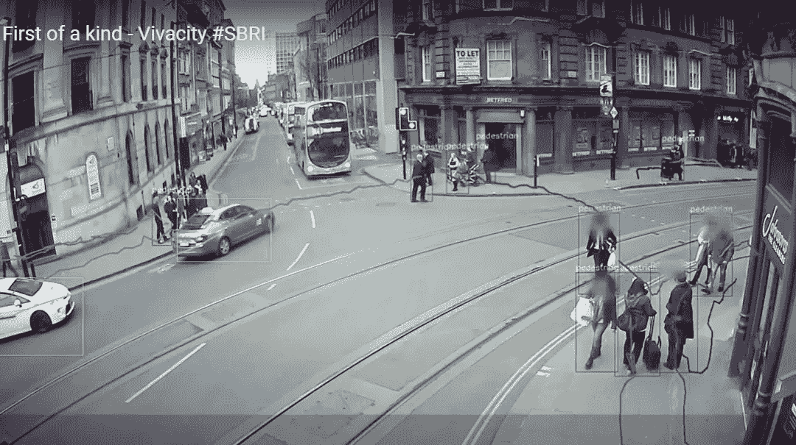
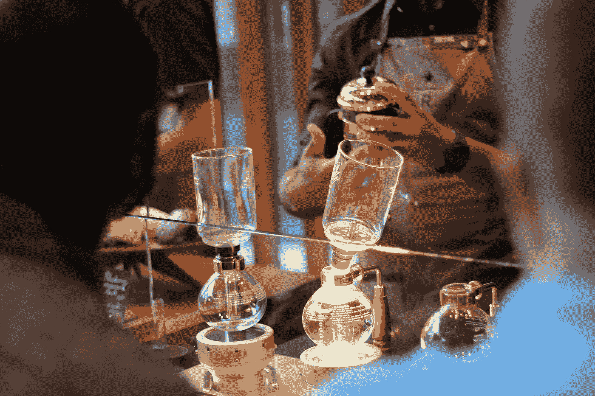

# 人工智能驱动的八件日常用品

> 原文：<https://medium.datadriveninvestor.com/eight-everyday-things-powered-by-ai-1caa126776c5?source=collection_archive---------12----------------------->

Designed by Freepik.

如果你搜索“人工智能”这个词，谷歌会返回几乎 10 亿个结果。这不仅仅是为了“卡戴珊”这个词。我们已经到了谈论人工智能不再“时髦”的地步。

但我敢于这样做，因为在所有的喧嚣平息后，仍有许多误解存在。一些人确信人工智能是一个旨在窃取他们工作的秘密敌人，而另一些人则持怀疑态度，认为人工智能是纯粹的科幻小说，与正常生活无关。

我可以向卢德派和怀疑论者证明，人工智能比我们想象的更接近我们。

尽管它无处不在，我们并不总是注意到它。

我试图说服我的朋友接受这个想法。让我们叫他让-保罗。他是一名年轻的厨师，在日常事务方面相当专业，但对人工智能非常怀疑。

 [## 人工智能在你眼皮底下出奇的聪明|数据驱动的投资者

### 如果你在社交媒体上，但人工智能听起来令人生畏，不要害怕。你对人工智能的了解可能比…

www.datadriveninvestor.com](https://www.datadriveninvestor.com/2020/08/14/ai-is-surprisingly-smart-right-under-your-nose/) 

“机器人厨师？？噗噗！人工智能将需要数以千计的废弃菜肴才能做出像样的东西，但它仍无法创造出需要想象力和品味的食物”。

好吧，创意烹饪对一个蹒跚学步的人工智能来说可能很棘手。你不会期望你两岁的孩子做出烤扇贝或者千层饼吧？但是让我们来数一数 AI 已经*能*做什么。

Photo from [https://ia.acs.org.au/](https://ia.acs.org.au/)

首先，人工智能在**社交媒体**中独占鳌头。例如，尖端的人工智能算法为 Instagram 和 Snapshot 中的[面部滤镜提供了动力。它们跟踪面部运动，并允许用户添加动画效果，随着用户的移动而调整。脸书使用人工智能来识别照片中的人脸。2014 年](https://emerj.com/ai-sector-overviews/everyday-examples-of-ai/)[脸书推出了 DeepFace](https://onezero.medium.com/how-instagrams-viral-face-filters-work-5c98ba05122f) ，这是一个自动识别图像中的人的系统，因此他们可以很容易地被标记。从那以后，脸书一直在努力改进它。在最基本的层面上，脸书算法分析照片，对面部特征进行分类，并给它们分配号码。然后，它为每个人创建一个独特的号码，脸书称之为“[模板](https://www.facebook.com/help/122175507864081)”。AI 使用模板将其与上传到平台上的其他照片和视频进行比较。如果模板与图像匹配，它会建议标记该人。脸书已经在有史以来最大的面部数据集上训练了其算法，该数据集随着脸书的用户基础不断增长。

“每次你在照片中给自己或朋友加标签，你都在帮助训练人工智能”——我向让-保罗解释道。“它有什么实际用途？”——他耸耸肩。——“让我们沉迷于社交媒体？”“不仅如此。2011 年，[美国美国联邦贸易委员会禁止脸书](https://www.ftc.gov/news-events/press-releases/2011/11/facebook-settles-ftc-charges-it-deceived-consumers-failing-keep)在未来 20 年内，未经用户明确同意，对该平台收集的数据(包括面对面的数据)进行商业利用。但在这 20 年后，脸书可以向其他公司和政府出售其算法，例如，验证在线和店内购买，操作边境控制，获得信贷批准以及天知道什么。通过建议你在照片中给人加标签，脸书是在投资未来”。

Designed by Freepik

社交媒体也使用人工智能来个性化你的新闻订阅。脸书再一次站在了人工智能应用的最前沿。脸书算法不仅优先考虑你互动最多的人的帖子，脸书还花费大量时间和金钱来了解[到底是什么让你‘喜欢’特定内容](https://www.vice.com/en_us/article/d7ywxa/facebook-newsfeed-personalization-hussein-mehanna)。深度学习技术是捕捉众所周知的用户多变兴趣的关键。

“为了能够说‘我没有在使用 AI’，你需要完全放弃现代社交媒体，回归 Myspace(最早的社交网络之一)的纯粹主义体验”。

那么**的电子商务和数字服务**呢？我们不再简单的打开一个网站，决定买什么。亚马逊、Spotify、网飞推荐的产品、音乐和电影会影响我们的选择。这些推荐是由 AI 研究我们过去的偏好并试图预测我们接下来会喜欢什么而创建的。事实上，早在 2013 年，消费者在亚马逊上购买的 35%和在网飞上观看的 75%来自产品推荐。在不太遥远的将来，这些算法将能够几乎完美地预测(或者实际上*塑造*)我们的购买决策。顾客甚至可以在没有订购的情况下获得[商品！](https://link.springer.com/article/10.1007/s11747-019-00696-0)

Photo by [Mollie Sivaram](https://unsplash.com/@molliesivaram?utm_source=medium&utm_medium=referral) on [Unsplash](https://unsplash.com?utm_source=medium&utm_medium=referral)

“当 Spotify 根据你的播放列表播放音乐时——我告诉让-保罗——这是人工智能预测你接下来想听什么”。“这就是为什么它经常是如此糟糕的猜测，”他评论道。“但当你跳过一首歌时，你帮助 Spotify 的算法变得更好，所以下次它会建议比莉·哈乐黛而不是艾德·希兰”。

在商业中，人工智能还被用来**设定和优化价格**。现在你很少会看到销售部门的人用电子表格手动为每件商品定价。企业使用人工智能来分析大量数据，以确定最佳定价策略。 [AI 会考虑许多因素](https://tryolabs.com/blog/price-optimization-machine-learning/)，如竞争、宏观经济条件、运营成本、客户评论，甚至天气，以根据预先确定的目标设定或更改价格(例如，最大化利润或在某个截止日期前出售所有库存)。

Source: [Trylab](https://tryolabs.com/blog/price-optimization-machine-learning/).

例如，Airbnb 有自己的动态[定价工具，称为智能定价](https://towardsdatascience.com/smarter-pricing-for-airbnb-using-machine-learning-413053a48793)。该工具根据 70 多个因素计算住宿价格。这些因素包括季节性、一周中的某一天、该地区的特殊事件，甚至是酒店的照片和描述。易贝和优步等其他在线企业也开发了类似的工具。实体公司(例如英国连锁超市 Morrisons )正在通过应用人工智能来设定价格和优化货架的补充，从而迎头赶上。

线下怎么样？每天我们使用交通工具从一个地方到另一个地方。人工智能支撑着许多交通工具。"你用谷歌地图寻找最快的路线吗？"—我问让-保罗。“是的，当然可以”。——“你有没有想过为什么它这么准确？”——“当然是因为它使用了大量的数据”。“但在有大量非结构化数据的地方，如图像、文本、动作，人工智能有必要将这些数据转化为可操作的信息”。一旦你在智能手机上打开谷歌地图，它就会向中央算法发送关于你的位置和速度的匿名数据[。该算法利用了谷歌关于一天中特定时间特定路线交通的大量历史数据。结合实时交通数据，它可以预测你到达目的地需要多长时间。](https://emerj.com/ai-sector-overviews/everyday-examples-of-ai/)

Photo by [Suzy Brooks](https://unsplash.com/@simplysuzy?utm_source=medium&utm_medium=referral) on [Unsplash](https://unsplash.com?utm_source=medium&utm_medium=referral)

但是谷歌走得更远。它使用人工智能来绘制建筑轮廓、街道名称和门牌号。人工智能从街景图片和卫星图像中提取信息，对其进行解释，然后更新地图——所有这些都没有人类的直接参与。你可能正在寻找一家新餐馆或某人的家庭住址，却不知道是人工智能“把他们放到了地图上”。

不仅仅是科技巨头使用 AI。地方当局依靠人工智能分析道路信息，改善交通管理。例如，2020 年 5 月，伦敦交通局安装了由 AI 驱动的 [43 个摄像头，以检测货车、公共汽车、汽车、骑自行车的人和行人。与普通的“哑”相机不同，普通的“哑”相机只是记录图像，并需要人类操作员来读取图像，新的“智能”相机分析这些图像，以提取有意义的数据(例如，什么类型的车辆在路上行驶，以什么速度行驶)。在丢弃记录之前，它们将处理过的信息发送给中央操作员。](https://www.gizmodo.co.uk/2020/03/london-tfl-ai-camera-locations/)

Source: [Vivacity](https://vivacitylabs.com/technology/#solutions).

经过塔山的十字路口，你真的“捕捉”到了艾的目光。在未来，人工智能驱动的闭路电视将成为任何“智能城市”不可或缺的一部分，人工智能将在收集点收集和解释大量数据。

当你跳上一架飞机，你仍然在人工智能的手中。2015 年，一项对航空公司飞行员的调查发现，在一次典型的波音 777 航班上，他们[只花了 7 分钟手动驾驶](https://www.nytimes.com/2015/04/07/science/planes-without-pilots.html?_r=0)他们的飞机。人工智能没有神经崩溃或自杀倾向(不像人类飞行员)。它不会疲倦或分心。使用 AI 可以节省数百万美元的培训、筛选和向人类飞行员支付工资。甚至有可能副驾驶将被一个单独的远程操作员取代，由人工智能增强，它将同时为多架飞机充当副驾驶。

“好吧，”让-保罗说，“你所有的例子都来自‘技术’行业，我预计在这些行业会有人工智能、大数据等类似的东西，但如果我们谈论我的*行业——餐馆和食品——就很难找到人工智能日常使用的例子了。”*

“一点也不！我可以给你人工智能在**食品供应链**中的常规应用的例子。”

咖啡……那种芳香、浓郁、令人上瘾的黑色物质由生长在热带地区的咖啡豆制成……人工智能的使用渗透到咖啡生产的各个层面，从仍在树上的咖啡浆果开始。许多农业公司和农民现在使用人工智能来优化种植条件。例如， [AI 读取无人机或智能手机拍摄的植物图像](https://emerj.com/ai-sector-overviews/ai-agriculture-present-applications-impact/)。该算法然后分析这些图像，以识别植物疾病、土壤缺乏和害虫，使专家能够为农民提供量身定制的建议。基于当地天气条件、土壤成分和前几年作物数据的预测模型进一步扩大了农业生产。简而言之，农业不再基于“经验法则”和直觉，它正在成为一门基于人工智能处理的大量数据的精确科学。

“所以，你吃的食物，喝的咖啡或酒很可能是人类专家和人工智能合作的产物”。

Photo by Lacey Williams on Unsplash

谈到咖啡，星巴克是零售人工智能战略的先驱，其在 2019 年推出了[“深度酿造”计划](https://stories.starbucks.com/stories/2020/how-starbucks-plans-to-use-technology-to-nurture-the-human-spirit/)。在后 COVID 时代，咖啡巨头受益于其早期的技术投资，因为[零售业试图重塑店内体验](https://thewisemarketer.com/retail/is-covid-19-stymying-retails-intelligence-and-making-ai-more-critical-than-ever/)。Deep Brew AI 被集成到星巴克的咖啡机中，可以记录和分析每一杯咖啡，并发送维护请求。人工智能帮助星巴克顾客个性化菜单选项。它还组织库存、供应链物流和补货订单，以便顾客永远不会用完他们最喜爱的咖啡或蛋糕。星巴克声称，人工智能将通过帮助员工专注于最重要的事情:顾客和咖啡，为更深层次的人际关系提供空间。“人工智能将帮助商店生活的许多方面实现自动化，不是作为一队烤三明治、制作拿铁咖啡的机器人，而是更像一个穿着绿色围裙的人类的隐形、超级智能的助手”。

“那太棒了！”Jean-Paul 说，“我喜欢人工智能作为一只无形的援助之手的想法……一辆帮你做家务的吉普车，而你专注于创造性的一面。老实说，我讨厌物流。当我需要与那些交货晚或缺货的供应商争论时，我会有糟糕的一天。然后你发现有人忘记点今天的特色菜白松露，或者 20 公斤的鲑鱼昨天过期了。Br-r-r-r…

我也不介意程序纠正我糟糕的拼写，建议最佳路线或驾驶飞机。只要它不干涉我的烹饪！".

在我们现在所处的位置，这是不可能的。让我们成为人类的不是计算最快路线、检测害虫或驾驶汽车的能力。我们之所以是人类，是因为我们的创造力、同理心和对世界的复杂解读——这些都是人工智能不擅长的。但是，在我们每天努力“把事情做完”的过程中，我们经常会忘记它们！

对我来说，人工智能是创造力的开始，而不是结束。使用算法解决日常问题可能是我们作为创造者而不仅仅是操作者展现人性的方式。每当你使用技术时，我邀请你把它看作是一种创造行为，让你和其他人的生活变得更好。

本故事中表达的观点是我个人的观点，不能归因于我所属的任何组织。

**访问专家视图—** [**订阅 DDI 英特尔**](https://datadriveninvestor.com/ddi-intel)