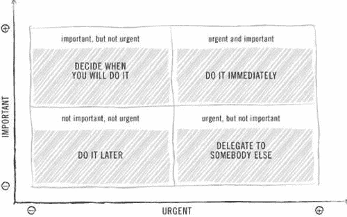
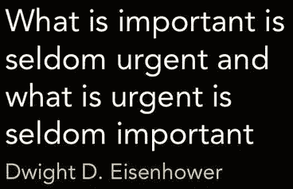

# 艾森豪威尔决策矩阵

> 原文：<https://medium.datadriveninvestor.com/eisenhower-decision-matrix-e4a20f312aca?source=collection_archive---------22----------------------->

***Decision-Making made easier***

时间管理是最重要的技能之一。只有当你认识到紧急和重要的活动时，你才能战胜把注意力集中在不重要的紧急活动上的倾向。我们倾向于安排压力极大的一天，而不是明智地将我们的任务分类。我们无法有效和高效地管理时间，这往往导致我们将精力集中在那些本可以在第二天完成的从属任务上。

这种模式不仅有助于战略决策，还能让你有时间提前完成更多工作，缓解压力。它打破了把每项任务都归类为紧急任务的习惯，而不是意识到它们很少是重要的任务。重要的是给自己一个时间框架，并问自己:我什么时候做这个特殊的任务？不按时完成会有什么后果？这项任务明天重要吗？

我有时使用的另一个时间管理方法是:在列好早上要做的事情清单后，我从第一个最直接的任务开始，并在它完成后删除。在第一个任务成功完成之前，我不会继续下一个任务。这样你就不会执行多重任务，而是有效地执行多重任务。

 [## 决策的移情设计方法如何工作|数据驱动的投资者

### 移情设计是一种产品设计方法，首先由多萝西·伦纳德和杰弗里·雷波特在哈佛大学提出

www.datadriveninvestor.com](https://www.datadriveninvestor.com/2018/07/18/how-the-empathic-design-method-of-decision-making-works/) 

***亡羊补牢，犹未为晚。***

**访问专家视图—** [**订阅 DDI 英特尔**](https://datadriveninvestor.com/ddi-intel)