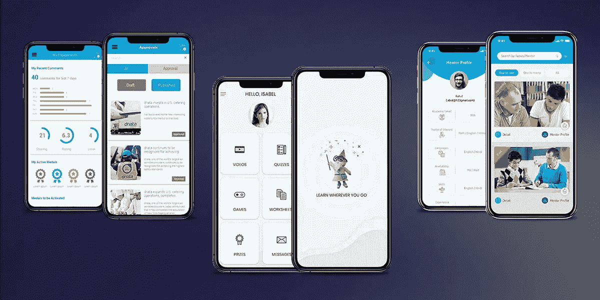
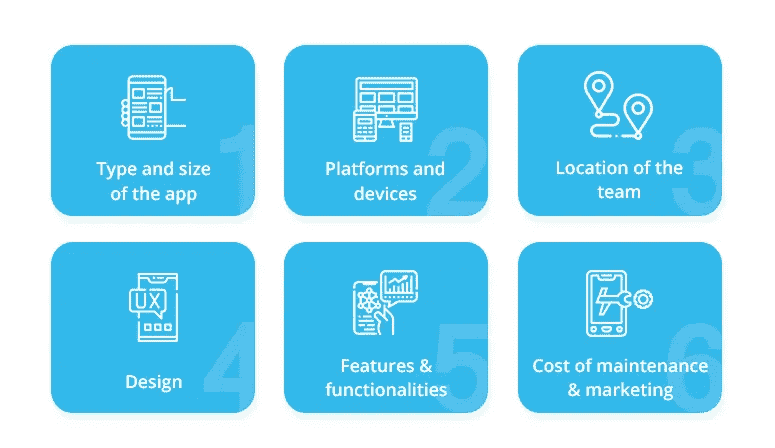
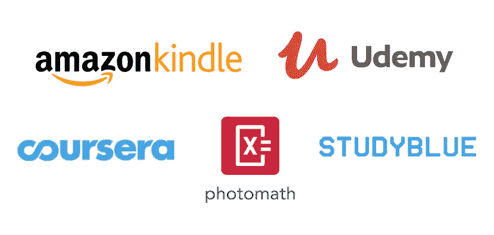

# 电子学习应用开发——类型、趋势、特性和成本

> 原文：<https://medium.datadriveninvestor.com/elearning-app-development-types-trends-features-and-cost-93cf13ad5204?source=collection_archive---------4----------------------->

嗨，读者们，

您是否在寻找电子学习应用程序开发的类型、趋势、功能和成本？

那么这个内容只给你看，

众所周知，技术进步改变了传统的教学方式。现在，学生和导师不必亲自去教室学习。

这一切都要归功于电子学习应用程序，通过这些应用程序，人们可以舒舒服服地在家接受教育。

学生和教师只需要在他们的设备上安装一个移动应用程序。电子学习或数字教育的趋势已经变得如此流行，以至于全球许多知名大学和学院都在采用向全球学生提供教育。

 [## 聊天机器人:我们都在学习与机器交谈|数据驱动的投资者

### 当你打算与一家公司进行第一次接触时，它们会突然出现。它们可能是你手机里的声音，也可能是…

www.datadriveninvestor.com](https://www.datadriveninvestor.com/2020/05/25/chatbots-we-are-all-learning-to-talk-to-machines/) 

如果您也想为您的教育机构开发这样的应用程序，那么请阅读这篇文章，以了解更多关于教育应用程序开发的类型、趋势、特性和成本的信息:

## 【2022 年数字化学习应用发展趋势

不可否认，快速发展的技术进步正在重塑数字化学习的趋势。在 2022 年，我们期望看到在线教育行业的以下趋势，以实现高学习者参与度，促进简单和远程学习，并提高学生的表现:

*   移动学习让每个人都可以学习
*   在电子学习中使用 AR 和 VR，轻松、实用地理解复杂的事物
*   个性化学习根据每个学生的学习能力和表现提供教育
*   提高绩效的各种教育工具
*   自我导向学习
*   ILT 的数字化(教师指导的培训)部分或完全在线学习
*   在线教育中的游戏化
*   小额学习

# **在线教育应用统计**

*   根据 Statista 的数据，未来两年，电子学习产业预计将增长 2430 亿美元。
*   根据总部位于华盛顿的著名公司盖洛普进行的一项调查，71%的人表示，与传统的课堂教学方式相比，电子学习应用程序的概念更加清晰。
*   大约 64%的人使用移动设备搜索培训和学习资料。

# **电子学习应用开发的类型**

各种类型的电子学习应用程序包括:

*   **备考应用程序** s-这些应用程序整合了不同的能力测试和系列，帮助学生准备各种竞争性考试。
*   词汇应用 -这类应用有助于自学。使用这个应用程序，用户可以提高特定语言的词汇量。
*   **语言学习应用**——帮助学生学习不同语言的应用。
*   **基于课程的应用** -学生可以注册各种课程的应用。
*   **虚拟教室应用-** 帮助学生和教师联系和学习的应用。

# 您的电子学习移动应用程序的必备功能

电子学习应用程序需要三个面板:学生面板、教师面板和管理员面板。因此，这些面板的应用程序功能将包括:

## **针对学生**

*   注册并登录-让学生通过电子邮件或社交媒体个人资料创建个人资料。
*   搜索-在应用程序上搜索特定的课程、科目或导师。
*   通知提醒-接收有关新课程的通知或获取预定课程的提醒。
*   仪表板-管理和检查他们在应用程序上的活动。
*   评级和评论-对导师或课程进行评级和撰写评论。

## **针对教师**

*   仪表板-管理班级，与学生共享视频或学习材料。
*   时间表-为特定的课程安排课程。
*   作业-给学生布置作业。
*   通知-接收有关学生提问或机构提供的任何课程更新的警报。
*   注册并登录-创建一个新帐户，然后随时访问它。

## **用于管理面板**

除了这两个，还有第三个小组。该面板可用于管理员(在大学、学校、学院或教练机构的教育应用程序开发中需要)。需要在该面板中实现的基本功能包括:

*   注册-在应用程序上创建个人资料。
*   管理课程-管理机构提供的课程。
*   管理学生——跟踪学生的表现，检查一门课程有多少学生，等等。
*   管理教师-检查教师提交的反馈和评论，给他们分配特定的课程，等等。
*   推送通知-向教师和学生更新即将发生的事件，如考试、任何课程的启动等。
*   支付网关-检查并记录学生的支付情况。
*   内容管理-管理应用程序上可用的内容。

(请注意，这些是电子学习应用程序的基本功能。如果您想添加更多，请联系具有您特定应用需求的定制移动应用开发公司。)

## 开发一个电子学习应用程序需要多少钱？

要估算教育应用开发的总成本，您需要写下以下要求:

*   您的应用程序的功能
*   您希望发布应用的平台(Android、iOS 或任何其他平台)
*   电子学习应用程序开发公司的规模和位置
*   应用程序的复杂性
*   应用程序开发中使用的工具和技术
*   项目持续时间
*   电子学习应用程序的类型

在你有了上述问题的答案后，你可以联系一家教育应用开发公司，估算一下成本。考虑到电子学习应用程序开发的平均成本，你可能需要支付 10，000 到 30，000 美元。根据您的特定应用需求，该费用可能会增加或减少。

**对学生来说，最好的电子学习应用是什么？**

最受欢迎且被认为是最好的电子学习应用程序包括:

亚马逊 Kindle
study blue
Photomath
元素周期表
Coursera
Udemy

除此之外，你还可以在网上找到许多其他的电子学习应用。你可以根据你的具体要求来选择。

## **电子学习应用的盈利战略**

在开发电子学习或任何其他应用程序时，最好提前计划好货币化策略。要通过您的在线教育应用赚钱，您可以从以下选项中进行选择:

特定课程的免费或付费订阅。
应用内广告——在你的应用上放置第三方广告。
销售产品——在 app 上销售教育产品或服务。

## **包装**

电子学习应用肯定有一个光明的未来，因为它帮助学生和导师甚至从偏远地区进行虚拟连接。在本文中，我们涵盖了您想了解的关于电子学习应用程序开发的所有内容，以及它的最新趋势、统计数据和特性。要开发这样的应用程序，请记下您的具体应用程序要求，然后联系[电子学习应用程序开发](https://www.quytech.com/blog/elearning-app-development-for-android-ios/)公司或为您的项目雇佣电子学习应用程序开发人员。确保你选择一个可靠的公司，为你提供最好的钱。

**访问专家视图—** [**订阅 DDI 英特尔**](https://datadriveninvestor.com/ddi-intel)