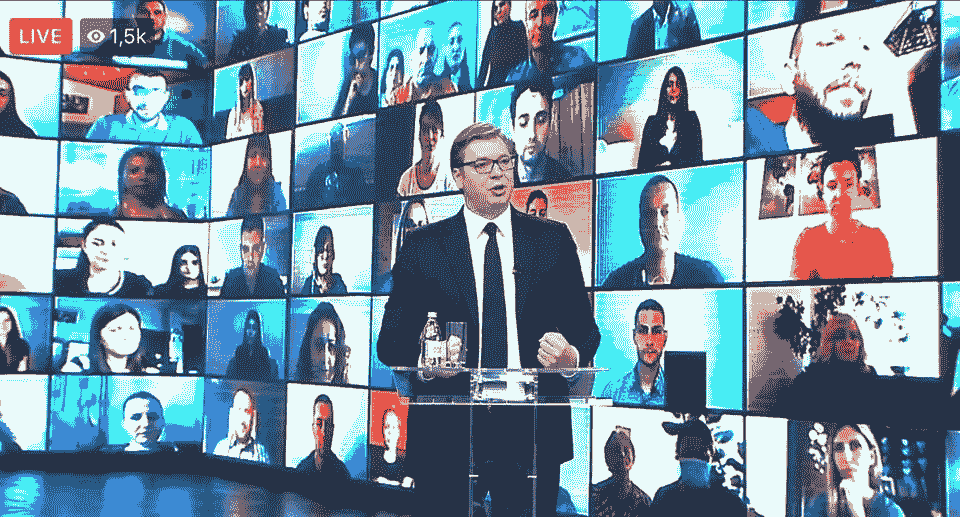

# 塞尔维亚 2020 年选举:退出还是回到 20 世纪 90 年代？

> 原文：<https://medium.datadriveninvestor.com/elections-2020-in-serbia-exit-or-return-to-the-1990s-dd69099362af?source=collection_archive---------15----------------------->

President Aleksandar Vucic held the first web meeting via Zoom on May 15th, remotely meeting over 1,500 voters.

像任何自尊的非自由民主国家一样，6 月 21 日星期天，塞尔维亚将进行投票，不是为了选出一位新的领导人，而是为了测试他仍然有多强大。

有关科索沃的决定迫在眉睫，或许 6 月 27 日在华盛顿，唐纳德·特朗普(Donald Trump)将首先向俄罗斯表明，他仍然可以决定巴尔干半岛的问题，并向美国公众表明，他知道如何解决一个从地理知识角度来看与他的选民相距甚远的问题。

Vucic 将被要求接受科索沃的独立，这可能是因为美国突然加速驱逐前亲欧洲的科索沃总理 Albin Kurti，这也让 Vucic 有更多的时间。特朗普天生就有一定的谈判残酷性，但正如我们已经知道的那样，由于 11 月份的美国总统选举，今年将是科索沃问题的决定性一年。

 [## 保护主义、政治和经济动荡|数据驱动的投资者

### 美国股市昨日出现 400 多点的大幅反转，为未来的事情发出了警告信号。市场…

www.datadriveninvestor.com](https://www.datadriveninvestor.com/2018/06/28/protectionism-politics-economic-turmoil/) 

武契奇是如何到达这个历史性的日期的？当然，一个肤浅的观察者可能会说，选举正在尽可能好的条件下进行。塞尔维亚冠状病毒感染的影响不大，官方死亡人数不到 250 人，经济和社会生活迅速恢复，外国企业家和投资者对政府支持经济的有效措施表示赞赏，这些都是应该导致新一轮选举胜利的因素。他可能会有…但武契奇第二天必须面对的问题将不是政治和议会问题，在较小程度上，而是社会问题。

从他在竞选期间决定传播的信息中也可以看出这一点。

**一场“外围”战役**

亚历山大·武契奇(Aleksandar Vucic)和他的国际顾问选择在地理、社会和人口方面开展一场“外围”运动。

此外，从过去三年的经济繁荣中受益最大的贝尔格莱德人民是把该国的经济复原力放在首位的人，他们较少参与科索沃问题。因此，必须触及的恰恰是外围选民，既要将投票与即将做出的历史性决定联系起来，又要解除右翼政党对这些选民的控制。

**虚弱的议会呼吁做出历史性的决定**

由于选举门槛降低到 3%,这些选举产生的议会将不再像上一届议会那样铁板一块，更加团结在武契奇的塞尔维亚进步党周围，理论上也更具代表性。

事实上，自由与正义党(塞尔维亚语，SSP，Stranka Slobode i Prava)对 Dragan Djilas 和 Marinika Tepic 的选举以及博斯科·奥布拉多维奇的 Dveri 的选举的抵制， 一旦从今年下半年开始成为该国特征的两个危机变得明显——反对科索沃独立的抗议和经济放缓后失业率上升，以及到目前为止由于冠状病毒的影响，许多在国外就业的塞尔维亚工人返回该国——就允许这些政党有广泛的批评和新的社会根源的政治空间。

虽然 Dveri 作为一个技术上的法西斯政党(土地和反动的意大利法西斯主义的口号“上帝，家园，家庭”的塞尔维亚版本)，将带头抗议科索沃协议，谴责 Vucic 的选择的非民主性和宪法不合法性，但 Djilas 的 SSP 将致力于谴责经济和社会危机的影响。很容易想象秋天的大规模示威游行，示威者和警察甚至双方的受害者发生暴力冲突。

政府的组成和总理的选择将表明武契奇将如何处理这种情况。在总理职位的候选人中，如今只有安娜·布纳比奇保证在一定程度上关注欧盟的要求。所有其他候选人，从现任农业部长 Branislav Nedimovic(现在是该职位的主要候选人)到财政部长 Sinisa Mali，首先都是武契奇信任的朋友，他们将保证共和国总统和政府行动之间有更密切的联系。

普京 10 月的访问至少会平息一些街头抗议，因为他在塞尔维亚民族主义右翼中的支持率大幅上升。我们必须弄清楚这种支持会让武契奇付出多少代价，以及普京会向特朗普要求什么回报。

2020 年将标志着 20 世纪 90 年代的结束吗？

选举是一个感性而非理性的时刻。尤瓦尔·诺亚·哈拉里在他的标志性著作《德乌斯人》中提醒我们，选举不是为了表明一个政府，也不是为了解决错综复杂的问题，而是为了评估民众的感受。塞尔维亚人将在 6 月 21 日回答的问题是，武契奇是否仍然是那个被委以重任、在许多方面自相矛盾地领导这个国家走出 90 年代的人。科索沃的独立问题是一颗定时炸弹，塞尔维亚政客们已经将这颗炸弹的爆炸推迟了 20 多年。

那些说塞尔维亚正在经历的一系列僵局将随着承认科索沃而结束的人是天真的错误，如果不是不诚实的话。然而，承认科索沃很可能会在该国开启一个不稳定和不确定的时期，持续时间将取决于各种因素。

西方国家会同意给予武契奇全权以换取稳定吗？还是会从外部增加不稳定以实现政权更迭，以或多或少的民主方式？邻国(其中许多国家的目的是破坏该国的稳定)将玩什么游戏，而发现自己的回旋余地越来越有限的欧盟将玩什么游戏？

如果说到目前为止，经济增长似乎在引导这个国家走向一种基于领土和物质福祉之间交换的妥协，那么新冠肺炎疫情则从根本上降低了这种交换的可持续性。贫困和民族主义相互助长的新一轮恶性循环的风险几乎可以肯定。外交官、经济经营者和投资者也有责任阻止塞尔维亚回到上世纪 90 年代，而不是完全离开这十年。

## 获得专家视图— [订阅 DDI 英特尔](https://datadriveninvestor.com/ddi-intel)