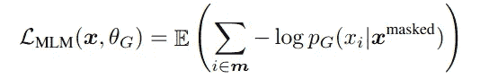

# ELECTRA:有效地学习编码器，准确地分类令牌替换

> 原文：<https://medium.datadriveninvestor.com/electra-efficiently-learning-an-encoder-that-classifies-token-replacements-accurately-59253abd5f25?source=collection_archive---------12----------------------->

## 了解基于变压器的自监督架构

Photo by [A. L.](https://unsplash.com/@overdriv3?utm_source=medium&utm_medium=referral) on [Unsplash](https://unsplash.com?utm_source=medium&utm_medium=referral)

NLP 的最新进展建议主要使用因果语言建模目标或去噪自动编码目标(例如，掩蔽语言建模目标)来训练语言模型。该框架根据上述目标之一对模型进行自我监督的预训练，然后根据特定的下游目标对模型进行微调。像[伯特](https://medium.com/swlh/bert-pre-training-of-transformers-for-language-understanding-5214fba4a9af)、[罗伯塔](https://medium.com/dataseries/roberta-robustly-optimized-bert-pretraining-approach-d033464bd946)、 [XLNet](https://towardsdatascience.com/xlnet-autoregressive-pre-training-for-language-understanding-7ea4e0649710) 、[艾伯特](https://arxiv.org/abs/1909.11942)、 [T5](https://towardsdatascience.com/t5-text-to-text-transfer-transformer-643f89e8905e) 等车型。接受过此类目标的培训，并已达到各自基准的最高水平。

在本文中，我们将讨论由 [Google AI](https://ai.googleblog.com/2020/03/more-efficient-nlp-model-pre-training.html) 提出的一种相当独特的方法，用于本文中的语言模型预训练， [ELECTRA:将文本编码器预训练为鉴别器而不是生成器](https://openreview.net/forum?id=r1xMH1BtvB)。我们将首先浏览现有的预培训方法，然后深入讨论 ELECTRA 的方法。

**注意**这些模型实现了变压器。艾尔。)建筑。想了解更多关于变形金刚的信息，请阅读本文[。](https://towardsdatascience.com/transformers-explained-65454c0f3fa7)

# 现有的培训前方法

Existing Pre-training Approaches via [Google AI Blog](https://ai.googleblog.com/2020/03/more-efficient-nlp-model-pre-training.html)

这些方法可以大致分为:

1.  **语言建模或因果语言建模目标**(左):在该目标中，在自回归设置中训练语言模型，即对于记号序列，我们最大化记号 ***x_t*** 出现在第“ ***t*** ”位置的概率，给定序列中该记号之前的所有记号。形式上最大化:***P(x _ t | x _(I<t))***。
2.  **去噪自动编码或模糊地屏蔽语言建模目标**(右):在该目标中，在自动编码设置中训练语言模型，即，对于记号序列，给定序列 ***x_hat*** 中的所有记号，我们最大化记号 ***x_t*** 出现在第 ***t*** 位置的概率。形式上最大化: ***P(x_t | x_hat)*** 。

 [## 人工智能、深度学习和医疗实践|数据驱动的投资者

### 人工智能和深度神经学习的效用看起来可能是合法和有前途的，特别是…

www.datadriveninvestor.com](https://www.datadriveninvestor.com/2020/06/24/disclosure-and-resolution-program-wont-prevent-physicians-from-practicing-defensive-medicine/) 

> [*【GPT】*](https://medium.com/dataseries/openai-gpt-generative-pre-training-for-language-understanding-bbbdb42b7ff4)*[*【GPT-2】*](https://medium.com/swlh/openai-gpt-2-language-models-are-multitask-learners-1c6d42d406ae)*[*XLNet*](https://towardsdatascience.com/xlnet-autoregressive-pre-training-for-language-understanding-7ea4e0649710)*接受语言建模目标训练*[*BERT*](https://medium.com/swlh/bert-pre-training-of-transformers-for-language-understanding-5214fba4a9af)*[*RoBERTa*](https://medium.com/dataseries/roberta-robustly-optimized-bert-pretraining-approach-d033464bd946)*接受去噪自动编码目标训练****

# **伊利克特拉**

****

**Replaced Token Detection via [Google AI Blog](https://ai.googleblog.com/2020/03/more-efficient-nlp-model-pre-training.html)**

**ELECTRA 论文提出了一个**替换记号检测**的目标，其中**不是屏蔽输入，然后训练模型来预测正确的记号，而是用不正确的记号替换序列中的原始记号**，但是它们对于给定的序列是有意义的(例如在上面的动画中， **把**、**熟了的**替换成 **a** 、**吃了**，虽然不正确，但还是有道理的)，然后训练模型对**分类**如果给定的令牌是“ ***原*** 或者“ ***替换了*** ”。**

**该模型由一个**生成器**和一个**鉴别器网络**组成，如[生成对抗网络](https://towardsdatascience.com/a-comprehensive-guide-to-generative-adversarial-networks-gans-fcfe65d1cfe4) (GANs)。相反，训练程序是**而不是** **对抗**就像甘斯一样。在本文的后面，我们将简要介绍 ELECTRA 不是 GAN 的几个原因。**

## **发电机**

**这本质上是一个**小型的屏蔽语言模型**。因此，输入最初被[屏蔽]记号破坏，然后，生成器被训练来从原始序列预测正确的记号(或如前所述有意义的似是而非的记号)。**

**此外，拥有小型生成器背后的逻辑与模型的计算复杂性有关。**

> **如果生成器和鉴别器大小相同，训练 ELECTRA 每一步的计算量将是仅用屏蔽语言建模训练的两倍**
> 
> **— [电子纸](https://openreview.net/forum?id=r1xMH1BtvB)**

**形式上，**

****

**Masked Language Modeling (MLM) Objective via [Paper](https://openreview.net/forum?id=r1xMH1BtvB)**

## **鉴别器**

**这实质上是一个变换器编码器，并且被训练为最大化将被替换的标记分类为“ ***被替换的*** ”并且将原始标记分类为“ ***原始*** ”的可能性。**

**形式上，**

****

**Replaced Token Detection Objective via [Paper](https://openreview.net/forum?id=r1xMH1BtvB)**

## **组合模型**

****

**ELECTRA via [Paper](https://openreview.net/forum?id=r1xMH1BtvB)**

**用两者对组合模型进行预训练；替换令牌检测目标上的生成器和鉴别器。**

****

**Combined Loss via [Paper](https://openreview.net/forum?id=r1xMH1BtvB)**

****发生器在预训练**后被丢弃，鉴别器用于下游任务的微调。**

> **因此，**鉴别器是 ELECTRA。****

# **伊莱克特拉怎么不是甘人？**

**虽然模型架构和/或培训目标可能会让人想起 GANs，但 ELECTRA 不是！以下是 ELECTRA 与 GANs 相比的一些特点:**

1.  **如果生成器碰巧生成了正确的令牌，则该令牌被认为是“真实的”而不是“伪造的”。**
2.  **以最大似然性训练生成器，而不是以对抗性训练来欺骗鉴别器。**
3.  **由于我们采样令牌作为发生器输出并将其馈送给鉴别器，所以不可能通过这个采样步骤反向传播损失，而这是对抗训练所必需的。**

# **结论**

**在本文中，我们介绍了一种新的语言模型预训练方法。我们还讨论了伊莱克特拉和甘斯的相似之处，以及它们之间的区别。**

**这里有一个[链接指向 ELECTRA 的 GitHub 资源库](https://github.com/google-research/electra)**

**这里有一个 API 引用[使用 huggingface transformers](https://huggingface.co/transformers/model_doc/electra.html) 实现 ELECTRA**

# **参考**

** [## ELECTRA:预先训练文本编码器作为鉴别器，而不是...

### ELECTRA:预训练文本编码器作为鉴别器而不是生成器；大卫:一个文本编码器…

openreview.net](https://openreview.net/forum?id=r1xMH1BtvB)  [## 使用 ELECTRA 进行更有效的 NLP 模型预训练

### 语言预训练的最新进展导致了自然语言处理领域的实质性进展…

ai.googleblog.com](https://ai.googleblog.com/2020/03/more-efficient-nlp-model-pre-training.html)  [## 伯特:语言理解变形金刚的前期训练

### 了解基于变压器的自监督架构

medium.com](https://medium.com/swlh/bert-pre-training-of-transformers-for-language-understanding-5214fba4a9af)  [## 开放式 GPT:语言理解的生成性预训练

### 了解基于变压器的自监督架构

medium.com](https://medium.com/dataseries/openai-gpt-generative-pre-training-for-language-understanding-bbbdb42b7ff4) 

**访问专家视图—** [**订阅 DDI 英特尔**](https://datadriveninvestor.com/ddi-intel)**