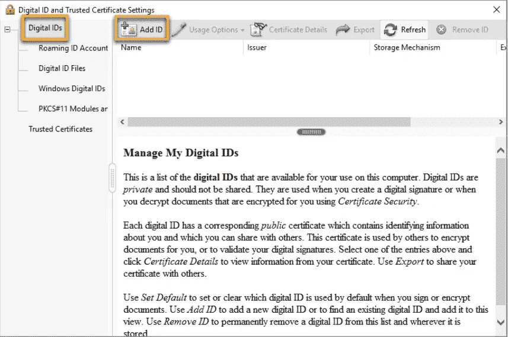

# 简化的电子签名

> 原文：<https://medium.datadriveninvestor.com/electronic-signatures-simplified-7b3f61c2f8b2?source=collection_archive---------10----------------------->

## 路易斯·莱霍特，商业律师，硅谷弗利律师事务所合伙人，拉德纳·LLP 律师事务所合伙人，前 T2 L2 律师事务所创始人

[***路易·莱霍特***](https://www.lexblog.com/2020/04/30/what-every-emerging-growth-company-needs-to-know-about-the-cares/) *是一名*商业律师，也是硅谷弗利&拉德纳·LLP 公司的合伙人，之前是 L2 法律顾问公司 P.C *的创始人。莱霍特先生是一名公司、证券和律师，他帮助他的客户组建、融资、管理、购买和出售公司，无论他们是上市公司还是私营公司、金融赞助商、风险资本家、投资者还是投资银行。*

随着业务变得越来越全球化，在重要文档上使用电子签名已经成为确保文档具有法律效力的快速有效的方法。下一篇文章将强调关于电子签名的几个考虑事项。

**什么是电子签名？**

根据《联邦电子签名法案》的定义，电子签名是“附加到合同或其他记录上或与之有逻辑联系的电子声音、符号或过程，由意图签署记录的人执行或采用。”该法案规定，不能因为文件是电子形式而否认其法律效力，电子签名不会使文件无效。

**哪些文档可以使用电子签名，哪些不可以？**

Picture Credits: [Pexels.com](https://www.pexels.com/photo/coding-computer-data-depth-of-field-577585/)

公司要求签名的绝大多数文件都可以使用电子签名。无论是商业、股票购买或期权协议，还是投资文件，都可以使用电子签名。电子签名可能不够的例外情况包括与知识产权转让或遗产规划有关的文件。在这些情况下，仍应提供湿签名。

**使用电子签名时，有哪些需要注意的常见错误？**

Picture Credits: [Pexels.com](https://helpx.adobe.com/acrobat/using/digital-ids.html)

使用电子签名时最常见的两个错误是与电子签名服务的功能相关的错误。第一个是由服务生成的与文档相关联的特定 ID 号。如果在提供电子签名后在文档中添加了额外的页面，这些新页面可能不包含 ID 号，这可能会引起关于可执行性的问题。此外，如果在提供签名后对文档正文进行了更改，则与签名相关联的时间戳和最终文档之间将存在差异，这又会产生可执行性问题。

我该如何避免这些常见的错误？？

避免这些错误非常容易，只需确保文档在上传到文档签名服务之前被最终确定，并且各方都在使用相同的服务。这将确保文档的所有页面都包含分配给它的特定 ID 号，并且没有时间戳差异。

如果某些方面仍然喜欢提供湿签名而不是电子签名，请确保您使用的电子签名服务允许您将包含湿签名的这些页面上传到文档的电子表格中。

 [## 夏普比率悖论:为什么还要投资风险资本？数据驱动的投资者

### 夏普比率是一种基于风险量化回报的方法，具体来说，它是超过…

www.datadriveninvestor.com](https://www.datadriveninvestor.com/2020/03/29/the-sharpe-ratio-paradox-why-still-invest-in-venture-capital/) 

在一个日益全球化和以技术为导向的世界中，电子签名提供了一种简单有效的方式来确保文件的可执行性和法律地位。

> [*路易斯·莱霍特*](https://www.lexblog.com/2020/04/30/what-every-emerging-growth-company-needs-to-know-about-the-cares/) *是*与[弗利&拉德纳·LLP](https://www.foley.com/en)的合伙人和商业律师，在公司的硅谷、旧金山和洛杉矶办公室工作，他是[私募股权&风险投资](https://www.foley.com/en/people/l/lehot-louis)、[并购&以及交易实务和技术](/louis-lehot-dealing-during-the-crisis-what-to-expect-for-m-a-and-how-to-get-deals-done-in-the-fd3156ecce9a)、医疗保健和能源行业团队的成员。路易斯专注于为企业家及其管理团队、投资者和财务顾问提供从车库到全球各个成长阶段的建议。路易斯尤其喜欢能够帮助他的客户实现高速增长、上市并成功获得最佳流动性。路易斯是硅谷一家名为 L2 法律顾问的小型律师事务所的创始人。他曾在硅谷的一家全球律师事务所担任新兴增长和风险投资业务的联合管理合伙人和联合主席。

文章原载[此处](http://www.imfaceplate.com/louislehot01/electronic-signatures-simplified)。

 [## 构建完美的球场平台

### 弗利&拉德纳·LLP 律师事务所合伙人、前 L2 律师事务所创始人路易斯·莱霍特

lehotlouis.medium.com](https://lehotlouis.medium.com/building-the-perfect-pitch-deck-af4e0b2cca1e)  [## 在筹集第一轮风险投资前要问的 8 个问题——路易斯·莱霍特

### 你准备好进入一轮风险投资融资了吗？

medium.com](https://medium.com/@lehotlouis/8-questions-to-ask-before-raising-your-first-round-of-venture-capital-louis-lehot-5e6b1b13d552)  [## 创业备案要点:联邦，州和公司备案

### 作者路易斯·莱霍特，福利&拉德纳·LLP 律师事务所合伙人，L2 律师事务所前创始人

lehotlouis.medium.com](https://lehotlouis.medium.com/startup-filing-essentials-federal-state-and-corporate-filings-54215de24f70)  [## 路易·莱浩分享“家庭是我们最宝贵的资产”

### 与硅谷成功的律师和企业家路易斯·莱霍特一起沉思。他说，“应该提醒人们…

medium.com](https://medium.com/@lehotlouis/louis-lehot-shares-family-is-our-most-precious-asset-ead8d371c3cb)  [## 第 3 集-交易准备准备出售你的公司

### 疫情影响了我们生活的方方面面。当市场强劲时，达成交易是一项挑战。当没有…

www . broker . audio](https://www.breaker.audio/louis-lehot-legal-podcasts/e/65441909) 

## 访问专家视图— [订阅 DDI 英特尔](https://datadriveninvestor.com/ddi-intel)