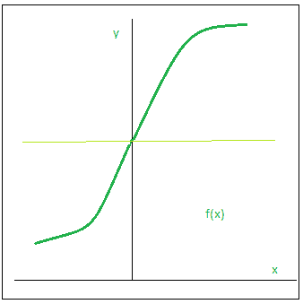

# 神经网络的要素

> 原文：<https://medium.datadriveninvestor.com/elements-of-neural-networks-6fa6edeb077c?source=collection_archive---------11----------------------->

Photo by [Josh Riemer](https://unsplash.com/@joshriemer?utm_source=medium&utm_medium=referral) on [Unsplash](https://unsplash.com?utm_source=medium&utm_medium=referral)

# 激活功能:

# 简介:

如今，互联网提供了获取大量信息的途径。无论我们需要什么，只需谷歌(搜索)即可。然而，当我们拥有如此多的信息时，我们面临的挑战是分离相关和不相关的信息。

当我们的大脑同时接收到大量信息时，它会努力理解这些信息，并将其分为“有用”和“不太有用”的信息。在神经网络的情况下，我们需要一种类似的机制来将输入信息分类为“有用”或“不太有用”。

这对网络的学习方式很重要，因为并非所有的信息都同样有用。有些只是噪音。这就是激活功能发挥作用的地方。激活函数帮助网络使用重要的信息并抑制不相关的数据点。

让我们浏览这些激活函数，了解它们是如何工作的，并找出哪些激活函数适合哪种问题陈述。

# 神经网络概述:

在我深入到激活函数的细节之前，让我们快速浏览一下神经网络的概念和它们是如何工作的。神经网络是一种非常强大的机器学习机制，它基本上模仿了人脑的学习方式。

大脑从外界接收刺激，对输入进行处理，然后产生输出。随着任务变得复杂，多个神经元形成一个复杂的网络，在它们之间传递信息。

人工神经网络试图模仿类似的行为。你下面看到的网络是由相互连接的神经元组成的神经网络。每个神经元都以其权重、偏置和激活功能为特征。

输入被馈送到输入层，神经元使用权重和偏差对该输入执行线性变换。

*x =(重量*输入)+偏差*

之后，激活函数被应用到上面的结果。

最后，激活函数的输出移动到下一个隐藏层，并重复相同的过程。信息的这种向前移动被称为向前传播。

如果生成的输出与实际值相差甚远怎么办？使用来自正向传播的输出，计算误差。基于这个误差值，神经元的权重和偏差被更新。这个过程被称为反向传播。

 [## 冗长但有价值的神经网络指南|数据驱动的投资者

### 如今可用于机器学习的神经网络类型如此之多，以至于它值得一个冗长的指南…

www.datadriveninvestor.com](https://www.datadriveninvestor.com/2019/04/04/neural-networks/) 

# 没有激活功能可以吗？

我们知道，使用激活函数会在正向传播期间在每一层引入一个额外的步骤。现在的问题是——如果激活函数增加了如此多的复杂性，我们能没有激活函数吗？

想象一个没有激活功能的神经网络。在这种情况下，每个神经元将只使用权重和偏差对输入执行线性变换。虽然线性变换使神经网络更简单，但该网络的功能会更弱，并且不能从数据中学习复杂的模式。

没有激活函数的神经网络本质上只是一个线性回归模型。

因此，我们对神经元的输入使用非线性变换，并且网络中的这种非线性是由激活函数引入的。

在下一节中，我们将看看不同类型的激活函数。

**二元阶跃函数:**

二元阶跃函数是基于阈值的激活函数。如果输入值高于或低于某个阈值，神经元就会被激活，并向下一层发送完全相同的信号。

阶跃函数的问题在于它不允许多值输出，例如，它不支持将输入分类到几个类别中的一个。

数学上，

f(x) = 1，x >= 0

= 0，x< 0

**s 形**

我们要看的下一个激活函数是 Sigmoid 函数。它是应用最广泛的非线性激活函数之一。Sigmoid 转换范围 0 和 1 之间的值。

这是 sigmoid- f(x) = 1/(1+e^-x 的数学表达式

优势:

*   平滑渐变，防止输出值“跳跃”。
*   输出值介于 0 和 1 之间，使每个神经元的输出正常化。
*   清晰预测-对于大于 2 或小于-2 的 X，倾向于将 Y 值(预测)带到曲线边缘，非常接近 1 或 0。这可以实现清晰的预测。

**谭**

双曲正切函数非常类似于 sigmoid 函数。唯一不同的是，它是关于原点对称的。在这种情况下，值的范围是从-1 到 1。因此，下一层的输入不会总是相同的符号。

双曲正切函数定义为-双曲正切(x)= 2 正弦(2x)-1

优势

*   以零为中心-更容易对具有强负值、中性值和强正值的输入进行建模。
*   否则就像 Sigmoid 函数。

**ReLU**

ReLU 函数是另一个非线性激活函数，它在深度学习领域已经获得了普及。ReLU 代表整流线性单元。只有当线性变换的输出小于 0 时，神经元才会被去激活。

下面的图将帮助您更好地理解这一点- f(x) = max(0，x)

优势

*   计算效率—允许网络快速收敛
*   非线性——虽然看起来像线性函数，但 ReLU 有一个导数函数，并允许反向传播

不足之处

*   垂死的 ReLU 问题——当输入接近零或为负时，函数的梯度变为零，网络无法执行反向传播，也无法学习。

**泄漏的 ReLU**

Leaky ReLU 函数只不过是 ReLU 函数的改进版本。正如我们看到的，对于 ReLU 函数，当 x <0, which would deactivate the neurons in that region.

Leaky ReLU is defined to address this problem. Instead of defining the Relu function as 0 for negative values of x, we define it as an extremely small linear component of x. Here is the mathematical expression-

f(x) = 0.01x , x < 0

= x , x > = 0 时，梯度为 0

优势

*   防止死亡 ReLU 问题-ReLU 的这种变化在负区域有一个小的正斜率，因此它确实支持反向传播，即使对于负输入值也是如此
*   否则像 ReLU

**唰**

Swish 是一个鲜为人知的激活功能，是由谷歌的研究人员发现的。Swish 的计算效率与 ReLU 一样高，并且在更深层次的模型上表现出比 ReLU 更好的性能。swish 的值范围从负无穷大到无穷大。该功能定义为–

f(x) = x*sigmoid(x)

f(x) = x/(1-e^-x)

**Softmax:**

与二进制分类(0 或 1)不同，我们需要在神经网络的输出层有多个概率。换句话说，输出层中隐藏单元的数量等于类的数量。例如，我们想从给定的数据集中识别猫、狗和母鸡。我们可以把猫归为第 1 类，狗归为第 2 类，母鸡归为第 3 类，以上都不属于第 0 类。在这种情况下，输出层将具有四个激活单元(4 x 1 矩阵)。每个激活单元计算其各自类别的概率，所有元素的总和应为 1。

softmax 函数或归一化指数函数可用于表示分类分布，即“K”个不同可能结果的概率分布。简单地说，给定的图片是猫、狗、母鸡或者都不是的概率是多少？

优势

*   能够处理多个类在其他激活函数中只能处理一个类-在 0 和 1 之间对每个类的输出进行归一化，并除以它们的总和，给出输入值在特定类中的概率。
*   对输出神经元有用-通常 Softmax 仅用于输出层，用于需要将输入分类为多个类别的神经网络。

# 学习率:

如果我们希望了解什么是学习率以及为什么会有学习率，我们必须首先了解监督学习场景的高级机器学习过程:

**前馈数据并计算损耗**

如你所见，神经网络不断改进。这是通过前馈训练数据来实现的，为馈入模型的每个样本生成一个预测。当通过损失函数将预测与实际(已知)目标进行比较时，可以确定模型的表现有多好(或者，严格地说，有多差)。

**学习率**是一个超参数，它控制我们根据损耗梯度调整网络权重的程度。该值越低，我们沿下坡行驶的速度越慢。虽然这可能是一个好主意(使用低学习率),以确保我们不会错过任何局部最小值，但这也可能意味着我们将需要很长时间才能收敛

以下公式显示了这种关系:

*new _ weight = existing _ weight—learning _ rate * gradient*

# 辍学:

拥有大量参数的深度神经网络是非常强大的机器学习系统。然而，过拟合在这种网络中是一个严重的问题。大型网络使用起来也很慢，很难通过在测试时组合许多不同的大型神经网络的预测来处理过拟合。辍学是解决这个问题的一种方法。关键思想是在训练期间从神经网络中随机丢弃单元(连同它们的连接)。这可以防止单位之间过度的相互适应。

点击这里阅读更多:[辍学:防止神经网络过度拟合的简单方法](https://www.cs.toronto.edu/~hinton/absps/JMLRdropout.pdf)

问题:

当全连接层有大量神经元时，更有可能发生协同适应。协同适应指的是一层中的多个神经元从输入数据中提取相同或非常相似的隐藏特征。当两个不同神经元的连接权重几乎相同时，会发生这种情况。

这给我们的模型带来了两个不同的问题:

*   计算相同产量时机器资源的浪费。
*   如果许多神经元正在提取相同的特征，它为我们的模型增加了这些特征的重要性。如果重复提取的特征仅特定于训练集，这将导致过度拟合。

# 批量标准化:

训练深度神经网络是复杂的，因为每层输入的分布在训练期间随着前几层参数的改变而改变。

由于需要较低的学习率和仔细的参数初始化，这减慢了训练，并且使得训练具有饱和非线性的模型变得非常困难。

我们将这种现象称为内部协变量移位，并通过标准化层输入来解决问题。

我们的方法从使标准化成为模型架构的一部分和为每个训练小批量执行标准化中汲取力量。

批处理规范化允许我们使用更高的学习速率，并且不需要太在意初始化。

它还起到了规范作用，在某些情况下消除了辍学的必要性。

应用于最先进的图像分类模型，批量归一化以少 14 倍的训练步骤实现了相同的准确性，并以显著的优势击败了原始模型。

在这里阅读更多:[为什么要批量归一化？](https://kharshit.github.io/blog/2018/12/28/why-batch-normalization)

# 一些互动资源:

1.  [可视化神经网络中的激活功能](https://dashee87.github.io/deep%20learning/visualising-activation-functions-in-neural-networks/)
2.  [在你的浏览器中修补神经网络。](https://playground.tensorflow.org/#activation=tanh&batchSize=10&dataset=circle&regDataset=reg-plane&learningRate=0.03&regularizationRate=0&noise=0&networkShape=4,2&seed=0.59663&showTestData=false&discretize=false&percTrainData=50&x=true&y=true&xTimesY=false&xSquared=false&ySquared=false&cosX=false&sinX=false&cosY=false&sinY=false&collectStats=false&problem=classification&initZero=false&hideText=false)

**访问专家视图—** [**订阅 DDI 英特尔**](https://datadriveninvestor.com/ddi-intel)