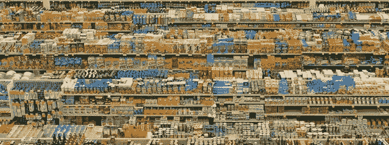
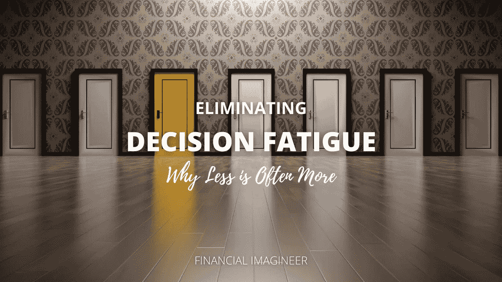
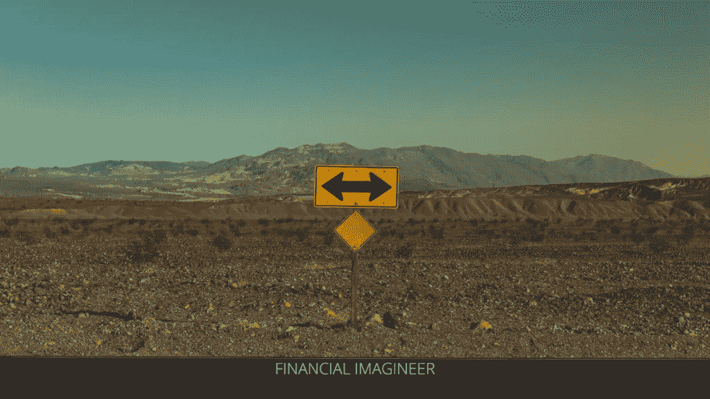
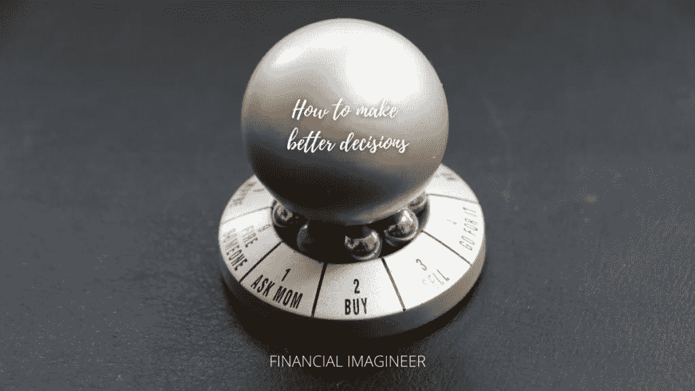

# 消除决策疲劳:为什么越少越好——金融幻想家

> 原文：<https://medium.datadriveninvestor.com/eliminating-decision-fatigue-why-less-is-often-more-financial-imagineer-f1cdc4587b5c?source=collection_archive---------17----------------------->

你知道吗，幸福的顶峰不是有最多的选择，而是有最多的选择。是的，越来越多本身并不是更好。从某一点开始，更多选择的增加会降低你的幸福感！

少即是多。

你有没有走进超市，被提供的大量不同的油、酸奶、面包或谷物惊呆了？你可以买到便宜的，由更好的或不同的原料制成的，然后你可以买到质量更好的，超级便宜的，甚至更多。

会是哪一个？

现代超市:噩梦还是福音？你选！

如果你去星巴克，你必须弄清楚你的游戏计划，点一份简单的饮料，比如:“双份，半无咖啡因，三份无糖香草味糖浆，一半大豆，一半脱脂，脱脂无泡沫拿铁……大杯，但请带走！”

现在想象一下，你去为你的整个家庭或团队点咖啡，需要重复上述 10 次。在超市里点一份简单的饮料或者选择一件普通的物品已经变得很让人头疼了！

你知道现在在星巴克你可以点 87，000 种不同的饮料组合吗？不开玩笑！

顺便投资也一样！

在纽约证券交易所，你可以投资 3000 多种股票，而这还只是在一个(！)股票交易所开始。大多数人会选择 ETF。

同样的道理也适用于在 Twitter 上信任谁或者关注谁。

如果你想更好地做类似“数据驱动”的决策，可以考虑查看一下[数据驱动投资者](https://www.datadriveninvestor.com/)或 [DDI Medium distribution](https://medium.com/datadriveninvestor) ，在那里你也可以找到金融幻想家的出版物。

我们生活在一个“多选择的社会”。

我们被选择淹没了！

# 如何做出更好的决策？

学习如何做出更好的决定是当今最重要的技能！

从根本上说，我们的文化似乎就是拥有更多选择。

难道我们不相信拥有“选择的能力”能让我们成为“你命运的驾驶员”吗？你吃什么就是什么！

简单的逻辑是:提供的选择越多，你明智的选择就越能满足你的真实需求，从而提高你的幸福水平！？

很明显事情不是这样的。

人类对此有两种不同的反应方式:

1.  你是一个**满足者** =你可以接受“足够好”
2.  你是一个最大化者

猜猜从长远来看谁更幸福？

人类很难预测什么能让他们真正快乐，因此从长远来看，满足者比最大化者更有机会获得真正的快乐。最大化者会被无休止的比较所打击，最终:决策疲劳。如果最大化者最终能满足于一个决定，那么满足者已经做出了更多的决定，并且已经开始了新的生活——更快乐！

想想这个仍然适用的古老故事:

有一头驴站在两大堆干草中间。它们都一样大，但离驴子的距离也一样远。站在那里，驴子不知道自己应该先去哪里。他犹豫不决。他不停地沉思，结果饿死了。

结束了。

从长远来看，人类也“不擅长”预测什么能让他们真正快乐。他们可以去买一辆新的、漂亮的车，并享受开它的头几天。他们期望买车是一个改变生活的决定，让生活变得更加幸福。然后，他们将受到更高的每月汽车付款的打击，这提醒他们在未来几年的愚蠢选择…就像一个蹒跚学步的孩子的糖热潮！是同一个概念。

最终别无选择是不好的。这是最糟糕的世界。有选择是好的，但是提供太多的选择会带来更多的伤害，而不是有助于提高幸福感。

一些成功人士已经想出了应对这些问题的好办法。

例如，马克·扎克伯格和史蒂夫·乔布斯致力于减少他们一天中要做的决定的解决方案，并成功地提高了他们的思维能力，使他们能够专注于对自己和公司更重要的决定。

他们是怎么做到的？

只要看看他们通常是如何穿着的，他们定义了他们最喜欢的服装，并得到了多套！扎克伯格得到了他的 t 恤，乔布斯通常得到了他的运动鞋和牛仔裤:问题解决了。同样的技巧也适用于校服或工作服。它减少了要做的决定，最重要的是提高了幸福感。

 [## 自然语言处理的五种金融应用|数据驱动的投资者

### 过去的五年对于自然语言处理领域来说是革命性的。我们从荣耀的 ctrl-f…

www.datadriveninvestor.com](https://www.datadriveninvestor.com/2020/09/17/five-financial-applications-of-natural-language-processing/) 

# 10–10–10 规则

如果你有更困难的决定要做，实际上有一个简单的方法可以让你“感觉”哪条路是最好的。

每当你要做一个艰难的决定时，保持真实的自己，反思你的想法，首先问自己这三个问题:

> *1。10 分钟后我对这个决定会有什么感觉？*
> 
> *2。10 个月后我对这个决定会有什么感觉？*
> 
> *3。10 年后我对这个决定会有什么感觉？*

这不是魔术，也不是花哨的决策工具，但它迫使你迅速思考你将要做出的决定的短期、中期和长期影响。

这种方法也被称为**10–10–10 法则**。像沃伦·巴菲特这样的人使用它。他喜欢把他将要购买的一罐可乐想象成几十年后可能变成的 100 万美元。不开玩笑！

为了更长久的幸福，试着关注那些持久的东西。

对于那些不仅影响你自己，而且最终会影响你的家人或更多我喜欢的人的艰难决定，我会做 [5 年规划练习](https://www.getrichslowly.org/couple-goals/)。只是不要像梦之队那样梦想和规划你的未来，而是简单地和你的利益相关者一起做 10-10-10 练习！

# 消除决策疲劳的八种方法

作为这篇博文的结尾，我为你准备了八种方法或策略来应对，甚至可能消除决策疲劳，这样你就能过上更快乐的生活。

# 1.决定

大多数情况下，做一个决定总比不做好，想想那头驴吧！

这个简单但不容易:

学会如何决定！

# 2.优先考虑

关注最重要的事情，纵观全局，以及您的决策将如何为所有相关利益方增加价值。

知道什么是重要的！

别管其他的了。

# 3.足够好就是足够好

不要迷失在无用的细节中，很快你就会忘记它们，成为满足者而不是最大化者。

不要纠结于不相关的细节。

继续前进。

# 4.应用 10–10–10 练习

看到短期、中期和长期的影响，这本身就可以帮助解决许多决策问题。

在不同的时间框架内思考！

# 5.简化

少即是多，如果这个世界没有为你减少你的选择，自己想办法去做。

简化你的生活！

剔除不必要的。

# 6.使自动化

反复面对类似的决定？定义一套清晰的规则，让他们代替你做决定。

自动化您的投资贡献或设置某些规则，以更好地做出决策。

尽可能自动化或授权！

# 7.坚持你的决定

花时间和精力做出高质量的决策。

但是一旦你决定了，就接受它。

学会接受，为自己的选择而快乐。

不后悔！

# 8.练习感恩

不要再想这山望着那山高了，关注你选择的积极面，坚持你的道路！

不要和邻居攀比了，开心点！

幸福的秘密不在于追求更多，而在于培养享受更少的能力。

如果你想了解更多关于这个话题的内容，我强烈推荐你以下几本书:[巴里·施瓦茨的《选择的悖论》或者丹尼尔·吉尔伯特的《被幸福绊倒》。](https://amzn.to/3nnWlMm)

如果你觉得今天的帖子有帮助，请考虑与你的朋友分享，不要忘记通过电子邮件订阅我的博客，如我的脸书页面或在 Twitter 上关注我。

干杯，希望你已经学到了一些东西，可以帮助你做出更快乐的决定！

马特(男子名ˌ等于 Matthew)

免责声明:请注意，上面使用的一些链接可能是附属链接，Financial Imagineer 可能会收到补偿。

*原载于 2020 年 10 月 8 日 http://www.financial-imagineer.com***。**

## *访问专家视图— [订阅 DDI 英特尔](https://datadriveninvestor.com/ddi-intel)*