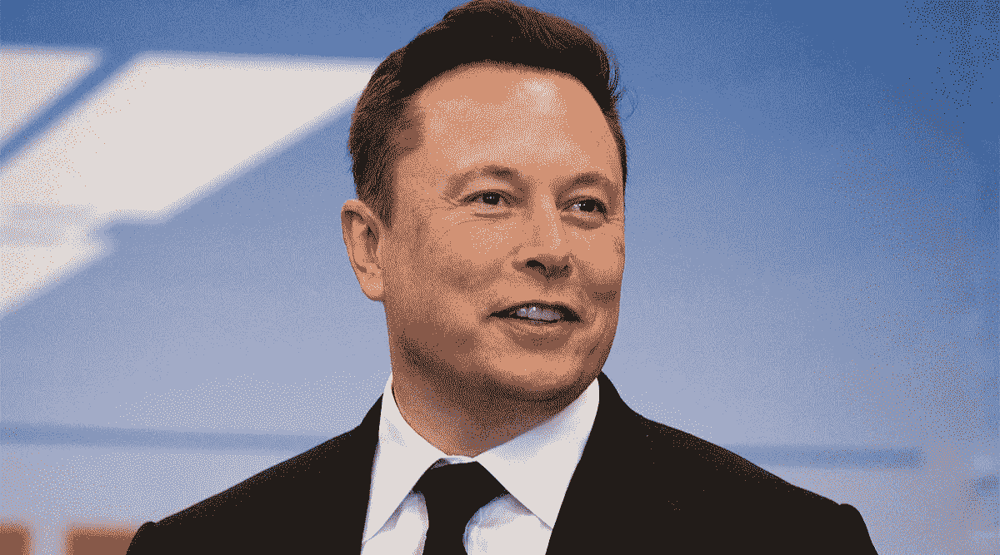
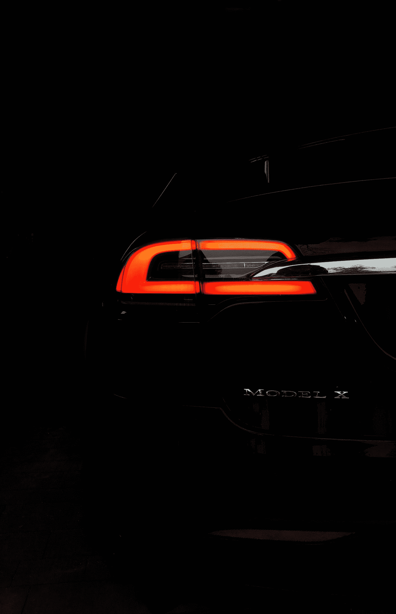

# 埃隆·马斯克又一次改变了人类的命运

> 原文：<https://medium.datadriveninvestor.com/elon-musk-has-changed-the-fate-of-humanity-once-again-c13698c989f9?source=collection_archive---------8----------------------->

## 对于想在办公室里放过山车的人来说，这一刻永远不会无聊

Saul Martinez/2020 Getty Images

就是这个人声称已经为俄罗斯的导弹谈好了价格，并计划投掷热核武器，使火星成为适合人类居住的地方。

昨天，你可能注意到了，也可能没有注意到，特斯拉首席执行官埃隆·马斯克(Elon Musk)决定向比特币投资 15 亿美元，震惊了世界。

该公司宣布，此举背后的原因是为了更好的灵活性，以进一步多样化和最大限度地提高现金回报。

尽管如此，这一举动不应令人惊讶，你的财务顾问应该警告你，埃隆·马斯克对加密货币的热爱，这在过去已经多次表达过。

This interview will help you understand the mind we are talking about

# 埃隆对比特币和 Dogecoin 的影响

这一举动现在引发了一些关于特斯拉首席执行官最近在 Twitter 等社交媒体平台上的行为的质疑，他被认为对提高其他加密货币(如 Dogecoin)的价格负有责任。

当整个世界都在等着你的时候，只要发布一条积极的推文或对一些事件做出反应，就可以改变整个市场，就像 Gamestop 事件一样，你可以被认为对投资世界的各种起伏负责。

这次是比特币。凭借他最近的投资和帖子，他成功地将比特币的价格推高至 44，000 美元以上。

他实现了类似于他关于另一种加密货币 Dogecoin 的不间断推文，这被认为是一种迷因。尽管如此，正如我们所看到的，它也有一些潜在的严重性。

# 俱乐部效应

在埃隆的这一重大举措之后，值得仔细看看他对比特币和其他加密货币的看法，他经常在推特上谈论这些货币。

我们可以有把握地说，马斯克是比特币的大力支持者。他在一个流行的音频聊天应用 Clubhouse 的讨论中证实了这一点。

更具体地说，他说:“我必须注意我在这里说的话，因为其中一些东西真的可以推动市场。”

 [## 埃隆·马斯克打破俱乐部会所限制，粉丝涌向 YouTube，他转而采访罗宾汉首席执行官

### 特斯拉、SpaceX 和许多其他公司的创始人埃隆·马斯克(Elon Musk)已经掌握了使用 Twitter 来驾驭…

techcrunch.com](https://techcrunch.com/2021/01/31/elon-musk-goes-live-on-clubhouse-but-with-the-room-full-fans-stream-audio-on-youtube/?guccounter=1&guce_referrer=aHR0cHM6Ly93d3cuZ29vZ2xlLmNvbS8&guce_referrer_sig=AQAAAIrn4uDPKGP9SH96uhHQ7XrFRsbA6sePsqwzleA4H4-N2uxwszhv11UnFpPnnLWV1XA9MeMhLoBLcjvikRyAgWtHiuWNHAhHlwzX0vHfKLTAtDSObZQ0CLfTGI-XyfNzy_rdygvgYfn0QeboAIPi2gRzYTUXVCD5aqK3zWQ1q8AN) 

他也承认，他的许多朋友长期以来一直试图说服他涉足比特币。

最重要的是，他承认他后悔八年前没有至少买一些比特币。“说到聚会迟到，”他说。

埃隆认为，比特币真的即将被传统金融人士广泛接受。

关于过去几周上涨 800%的加密货币 Dogecoin，他说:“我偶尔会开 Dogecoin 的玩笑，但它们真的只是为了开玩笑。Dogecoin 是作为一个笑话来取笑加密货币的。”

最后，他开玩笑地补充说，命运喜欢讽刺，最有趣和讽刺的结果将是 Dogecoin 在未来的某个时候成为地球的货币。

# 世界正在改变

特斯拉向比特币投资 15 亿美元的主要原因是他们计划开始接受加密货币作为交换其产品的支付形式。

此举将使特斯拉成为第一家迈出这一步的主要汽车制造商。当特斯拉最终决定开始接受比特币作为支付方式时，投入的比特币将为特斯拉提供流动性。

然而，埃隆的决定还有许多其他影响。这也使得特斯拉的股票在 2 月 8 日星期一上涨了 2%以上。还应该注意的是，在最近提交给 SEC 的文件中，特斯拉警告投资者比特币价格的波动性。

Photo by [Szymon Kita](https://unsplash.com/@szymkita?utm_source=medium&utm_medium=referral) on [Unsplash](https://unsplash.com?utm_source=medium&utm_medium=referral)

埃隆·马斯克过去因为他的推文惹上了大麻烦，这不是什么秘密，但不确定这将如何影响他最近关于比特币和 Dogecoin 的推文。

然而，我们不要忘记，2018 年，美国证券交易委员会已经起诉埃隆·马斯克欺诈。背后的原因是，特斯拉的首席执行官发布了虚假和误导性的声明，称当公司股价达到 420 美元时，将公司私有化。

本文仅供参考，不应被视为财务建议。这篇文章是个人观点，我鼓励你在做任何财务决定之前咨询财务专家。

[加入我新成立的名为“媒介作家之声”的脸书小组，该小组旨在帮助你接触更广泛的读者，推广你的作品，并与其他作家讨论项目](https://www.facebook.com/groups/258285522541309)。

# 参考

[https://www . CNBC . com/2021/02/01/elon-musk-on-club house-I-am-a-supporter-of-bit coin . html](https://www.cnbc.com/2021/02/01/elon-musk-on-clubhouse-i-am-a-supporter-of-bitcoin.html)

[https://www . CNBC . com/2021/02/01/elon-musk-on-club house-I-am-a-supporter-of-bit coin . html](https://www.cnbc.com/2021/02/01/elon-musk-on-clubhouse-i-am-a-supporter-of-bitcoin.html)

[https://www . CNBC . com/2018/09/27/Tesla-falls-4 percent-on-report-elon-musk-sued-by-sec . html](https://www.cnbc.com/2018/09/27/tesla-falls-4percent-on-report-elon-musk-sued-by-sec.html)

[https://twitter.com/elonmusk](https://twitter.com/elonmusk)