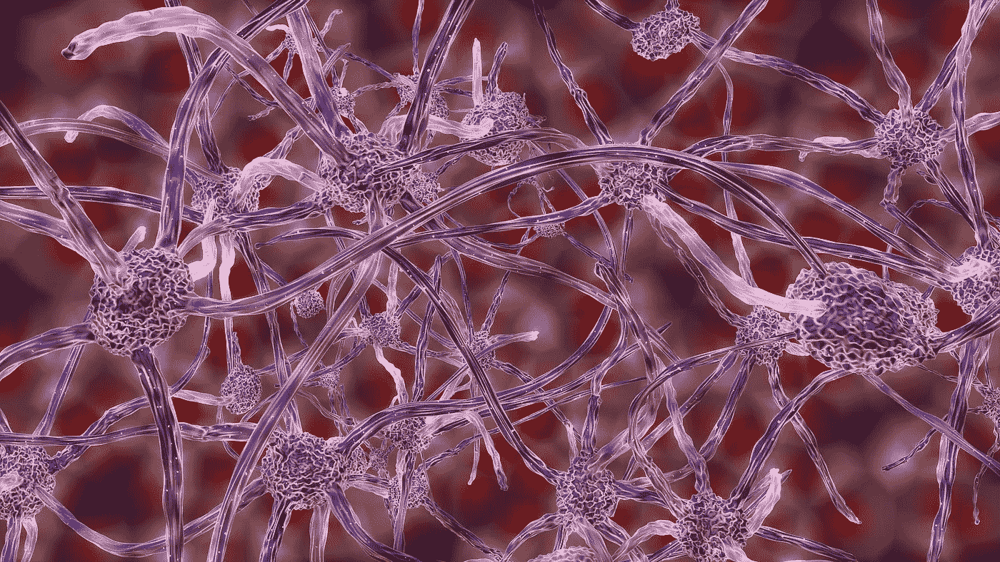

# 埃隆·马斯克将心灵感应和超人的视觉带给了🧠大众

> 原文：<https://medium.datadriveninvestor.com/elon-musk-is-bringing-telepathy-and-superhuman-vision-to-the-masses-65896045fa43?source=collection_archive---------2----------------------->

## 分析 Neuralink。



Image by [MasterTux](https://pixabay.com/users/MasterTux-470906/?utm_source=link-attribution&utm_medium=referral&utm_campaign=image&utm_content=1588720) from [Pixabay](https://pixabay.com/?utm_source=link-attribution&utm_medium=referral&utm_campaign=image&utm_content=1588720)

这里有几十年什么都没发生；而且有几周是几十年发生的时间”——列宁。

观看 Elon Musk 的直播 Neuralink 演示，感觉就像见证了人类进化的一次飞跃，甚至超过了 5 万年前语言的创造。我们终于进入了一个疯狂的科幻世界——在这个世界里，你可以为以后保存记忆，拥有内置的平视显示器和超人的视觉，感觉不到痛苦，并通过心灵感应进行交流。

# 演示

Neuralink 的当前形式，版本 0.9，在一个“三只小猪”的演示中展示，其中一只猪(乔伊斯)没有 Neuralink 植入物，另一只猪(格特鲁德)有一个隐形植入物 2 个月——并在计数——第三只猪(多萝西)以前有一个植入物，但被移除以展示可逆性。第四只猪展示了双 Neuralink 植入物(另外两只这样的猪可能在围栏后面)。所有的猪都健康、快乐，与正常的猪没有区别。

当饲养员给格特鲁德喂食时，我们可以听到哔哔声，并在显示器上看到一个实时图表，埃隆解释说，这代表了格特鲁德植入物的实时信号。当她的鼻子感觉到什么时，它会发出神经元尖峰信号，由植入物的 1024 个电极接收。

此外，在视频中，我们看到其中一只猪在跑步机上，旁边有一个移动的图表，显示了 Neuralink 从猪的神经元中读取数据，并预测其关节的位置，以及其关节的实际测量位置——几乎完全对齐。

# 后果

这真是令人吃惊。例如，一个截瘫的人有一天可以使用 Neuralink 来恢复运动和交流。正如埃隆所说，从长远来看:

> "脊椎被切断的人可以再次行走。"

脊髓被切断后，身体的电线就断了，但如果你能跳过这些电线并传输信号，你就能给人以行走和恢复运动的能力。

因此，第一次临床试验将用于少数截瘫患者，表明该设备在人体内是安全和有效的。仅仅通过思考，他们就可以输出单词、打字、控制电脑或电话。

# 对大脑的读写

那么，它到底是怎么工作的呢？大脑是一个生物输入输出机器。当你阅读这篇文章时，你正在获得新的信息(输入)，不仅仅是从文本中，还包括你座位的感觉，你周围空气的味道，温度等等。你做的每一个动作(可感知的或不可感知的)都是一种输出，无论是移动肢体、说话还是写作。

Neuralink 像计算机一样与我们的大脑进行交互:它可以读取和写入大脑。它通过精确控制电场来刺激神经元，从而向大脑写入数据。这种空间和时间上的精确是必要的，因为大脑区域的范围很广，其中一些需要微妙的刺激，而另一些则需要大量的电流。

为了分析受刺激的神经元，如在三只小猪的演示中，使用了双光子显微镜。你可以看到神经元是如何放电的，红色的条形是电极(1024 个中有 2 个可见)，绿色的是对电极电流做出反应的神经元体。一个电极可以控制一千到一万个神经元，因此全部 1024 个电极可以影响数百万个神经元。

Neuralink 的 0.9 版本可在 1024 个电极中的每个电极上读取/写入，具有全天电池寿命，可在夜间无线充电，并通过蓝牙低能耗无缝连接到您的手机。下一个最好的消费设备是笨重的，侵入性的，并且只有很少的频道，所以 Neuralink 0.9 已经是一个惊人的突破。FDA 认识到这一点，于 7 月授予 Neuralink 突破性设备称号。

[](https://www.datadriveninvestor.com/2019/04/04/neural-networks/) [## 冗长但有价值的神经网络指南|数据驱动的投资者

### 如今可用于机器学习的神经网络类型如此之多，以至于它值得一个冗长的指南…

www.datadriveninvestor.com](https://www.datadriveninvestor.com/2019/04/04/neural-networks/) 

## 尖峰检测

在三只小猪的演示中，我们可以看到猪的神经元活动的峰值。尖峰是神经元中的一种电行为，它是神经元之间通信的主要形式，类似于实时发送的 1 和 0。

通常，尖峰检测是通过离线记录数据并寻找特征形状来完成的。Neuralink 需要在线检测尖峰信号，这是通过带通滤波等技术在芯片上对所有 1024 个电极进行的。

这类似于 1024 个“小麦克风”，实时过滤，寻找特征形状。发送大量的原始电极数据将会是太多的信息(尽管它可能在只有 1024 个频道的手机上完成，但你会在更多频道上达到无线电的极限)，这就是为什么尖峰会在芯片上(在你的头上)被检测到。

该信息可以像音频馈送一样以声谱图频段和原始波形的形式被消费，对数据流进行大约 100 千比特的无损压缩(具有 1，024 个通道)。

信号以 20 千赫的速率数字化，感兴趣的信号宽度为 1 毫秒，采样速率为 20 倍。模数转换器将其分为 1024 级，即 10 位分辨率。最终，尖峰检测在不到 900 纳秒的时间内完成，并且仅由时钟的速度决定。为了刺激大脑，可以产生分辨率为 7 微秒的任意波形。

Neuralink 有一个完全定制的 ASIC，因为没有任何东西可以测量和创建微伏级信号。它是专门设计来记录大脑信号的，同时也借鉴了无线电和可穿戴传感器等行业标准的想法。

# 为什么你会想要它

就算你现在看不到 Neuralink 有什么个人医疗需求，以后也会的。这是(曾经是)生活中的一个事实:随着时间的推移，几乎每个人都会出现大脑和脊柱问题，从记忆丧失到焦虑到脑损伤。

由于我们所有的感官都只是神经元发出的电信号，我们可以通过一种可植入的电子设备来解决电环境中的任何问题，如记忆丧失、听力丧失、失明、疼痛、癫痫发作、焦虑、成瘾、*等等*。

# 一枚硬币被强力胶粘在你的脑壳里

一年前，Neuralink 有一个由多个部分组成的复杂设备，包括一个位于耳朵后面的部分。今天，它只有硬币大小，它取代了你的一块头骨，电线连接在离设备大约一英寸的地方。埃隆把它描述为“你脑袋里的一个装有细小电线的 Fitbit”它与你的头骨完全齐平，不会留下任何痕迹，所以你甚至无法判断是否有人拥有它。

> 你脑袋里有一个带小电线的钻头。

植入手术由全自动手术机器人在一小时内完成，不需要全身麻醉。因为电线很细，安装时需要机器人的精度。该过程如下所示:

*   取出一块硬币大小的头骨。
*   机器人插入电极。
*   Neuralink 取代了被移除的那块头骨。
*   这是强力胶粘在一起的。

这个机器人被用于所有的猪的植入手术，所以它已经可以工作了。有点违反直觉，安装过程中没有出血。电极非常小，插入时非常小心，所以当一个链接被插入时，没有明显的神经元损伤。机器人对大脑进行成像，并使用人工智能来检测和避免静脉和动脉。这种高度精确的穿线意味着没有流血。

# 有多深？

Neuralink 0.9 的电线进入皮层表面，这简化了事情，因为许多低级处理发生在皮层中。我们可以通过大脑皮层内的接口来解决失明、瘫痪和听力等问题。

电线进入大脑皮层 3 或 4 毫米，这样电极就可以从大脑皮层的多层发出。Neuralink 计划探索更深层的大脑系统，如下丘脑，以治疗抑郁症，成瘾，焦虑等疾病。

最终，为了成为一种通用设备，电线将变得更长，机器人将被修改以进入大脑的更深区域。棘手的部分不在于致动器，而是避免深层脉管系统的传感问题。

# 材料学

Neuralink 最困难的问题之一是在材料科学方面，即选择与大脑兼容并能持续几十年(即使在这样一个腐蚀性环境中)的导线的正确材料。有一个有趣的二分法，你需要在完全不腐蚀电极的情况下感测和产生电信号，这样就需要恰到好处的绝缘，并且需要在几十年内保持这个数量。

Neuralink 使用加速试验箱，模拟植入物在体内看到的条件，其中一些设备已经经过了近一年的测试，经历了化学、压力和机械攻击。

目前，从长远来看，碳化硅绝缘体似乎是电极的最佳材料。这是一种很难加工的材料，但具有有用的电学和物理特性。

电极的厚度大约是人类头发的二十分之一(直径为 5 微米，而不是 100 微米)，并且会越来越薄——可能达到亚微米水平。这是一项挑战，因为电线越细，由于电信号通过的横截面面积越小，读取和写入信号就越困难。

# 解决安全问题

我们已经讨论了 Neuralink 如何完全可逆，如何在安装过程中没有出血，以及 Neuralink 如何与 FDA 密切合作。

Neuralink 更进一步，将极其严格，大大超过 FDA 的最低安全指南，就像特斯拉远远超过其领域的所有指南一样。

鉴于 Neuralink 是无线的，许多人对干扰感到好奇。与任何蓝牙设备类似，它能够与共享相同 2.4 GHz 频谱的其他设备共存。由于当许多人共享同一频谱时，如在音乐会上，信号质量确实会下降，Neuralink 正在开发工作在不同频率的新版本。

此外，所有数据都经过安全加密和验证，安全性从一开始就嵌入到设计中，并且从芯片设计到源代码都在内部完成。像收音机这样的敏感模块在硬件层面被隔离，这样大脑的 I/O 就完全不受攻击。

# Neuralink 的未来

如果给予截瘫患者全身运动还不够惊人，那么考虑 Neuralink 的第 2、3 或 4 版。有一天，我们可能会上传并储存我们的记忆作为备份。最终，正如埃隆所说，我们**“有可能将它们下载到一个新的身体或机器人身体**”

从短期来看，Neuralink 将会给意识带来光明。神经科学家终于可以获得工具来观察神经元的相互关系以及它们与现象状态的关系，从而解开大脑的谜团。

还讨论了其他令人惊讶的可能性，包括平视显示器、监督(通过动态调整输入你视觉皮层的传感器，你可以看到红外、紫外、雷达——你能想到的)，以及心灵感应。

它也将变得超级便宜，成本尽可能低——包括自动手术在内的几千美元，类似于 LASIK 手术。虽然上市时会很贵，但这些电子设备实际上并不贵，因为它们使用的是为智能手机、智能手表和其他可穿戴设备大规模生产的相同单元。

也许 Neuralink 最重要的作用将是实现与高级人工智能的共存，因为我们可以与我们自己的人工智能扩展实现积极的共生。

# 亲自动手

回想一下，Neuralink 通过分析电极数据和寻找特征形状来检测神经尖峰。Neuralink 实时在线地为许多频道做这件事。

神经科学家多年来一直在分析神经电极数据，试图找到神经元与各种大脑状态的关联，并解开思维的秘密。为了更好地理解，许多脑电图数据集可在线获得:

```
[EEG — Alcohol](https://www.kaggle.com/nnair25/Alcoholics)
[EEG — Sleep Pattern Analysis](https://www.kaggle.com/jbouv27/eeg)
[EEG — Schizophrenia](https://www.kaggle.com/broach/button-tone-sz)
[EEG — Personal Micro-experiment](https://www.kaggle.com/millerintllc/eeg-microexperiment)
[EEG — Synchronized Brainwaves](https://www.kaggle.com/berkeley-biosense/synchronized-brainwave-dataset)
[EEG — Hands Movement](https://www.kaggle.com/fabriciotorquato/eeg-data-from-hands-movement)
[EEG — Personal Concentration Tasks](https://www.kaggle.com/dqmonn/personal-eeg-tasks)
[EEG — Eye Movement](https://www.kaggle.com/shrutimechlearn/eye-movement-data-eeg)
[EEG — Personal Eye Data](https://www.kaggle.com/latimerb/eeg-leftright)
[EEG — Depression](https://www.kaggle.com/tocodeforsoul/depression-rest-preprocessed?select=510_Depression_REST-epo-feat-v1.npy)
[EEG — Confused Student](https://www.kaggle.com/wanghaohan/confused-eeg)
[EEG — Feeling Emotions](https://www.kaggle.com/birdy654/eeg-brainwave-dataset-feeling-emotions)
[EEG — Mental State](https://www.kaggle.com/birdy654/eeg-brainwave-dataset-mental-state)
```

虽然研究人员已经发现了基本脑电图设备的有趣关联，但拥有 1024 个通道的实时 I/O 数据是一项突破。正如马斯克指出的那样，未来版本中的电极数量将会增加几个数量级，从而能够对大脑进行全面测绘，并释放无限的潜力。

**访问专家视图—** [**订阅 DDI 英特尔**](https://datadriveninvestor.com/ddi-intel)