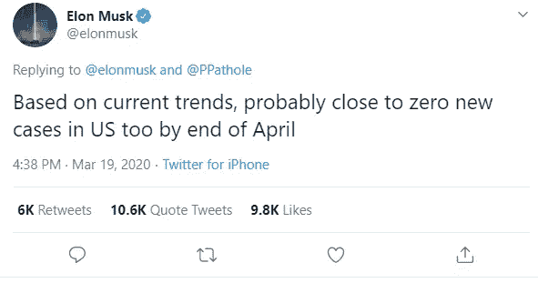
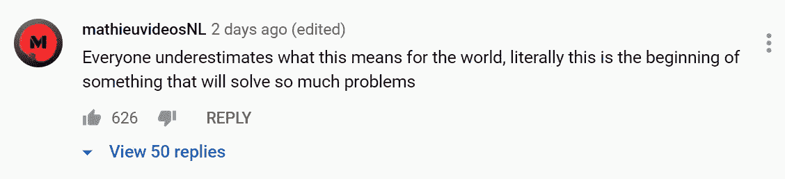
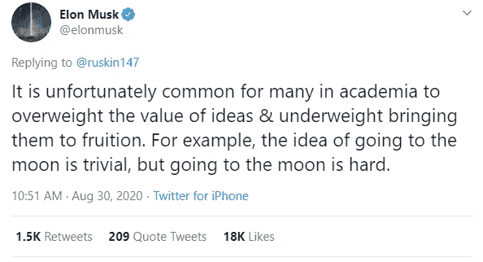
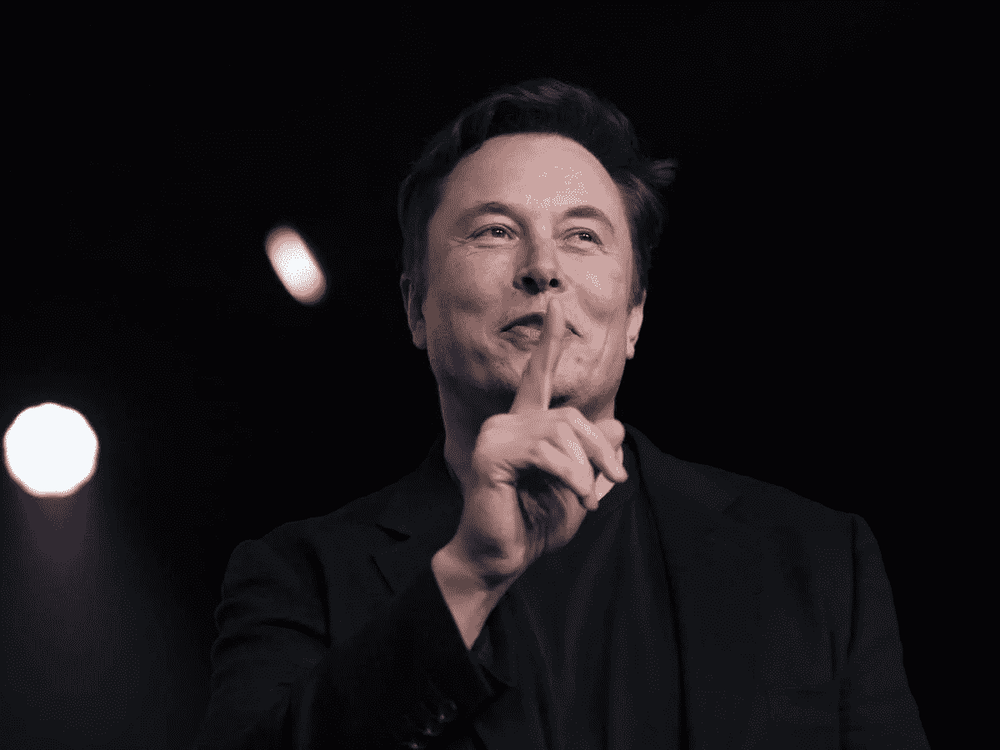

# 埃隆·马斯克在耍你——neural ink 是个骗局

> 原文：<https://medium.datadriveninvestor.com/elon-musk-is-trying-to-take-you-for-a-fool-f41d2d56b02b?source=collection_archive---------0----------------------->

## 任何神经科学家都会告诉你，大脑比埃隆·马斯克声称的要复杂得多

当我第一次听说埃隆·马斯克的大脑-计算机接口公司 Neuralink 时，我立即持怀疑态度。即使是最强大的计算机也比不上大脑神奇的复杂性。而且，最杰出的神经科学家也缺乏一幅精确的全景图，无法知道一个神经元是如何激活的，或者所有那些其他脑细胞真正在做什么。由于马斯克似乎没有掌握[生物学](https://twitter.com/elonmusk/status/1240754657263144960)，我严重怀疑 Neuralink 能有任何实质性的东西。

This tweet aged well. Does he not understand statistics, biology, or both?

事实证明我的预感是对的。2020 年 8 月下旬，该公司展示了其…嗯…脑机接口的工作原型？在下面的视频中，你可以看到“Neuralink”设置如何显示当猪用鼻子触摸某物时少量神经元放电。

从演示中我可以看出，他们将无线微电极植入猪的大脑，然后将输出翻译成音符。马斯克在上面的视频中说，“我认为这是令人难以置信的深刻，”我非常同意:神经科学是令人难以置信的深刻。但是马斯克对 Neuralink 的介绍纯粹是 bullsh*t。

通过 Neuralink，马斯克有效地展示了已经存在[至少五年](https://www.sciencedirect.com/science/article/pii/S0896627314010101)，如果不是[几十年](https://www.sciencedirect.com/science/article/pii/S1046202301912319)的技术。马斯克实现的真正革命性的事情是杜平让很多人认为这有超越基础转化研究的应用。他声称 Neuralink 将治愈从抑郁和焦虑到脊髓损伤的各种疾病。但这只是纯粹的欺诈。

 [## Neuralink:未来还是终结？数据驱动的投资者

### 见见 Neuralink，埃隆·马斯克的新宝贝。一个微小的大脑植入物，可以将脑电波实时传送到你的手机上…

www.datadriveninvestor.com](https://www.datadriveninvestor.com/2020/09/01/neuralink-future-or-the-end/) 

我无意扫任何人的兴，但这种蛇油式的推销是危险的。它不仅给了人们虚假的希望，而且使人们误解和不信任真正的科学成就。在一个人们因为担心比尔·盖茨给他们植入微芯片而不愿接种疫苗的世界里，怎么会有这么多人对**被植入微芯片感到兴奋？！？！**

Cool, cool. YouTube is always full of such educated and helpful opinions from reputable experts.

现在，这种技术对于研究人员如何研究动物行为中的神经元活动确实具有重要而迷人的意义。但是，[这不是新的](https://ieeexplore.ieee.org/abstract/document/6944288)，甚至也不是[这类无线电生理学设置中最酷的东西](https://ieeexplore.ieee.org/abstract/document/8050345)。我很难想象除了目前在癫痫方面的有限使用和作为心脏手术诊断的可能使用之外，它还有什么临床应用。如果你能看到一些我看不到的潜力，请告诉我。

它可能有研究用途，但是，即使在这方面，它的效用也是极其有限的。正如我之前所写的，将大脑活动简化为电信号是一个严重的错误——这种方法完全忽略了[使大脑运转的数十亿其他细胞](https://medium.com/medical-myths-and-models/youve-been-misled-about-myelin-d6238691704b),以及[神经元沟通的无数化学和机械方式](https://medium.com/medical-myths-and-models/youve-been-misled-about-action-potentials-4229a1fe956d)。将我们的希望赌在一种能测量一小群神经元电信号的设备上是一个严重的错误。

马斯克在一条推文中回应了这一系列批评，内容如下:

> “不幸的是，学术界普遍高估了想法的价值，而低估了实现想法的价值。比如，去月球的想法是微不足道的，但去月球是艰难的。”

但是谁说去月球的想法是微不足道的？这是一个奇妙而不可思议的想法，直到最近，它还只是神话和传说的素材。这感觉像是埃隆的纯粹预测，因为他完全低估了解决神经科学中最困难问题的难度。而且，就像登上月球的梦想一样，他的想法并非微不足道——它们代表了对人类潜力最乐观的看法。但是与现实脱节的潜力变成了错觉。

除了智力上的怀疑，我对 Neuralink 项目也有道德上的疑虑。忘记长期的道德问题，比如个人隐私的完全丧失或大脑被黑的可能性。从短期来看，仅仅为了宣传噱头而进行动物实验似乎是不负责任的，甚至是完全不道德的。如果这是对科学文献有积极贡献的开创性工作，也许我会有不同的感受。但这似乎并不新奇，他们似乎也没有计划发表任何关于他们工作的同行评议研究。

我希望 Neuralink 能够实现马斯克声称它将实现的惊人事情的一小部分。我进入神经科学领域是为了改善人类，既通过治愈疾病，也通过增强我们已经令人惊叹的生物学过程。我完全同意马斯克的观点，对我们自己大脑的探索是“令人难以置信的深刻”但我希望他能通过阅读教科书或维基百科的文章来理解这一点。相反，他决定在一个表演性工程项目上砸下 1.6 亿美元。

我会让你想象所有钱可以用来做的事情…

**进入专家视角—** [**订阅 DDI 英特尔**](https://datadriveninvestor.com/ddi-intel)