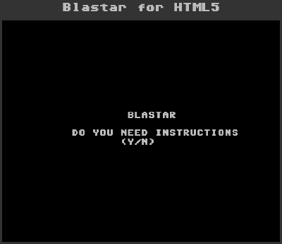
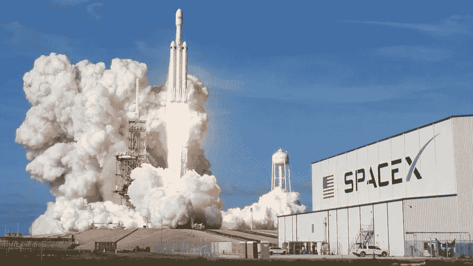
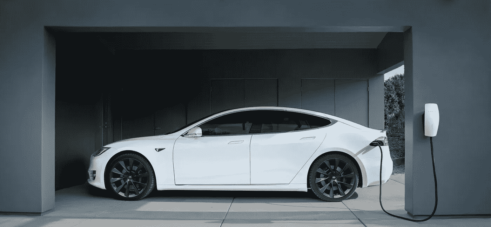
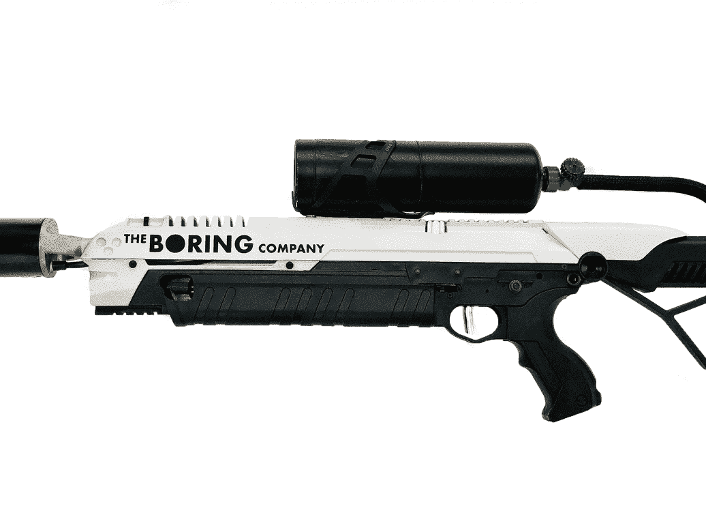

# 埃隆·马斯克:迷你传记

> 原文：<https://medium.datadriveninvestor.com/elon-musk-mini-biography-d12a4a7156e?source=collection_archive---------13----------------------->

如果你对科技感兴趣，你很可能听说过或知道埃隆·马斯克。你可能因为他有趣的推文而认识他，或者有一次他如何出于无聊制作了一个喷火器，或者他如何给他的孩子起了一串随机的字母，甚至有一次他如何主持 PewDiePie 的 Meme Review。然而，你知道吗，埃隆·马斯克不仅仅是这样。

# 这一切是如何开始的

大多数人都知道他是后来成为 PayPal 的公司的联合创始人。我的钦佩并不是因为他创立了一家让它变大的公司。它来自于他追求自己的激情并从中做出了一些成绩。10 岁时，他对计算机产生了兴趣，后来在 12 岁时，他制作了自己的第一个视频游戏，名为 *Blaster* ，并将其卖给了一家计算机杂志。没有多少人有毅力和意愿自己去学东西，更别说在 10 岁的时候。最重要的是，他实际上创造了一些有形的东西并卖给了别人。我现在 22 岁，我已经编程 4 年多了，但是我从来没有做过他 12 岁时做的事情。

# 激情引领的创新

继 PayPal 之后，埃隆找到了更多的公司。SpaceX 和特斯拉等等。他创建所有公司的原因很简单。他想通过创新来追求他的激情和信念。

 [## Neuralink:未来还是终结？数据驱动的投资者

### 见见 Neuralink，埃隆·马斯克的新宝贝。一个微小的大脑植入物，可以将脑电波实时传送到你的手机上…

www.datadriveninvestor.com](https://www.datadriveninvestor.com/2020/09/01/neuralink-future-or-the-end/) 

## 空间探索

伊隆认为人类应该超越地球。总有一天，地球上所有的资源都会耗尽。总有一天，污染和疏忽会让地球变得无法居住。为此，他建立了 SpaceX。

## 气候变化

埃隆认为，我们在日常生活中对车辆的依赖会消耗大量的汽油。它在很大程度上导致了气候变化逐年恶化。他制造特斯拉是为了生产他认为可以应对气候变化的电动汽车。

## **人工智能**

埃隆认为，如果人工智能发展不当，人类将在未来几年被淘汰。这就是为什么他建立 OpenAI 来追求对 AI 的研究，并学习如何为每个人适当地开发它。

## 无聊的

有一次，他也无聊到了极点，于是创建了无聊公司，卖了一顶帽子。他用卖那些帽子赚来的钱，制造并出售了一个迷你喷火器，当然，很快就卖光了。

# **关闭**

我可以谈谈美国国家航空航天局和 SpaceX 如何合作，在今年的某个时候将四名被称为“龙组”的宇航员送上太空，或者他如何从他创建的公司赚了数百万美元，但这不是重点。我相信他最大的成就是通过激情追求和创新。如果我们都这样做，也许我们可以像埃隆·马斯克那样对世界产生同样的影响。

## 访问专家视图— [订阅 DDI 英特尔](https://datadriveninvestor.com/ddi-intel)