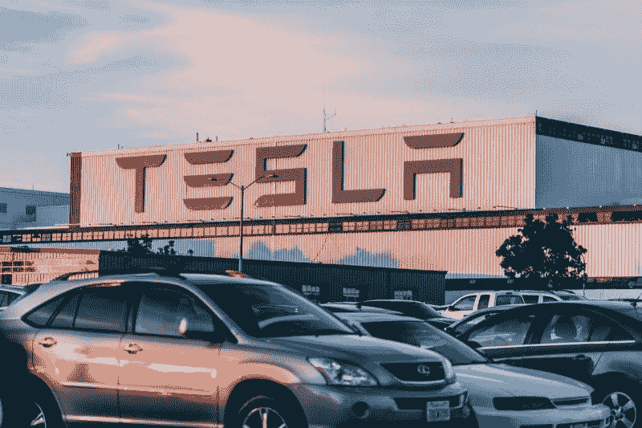
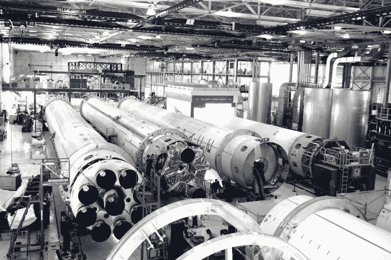
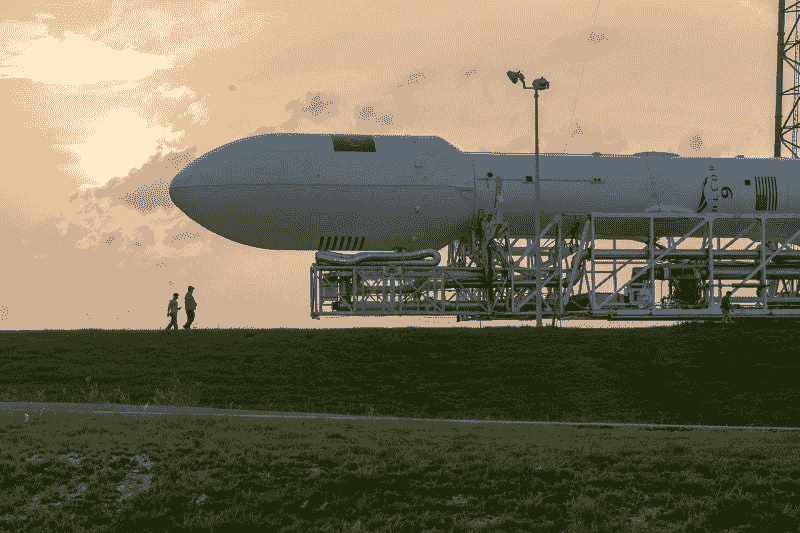
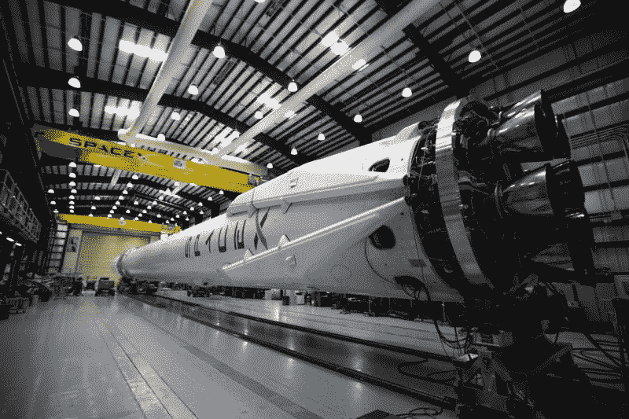
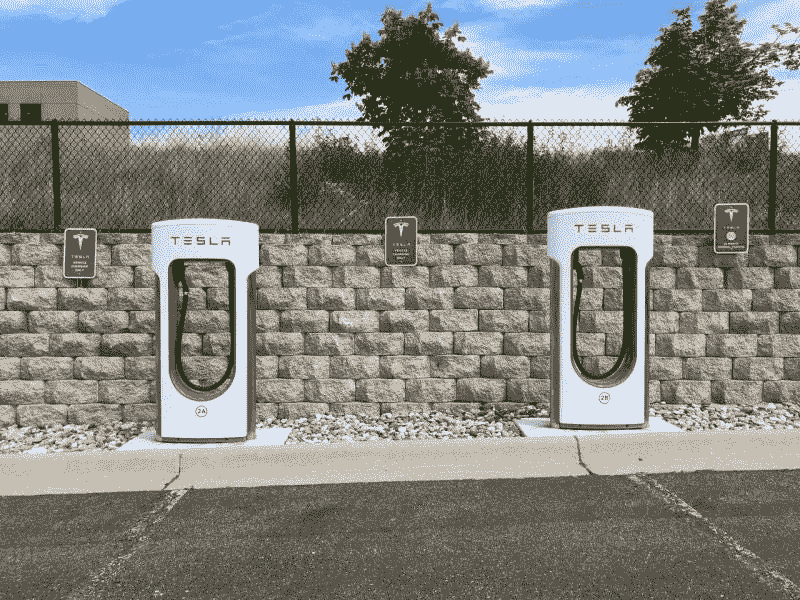

# 埃隆·马斯克证明政府可以发展经济——市场疯人院

> 原文：<https://medium.datadriveninvestor.com/elon-musk-proves-government-can-grow-the-economy-market-mad-house-bf5cacd76291?source=collection_archive---------14----------------------->

奇怪的是，超级企业家埃隆·马斯克证明了政府对经济增长的必要性。解释一下，联邦贷款推动了马斯克不断壮大的工业帝国，以及它创造的数万个就业岗位。

例如，马斯克在 2010 年用 4.655 亿美元的联邦贷款买下了第一家**特斯拉(纳斯达克股票代码:TSLA)** 工厂。此外，[米塞斯研究所估计](https://mises.org/wire/elon-muskss-taxpayer-funded-gravy-train)特斯拉在 2018 年获得了超过 2.8 亿美元的联邦税收优惠。此外，特斯拉车主在 2018 年获得了 7500 美元的联邦税收减免。

可以预见的是，米塞斯研究所的紧缩鹰派认为任何给特斯拉的钱都是浪费。然而，有证据表明普通人、纳税人和投资者从特斯拉的成功中受益。

# 埃隆马斯克在特斯拉证明现代货币理论了吗？

首先，特斯拉提前九年在 2013 年偿还了[4.645 亿美元的贷款， *Clean Technica* 报道。二、**特斯拉(TSLA)**2019 年雇佣了 48016 人。](https://mises.org/wire/elon-muskss-taxpayer-funded-gravy-train)

与此同时，2020 年 8 月 25 日，特斯拉股东的股价为 2，023.34 美元，市值为 3，770.7 亿美元。因此，十年前山姆大叔对特斯拉的 4.655 亿美元投资，10 年后为投资者创造了 3770.7 亿美元的财富。

此外，**特斯拉公司(纳斯达克股票代码:TSLA)**2019 年 12 月 31 日报告的年收入为 245.78 亿美元。此外，截至 2020 年 6 月 30 日，特斯拉的总资产为 381.35 亿美元，现金和短期投资为 80.8 亿美元。此外，特斯拉报告 2020 年 3 月 31 日的季度运营现金流为 84.57 亿美元。

 [## 后疫情经济中的基本 GTM 变革策略|数据驱动的投资者

### 新冠肺炎以一种新的不可想象的方式开展业务。这个疫情甚至强迫…

www.datadriveninvestor.com](https://www.datadriveninvestor.com/2020/08/11/an-essential-gtm-change-strategies-in-the-post-pandemic-economy/) 

因此，特斯拉可以证明现代货币理论背后的一个想法。本质上，MMT 告诉我们，政府可以通过赤字支出来创造货币和增长经济。

另一种看待 MMT 的方式是认为你需要花钱才能赚钱。或者说消费可以创造金钱。

# SpaceX 呢？

因此，联邦政府向马斯克的 SpaceX 支付的数十亿美元可能是值得的。2018 年，SpaceX 获得了超过 50 亿美元的资金，米塞斯研究所声称马斯克的猎鹰火箭不如竞争对手可靠。

2020 年 5 月 30 日，SpaceX 公司的载人龙飞船成为 17 年来第一艘载人进入轨道的新飞船。因此，马斯克实现了他的目标，并在 SpaceX 创造了 8000 个工作岗位。

因此，我认为我们应该欢迎马斯克为 SpaceX 的卫星互联网计划寻求 160 亿美元联邦拨款的决定

# Starlink 和 SpaceX 会赚钱吗？

解释一下，联邦通信委员会(FCC)将让 SpaceX 从其[农村数字机会基金](https://marketmadhouse.com/elon-musk-proves-government-can-grow-the-economy/#:~:text=The%20Crew%20Dragon%20capsule%2C%20built,humans%20have%20reached%20orbit').)， *The Motley Fool* 报道。该基金包含 160 亿美元的补贴。

该基金为美国服务不足的农村地区支付高速互联网费用。马斯克希望 Starlink 将向地球上 12，000 至 42，000 颗轨道卫星上的人们传输互联网。

因此，Starlink 可以创造数万个制造卫星和发射火箭的工作岗位。此外，Starlink 可以为投资者创造数百亿美元的股票价值和市值。

因此，马斯克可以在 Starlink 和 SpaceX 复制他在特斯拉的成功。因此，美国太空部队计划向 SpaceX 支付的 3 . 16 亿美元可能是一项明智的投资。

# 我们能保护我们的经济免受紧缩秃鹫的攻击吗？

马斯克在**特斯拉(TSLA)** 和 SpaceX 的胜利证明了[川普政府贷款**伊士曼柯达公司【纽约证券交易所代码:KODK】**](https://marketmadhouse.com/can-eastman-kodak-make-money/)7 . 65 亿美元用于制造仿制药成分的决定是正确的。

不幸的是，紧缩秃鹫已经在批评伊士曼柯达的交易了。详细地说，紧缩是政客们利用赤字恐慌来掩盖他们为富裕的特殊利益服务的愤世嫉俗的努力。令人不安的是，攻击伊士曼柯达公司的赤字鹰派是美国众议员吉姆克莱伯恩(D-南卡罗来纳州)。

自称进步人士和前民权领袖的克莱伯恩在最近一集的播客中抨击了伊士曼柯达公司的交易。克莱本的抱怨是，伊士曼柯达公司的高管可以从这笔交易中赚钱。

令人厌恶的是，克莱本透露他对柯达及其业务一无所知。例如，Clyburn 告诉 Skullduggery，“柯达制造了伟大的相机。”根据记录，[柯达从 2004 年 1 月起就没有生产过胶片相机](https://marketmadhouse.com/elon-musk-proves-government-can-grow-the-economy/#:~:text=January%202004%3A%20Kodak%20announced%20that,total%20workforce%20at%20the%20time).),超过 16 年了。因此，Clyburn 显示了他对一个他想管理的行业的无知。

此外，克莱本并不知道，自乔治·伊斯曼于 1888 年创立柯达以来，该公司一直从事化学行业。为了解释这一点，他们用化学物质制作了照相胶片。因此，对柯达来说，仿制药和化学药品的成分是一项合乎逻辑的业务。

解释一下，Clyburn 可能希望保持高药价；通过限制廉价仿制药的供应，他的钱滚滚而来。Clyburn 和他的公司老板可能担心更多的仿制药会压低药品价格，从而减少他们的利润。

令人不安的是，克莱伯恩是民主党总统候选人乔·拜登(特拉华州民主党人)的亲密政治盟友。许多专家将拜登的民主党初选胜利归功于克莱伯恩。解释一下，克莱伯恩通过提供南卡罗来纳州的初选选票挽救了拜登惨淡的总统竞选。

# 乔·拜登节俭秃鹫

可怕的是，拜登；谁可能成为美国的下一任总统，可能是一个紧缩秃鹫。*雅各宾派的*戴维·西罗塔声称[“拜登的核心圈子似乎执着于紧缩的意识形态](https://jacobinmag.com/2020/08/biden-democratic-national-convention-austerity)。”

紧缩是一种教条，认为政府不能创造货币，所有政府支出都是浪费。紧缩政策吸引了想要弱政府的自由主义者和想要低税收的富有的竞选捐助者。

拜登的宠臣泰德·考夫曼告诉华尔街日报:“当你看到川普对赤字做了什么……忘记新冠肺炎，所有他用难以置信的减税建立的赤字。所以我们会受到限制。”

我不知道拜登是否同意考夫曼的信念，然而，拜登有很长的赤字小贩历史。事实上,《拦截》声称乔·拜登主张削减社会保障已经有 40 年了。相反，拜登的竞选团队正在兜售一项 3.5 万亿美元的支出计划和每月 200 美元的社会保障增加额。

# 拜登会让经济增长吗？

因此，西罗塔的指控让我感到害怕。拜登可以用赫伯特·胡佛(R-California)式的紧缩计划来收缩经济，而不是增长经济。因此，拜登可能会让美国变得更穷，同时给普通民众带来巨大的痛苦。

但愿西罗塔是错的，拜登将向企业家提供大量贷款，以扩大美国经济。或者向普通美国人支付现金，以增加消费支出，促进经济增长。

值得注意的是，有人猜测拜登可能会任命失败的总统候选人和基本收入倡导者[杨安泽(纽约州民主党人)](https://marketmadhouse.com/capitalism-is-broken-can-andrew-yang-fix-it/)进入内阁。然而，没有证据表明杨是拜登核心集团的一员。

最后，必须指出的是，美国总统对支出和经济政策几乎没有控制权。根据宪法，总统所能做的就是向国会提出支出建议。相反，总统只能花国会给他的钱。

# 特朗普相信现代货币理论吗？

我认为现任总统唐纳德·j·特朗普(R-Florida)相信 MMT，并希望增加支出。不幸的是，国会紧缩秃鹫；包括美国众议院议长南希·佩洛西(D-California)和美国参议院多数党领袖米奇·麦康奈尔(R-Kentucky)在内，阻止特朗普支出。

因此，拜登的信念可能毫无意义，因为佩洛西和麦康奈尔在 2021 年仍可能执掌国会山。因此，紧缩秃鹫将有能力阻止未来的支出，让美国在未来几年保持贫困。

我认为埃隆·马斯克的成功表明 MMT 是有效的。不幸的是，华盛顿很少有人注意到马斯克的成功。

*原载于 2020 年 8 月 25 日 https://marketmadhouse.com***。**

***访问专家视图—** [**订阅 DDI 英特尔**](https://datadriveninvestor.com/ddi-intel)*