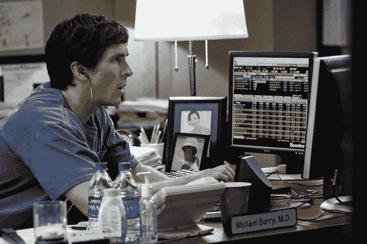

# 埃隆·马斯克接受了迈克尔·伯瑞博士的建议

> 原文：<https://medium.datadriveninvestor.com/elon-musk-takes-dr-michael-burrys-advice-6e5f5401a6a1?source=collection_archive---------0----------------------->

## 《大空头》中的迈克尔·伯里(克里斯蒂安·贝尔饰演)对泡沫略知一二

Christian Bale, playing Dr. Michael Burry in the Big Short ~ photo from WSJ.com

你可能还记得迈克尔·布里博士，他是一个有点古怪的冲浪兄弟兼对冲基金的家伙，住在加州的大空头里。你还记得那个确信房地产会崩溃的家伙，他说服银行卖给他一种他们必须发明的新型金融工具。为了让迈克尔卖空抵押债务债券(CDO ),作为对住房市场的押注。

然后，他在这些工具上又呆了 18 个月，损失了很多时间，而房地产市场一直在上涨，他的投资者在喊他卖掉这些工具。因为他毫无疑问地知道房价会随时崩溃。

众所周知，这最终发生了，让迈克尔成为了亿万富翁。

12 月 3 日，迈克尔·伯利在推特上给埃隆·马斯克发了这条消息

> “所以，@elonmusk，是的，我缺少$TSLA，但是给一个好人一些免费的建议…说真的，以目前可笑的价格发行你 25-50%的股份。这不是稀释，你会巩固永久性和无限的选择性。如果有买家，就卖掉那个#TeslaSouffle。”~来自 2020 年 12 月 3 日 Michael Burry 博士的推特账号

除此之外，他还在推特上发布了一张公开市场上所有汽车制造商的截图，显示所有这些制造商的市值仅略高于特斯拉 6000 亿美元的市值。尽管特斯拉的收入仅占其他汽车制造商总收入的 1%左右。

迈克尔·伯里说得有道理。即使特斯拉接管了地球上所有汽车的生产。今天，公开市场对所有其他汽车公司的估值已经达到 7000 亿美元左右。因此，虽然特斯拉可能是一家伟大的公司，但该公司似乎有点超前了，至少在股价方面。

几天后，特斯拉向美国证券交易委员会提交了一份 8k 文件。建立一个自动取款机项目。这意味着他们已经登记并预留了一定数量的股份(高达 50 亿美元),可以随时“在市场上”出售。

我看到了一些其他的报道，他们卖出了 50 亿美元的股票。事实并非如此。他们只是把它们保留起来，放在一边，以便不时地在“市场”上出售。

因此，他们可以在下周卖出 5 亿美元，然后在 1 月份卖出 2 亿美元，然后在 3 月份卖出 5 亿美元，或者基本上是他们想要的任何东西，无论他们何时想要，无论当前的市场价格是多少。高达 50 亿美元。

 [## 移动网络 O2 发布英国首个无人驾驶汽车实验室测试使用 5G 和…

### 随着时间的推移，技术越来越强大。我们不仅成功地登上了月球，我们现在…

www.datadriveninvestor.com](https://www.datadriveninvestor.com/2020/11/24/mobile-network-o2-launch-uks-first-driverless-car-lab-testing-driverless-cars-using-5g-and-satellite-technology/) 

这是埃隆的明智之举。特斯拉过去最大的担忧是烧钱和手头有足够的现金。这不再是一个担忧。未来几年他们有足够的资源。即使他们已经实现了盈利，他们仍然需要大量的资本支出来扩大生产。这一举措让他们不必担心从哪里获得资金来满足资本支出需求。即使市场和特斯拉崩溃了，埃隆也能让特斯拉继续运营数年。

因此，很高兴埃隆接受了迈克尔的建议，开始兑现特斯拉虚高的股价。但是迈克尔·伯利博士也在推特上写道:

> “是的，我正在做空 [$TSLA](https://twitter.com/search?q=%24TSLA&src=cashtag_click) 进行一次长期的波动交易。这让任何人感到震惊吗？它走得太抛物线了。目前它被过分夸大了。10 年后，它将变得巨大，但现在，它将迎来一次重大的下行修正，”来自迈克尔·伯里博士 2020 年 12 月 3 日的推特账户

任何人，认为迈克尔博士是一个聪明的家伙，所以他们应该进入和跟随他的短裤。干脆不要。

做空特斯拉的问题是，你很有可能会在很长一段时间内痛苦不堪，直到它最终坠落地球。

**特斯拉的交易独立于任何传统的估值逻辑和规则**

下个月它可能会垮掉。或者价格可能会翻倍，直到 2023 年才会回落。Michael Burry 博士有能力在这场高风险的赌博中输掉一大笔钱。如果有回报的话，他会赚很多钱。

如果你不愿意在一场与特斯拉投资者近乎狂热的天性背道而驰的赌博中孤注一掷，那就不要这么做。其实我就直说了。不要这样做。有些股票你绝对不应该做空。我会说特斯拉和亚马逊可能会名列前茅。

不过，我会饶有兴趣地看着这个。[今年早些时候，我们已经看到史蒂夫·艾斯曼(史蒂夫·卡雷尔在《大空头》中扮演的另一个伪英雄)脱下他的特斯拉短裤承认失败。](https://www.cnbc.com/2020/02/05/even-big-short-steve-eisman-is-giving-up-on-betting-against-tesla.html)

让我们看看迈克尔·伯利医生是怎么做的。

 [## 12 月 21 日—我们都在购买特斯拉股票！

### 不管我们愿不愿意

medium.com](https://medium.com/datadriveninvestor/december-21st-were-all-buying-tesla-stock-32eb33c9efd5) 

## 访问专家视图— [订阅 DDI 英特尔](https://datadriveninvestor.com/ddi-intel)