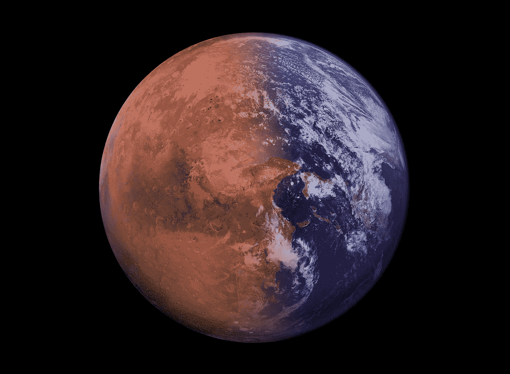

# 埃隆·马斯克:上帝之子

> 原文：<https://medium.datadriveninvestor.com/elon-musk-the-son-of-god-eeaaf7b79762?source=collection_archive---------14----------------------->

Source: [Max Pixel](https://www.maxpixel.net/Colonization-Space-Mars-Terraforming-Exploration-5268447)

## 是邪教还是必需品？

我们都听到了。埃隆·马斯克(Elon Musk)是一位梦想家、工程师、企业家、科学家、外星人、技术专家、特斯拉首席执行官、PayPal 创始人、SpaceX 首席执行官，是一个超级酷的坏蛋。但是有一件事人们不叫他，实际上，这正是他的名字——一个传教士。他喜欢鼓吹可持续发展、绿色技术、电池、自动驾驶仪、电动汽车、多行星物种、生活在模拟环境中。他谈到了殖民化和地球化火星，并提出了无人能及的目标。他几乎就像是《卑鄙的我》中的 Gru，他的追随者和投资者是他的跟班，他们听从命令，对他说的任何事情都非常兴奋。

我们把他的话当作圣人的话，从不质疑。他希望我们购买他公司的股票，我们很乐意这样做，因为我们相信他为我们展示的未来。人们渴望一个更高的目标，一个人类的愿景，而不是在公司工作中浪费生命，唯一的目标是明年更高的利润。弗洛伊德称之为超我。人们喜欢这些幻觉，因为这让他们更接近埃隆·马斯克发出的积极之光(字面上把埃隆想象成一个灯泡💡那不是发光而是发光的积极)。有些人甚至会对他的积极性上瘾，这是驱动和激励他们的东西，就像有些人滥用药物来激励自己一样。埃隆的这些说教听起来不像这个世界，就像他是神一样。也许他是，也许他有上帝的基因，让他向星星射击，因为从内心来说，他知道如何让伟大的事情发生。

如果你仔细想想，他是一个很酷的人，但做他并不容易。能够创造如此庞大的追随者，并对他的追随者负责。让自己凌驾于他人之上并保持理智并不容易。这是少数人拥有的非凡才能(唐纳德·特朗普等)。虽然他有很多优点，但凡事都有两面性。埃隆经常给人以自大狂的印象，让人们难以置信地努力工作，成为媒体关注的焦点，制造扭曲市场的非理性炒作。他的意图是自私的，还是为了所有人的利益而富有同情心的？他是想通过殖民另一个星球来拯救人类，还是自我和一个关于如何作为火星之神被永远记住的深思熟虑的计划？所有火星人的父亲。我们必须成为一个多行星物种吗，或者这只是另一个创造更重要的追随者并让他们为埃隆工作的口号？他是想拯救这个星球，转向可持续能源，因为这是必要的，还是符合他的战略，或者两者兼而有之？

如你所见，即使是“神”也不是完美的。他们也有不完美的地方和不好的品质。啊，生活，永远不会停止给我惊喜。