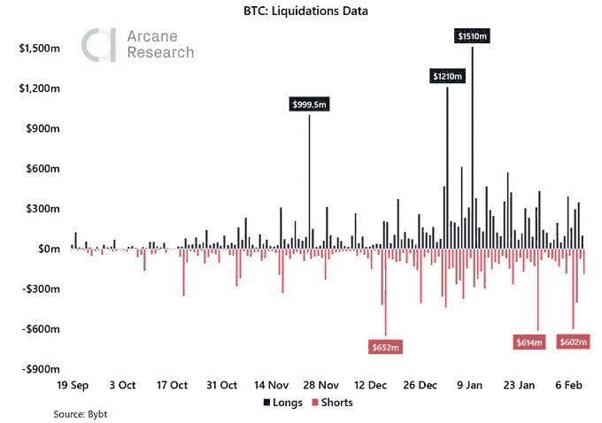

# 埃隆·马斯克引发了 12 亿美元的价格做空

> 原文：<https://medium.datadriveninvestor.com/elon-musk-triggered-a-1-2-billion-price-short-982352baf641?source=collection_archive---------1----------------------->

## 当比特币涨到 50，000 美元时，这位科技亿万富翁引发了一场短暂的挤压

Photo by [Dmitry Demidko](https://unsplash.com/@wildbook?utm_source=medium&utm_medium=referral) on [Unsplash](https://unsplash.com?utm_source=medium&utm_medium=referral)

电动汽车制造商特斯拉的首席执行官埃隆·马斯克最近几周投资了数千美元，其他机构投资推动比特币走高。

在特斯拉宣布购买价值 15 亿美元的比特币后，比特币价格飙升至 5 万美元，在过去 10 个月里上涨了约 350%。

加密市场进入狂喜状态，将以太坊和比特币都推至历史高点。

现在，该报告披露，埃隆·马斯克(Elon Musk)引发了价值 12 亿美元的比特币价格做空清算。

马斯克已经被律师警告，他的比特币推文可能会引起美国证券交易委员会的质疑。

Source: [Twitter/Bybt](https://pbs.twimg.com/media/Et85FcoWYAAqdBe?format=jpg&name=small)

最近，[***arcane research***](https://theweeklyupdate.substack.com/p/the-bull-market-intensifies)的分析师显示，***【6.02 亿美元的比特币*** 空头头寸在特斯拉宣布将比特币纳入其账簿后被冲高。

> 这包括上个月 6.12 亿美元的短暂挤压，由马斯克在将自己的推特简历改为“***#比特币*** ”并发推文:“ ***回想起来，在短短几分钟内将比特币*** 价格 ”提高 ***20%是不可避免的。***

投资者似乎对在现在的市场上承担重大风险非常兴奋。

自去年 12 月以来，无论是多头还是空头的清算都出现了可怕的上升，这是显而易见的。

然而，无论价格在短期内触及天空还是下跌，人们都在押注空头和多头。

## 昨天的比特币价值是历史上最大的美元收益，也是 3 年多来最大的%收益。

奥术分析师维特·伦德说。

> “我不认为我们今后会看到做空比特币的行为减少”

今天，加拿大银行的一名高级官员实际上已经将加密货币价格的当前飙升称为“投机狂热”。

谁说市场有一种氛围，一条高调的推文就足以引发价格突然飙升

比特币和加密货币集团 Panxora 的首席执行官加文·史密斯说，

> “投资者必须记住，比特币不是一个简单的致富计划”

事实上，当短期赢家的目标是交易他们的利润时，它很容易看到下降的价格波动。投资者应保持谨慎，专注于实施风险管理策略。

# 放弃

本文仅用于信息和教育目的。它无意成为任何投资意见或建议。

来源:[福布斯](https://www.forbes.com/sites/billybambrough/2021/02/12/as-bitcoin-soars-toward-50000-data-reveals-tesla-billionaire-elon-musk-triggered-a-12-billion-bitcoin-price-short-squeeze/?sh=50515148219e)