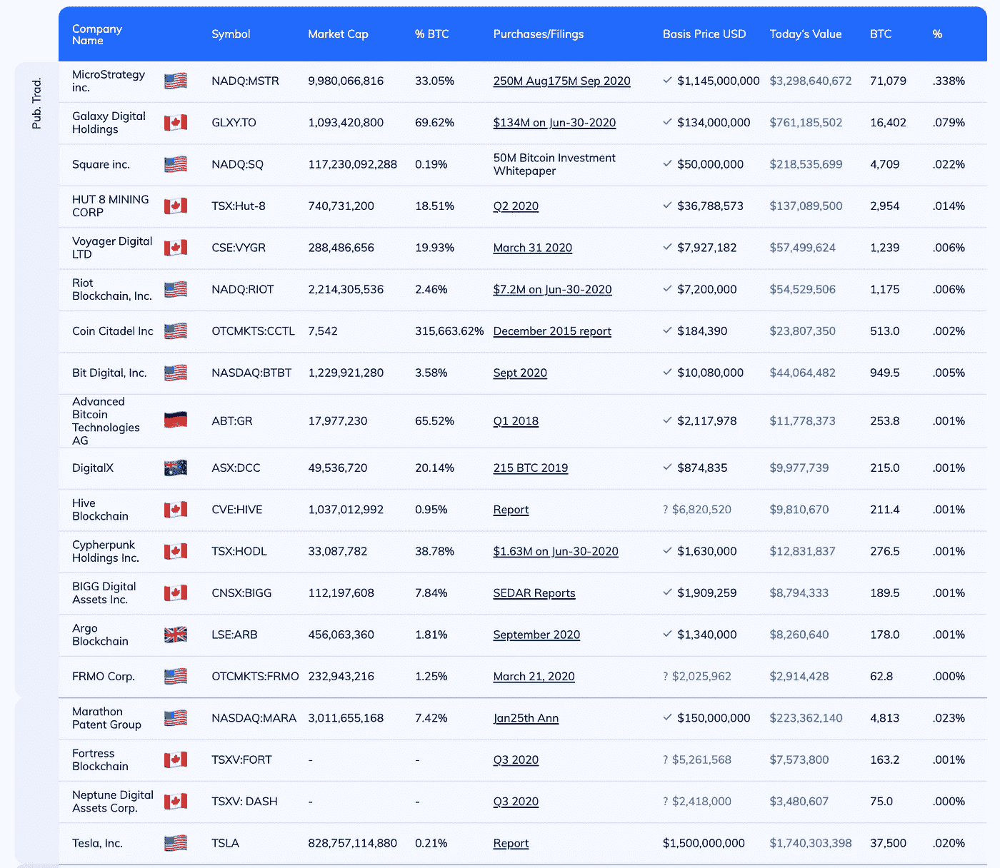
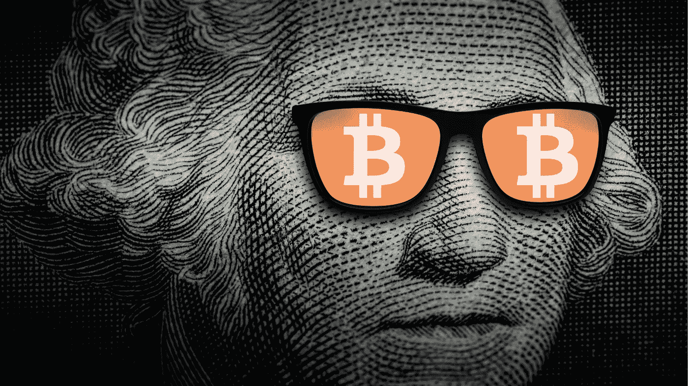

# 埃隆·马斯克写道，世界改变了。

> 原文：<https://medium.datadriveninvestor.com/elon-musk-writes-and-the-world-changes-da44e61acf80?source=collection_archive---------33----------------------->

## 回想起来，这是不可避免的。

[Elon Musk](https://www.flickr.com/photos/163370954@N08/46339127625/in/photolist-2dAQ9di-2iNbnc9-2hkBMFW-2j7MVJA-2j7MZZQ-2j7KrWH-2j7Kqbd-2j7Kmdt-2j7Pm5t-2hXJL4b-T258A3-e2rcqL-T258wL-T258uS-2iMX5RR-2hGnzKP-2eo4SmE-2iYA6Zo-EvkWTZ-bfGoJr-5AFqF6-28bWJrA-2kqaH6v-SSZdwE-Tqeub6-2exdQoF-bTGd7T-2cSJtM2-2iYCBHm-QSkG6T-215fZkv-9i9VqV-2iSagtv-e1YTFs-jMLzMb-G7x2vX-e1TfMB-e1YTGd-2hPyKDg-2523zRK-2i4z1NL-WEgTPd-4Pd5of-24Q2B1M-26apz17-Xpeez1-4Pd7RN-2iScTKh-2gAUWZy-K7Ce8A) by [Daniel Oberhaus](https://www.flickr.com/photos/163370954@N08/) is licensed under [CC BY 2.0](https://creativecommons.org/licenses/by/2.0/?ref=ccsearch&atype=rich)

埃隆·马斯克最喜欢的社交媒体平台是 Twitter，这并不是什么新鲜事。

他不止一次用这个星球上最富有的人之一的全能之手干预了宇宙的进程。

几年前，他[在推特上](https://twitter.com/elonmusk/status/1026872652290379776?s=20)说他考虑以 420 美元的价格将特斯拉私有化——那是 2018 年，从那以后，特斯拉一直在飙升。它在 2020 年 2 月的定价为 806 美元——在 2020 年夏天 5:1 的股票分割之后。

基本上，自从那条推特发布后，特斯拉的价值增加了 10 倍。

今年 1 月，马斯克又做了一次，他发布了信号，意外推高了[信号进展](https://qz.com/1956105/elon-musks-tweet-about-signal-boosts-shares-of-the-wrong-company/)的股价。当他发布 [GameStonk 的时候，真是太搞笑了！](https://twitter.com/elonmusk/status/1354174279894642703)并支持 Reddit Group[r/wall street bets](https://www.reddit.com/r/wallstreetbets/)的对冲基金狩猎。

在一月底之前，它在推荐任何东西方面变得有点低调。

1 月 29 日，这条简单的推特

> [回想起来，这是不可避免的](https://twitter.com/elonmusk/status/1355068728128516101?s=20)

在读完这篇文章后，我并没有期望会有太大的变化，因为在我看来，这只是埃隆·马斯克以其出名的那些普通文章中的一篇。

好吧，回想起来，在他同时发布的简历$BTC 中的暗示似乎相当明显。这是无法避免的。

# 美国证券交易委员会的文件揭示了这条推文背后的深层含义

2021 年 2 月 10 日，出于法律义务，特斯拉不得不披露 2020 年年报。

当我查看公司的现金状况时，我大吃一惊。

这家最有价值的汽车制造商在提交给美国证券交易委员会的年度报告中表示，它已经将总

> **15 亿美元投入比特币**

根据*新的投资政策*以及公司未来可能对其他数字资产的计划:

> 在 2021 年 1 月，我们更新了我们的投资政策，为我们提供了更多的灵活性，以进一步多元化和最大化我们的现金回报，这并不需要维持足够的运营流动性。作为该政策的一部分，经我们董事会审计委员会正式批准，我们可能会将一部分此类现金投资于某些替代储备资产，包括数字资产、金条、黄金交易所交易基金和未来指定的其他资产。此后，我们根据该政策向比特币投资了总计 15 亿美元，并可能不时或长期收购和持有数字资产。此外，我们预计将在不久的将来开始接受比特币作为我们产品的一种支付形式，但须遵守适用的法律，并且最初是在有限的基础上，我们可能会也可能不会在收到后清算。

在我看来，第一家上市的标准普尔 500 公司似乎正在用比特币分散其短期流动性。

Source: [Bitcoin Treasuries](https://bitcointreasuryreserve.com/)

经过简短的研究，我偶然发现了比特币金库这个网站，我非常惊讶。

比特币似乎已经成为财政部的企业标准。

特斯拉很可能是第一家购买比特币作为投资组合的标准普尔 500 公司。

2020 年底的一项研究引用了一项调查来回答到 2021 年底有多少标准普尔 500 公司将持有比特币的问题。

结论是，至少到 2020 年底，除了 Square 之外，它们的资产负债表上都没有比特币，而 Square 可能会在 2021 年被纳入标准普尔 500 指数。

# 2021 年的下一步是什么？比特币——新的企业标准？

特斯拉在 2020 年底有 190 亿美元的现金头寸，8%或 15 亿美元进入了比特币。

根据他们提交给 SEC 的文件，这是为了

> 分散并最大化我们的现金回报，这并不需要维持足够的运营流动性。

简单来说，这意味着**他们有一些额外的现金，他们认为这是一项不错的投资**。

为什么此举对特斯拉来说是一件好事，而年报的解释是股东可以借鉴的？

## 多样化

各国政府目前正在全球范围内印出无尽的钞票。股票市场从一个历史高点奔向下一个历史高点，而旧经济正悄然走向破产。

如今，如果出现股市崩盘和恶性通货膨胀的情况，公司能把钱投到哪里来维持流动性呢？事情发生在 1929 年历史上最大的股票[市场崩盘](https://en.wikipedia.org/wiki/Wall_Street_Crash_of_1929)期间。

上世纪 30 年代是这些最终以第二次世界大战结束的崩溃的结果。

但让我们面对现实吧，2021 年的世界与 1921 年不同，我们在最近两年没有像一战那样需要消化一场大规模的战争。到目前为止，人类似乎并没有走向一场战争。敲敲木头。

疫情基本上是一个无关紧要、令人讨厌的事件，但与一百年前西班牙流感的死亡人数相比，这算不了什么。

## 投资

特斯拉进军比特币的另一个可能场景是投资角度，它可以为股东创造出色的回报。特斯拉有一项很有前途的业务，很可能在未来几年蓬勃发展。

然而，估值在 2020 年飙升，问题是这种增长在未来是否可持续。

投资不需要的比特币现金的一个简单理由是，等待更可观的升值。

# 凯西·伍德的估计

但是比特币还是投资案例吗？以错误的方式验证一个投资论点的最简单的事情就是用过去的 4 年来推断未来的历史发展。

但是为了好玩，让我们来做吧:

2017 年初，比特币突破了每枚 1000 美元的定价音障。今天，2 月 11 日，比特币的价值为 48000 美元，是大约 4 年前的 48 倍。

预测未来——只要乘以 48，我们就会看到 2025 年 2 月一个比特币的价格——超过 200 万美元。澄清一下——这是个玩笑，不是投资建议。

可惜价格预测没那么容易，比特币还有提升空间吗？

凯西·伍德创建了标志性的基金管理公司方舟投资公司，随着她最近的成功，她有时被称为下一个沃伦·巴菲特。

她的基金已经发布了一份研究报告，其中他们分析了如果所有的标准普尔 500 指数公司都跟随埃隆马斯克的脚步，比特币的价格会产生什么样的影响。长话短说:

> 根据 Ark Investment Management (AIM)的一项研究结果，如果所有标准普尔 500 公司将 1%的现金持有量用于加密，比特币的价值可能会增加 4 万美元。类似地，如果所有这些公司将持有的现金的 10%转换成比特币，加密资产的价值可能会上升到 40 万美元。

Ark Invest 认为，在未来 5 到 10 年，由于这些因素，比特币价格可能会上涨 2 到 10 倍。

作为一名欧洲人，我知道一旦美国公司在 3-4 年后领先，欧洲公司只是简单地模仿这种行为。我还认为，聪明的中国投资者可能已经预料到了特斯拉的举动，也有可能进入 BTC。

# 聚会迟到了

Canva Pro Stock Image

特斯拉和 SpaceX 首席执行官埃隆·马斯克澄清说，如果有点“迟到”，他是比特币的支持者。

2021 年 2 月 1 日周一，马斯克[在受邀才能使用的音频聊天应用 Clubhouse 上说](https://www.youtube.com/watch?v=rJI5MH7KhcM&ab_channel=BrianPhobos)“我应该在八年前买下(比特币)……在这一点上，我确实认为比特币是个好东西。我是支持者。”

特斯拉首席执行官进一步表示，市值最高的加密货币[比特币](https://www.coindesk.com/price/bitcoin)是

> "即将被传统金融人士广泛接受."他补充说，他没有“对其他加密货币的强烈意见。”

回到历史的外推——上一次比特币价格像 2021 年那样出现抛物线是在 2018 年初，随之而来的是巨大的比特币崩盘，让后来者减少了损失。

比特币需要到 2020 年才能恢复，现在价格又是抛物线。

谈到价格预测，没人知道未来会发生什么。许多人都在谈论比特币是新的黄金标准。

它能像房地产和股票一样随着时间的推移而升值吗？

埃隆·马斯克(Elon Musk)将特斯拉 8%的现金头寸转移到比特币，这是 2017 年没有发生的事情。

让我们看看未来几个月会发生什么，其他标准普尔 500 公司是否会效仿特斯拉的做法。

我自己？

我不认为增加一点比特币会对我的投资组合造成任何伤害。

**更多关于理财素养的故事:** [**点击此处**](https://christian-soschner.medium.com/17-great-stories-on-financial-literacy-4c7cbe5dbb10)

自 1999 年以来，我是各行各业公司的执行官、顾问和教练。我专攻企业发展和金融，从种子轮到 IPO 级别，从 2006 年开始专注于生命科学。

[**加入我的邮件列表保持联系！**](https://mailchi.mp/5a50875fb5ea/newsletter)

*本文仅供参考。不应将其视为财务或法律建议。在做出任何重大财务决定之前，请咨询财务专家。*

# 读者:

[https://www . Reddit . com/r/de/comments/lge tam/wie _ ich _ heute _ die _ international e _ presse _ getrollt/](https://www.reddit.com/r/de/comments/lgetam/wie_ich_heute_die_internationale_presse_getrollt/)

 [## “这是好事”:埃隆·马斯克说他是比特币 CoinDesk 的支持者

### 特斯拉和 SpaceX 首席执行官埃隆·马斯克(Elon Musk)澄清说，他是比特币的支持者，尽管有点“迟到”。谈论…

www.coindesk.com](https://www.coindesk.com/a-good-thing-elon-musk-says-hes-a-supporter-of-bitcoin)  [## 方舟投资公司的研究表明，如果所有标准普尔 500 公司都配置 1%的股票，BTC 价值将上涨 4 万美元

### 根据方舟投资管理公司(AIM)的一项研究结果，比特币的价值可能会增加…

news.bitcoin.com](https://news.bitcoin.com/ark-investment-study-suggests-btc-value-will-rise-by-40000-if-all-sp-500-companies-allocate-1-of-their-cash-to-bitcoin/)  [## 大多数 Block 的前景调查显示，到 2021 年底，标准普尔 500 公司将持有比特币…

### 今年 9 月，标准普尔 500 指数和比特币的相关性接近历史高点。现在，投资者相信…

www.theblockcrypto.com](https://www.theblockcrypto.com/linked/89323/sp-500-companies-will-hold-bitcoin-by-end-of-2021-says-majority-of-the-blocks-outlook-survey-respondents)  [## 1929 年华尔街股灾

### 1929 年的华尔街股灾，也被称为大崩盘，是发生在…

en.wikipedia.org](https://en.wikipedia.org/wiki/Wall_Street_Crash_of_1929) 

[https://www . investopedia . com/articles/forex/121815/bitcoins-price-history . ASP #:~:text = Continued % 20 institutional % 20 interest % 20 in % 20 the，sure % 20% 2440% 2c 000% 20 in % 20 January % 202021](https://www.investopedia.com/articles/forex/121815/bitcoins-price-history.asp#:~:text=Continued%20institutional%20interest%20in%20the,surpass%20%2440%2C000%20in%20January%202021)。