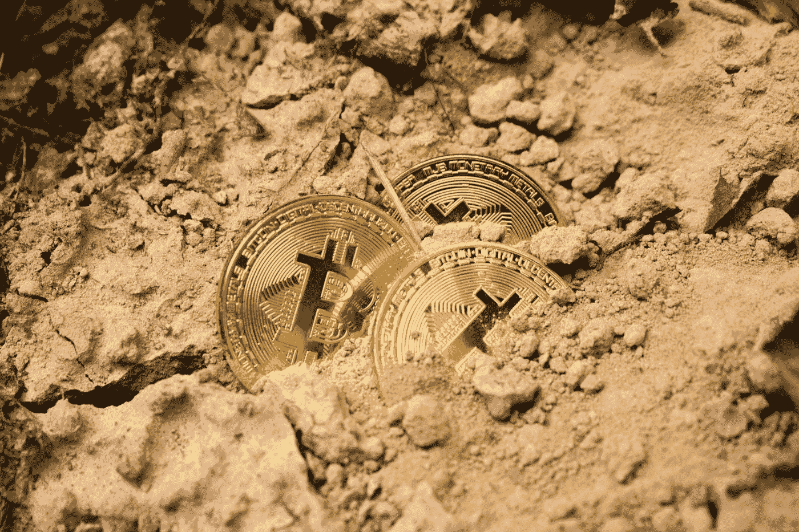
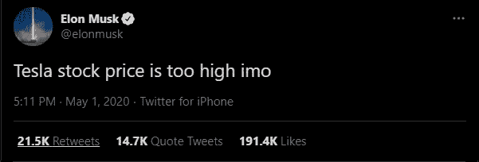
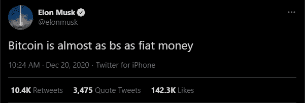
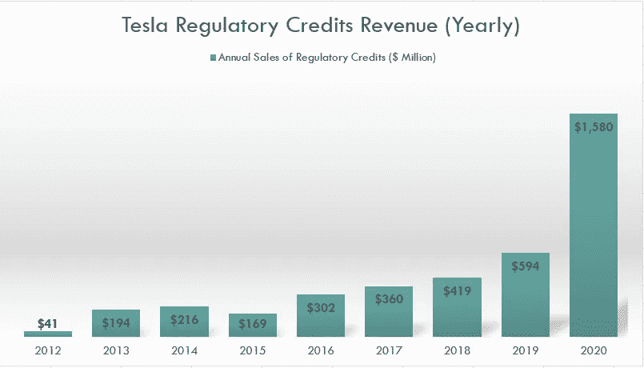
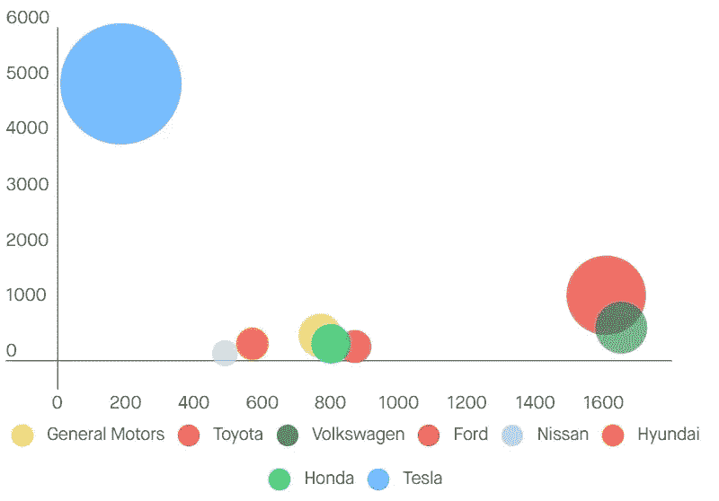
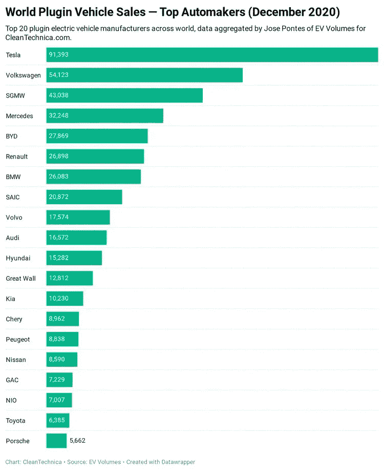

# 埃隆·马斯克的比特币狂潮将特斯拉推向欺诈领域

> 原文：<https://medium.datadriveninvestor.com/elon-musks-bitcoin-binge-moves-tesla-toward-fraud-territory-9b70bceb1a3c?source=collection_archive---------0----------------------->

## 加密货币和(不)道德企业管理

## 从欺骗投资者到顾客和气候，马斯克试图愚弄所有人

Photo by [Dmitry Demidko](https://unsplash.com/@wildbook?utm_source=medium&utm_medium=referral) on [Unsplash](https://unsplash.com?utm_source=medium&utm_medium=referral)

操纵特斯拉股价。试图操纵加密货币市场。向客户销售政府补贴的气候和 ESG 蛇油。

埃隆·马斯克势如破竹。

这位特斯拉创始人兼首席执行官最近超过杰夫·贝索斯，成为(估计)世界上净资产最高的个人。

他在社交媒体上拥有大量追随者，在一部分公众中非常受欢迎，他们欣赏他在迷因和行为方面的努力，这对于一位杰出的首席执行官来说是不寻常的。

> 马斯克的工作、声望和声望带来了巨大的责任。他似乎不在乎

虽然表面上看起来一切都像是天真的玩笑——从他连续的 Dogecoin 评估到他在推特上发布他对特斯拉股价的未经过滤的想法——马斯克的行为是值得质疑的。

特斯拉的比特币购买尤其如此。它们与马斯克多年来试图围绕特斯拉打造的 ESG 精神相矛盾。

一家本应快速增长、需要流动性来扩大生产规模和占领市场份额的公司，决定将资金储存在一种投机性资产中，这是一个巨大的危险信号。

此外，马斯克的工作、声望和声望带来了巨大的责任。法律上和道德上的。

他似乎不在乎。但特斯拉投资者、金融监管者和客户会容忍马斯克的游戏多久？

将公司资金挥霍在比特币上是一个奇怪的举动。埃隆·马斯克(Elon Musk)在信息披露后为加密多头造势，尽管他此前对比特币的态度含糊不清，但这是可疑的。

## 马斯克操纵市场的努力

埃隆·马斯克已经数次成为金融监管机构的焦点。

通常是因为他在 Twitter 上的活动，在那里[爆发](https://twitter.com/elonmusk/status/1256239815256797184)如“在我看来，特斯拉股价太高了”导致特斯拉股票价格下跌超过 10 %,同时引起了 SEC 的兴趣。

Screenshot by the author on February 10, 2021\. Source: Twitter

另一个例子是声称正在考虑以每股 420 美元(拆分前)的价格将公司私有化。

> 诋毁一项资产，购买它，然后大肆宣传，这是马斯克的经典之作

怀疑论者在关键时刻故意操纵股价。其他人对此不屑一顾，认为这是一个不习惯上市公司高管规范的人的愚蠢行为。

特斯拉的支持者和其他妄想者甚至为他欢呼，因为他发出了不在乎华尔街想法的信号，而是假装成一个普通人。

围绕特斯拉购买比特币的行动过程同样应该受到审查。诋毁一项资产，购买它，然后大肆宣传，这是马斯克的经典之作。

去年 12 月，他在推特上猛烈抨击比特币。一个月来形势如何变化。

Screenshot by the author on February 10, 2021\. Source: Twitter

马斯克推文迷因和俏皮话鼓励购买或出售金融资产的例子不胜枚举。

炒作基于迷因的加密货币 Dogecoin 以及 GameStop 和 AMC Entertainment 等所谓的迷因股票，同时在幕后购买比特币，这只是少数。

他帮助给 GameStop 火上浇油，让普通美国人跳上股票。这些人中的许多人被留在[拿着袋子](https://medium.com/datadriveninvestor/the-gamestop-craze-will-screw-retail-investors-fea762111434)，被他们认为要反击的资金玩弄于股掌之间。

所有这一切都是因为马斯克希望一只对冲基金遭受损失。GameStop 的主要空头之一 Melvin Capital 一直不看好特斯拉。

 [## GameStop 热潮会让散户投资者抓狂

### 随着次级 Reddit WallStreetBets 接受激进卖空者，一些对冲基金无论结果如何都在获利

medium.com](https://medium.com/datadriveninvestor/the-gamestop-craze-will-screw-retail-investors-fea762111434) 

## 特斯拉的肮脏(不那么秘密的)秘密

特斯拉从几个来源获得收入。他们的主要业务是制造和销售汽车，但他们也从事太阳能和储能。

对公司财务状况的一瞥表明，他们的大部分收入来自汽车销售。虽然这是事实，但这是一种简化。

汽车销售收入包括监管信用额度，通常称为碳信用额度或排放信用额度。

在美国的一些州，尤其是加利福尼亚州，法律要求车辆达到二氧化碳排放标准。当制造商生产汽车时，他们获得排放信用。如果他们的汽车排放超过限制，他们可以从有盈余的生产商那里购买信用额度。

通过生产行驶时不直接排放二氧化碳的汽车，特斯拉有大量的信用可以推向市场。

排放信用销售在特斯拉的收入中并不占很大份额，但他们的营业利润完全由其构成。除去它，特斯拉勉强收支平衡。

如下图所示，从 2012 年到 2020 年，销售积分的收入以年均 85%的惊人速度增长。

Source: stockdividendscreener.com

看好特斯拉的人寄希望于碳信用交易利润的增长能够继续。但随着竞争对手转向电动汽车市场，他们对信贷的需求将会下降。

特斯拉将自己标榜为对环境负责的公司的帆船。但他们真的是吗？

> 特斯拉的生活依赖于出售信用额度

他们的低利润汽车在有大量补贴(每辆车超过 10，000 美元)支持的市场上竞争。然而，电动汽车的普及对排放的影响很小。

首先，在出售信用额度时，特斯拉为燃烧驱动的汽车提供了更大的平均排放量。又有什么用呢？零排放汽车降低了平均排放量？

再想想。事实证明，超过 90%拥有电动汽车的美国人也拥有内燃机汽车。受补贴的电动汽车推高了汽车总量。

更进一步说，电动汽车电池的生产是一个污染过程。因此，电动汽车减少了污染，而且要成为比化石燃料汽车更环保的选择，就需要用后者的行驶里程来替代前者。

计算通常会考虑汽车使用寿命期间的排放量，以表明电动汽车是更环保的选择。但是，修正较短的寿命以及碳信用交易和消费行为的间接影响，会让情况变得不那么明朗。

底线是特斯拉的生活依赖于出售信用额度，只要他们出售信用额度，他们就不像宣传的那样环保。这种优先顺序是公平的，但马斯克仍然以 ESG 先驱的身份出现，这很具有挑衅性。

> …这是关于销售一个“绿色梦想”来赚钱

马斯克决定在特斯拉的资产负债表上加载比特币，这是特斯拉不打算减少碳足迹的又一个迹象。

比特币与相对较高的排放量有关。用比特币做一笔交易比做一笔老派的银行转账要耗费更多的精力。

根据 Digiconomist 的数据，拥有 15 亿美元的资产，每年排放 3700 万吨二氧化碳，这是在不久的将来寻求低排放的努力中失败的迹象。

或者可能是关于销售一个“绿色梦想”来赚钱。

特斯拉的购买和马斯克对比特币的公开支持和炒作可能有助于加密货币的价格升值。反过来，这又增加了花费大量精力开采剩余比特币的动机。

这大部分是在中国完成的(根据剑桥研究人员的数据，占全球哈希的 65%)，因为那里的能源成本很低。在越来越多的煤电的推动下，大规模比特币开采最引人注目的地区是新疆——该地区也因拥有维吾尔族营地而闻名。

新疆也有大量的水力发电和风力发电，但只占不到四分之一的能源产出。

但比特币是肮脏的，很难看出马斯克想要在这里实现什么。这可能是改善特斯拉财务状况的孤注一掷的尝试。但有了投资者粉丝的忠实追随者，他本可以选择通过出售股票来筹集资金。

目前，他以蛇油推销员的身份出现。他的动机不明，他的行为与其宣称的使命相矛盾。

## 特斯拉的护城河看起来像一条小溪

马斯克或许应该将重心转向特斯拉的核心业务——销售电动汽车。

是需要的。

特斯拉的估值飙升，不仅超过了所有其他汽车制造商——以及大多数大型汽车制造商的总和——还超过了阿里巴巴和脸书等科技巨头。尽管后者的每股收益是前者的 20 倍以上，增长前景如果不是更好，也与之相当。

在这里，特斯拉股价是否存在泡沫并不重要。它本身就值得整个讨论，而且不一定那么容易确定。

但即使是最乐观的特斯拉投资者也知道估值过高。这意味着特斯拉必须不断创新，提供更好的业绩，以证明股价的合理性。

> 特斯拉正在流失市场份额

下图根据市值(球的大小和在 y 轴上的位置)和收入(在 x 轴上的位置)绘制了特斯拉和几个大型汽车制造商。

特斯拉的股价目前远高于计划制定时的股价，这让情况变得更加扭曲。

Revenue DKK billion (x-axis) and market cap DKK billion (y-axis) of car manufacturers. Source: Euroinvestor, December 1, 2020

尽管妄想狂称特斯拉“不仅仅是一家汽车制造商”，但他们的主要产品是汽车，并将继续是汽车。甚至上面讨论的排放信用的销售也与他们的汽车销售联系在一起。

多年来，特斯拉在电动汽车市场一直处于领先地位。马斯克对该领域创新的眼光让特斯拉处于非常有利的位置。

他实现愿景的决心在很多方面都值得称赞。但与竞争对手的距离正在缩小。

就目前而言，特斯拉仍在销售相对较多的电动汽车。但是大型欧洲汽车制造商正在扩大生产。大众汽车正在快速缩小差距。

Source: EV Volumes / CleanTechnica.com

此外，新的电动汽车合资企业正在快速增长，尤其是在中国。特斯拉最多有一个狭窄的经济护城河(这个术语描述的是让竞争对手难以且代价高昂地占领市场份额的机制)。

首先，特斯拉的汽车[不是很高](https://ca.finance.yahoo.com/news/chinese-regulators-call-tesla-over-122624243.html)[质量的](https://www.drive.com.au/news/tesla-claims-recalled-touchscreens-only-expected-to-last-5-6-years--125093.html)。第二，汽车制造是一个低利润的行业。

竞争对手拥有庞大的 R&D 预算，随着全球采用电动汽车，排放信用市场将会萎缩。

特斯拉正在失去市场份额，他们最近的收益报告是一个巨大的失误。每股收益比预期低 25%。他们的主要收入来源正在恶化。

挑战正在排队，以相当于特斯拉整个 R&D 预算的金额购买比特币并不能解决任何一个挑战。

> 特斯拉似乎是一个比 GameStop 更好的做空机会

投资者和旁观者可以合理地质疑马斯克是否真的关心经营一家盈利的企业，或者他只是想探索他的自动驾驶、太空旅行和货币革命的想法。

在这一点上，马斯克的行动似乎旨在取悦他的自我，并测试他可以逃脱的界限。而不是努力为股东创造一个更好的世界(他自称是这个世界的先驱)或者至少是一家更好的公司。

时间会证明特斯拉能否利用其财务优势地位，成为市场领导者。

或者，当世界意识到该公司在汽车行业没有发挥作用时，它的追随者是否会背黑锅。

一切都指向后者。特斯拉似乎是一个比 GameStop 更好的做空机会，尽管更难把握时机。无论如何，投资者肯定会乐在其中。

与此同时，埃隆·马斯克应该去看看威廉姆斯·杜兰特。

 [## 比特币不是钱

### 虽然散户投资者认同比特币的故事，但重要的是要记住它是一种投机资产，应该…

medium.com](https://medium.com/datadriveninvestor/bitcoin-isnt-money-fe5f7a3536bb)  [## 罗宾汉将“你的”股票借给卖空者(并保留所有收益)

### 零佣金交易平台如何在幕后赚钱

medium.com](https://medium.com/datadriveninvestor/robinhood-lends-your-shares-to-short-sellers-and-keeps-all-the-proceeds-78353ca33fb9)