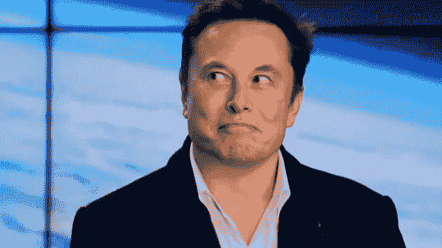

# 埃隆·马斯克的个人崇拜掩盖了一些残酷的事实

> 原文：<https://medium.datadriveninvestor.com/elon-musks-cult-of-personality-obscures-some-harsh-truths-95fb58b394de?source=collection_archive---------2----------------------->

Photo from *Mike Blake | Reuters on* [*cnbc.com.*](https://www.cnbc.com/2020/05/13/elon-musk-has-a-complex-relationship-with-the-ai-community.html)

凭借他名下的超高科技和科幻类型公司网络，埃隆·马斯克是一股不可忽视的力量。更重要的是，他在世界各地有数以百万计的忠实粉丝为他唱赞歌。

围绕马斯克的个人崇拜经常与他的目标和成就的现实相冲突。

## 埃隆马斯克的炒作，解释道。

埃隆·马斯克是现实生活中的钢铁侠。他是一个发明家，一个有远见的人，一个有魅力的公众人物。

你知道还有哪个亿万富翁会发布有趣的迷因吗？

他似乎理解并能够参与“互联网文化”，这对于他这个年龄的公众人物来说是相对罕见的。

由于他令人印象深刻的成就和幽默感，他在世界各地赢得了许多粉丝。

他的崇高目标是创建一支 robotaxi 舰队，洛杉矶市下的超级环路，以及在未来几年内殖民火星的计划，这些听起来都像是电影情节。

这些目标听起来都像是直接从科幻电影中撕下来的。他的计划需要清除的后勤和科学障碍是巨大的。你不得不承认他尝试了如此艰难的挑战。

 [## 未来科技:Neuralink 更新|数据驱动的投资者

### 8 月 28 日，埃隆·马斯克提供了他的公司 Neuralink 的最新进展，该公司旨在创造植入式…

www.datadriveninvestor.com](https://www.datadriveninvestor.com/2020/09/03/futuristic-tech-neuralink-update/) 

## 炒作反馈循环

对马斯克及其个性的兴趣是特斯拉最重要的营销资产。

他能为自己的产品和想法制造的宣传令人印象深刻。尽管在营销上花费很少甚至为零，特斯拉是世界上最受炒作的电动汽车公司，尽管与老牌汽车制造商相比微不足道。

正是这种炒作推动了特斯拉股价今年令人眩晕的上涨。该股自 3 月份低点以来大幅上涨了 469%。这次跑步让马斯克成为世界上最富有的人之一，短暂超过了沃伦巴菲特和伯纳德·阿诺特。

特斯拉的上涨似乎大多与积极的收益结果或任何重大发展无关。特斯拉确实报告了第四季度的利润，但其收入增长了约 16%，远不及其股价的上涨。

> 特斯拉实际上已经成为一只迷因股票。

人们往里面投钱，说“股票总是上涨”，并近乎幽默地对 Instagram 上的[reddit.com/wallstreetbets](https://www.reddit.com/r/wallstreetbets/)和 [@litquidity](https://www.instagram.com/litquidity/?hl=en) 等地最近的罗宾汉交易员互联网文化点头。

看一家公司基本面的人对上涨感到困惑。该公司的市盈率是 1000 倍。其市值几乎盖过了全球所有汽车行业，不包括其最接近的竞争对手丰田。

而且这还是在一个小市场中占有相对适中的份额。诚然，这是一个正在成长并将在未来成长的时代。然而，为了让特斯拉的价格开始有意义，他们需要占领整个汽车行业的大部分市场份额。不仅仅是电动汽车市场，大众、丰田、通用和福特都紧随其后。当马斯克成为 meme lord 时，这些公司不会翻身，让他们的业务蒸发。

现在的价格很大程度上是对未来收益的假设。该公司未来的收益取决于马斯克承诺的几件事。看看这些承诺兑现的记录，特斯拉的价格是不合理的，应该调整到两位数的水平。

# 失信:时间表

马斯克多年来一直声称:

## Telsa 汽车将会自动驾驶。

 [## 特斯拉预计明年展示自动驾驶越野旅行

### 特斯拉汽车公司(Tesla Motors Inc .)正在为无人驾驶汽车的未来做准备，已经开始为所有新车配备…

t.co](https://t.co/YTxMUT3hWq?amp=1) 

马斯克多年来一直声称，特斯拉汽车明年将实现“自动驾驶”。他至少已经说了五年了，他们仍然没有办法实现自动驾驶。

要让一辆汽车能够被编程，在没有帮助的情况下从美国的一端行驶到另一端，所需的监管和安全障碍是巨大的。我们可能需要 10 到 15 年才能实现这一点。全国范围内实现这一目标所需的基础设施远未建成。要实现这一点，需要覆盖全国各个角落的 5G 网络。

特斯拉汽车的自动化水平并不独特。在市场上的许多车辆中都有驾驶员辅助系统的元件。特斯拉并不是这一领域的开拓者，在这一点上比其他任何人都好得多。

## 特斯拉预计生产(插入图)

我喜欢马斯克对他的公司可以实现的目标的乐观态度。但他很少实现。

2019 年，特斯拉管理了 365，300 辆汽车，比他在推特上所说的少 27%。有趣的是，与观察公司的成就相比，有多少人根据马斯克的 Twitter 账户帖子进行投资。

## 机器人出租车网络

robotaxi 网络似乎是特斯拉多头的一大乐观点。这种想法很诱人。一个自动驾驶的出租车系统，载着人们到处跑，有效地粉碎了世界各地的出租车行业，特斯拉从每一次旅程中抽取利润，这将是一笔伟大的生意。

我承认，如果他真的成功了，这对公司来说将是一笔可观的收入。由于汽车已经售出，大多数汽车制造商除了在特许经销商处修理和购买零件之外，没有其他方法从汽车中获得收入。拥有这个选项将会改变游戏规则。

但同样，这取决于他五年来一直承诺的事情。我们仍然远远没有实现这个目标。

作为一名投资者，我绝不会买那些 15 年后可能会发生***T3 的股票。***

## *离别的思绪*

*胡萝卜摆在眼前，股价上涨，胡萝卜离你越来越远。*

*然而，人类的批判性思维能力比追逐胡萝卜的驴子更强。*

*那么，人们还需要多久才能意识到，在马斯克设定的时间框架内，这些事情是不可能的？*

*只有时间能证明一切。*

***访问专家视图—** [**订阅 DDI 英特尔**](https://datadriveninvestor.com/ddi-intel)*