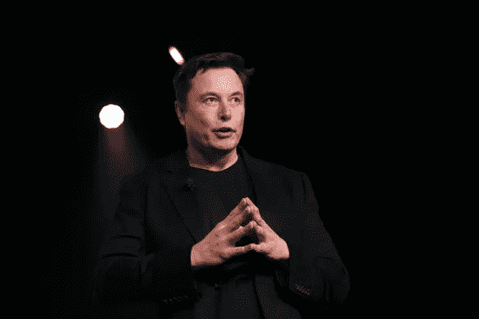
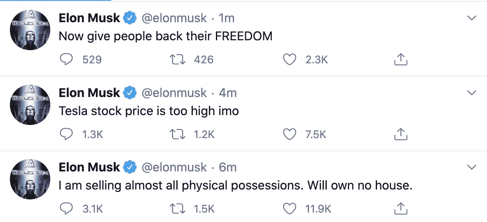
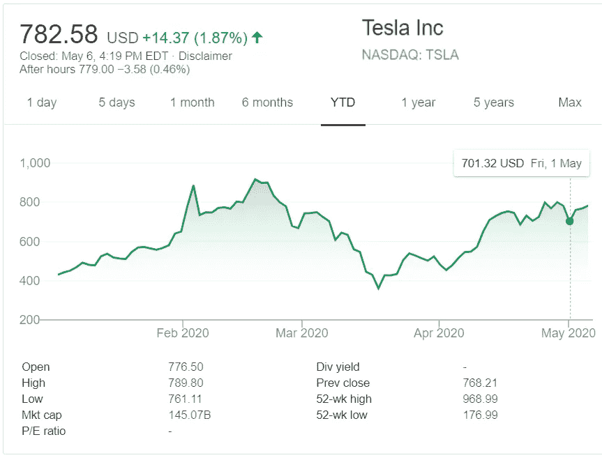
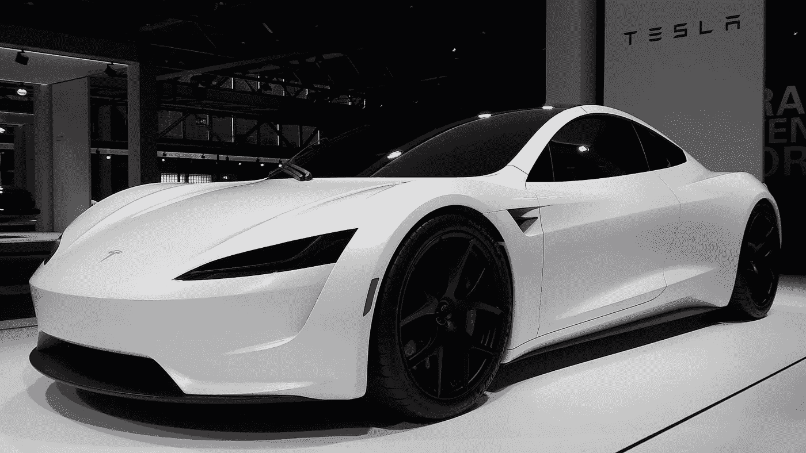

# 埃隆·马斯克数十亿美元的错误

> 原文：<https://medium.datadriveninvestor.com/elon-musks-multi-billion-dollar-mistake-the-begining-of-his-downfall-86c1acf75e2c?source=collection_archive---------7----------------------->

## 该不该投资特斯拉？

Photo Credits: Getty Images

至少可以说，esla 古怪的 CEO 最近在 twitter 上太活跃了。他设法在推特上发布了一些如此有争议的事情，以至于他的公司价值**损失了 140 亿美元**；这可能只是开始。由于对新冠肺炎·疫情的行为，埃隆·马斯克最近受到了生动的批评。在这场全球紧急事件的最初几天，他表示，围绕病毒的恐慌是愚蠢的。即使在报道的病例数量变得惊人之后，特别是在美国，他仍然坚持他对这个问题的最初看法。他甚至将封锁描述为法西斯主义的**行为和对自由人权的侵犯。他继续称赞德克萨斯州是第一个重新开放的州，并要求政府“还给人民自由”。**

埃隆无疑是有抱负的科学家、工程师、投资者和企业家的榜样。他的职业道德令人钦佩，他为人类取得了许多胜利，尤其是在交通运输和太空探索领域。

他强烈反应背后的真正原因尚不清楚。许多人声称，由于疫情引发的股市危机，他损失了数百万美元，因此需要他的员工尽快返回。如果是这样的话，他的键盘抗议对他来说并不奏效。他不仅失去了尊重和影响力，还失去了三十亿美元的个人净资产。

Screenshot from Elon Musk’s official twitter account

我们需要考虑到，这并不是埃隆第一次在 twitter 上发疯。尽管他的地位和声望，他经常在推特上发布迷因、系列参考和歌词。他还出现在广受欢迎的科幻漫画《瑞克和莫蒂》中，这部剧因其宇宙悲观主义而臭名昭著——就像埃隆本人一样。他的其他客串作品包括漫威的《钢铁侠》和《生活大爆炸》。可以肯定地说，他已经成为现代网络文化不可分割的一部分。

引起全球股民极端反应的推文，是他陈述特斯拉股价在他看来过高的那条；或者，我应该说，iho。由于这一声明，许多投资者抱怨在股票上损失了一大笔钱。特斯拉的声誉不仅受到投资者的质疑，也受到顾客的质疑。股价大幅下跌，尽管几个月前曾达到顶峰。这种情况是独一无二的，因为越来越多的人想知道是该卖出还是买入，或者两者都不是。

我相信公司股票的历史会很有用。去年 6 月，特斯拉的股价为 200 美元。10 月，当第三季度利润公布时，股价暴涨。在这家电动汽车制造商公布出人意料的令人满意的业绩并加速发布 Model Y 跨界 SUV 后，价格持续攀升。3 月下旬出现了大幅下降，这是一家公司在达到历史高点后的预期。

随着新冠肺炎病毒的蔓延，特斯拉暂停了其纽约光伏太阳能发电厂的生产。特斯拉，就像每一个汽车制造商一样，继续在前所未有的新冠肺炎销售环境中航行，迫使他们做出艰难的决定。然而，股价设法回升到 850 美元，直到在这条有问题的推文之后经历了突然下跌。

那么你应该怎么做呢？

Tesla’s stock price during 2020

一方面，公司首席执行官的不负责任加上持续的市场危机，使得出售似乎是一条出路。尤其是考虑到在这条推特发布后，**的股价下跌了 155 美元。此外，埃隆在对他的追随者的在线回复以及无数次采访中表现出的傲慢，在这里是雪上加霜。他对股东失去毕生积蓄没有表现出同情，同时仍然选择忽视封锁的必要性。**

另一方面，**股市不是让情绪引导你的地方。**谈到你的个人投资组合，你需要考虑你的特斯拉投资的总时间表。如果你是一个长期投资者，你最有可能还在果岭上。如果你在股价达到历史高点时买入，不要把亏损完全归咎于埃隆。趁高买入一般不是最明智的举措；尤其是在空前高涨的时候。这家高科技汽车制造商设法成为少数几家没有破产的美国汽车公司之一，更不用说获得巨额利润了。特斯拉似乎会留在这里。

全世界的汽车爱好者都对即将到来的电动汽车非常兴奋。在 cybertruck 取得巨大成功后，尽管其设计备受争议，该公司仍宣布推出其首款超级跑车。改进后的特斯拉跑车预计将成为第一款在 2 秒内完成 0-60 的量产车，这比布加迪威龙的加速更好，价格不到 7%。更具体地说，一辆布加迪威龙的价格高达 300 万美元，而一辆特斯拉跑车的价格预计在 20 万美元左右。

Tesla Roadster is set to release this year

围绕特斯拉的宣传正在持续增长，因为 16，000 个车载充电器已经在全球范围内分发，还有 8，000 个即将分发。对电动汽车性能的怀疑开始消退，因为拥有一辆电动汽车的危险被最小化，甚至消失了。这使得特斯拉处于极其有利的地位。这似乎使它成为一个巨大的投资机会。

就像每一项投资一样，都有风险。就特斯拉而言，它是否超过了好处？在我看来，事实并非如此。特斯拉的创新目前在车坛无人能及，在业界的影响力可见一斑。我没有看到特斯拉进一步下跌。甚至在 CEO 本人声称就股价而言被高估之后。推文造成的损害正在迅速恢复。我不认为在这种情况下出售是最好的选择。

我曾经是非常崇拜埃隆·马斯克的人之一。作为一名工科学生，我很佩服他的技术突破。作为一个投资人，我很佩服他的创业技巧。因此，我对他的网上妄想症感到措手不及是有道理的。如果我要用一句话来总结这种情况教会我的东西，那就是下面这句话。

> 崇拜品质，而不是人类。