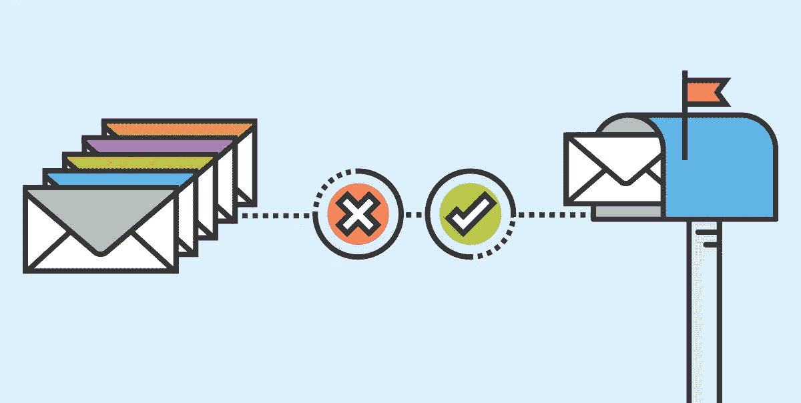
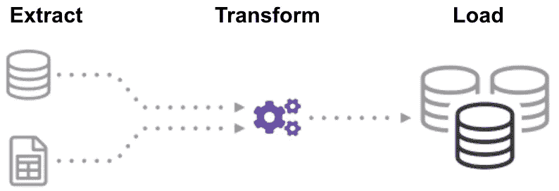
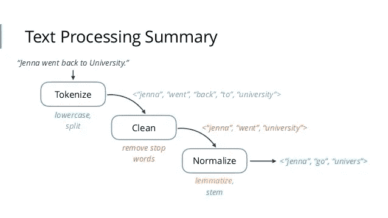
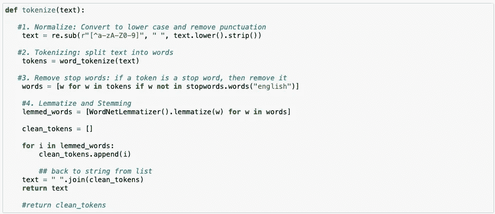

# 使用自然语言处理(NLP)的电子邮件分类

> 原文：<https://medium.datadriveninvestor.com/email-classification-using-natural-language-processing-nlp-ee3573bc79f7?source=collection_archive---------1----------------------->

## Udacity 数据科学家计划

NLP 是人工智能的一个子领域，允许机器操纵人类自然语言。自然语言处理已经在许多领域得到了应用。在这篇博客中，我们将使用自然语言处理技术对一封邮件进行分类，看它是不是垃圾邮件。但是首先，让我们从定义我们将在这个博客中尝试解决的问题开始。

# 问题陈述

我们大多数人都应该熟悉垃圾邮件。Cisco 将其定义为大量发送给任意收件人列表的不受欢迎的垃圾邮件。通常，垃圾邮件是出于商业目的发送的。它可以通过僵尸网络，即被感染的计算机网络大量发送。因此，垃圾邮件过滤是 Outlook 和 Gmail 等电子邮件服务的基本功能。服务提供商广泛使用机器学习技术来成功地过滤和分类它们。

# 资料组

我们正在使用的数据集是一个公共文本数据，它包含两列，包括文本(电子邮件)和垃圾邮件(标签)。垃圾邮件列有两个值(0 和 1)，如果是垃圾邮件，文本标记为 1，否则标记为 0。

可以从 [Kaggle](https://www.kaggle.com/bagavathypriya/email-spam-dataset) 下载。

# ETL 管道

在计算中，管道也称为数据管道，是一组串联的数据处理元件，其中一个元件的输出是下一个元件的输入。流水线的元素通常以并行或时间分片的方式执行[ [1](https://en.wikipedia.org/wiki/Pipeline_(computing)) ]。

**ETL(提取、转换和加载)管道**指的是允许我们为机器学习模型准备数据的一系列步骤。**提取**是从数据源下载/收集数据的过程(在我们的例子中是我们 Kaggle)。**转换**数据允许我们清理和处理数据，而**加载**数据是我们将数据保存/存储到数据库或文件中以供进一步分析或将其用作构建机器学习模型的输入的步骤。

# **机器学习管道**

在这一步中，我们将构建一个 NLP 管道，包括:

**1。文本处理**

这一步是从 [Udacity 数据科学家计划](https://www.udacity.com/course/data-scientist-nanodegree--nd025?utm_source=gsem_brand&utm_medium=ads_r&utm_campaign=8826748925_c&utm_term=87779570854&utm_keyword=udacity%20data%20scientist%20nanodegree_e&gclid=CjwKCAiAxp-ABhALEiwAXm6IyUjsoLsoRiorchoiRVa8Cu1Y7yUpNBbPoHxmbqkh3WJ79_Q1yShzDBoCc_YQAvD_BwE)中学到的

Text Processing Summary [[2](https://www.udacity.com)]

## 标记化

给定一个纯文本，我们首先将它规格化，转换成小写，去掉标点符号，最后将它拆分成单词，这些单词称为分词器。

## 干净的

删除停用词以减少词汇量。

## 使标准化

为了进一步简化我们的文本数据，我们可以在这一步中对其进行词汇化或词干化。**词汇化和词干化**通常是指通过使用词汇和单词的形态分析来正确地做事情，通常旨在只删除屈折词尾，并返回单词的基本形式或词典形式，这被称为词汇[ [3](https://nlp.stanford.edu/IR-book/html/htmledition/stemming-and-lemmatization-1.html)

**2。SKLearn 管道**

**管道**的目的是在设置不同参数[ [4](https://scikit-learn.org/stable/modules/generated/sklearn.pipeline.Pipeline.html) ]时，将几个可以交叉验证的步骤组合在一起。

sklearn 管道的组成部分如下:

1.  在 **CountVectorizer ()** 中，我们传递我们的 tokenize 函数来提供词汇表，并使用该词汇表对新文档进行编码
2.  **TfidfTransformer()** 将计数矩阵转换为标准化的 tf 或 tf-idf 表示。Tf 表示术语频率，而 tf-idf 表示术语频率乘以逆文档频率。这是信息检索中常见的术语加权方案，在文档分类中也有很好的用途。
3.  **机器学习分类器()**在这种情况下，我使用一个简单的机器学习算法'*朴素贝叶斯*'，因为它被认为是最好的文本分类器之一

**3。评估**

为了评估我们的机器学习模型的性能，我使用了以下指标:

**准确性**:模型正确分类的预测比例

**混淆矩阵**:评估一个分类准确性的汇总表，它按每一类分解了正确和错误预测的数量。

我们可以看到我们有 0 个假阴性和真阴性。而真阳性= 1398，假阳性= 493 这还不错。

# 结论

在这篇文章中，我们建立了一个 ETL 管道，帮助我们准备数据，以便用它来建立一个分类电子邮件的机器学习模型。

我们实现了一个基本的自然语言处理技术和机器学习。结果并不坏，因为在没有超参数调整也没有添加另一个特征的情况下，该模型的准确度是 74%,这是相当可观的，一点也不坏，因为我们有非常小的数据集，并且使用 NLP 和 ML 的基本技术。

下一步:我将尝试使用不同的自然语言处理技术来改进模型。

# 参考

[1] [ETL 管道](https://en.wikipedia.org/wiki/Extract,_transform,_load)

[2] [Udacity 数据科学家计划](https://www.udacity.com/course/data-scientist-nanodegree--nd025)

[3] [词干化和词汇化](https://nlp.stanford.edu/IR-book/html/htmledition/stemming-and-lemmatization-1.html)

[4] [sklearn.pipeline](https://scikit-learn.org/stable/modules/generated/sklearn.pipeline.Pipeline.html)

快乐学习！