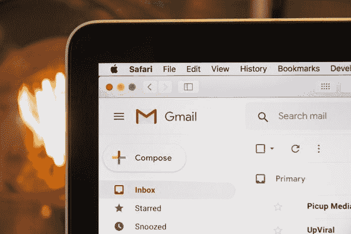

# 电子邮件的力量来自数据

> 原文：<https://medium.datadriveninvestor.com/emails-power-surges-from-data-889015c20958?source=collection_archive---------23----------------------->

## 一份名单代表人们向你伸出友谊之手

Photo by Webaroo on Unsplash

如果安静的周末过后，收件箱看起来异常的满，那可能不是你的想象。研究表明，周一的邮件影响最大。

这对于数字营销执行官兼培训师 [Emmanual Ibekwe](https://twitter.com/TheEmmaIbekwe) 来说并不新鲜。他创建并管理数据驱动的电子邮件营销活动和[销售渠道](https://www.datadriveninvestor.com/2019/09/15/simple-sales-funnels-yield-big-results/)。在一次[非洲推特聊天](https://twitter.com/AfricaTweetChat)中，Ibekwe 解释了为什么电子邮件列表很重要。

“电子邮件列表基本上是一个订户列表，”他说。“简单来说，这些人给了你他们的电子邮件地址，并明确表示允许你给他们发邮件。

“就当有人接受了你热情的友谊之手，”Ibekwe 说。"这通常是建立良好商业关系和营销目的的可靠方法."

 [## 极其小心地对待你最强大的工具

### 电子邮件营销是博主们一个巨大的联系渠道

blog.markgrowth.com](https://blog.markgrowth.com/treat-your-most-powerful-tool-with-massive-care-e60503b21783) 

许可真的很重要，尽管有回旋的余地。

“这并不意味着公司不这样做，但许可是重要的，”Ibekwe 说。"这让你很容易不去抱怨收到了一封你从未计划过的邮件."

电子邮件列表是经过数月甚至数年的编辑和整理的。它们反映了你的历史以及你未来职业的潜力。

“想想你会用来交新朋友的过程，”Ibekwe 说。“假设你们在某个地方相遇，进行了一次交谈，他们非常喜欢你的内容。然后你要他们的联系方式，他们心甘情愿的给你。

“还有其他的例子，”他说。“他们很匆忙，但在他们离开之前，你答应给他们一份礼物——但有一个条件:他们只有留下联系方式，才能得到你的礼物。嗯，你的礼物很好，所以他们放下了他们的联系。”

# 施加压力

这些是建立电子邮件列表的主要方式，但除了面对面的互动，还有更多方法，例如通过挤压页面。

根据谷歌的说法，[挤压页面是一个登陆页面](https://www.google.com/search?sxsrf=ALeKk00ZLz5FGp29w6jA-SCifqr84nIaXA%3A1586557004089&source=hp&ei=TPCQXoeTArulytMPj9-E8AI&q=social+media+squeeze+page&oq=social+media+squeeze+page&gs_lcp=CgZwc3ktYWIQAzIFCCEQoAEyBQghEKsCMgUIIRCrAjIFCCEQqwI6BwgjEOoCECc6BQgAEIMBOgIIADoECCMQJzoFCAAQzQI6BggAEBYQHkoyCBcSLjBnMTQ2ZzEwNGcxMTFnMTkxZzExMGc5N2c5OWc5N2cxMjBnMTA4ZzEyNmcxMjlKHQgYEhkwZzJnMmcyZzFnMWcxZzFnMWcxZzVnNWc2UK4QWOplYIx4aAVwAHgAgAGeAYgBmxaSAQUxNy4xMZgBAKABAaoBB2d3cy13aXqwAQo&sclient=psy-ab&ved=0ahUKEwiH6ZC18d7oAhW7knIEHY8vAS4Q4dUDCAk&uact=5),旨在从潜在订户那里获取选择加入的电子邮件地址。挤压页面的目标是说服、哄骗或以其他方式“挤压”访问者提供他们最受欢迎和最渴望的个人数据:他们的电子邮件[地址](https://www.datadriveninvestor.com/glossary/address/)。

“大多数时候，通过博客、挤压页面、网站或博客上的弹出页面或广告弹出窗口进行的互动，只有在你留下电子邮件地址的情况下，才能向你承诺一些东西，”Ibekwe 说。“使用弹出窗口并不能保证您获得想要的电子邮件地址。通常你需要一个销售线索磁铁，可以是一个 PDF 或短视频——你的目标受众需要的东西。

 [## 铅磁铁:吸引人的入门方式

### 有价值的赠品是营销的关键部分

blog.markgrowth.com](https://blog.markgrowth.com/lead-magnets-attractive-ways-to-get-your-foot-in-the-door-2005d8be6f96) 

“你的潜在客户磁铁是迫使他们放弃电子邮件地址的原因，”他说。“你的销售线索磁铁有多大用处，有助于确定他们有多大兴趣给你他们的地址。”

社交媒体是邮件列表增长的一大因素。

“在聚会上交朋友很容易，但维持友谊的唯一方法是留下对方的联系方式，”Ibekwe 说。“当你离开聚会时会发生什么？友谊结束了？

“社交媒体是‘派对’，”他说。“这个人的电子邮件是你的联系人。我们建议您留下来并保持联系的一个方法是尝试获取电子邮件地址。”

然后，电子邮件列表成为在线故障的备份。

“你可以利用社交媒体建立追随者，获得声誉和影响力，”Ibekwe 说。“然而，我们大多建议获取电子邮件地址，因为社交网站随时可能关闭，你所有的追随者都将丢失。

“你的电子邮件列表是你唯一真正拥有的不动产，”他说。“这就像社交媒体网站的所有者把你的电子邮件地址和电话号码存在他们的钱包里一样。你在他们的“房地产”里。"

# 物业推广

Ibekwe 认为所有的企业家都应该投资这种在线财产。

“通过社交媒体扩大你的影响力，但无论如何，要获得你的一份不动产，”他说。“在社交媒体上推广您的注册页面，让它成为您的专属。

“在推广它的时候，确保你让人们知道一旦他们把电子邮件地址留给你，你会和他们分享什么，”Ibekwe 说。“至少他们知道对你有什么期望。”

 [## 如果你想看到成长，就和别人交往吧

### 建立在线和面对面的关系

medium.com](https://medium.com/datadriveninvestor/engage-with-others-if-you-want-to-see-growth-c7e114b4a03d) 

收集地址只是一个开始。电子邮件用户必须保持参与。

“给他们你答应他们的东西，”Ibekwe 说。“如果我答应你 XYZ 电子书加入我的名单，一旦你加入我想给你的第一件事就是你的电子书。这有助于我们在我给你发送其他有价值的新闻内容之前建立信任。

“为你希望给他们发多少封邮件制定一个时间表，”他说。“然后，你发送的每封电子邮件都要有一个行动号召。更重要的是，你的内容有助于决定你的邮件有多有趣。”

电子邮件越有趣，就会有越多的收件人参与进来。

“当我说‘有趣’的时候，我也指‘相关的’，”Ibekwe 说。“如果你在我的名单上注册接收食谱，而我发给你布料设计，那就没关系了。

“把更多的注意力放在实现他们想注册时你给他们的第一个承诺上，”他说。"用相应的行动号召来提供帮助，让它变得有趣."

应该为每个列表定制消息。

“向你的清单销售帮助你细分你的清单，”Ibekwe 说。“那么你就可以很容易地识别‘买家’买家名单对你的营销非常重要，但是不要停止给那些当时没有购买的人发邮件。

“如果他们没有购买，也许他们正在汇集资金，或者他们还没有现金，”他说。“更糟糕的是，他们没有兴趣购买。这不是路的尽头。他们今天不会买你的报价，但他们明天可能会买你的另一份报价。”

# 最佳日期和时间

发送批量电子邮件的日期取决于潜在客户最活跃的时间。这可能因团体而异，这使得当你的团体骚动时倾听变得更加重要。

“我可能没有最好的一天或几天，但你需要测试，”Ibekwe 说。“例如，去年我在加拿大的一家电子商务商店工作。从我的电子邮件中，我发现我在周二得到了最好的结果。

“我试过其他日子，第二好的一天是周四，”他说。“有办法吗？也许吧。有一些报道说星期二和星期四是最好的日子，但是不要相信我的话。你需要尝试和测试，看看什么适合你。”

 [## “战略性社交倾听是真实的生活”

### 获得洞察力以抓住机会

medium.com](https://medium.com/datadriveninvestor/strategic-social-listening-is-real-life-90c8a07b7c3f) 

另一个案例证明了他的观点。

“还是在加拿大，我帮助了一家餐馆，我们在周五得到了最好的回应——这一天大多数人会说不要发电子邮件，”Ibekwe 说。“因此，它因行业、内容以及用户参与度而异。

“所以，测试，测试，测试，测试，”他说。还要测试时间。我的电子商务商店的电子邮件在午休时间比其他时间做得更好。"

与早期的研究相反，Ibekwe 对一周开始时的信息传递持怀疑态度。

“通常，我担心周一发邮件，因为我收到报告说周一是不允许的，”他说。“我观察了我周一的例行工作，知道我周一做的所有事情就是清理我的邮箱。然而，不要相信我的话。测试你的列表。”

从博客中建立邮件列表并保持收件人活跃需要一种特殊的方法。

“从给你的博客添加一个压缩页面开始，”Ibekwe 说。然后，在你发送的电子邮件中分享你最感兴趣的或最近的文章的片段。

“偶尔，尝试一些有趣的事情，”他说。“分享一些与你的博客相关的东西。比如，一个时尚博客可以向订阅者分享一个新的着装创意。

# 牛奶和共享

这也是推广销售线索磁铁或简单地邀请人们订阅您的博客的好地方。

“如果你在社交媒体上有大量积极参与的粉丝，事情总是会更容易，”Ibekwe 说。“挤牛奶吧。充分利用它。

“在你的邮件中，不要害怕要求他们与可能喜欢你内容的朋友分享，”他说。“这个想法是每个时尚达人都互相了解。所以，让他们为你分享你的电子邮件，扩大你的受众。”

 [## 参与建立受众和利润

### 重要的是追随者的质量，而不是数量

blog.markgrowth.com](https://blog.markgrowth.com/engagement-builds-audience-and-profit-3849952ddbaf) 

电子邮件不是数字游戏，而是质量游戏。正如 Ibekwe 所解释的那样，一份由 10 个最活跃的回答者组成的电子邮件列表要比一千个无用的人组成的列表好得多:

*   是的，你需要在你的电子邮件列表上有一个相当大的数字。一千个订了婚的用户就很好了。
*   不，如果他们不关注你的邮件，你真的不需要一个大名单。如果他们没有反应，这就有点违背了拥有名单的目的。

“有一个电子邮件列表很好，但更好的是，有一个包含你的信息的列表会更好，”Ibekwe 说。

没有变得复杂，企业家可以使用简单的工具来建立电子邮件列表。

“从铅磁铁开始，”Ibekwe 说。“决定什么对你的理想受众有价值。它可以是一个简单的 PDF 格式的文件，上面有“如何着装杀人的提示”

“一旦我们有了我们的销售线索磁铁，让我们在一个挤压页面上工作，它基本上要求他们的电子邮件地址在[交换](https://www.datadriveninvestor.com/glossary/exchange/)你的销售线索磁铁，”他说。因为这类似于选择加入页面，所以您有许多样式可以轻松选择

通过 [MailMunch](https://twitter.com/mailmunch) 和 [Mailchimp](https://twitter.com/Mailchimp) 弹出的插件帮助收集电子邮件地址。

“这些工具也是电子邮件服务提供商，”Ibekwe 说。“这样，当你使用它们的时候，你的工作就容易多了，因为它们可以很顺利地集成。我会推荐他们，但是如果你的技术水平比他们高一个档次，你也可以试试其他人。

“记住，建立一个电子邮件列表是至关重要的，”他说。“用你交朋友的方式去做。有意为之。”

**关于作者**

吉姆·卡扎曼是[拉戈金融服务公司](http://largofinancialservices.com/)的经理，曾在空军和联邦政府的公共事务部门工作。你可以在[推特](https://twitter.com/JKatzaman)、[脸书](https://www.facebook.com/jim.katzaman)和 [LinkedIn](https://www.linkedin.com/in/jim-katzaman-33641b21/) 上和他联系。

*原载于 2020 年 4 月 20 日 https://www.datadriveninvestor.com***。**