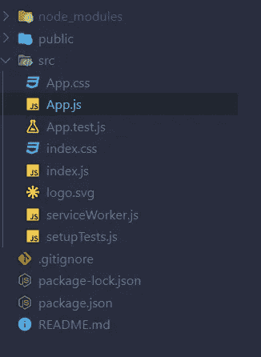
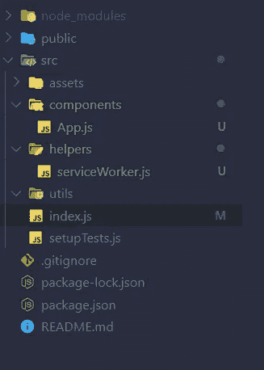
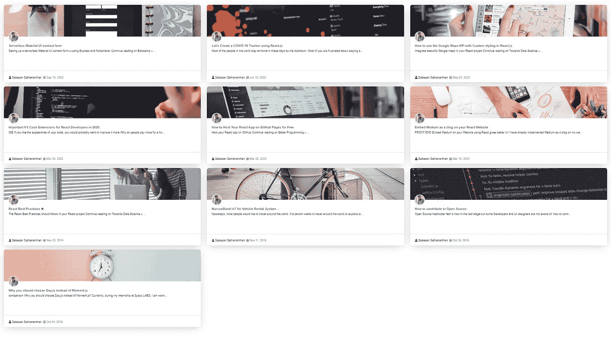
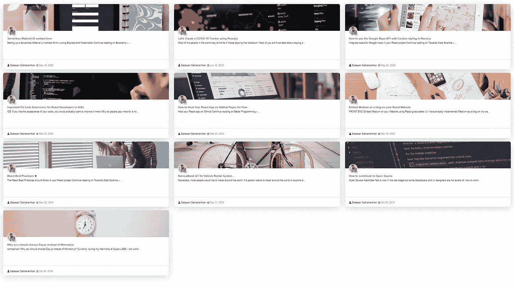

# 将媒体作为博客嵌入到 React 网站上——第 2 部分

> 原文：<https://medium.datadriveninvestor.com/embed-medium-as-a-blog-on-your-react-website-part-2-187db2b60a59?source=collection_archive---------3----------------------->

## 前端

## 使用 Material-UI 在你的网站上嵌入媒体可以提供更好的用户界面


Photo by [Aron Visuals](https://unsplash.com/@aronvisuals?utm_source=unsplash&utm_medium=referral&utm_content=creditCopyText) on [Unsplash](https://unsplash.com/?utm_source=unsplash&utm_medium=referral&utm_content=creditCopyText)

我已经在我的网站上实现了博客媒体。在我使用碎片之前。我在我的[第 26 篇](https://medium.com/datadriveninvestor/embedded-medium-as-a-blog-on-your-react-website-f01be289e151)中已经提到了那个方法。但我想让它变得更好。我喜欢那个用户界面，但不满意。所以我考虑使用 Material-UI 来获得更好的用户体验。这里我将解释用纯 JavaScript 和 React Js 实现它。在这里你可以看到 react 应用程序的现场[演示](https://material-ui-medium-blog.vercel.app/)。这是我的第 32 篇中型文章。

我在之前的文章中已经介绍过 [React](https://towardsdatascience.com/react-best-practices-804def6d5215) 和 Medium。如果你错过了，点击这些链接并阅读。我喜欢用绿色徽章在我的博客页面上显示我的活跃时间。我喜欢将我的博客组件从 [Shards-React](https://github.com/DesignRevision/shards-react) 迁移到 [Material-UI](https://github.com/mui-org/material-ui) 。因为 Material-UI 组件看起来很吸引人，也很容易操作。然后我想，为什么我不能在我的博客页面中实现它。现在我完成了那个，在 GitHub 有一个回购。在这篇文章中，我要说的是如何从零开始。

# 步骤 1:设置 React 项目🆕

首先，您需要创建一个 react 应用程序。为此，请在您的 shell/终端的特定文件夹(例如，桌面)中运行以下命令

```
npx create-react-app medium-post
```

将创建一个新文件夹，并将其命名为中篇文章。从这一步开始，我们的应用程序用 [Create React App](https://github.com/facebook/create-react-app) 引导。更多信息，请点击[链接](https://github.com/facebook/create-react-app)。然后在 IDE 中打开该项目。我个人正在使用 VS 代码集成开发环境。

# 第二步:删除不想要的文件🗑️



Create React App file organization

在 IDE 中打开文件夹后，您需要删除一些文件并组织这些文件以便进行开发。因此，您需要转到 src 文件夹，删除 Logo.svg、App.css、index.css 和 App.test.js 文件。并在 src 文件夹中创建名为 components、assets、helpers 和 utils 的以下文件夹，然后将 serviceWorker.js 移动到 helper 的文件夹中。App.js 文件放到 Components 文件夹中。

现在打开 index.js 文件，删除 index.js 文件中的以下代码片段。

```
*import* ‘./index.css’;
```

然后修改 index.js 导入中的 App.js 和 serviceWorker.js 文件路径，如下所示。

```
*import* App *from* ‘./components/App’;
*import* * *as* serviceWorker *from* ‘./helpers/serviceWorker’;
```

进入 Components 文件夹，打开 App.js，删除 App 函数的返回部分。现在，您的文件组织将如下所示。



# 步骤 3:安装软件包🔄

为材料设计表单组件安装材料用户界面。

```
npm install @material-ui/core --save
```

安装 Axios 向 API 发出 HTTP 请求。

```
npm install axios --save
```

> 注意:获取 JSON 数据可以通过 JavaScript 中的 fetch API 来实现。使用 Axios 的原因即使是 IE11 这样的旧浏览器也可以毫无问题地运行 Axios。而`*Fetch()*`则只支持 Chrome 42+，Firefox 39+，Edge 14+，Safari 10.1+(你可以在[上看到完整的兼容表我能用](https://caniuse.com/#search=Fetch)……)

安装 react-fontawesome 来显示图标。

```
npm i @fortawesome/fontawesome-svg-core @fortawesome/free-solid-svg-icons @fortawesome/react-fontawesome --save
```


Photo by [Christina Morillo](https://www.pexels.com/@divinetechygirl?utm_content=attributionCopyText&utm_medium=referral&utm_source=pexels) from [Pexels](https://www.pexels.com/photo/photography-of-person-typing-1181675/?utm_content=attributionCopyText&utm_medium=referral&utm_source=pexels)

# 步骤 4:从介质中获取数据🔗

然后在 components 文件夹中创建一个名为 slider.js 的新文件。在 slider.js 文件中添加以下代码。

将第 13 行中的@Sabesan96 替换为您的中型用户名。

然后创建 utils 文件夹，并在 utils 文件夹中创建 Totext.js 文件。在 Totext.js 文件中添加以下代码片段。

然后在 utils 文件夹中创建 ShortenText.js 文件，并在 ShortenText.js 文件中添加以下代码片段

在组件文件夹中创建明信片. js 文件，并在明信片. js 文件中添加以下代码片段。

在明信片. js 中，我实现了活动状态徽章。在这里，我使用 **Date()** 函数在 JavaScript 中创建一个带有当前日期和时间的对象。并且我根据我的起床时间(早上 5 点)和就寝时间(晚上 10 点)有条件地呈现该组件(第 140 行)。第 110-133 行的代码部分用于日期格式化。

最后，在 App.js 中呈现 Slider 组件，如下所示



UI in sleeping hours



UI in Active hours

# 结论

在这里，我展示了将媒体作为博客嵌入 React 网站的四个步骤。如果你用这个，你就不会花钱去嵌入介质。然而，当你遵循这些方法时，你将无法在你的博客中显示你的相关文章。你可以从这个[链接](https://github.com/sabesansathananthan/material-ui-medium-blog)克隆回购。如果你要使用这个项目，那么不要忘记给这个回购 star⭐️。

快乐编码😊！！！

***感谢您阅读至此。如果你喜欢这篇文章，请分享、评论并发表👏几次(最多 50 次)。。。也许会对某个人有帮助。***

***关注我的*** [***推特***](https://twitter.com/TheSabesan) ***和 Medium 如果你将来对这些更深入、更翔实的文章感兴趣的话！***

## 访问专家视图— [订阅 DDI 英特尔](https://datadriveninvestor.com/ddi-intel)