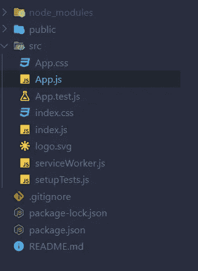
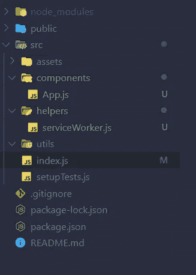

# 将媒体作为博客嵌入到 React 网站上——第 1 部分

> 原文：<https://medium.datadriveninvestor.com/embedded-medium-as-a-blog-on-your-react-website-f01be289e151?source=collection_archive---------0----------------------->

## 前端

## 使用 React 在你的网站上嵌入媒体可以提供更好的用户界面


Photo by [William Iven](https://unsplash.com/@firmbee?utm_source=unsplash&utm_medium=referral&utm_content=creditCopyText) on [Unsplash](https://unsplash.com/s/photos/blog?utm_source=unsplash&utm_medium=referral&utm_content=creditCopyText)

我已经在我的网站上实现了博客媒体。但是为此，我使用 jQuery 来获取 JSON 对象。我在我的[第 21 篇文章](https://medium.com/datadriveninvestor/embed-medium-as-a-blog-on-your-site-54a1b49cbe16#9ee4)中已经提到了那个方法。但是我对那种方法不满意。我不喜欢那个用户界面。所以我考虑使用 React 来获得更好的用户体验。这里我要解释一下我是如何避开 jQuery，用纯 JavaScript 和 React Js 实现的。在这里你可以看到 react 应用程序的现场[演示](https://react-medium-blog.firebaseapp.com/)。这是我的第 26 篇媒体文章。

我在之前的文章中已经介绍过 [React](https://towardsdatascience.com/react-best-practices-804def6d5215) 和 [Medium](https://link.medium.com/7gxBkDc151) 。如果你错过了，点击这些链接并阅读。我下载了 [shards dashboard lite](https://designrevision.com/downloads/shards-dashboard-lite-react/?ref=madewithreact) ，它的博客页面给我留下了深刻印象。然后我想，为什么我不能在我的博客页面中实现它。之后，我想出了一个解决方案。但是那没有用。然后我尝试了一种有效的新方法。现在我完成了那个，在 GitHub 有一个回购。在这篇文章中，我要说的是如何从零开始。

## 步骤 1:设置 React 项目🆕

首先，您需要创建一个 react 应用程序。为此，请在您的 shell/终端的特定文件夹(例如，桌面)中运行以下命令

```
npx create-react-app medium-post
```

将创建一个新文件夹，并将其命名为中篇文章。从这一步开始，我们的应用程序用 [Create React App](https://github.com/facebook/create-react-app) 引导。更多信息，请点击[链接](https://github.com/facebook/create-react-app)。然后在 IDE 中打开该项目。我个人正在使用 VS 代码集成开发环境。

## 第二步:删除不想要的文件🗑️



Create React App file organization

在 IDE 中打开文件夹后，您需要删除一些文件并组织这些文件以便进行开发。因此，您需要转到 src 文件夹，删除 Logo.svg、App.css、index.css 和 App.test.js 文件。并在 src 文件夹中创建名为 components、assets、helpers 和 utils 的以下文件夹，然后将 serviceWorker.js 移动到 helper 的文件夹中。App.js 文件放到 Components 文件夹中。

现在打开 index.js 文件，删除 index.js 文件中的以下代码片段。

```
*import* ‘./index.css’;
```

然后修改 index.js 导入中的 App.js 和 serviceWorker.js 文件路径，如下所示。

```
*import* App *from* ‘./components/App’;
*import* * *as* serviceWorker *from* ‘./helpers/serviceWorker’;
```

转到 Components 文件夹，打开 App.js，删除 App 函数的返回部分。现在，您的文件组织将如下所示。



## 步骤 3:安装碎片反应包🔄

你可以通过 NPM 安装碎片反应。

`npm i shards-react`

安装完软件包后，打开 index.js，将下面的代码片段添加到代码的顶部。

```
*import* ‘bootstrap/dist/css/bootstrap.min.css’;
*import* ‘shards-ui/dist/css/shards.min.css’;
```

然后你需要将这个 [CSS](https://github.com/sabesansathananthan/React-Medium-Blog/blob/master/src/assets/shards-dashboards.1.1.0.min.css) 文件添加到 assets 文件夹中。将文件添加到 assets 文件夹中后，将 CSS 文件导入 index.js。

```
*import* ‘./assets/shards-dashboards.1.1.0.min.css’;
```

## 步骤 4:从介质中获取数据🔗

然后在 components 文件夹中创建一个名为 slider.js 的新文件。在 slider.js 文件中添加以下代码。

然后创建 utils 文件夹，并在 utils 文件夹中创建 Totext.js 文件。在 Totext.js 文件中添加以下代码片段。

然后在 utils 文件夹中创建 ShortenText.js 文件，并在 ShortenText.js 文件中添加以下代码片段

在组件文件夹中创建 MediumCard.js 文件，并将以下代码片段添加到 MediumCard.js 文件中。

最后，在 App.js 中呈现 Slider 组件，如下所示。

## 结论

在这里，我展示了将媒体作为博客嵌入 React 网站的四个步骤。如果你用这个，你就不会花钱去嵌入介质。然而，当你遵循这些方法时，你将无法在你的博客中显示你的相关文章。你可以从这个[链接](https://github.com/sabesansathananthan/React-Medium-Blog)中克隆回购协议。

在这里，我补充我的第 2 部分的教程。

[](https://medium.com/@sabesan96/embed-medium-as-a-blog-on-your-react-website-part-2-187db2b60a59) [## 将媒体作为博客嵌入到 React 网站上——第 2 部分

### 使用 Material-UI 在你的网站上嵌入媒体可以提供更好的用户界面

medium.com](https://medium.com/@sabesan96/embed-medium-as-a-blog-on-your-react-website-part-2-187db2b60a59) 

快乐编码😊！！！

***感谢您阅读至此。如果你喜欢这篇文章，请分享、评论并发表👏几次(最多 50 次)。。。也许会对某个人有帮助。***

***关注我的***[***Twitter***](https://twitter.com/TheSabesan)***和 Medium 如果你将来对这些更深入、更翔实的文章感兴趣的话！***