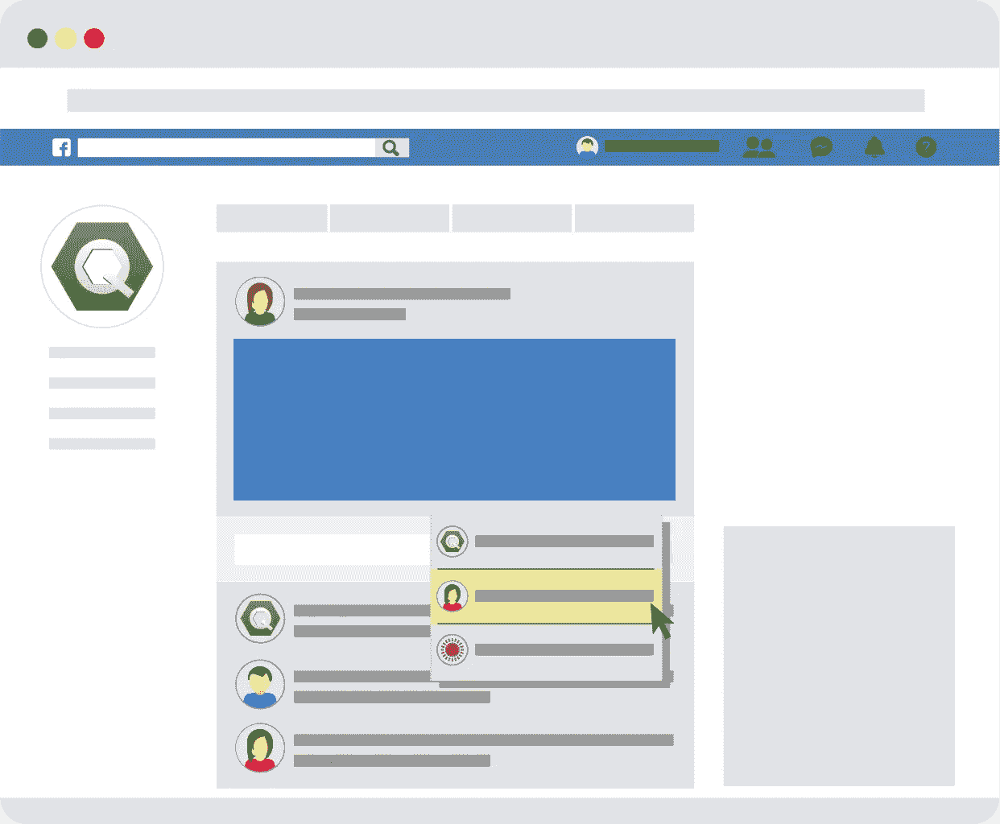

# 在营销活动中嵌入用户评论

> 原文：<https://medium.datadriveninvestor.com/embedding-users-review-in-marketing-campaign-e95cfcfd6e77?source=collection_archive---------21----------------------->

在营销活动中嵌入用户生成的内容。这篇文章解释了如何在营销活动中嵌入用户生成的内容。

用户生成的内容在网络上随处可见，营销人员正在利用这些内容的优势，将其作为提高客户参与度的工具。

随着公司意识到使用用户生成内容的价值，客户更容易被真人分享的原创图像和视频所吸引，因为他们可以正确地可视化事物。

这是制造轰动的好方法，有助于与你的潜在客户建立信任关系。当你成功地建立了信任关系，这将大大有助于你的营销活动取得成功。

## 什么是用户生成内容？

*   脸书帖子和评论
*   用户生成的博客帖子
*   博客评论
*   用户生成的视频
*   复习
*   客户评价
*   论坛
*   播客

 [## 反馈是企业的生命线。

### 在 20 世纪，顾客面对许多彼此相似的产品。但是他们获得的经验…

medium.com](https://medium.com/datadriveninvestor/feedback-is-lifeline-for-business-a3d5af571508) 

## 如何将用户生成的内容纳入内容营销计划？

使用用户生成内容的一些方法是在你的网站上使用各种社交媒体插件，这将鼓励网站访问者创建和分享他们的用户生成内容。你甚至可以嵌入一个显示你所有提及的 Twitter 流或者一个脸书评论框。

这将有助于你在你的网站和脸书这两个平台上发布内容。在网站上突出使用社交 feed，并将用户生成的内容作为独立内容放在网站上，这非常有帮助。然而，公司可以采用更具战略性和深思熟虑的方式来对他们的营销活动产生更大的影响。

博客是为你的网站吸引新访客的重要工具，使用清晰的 CTA 按钮，鼓励访客分享他们对你的博客文章和网站内容的看法。

在你的博客和网站上使用社交媒体分享按钮也很重要，而且是在正确的地方。简单地在你的博客中加入一个带有你品牌标签的社会反馈并不足以成为最有效的方法。

一些在线营销者正在嵌入用户生成的内容，如包含其产品的视频和图像，以及电子邮件，以提供更好的方法。

 [## 7 件事宣告你企业的未来。

### 电子邮件是与客户保持联系的最佳方式之一。我列出了 7 种类型的电子邮件…

medium.com](https://medium.com/datadriveninvestor/7-things-declare-your-businesss-future-70a8978b21d3) 

在付费广告上使用用户生成的内容也非常有效。虽然这样做对营销人员来说是一个相当大的挑战，但如果方法正确，它可以给你的营销结果带来巨大的变化。

# 感谢您阅读这篇文章。随时欢迎反馈。如果你喜欢它，请点击拍手按钮，并分享这篇文章。

你可以在[Github](https://github.com/tejamaddimsetty)&[LinkedIn](http://www.linkedin.com/in/tejmaddimsetty)上联系我

[Tej Maddimsetty](https://medium.com/@tejmaddimsetty)