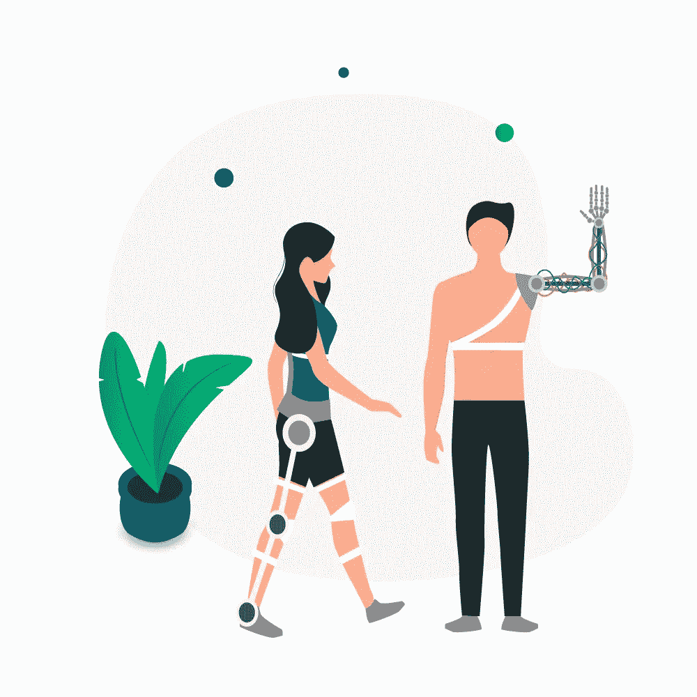

# 机器人在医疗保健中的新兴角色

> 原文：<https://medium.datadriveninvestor.com/emerging-roles-for-robots-in-healthcare-f01c39107534?source=collection_archive---------8----------------------->

机器人技术在医疗保健领域的现状和未来如何？

# 概观

如今机器人无处不在。与科幻电影中常见的嗜血怪物大相径庭，它们对医疗保健的贡献是无价的。没有它们，远程医疗就不会如此有用，我们也不会有机器人护士、达芬奇手术系统或成人护理中使用的任何机器人(这个列表还在继续)。在本文中，我们研究了医疗保健行业利用机器人的最常见方式，以及机器人如何能够提供比人类更好的护理。

# 机器人如何改变医疗保健？

# 手术机器人

外科手术过程需要对细节给予最大的关注。容易疲劳的外科医生可能没有准备好去照看等待动手术的无止境的病人。此外，由于敏感性或位置，他们可能会发现他们接触特定重要器官或身体部位的机会有限。

手术机器人可以帮助缩短手术时间，减少术后并发症和恢复时间。

 [## 医疗保健的未来正在被一场大型技术入侵所塑造|数据驱动型投资者

### 过去十年，全球经济的所有部门都经历了大规模的数字颠覆，而卫生部门现在…

www.datadriveninvestor.com](https://www.datadriveninvestor.com/2018/11/02/the-future-of-healthcare-is-being-shaped-by-a-big-tech-invasion/) 

手术机器人的市场价值预计将在 2020 年超过[915 亿美元](https://www.globenewswire.com/news-release/2019/06/06/1865115/0/en/Global-Surgical-Robots-Market-was-Valued-at-USD-5-4-Billion-in-2018-and-Anticipated-to-Observe-a-CAGR-of-10-1-during-the-Forecast-Period-VynZ-Research.html)，在接下来的几年里会有更多的扩张。这种前所未有的繁荣对投资者来说是一个诱人的平台。

在写这篇文章的时候，达芬奇手术系统和视觉触觉将会彻底改变外科手术。这些 15 岁的机器人拥有一些神奇的功能，如放大的 3D 高清视觉系统和微型腕式仪器，可以弯曲和旋转的程度远远超过人手。有了外科医生的控制，达芬奇能够比我们想象的更精确。

# 老年人护理

老年护理可能是一项乏味的工作。远程控制的医疗机器人，如由 [Anybots](http://www.anybots.com/) 设计的机器人，可以通过监控病人的基本需求和生活条件来帮助护理人员。这些机器人护工减少了家访的次数，从而解放了护工，让他们专注于其他更紧急的活动——每个人都受益！这些机器人由尖端技术驱动，具有人情味，允许他们经常检查病人，决定他们的行动，甚至陪伴他们。

# 远距离医学

患者现在可以与他们的医生互动，接受信息和医疗咨询，而不必离开自己舒适的家。当需求增加时，偏远地区往往很难找到医生。像 [Babylon Health](https://www.babylonhealth.com/us) 、Avizia、[、Teladoc](https://www.teladoc.com/) 、 [American Well](https://www.americanwell.com/) 、 [Health Tap](https://www.healthtap.com/) 、 [Doctor on Demand](https://www.doctorondemand.com/) 和 [InTouch Health](http://www.intouchhealth.com/) 这样的项目都在努力弥合这些差距。这些机器人有助于为心血管疾病、皮肤病、中风和任何其他紧急医疗情况提供高质量的紧急咨询。这个过程就像浏览你的社交媒体一样简单，需要患者访问一台个人电脑或平板电脑，而医生则在他们那端做出回应。

# 机器人护士

将人工智能应用于护理已被证明是一项艰巨的任务，因为个性化，人与人的互动无法完全复制。尽管有这样的障碍，像希瓦这样的机器人护士仍然可以帮助保持对病人的积极关注。这位机器人护士还抽血，检查生命体征，监测病情，并照顾卫生需求。它们被设计成擅长执行重复和单调的任务，这让它们的人类同伴有更多的时间去关注其他问题。目前，有人猜测这些机器人可能很快会被改进到甚至可以进行实验室测试的程度。

# [昆]外骨骼

外骨骼不仅让许多人有机会再次行走，而且它们也有助于扩大医疗实践。它们的用途不胜枚举，因为它们可用于康复、外科手术等。

# 机器人:新的现实

让我们澄清一些对机器人最常见的误解:

嗯，这很复杂。不，他们不会接管我们的星球，也不会夺走我们所有的工作。在医疗保健领域引入人工智能机器人的目的是补充人类劳动，并将我们的能力提升到另一个水平。不是所有的过程都可以自动化，这些机器需要人类的交互来学习和正常工作。

虽然机器人确实不容易疲劳或面临人类常见的其他挑战，但这并不意味着它们没有错误。你的车坏过吗？机器人和其他机器一样——它们的程序可能会受到恶意软件的影响，或者它们可能会在任何时候因为任何原因出现故障。因此，它们的操作员必须维护它们，并确保它们处于良好的工作状态。

我们很多人都是看着科幻电影长大的，所以我们可能会相信，拥抱机器人就意味着拥抱我们的末日。谢天谢地，情况不会如此。机器人是我们忠诚的仆人，它们通过与我们和我们的环境互动来学习。

# 结论

目标是让先进的医疗机器人在第三级自主状态下运行。在第三级自治中，人类通过密切监控他们，起到制衡干预的作用。

机器人已经存在了。他们提供了大量的好处，并能够改善每一个病人与医生的接触。未来在于人工智能，因此未来的医疗保健服务肯定会出现高功能、不断发展的医疗机器人。

*原载于*[*http://www . aim blog . io*](http://www.aimblog.io/2020/01/17/emerging-roles-for-robots-in-healthcare/)*2020 年 1 月 17 日*