# 情绪分析技术:让自动化客户服务更加智能

> 原文：<https://medium.datadriveninvestor.com/emotion-analysis-technology-making-automated-customer-service-more-intelligent-f1c33d508531?source=collection_archive---------27----------------------->

*宋双勇、王超、陈海清、陈欢*

在回答客户的常见问题时，一个好的[智能客服机器人](https://www.alibabacloud.com/product/bot)需要为客户提供多维度、类人的服务能力，包括协助、导购、语音聊天、娱乐等。这将提高客户对智能客服机器人的整体满意度，甚至可能让客户相信客服机器人确实是个人。在这个过程中，情感分析技术在赋予机器人类似人类的能力方面起着至关重要的作用。

本文将讨论情感分析算法模型的原理、它们的实际应用以及它们的性能。本文还通过智能客服系统中人机结合服务的形式，从五个维度总结和介绍了情感分析技术的应用场景。

# 介绍

[人机交互](https://www.alibabacloud.com/product/intelligent-speech-interaction)一直是自然语言处理领域的重要研究领域。近年来，随着人机交互技术的进步，对话系统逐渐应用于实际应用中。在这些应用中，智能客户服务系统引起了许多企业，尤其是大中型企业的关注。智能客户服务系统旨在减少传统人工客户服务人员的工作量。这样，当处理特定问题或特定用户时，工作人员可以提供更高质量的服务。因此，智能客服和人工客服的结合可以提高整体服务效率和服务质量。近年来，许多大中型企业都建立了自己的智能客服系统，如富士通的 FRAP、京东的 JIMI 和阿里巴巴的 AliMe。

智能客服系统的构建必须基于行业数据以及海量知识处理、自然语言理解等相关技术。第一个智能客户服务系统被设计用来回答与商业相关的常见问题。这个过程需要业务专家准确地组织常见问题的答案。主要技术能力是将用户提问的文本与知识点进行精准匹配。新的智能客户服务系统现在覆盖了更广泛的业务场景。除了回答常见问题之外，此类系统还必须关注并满足智能导购、障碍预测、智能语音聊天、日常生活辅助和娱乐互动的要求。情绪分析是一项重要的类人能力，已应用于不同的智能客服系统场景。它在提高这些系统的类人能力方面起着至关重要的作用。

# 智能客服系统中情感分析技术的架构

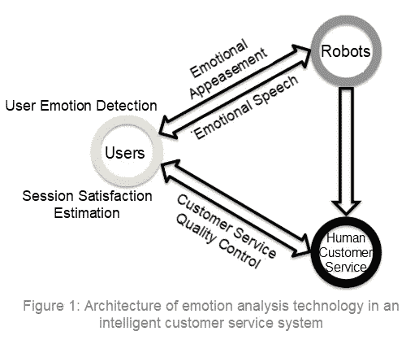

图 1 展示了基于人机结合的经典智能客服模型。用户通过基于对话的过程从机器人或人类客户服务人员那里接受服务。当由机器人服务时，用户可以通过指令或基于机器人的自动识别被重定向到人类客服人员。在图 1 所示的完整客户服务模型中，情绪分析技术用于实现多维能力。

# 维度 1:用户情感检测

## (1)用户情感检测模型介绍

用户情感检测是许多情感相关应用的基础和核心。本文提出了一种融合词语义特征、多短语语义特征和句子语义特征的情感分类模型。该模型用于识别智能客户服务系统的用户对话中包含的诸如“焦虑”、“愤怒”和“感激”的情绪。提取不同层次语义特征的技术在相关工作中被多次提及。通过结合不同层次的语义特征，可以有效地提高最终的情感识别性能。图 2 显示了情感分类模型的架构。

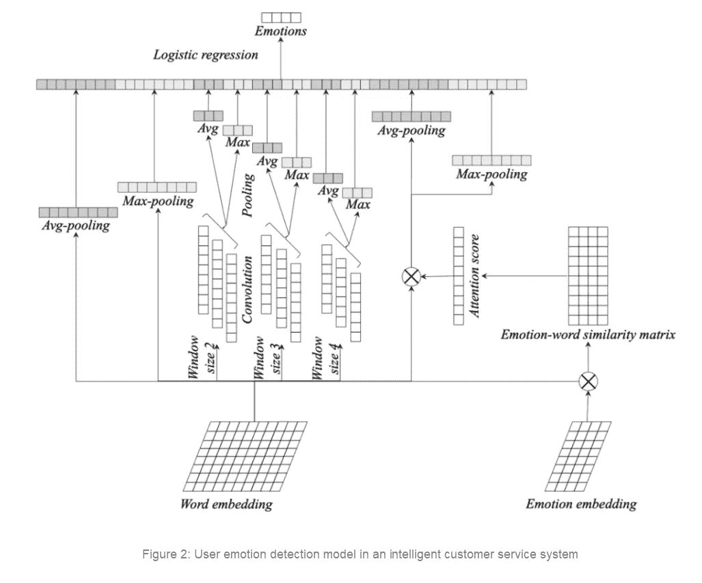

## (2)句子语义特征的提取

沈等[3]提出了模型。该模型将简单的池策略应用于单词嵌入向量，以提取句子语义特征。基于这些特征训练的分类模型和文本匹配模型可以达到与经典的卷积神经网络(CNN)模型和递归神经网络(RNN)模型几乎相同的实验效果。

在我们的模型中，我们使用 SWEM 模型的特征提取能力来从用户问题中获得句子语义特征，并在用户问题的情感分类模型中使用这些特征。

## (3)多短语语义特征的提取

在许多情况下，传统的 CNN 模型用于提取 n 短语语义特征，其中 n 是指示卷积窗口大小的变量。在本文中，我们根据经验将 n 分别设置为 2、3 和 4。我们还为每个窗口大小设置了 16 个卷积核，以便从原始词向量矩阵中提取丰富的 n 短语语义信息。

## (4)词语语义特征的提取

我们使用 LEAM 模型[1]来提取单词语义特征。LEAM 模型在相同的维度上为单词和类别标签实现语义信息的嵌入式表示，然后基于该表示实现文本分类。LEAM 模型通过使用类别标签来增加单词和标签之间的语义交互。这使得它可以更深入地探索单词语义信息。图 3 (2)显示了类别标签和单词之间的语义交互，并比较了 LEAM 模型和传统模型。

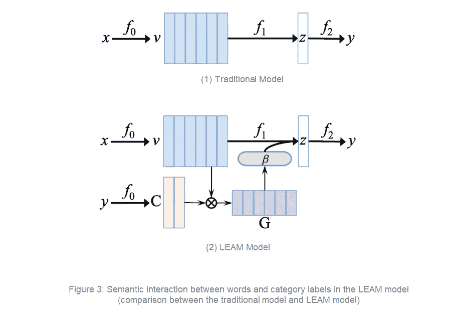

最后，通过逻辑回归模型将不同层次的语义特征合并输入到模型的最后一层进行最终的分类训练。

表 1 比较了我们的集成模型和三个仅考虑单级特征的对比模型的真实在线评估结果。

# 维度 2:情感安抚

## (1)情绪安抚框架介绍

本文提出了一个情绪安抚框架，由离线部分和在线部分组成，如图 4 所示。

离线部分

第一，需要识别用户情绪。我们选择了七种常见的用户情绪来识别。它们是恐惧、辱骂、失望、委屈、焦虑、愤怒和感激。

然后，我们识别用户问题中包含的主题内容。我们请商业专家总结了 35 个用户表达的常见话题，包括“对服务质量的投诉”和“对物流缓慢的反馈”。我们使用用于识别情绪的相同分类模型来设计主题识别模型。

知识构建旨在整理表达用户情绪的常见问题，这些问题需要安抚，以更精确地解决用户表达。我们没有将这些特定的用户问题合并到上面提到的主题维度中，因为主题维度的处理是相对粗粒度的。而是希望集中回答这些常见的具体问题，以达到更好的回应效果。

商业专家分别按照情绪、“情绪+话题”和常见问题等维度组织安抚回应。具体来说，在常见问题这个维度上，我们把一个问答对称为一段知识。

在线部分

基于知识的安抚旨在安抚表达特定情感内容的用户。我们使用文本匹配模型来评估用户的问题与我们知识库中的问题之间的匹配。如果我们的知识库中包含一个与用户的问题意义相似的问题，则直接向用户返回相应的响应。

基于情感和话题的情感反应同时考虑用户表情中包含的情感和话题信息，然后给予用户适当的情感反应。相对于基于知识的安抚，基于情绪和话题的情绪应对是一种更通用的方法。

基于情感类别的情感反应只考虑用户表达中的情感因素，然后给予用户适当的安抚反应。这种响应方式是对前两种响应方式的补充和支持，其响应内容更具一般性。

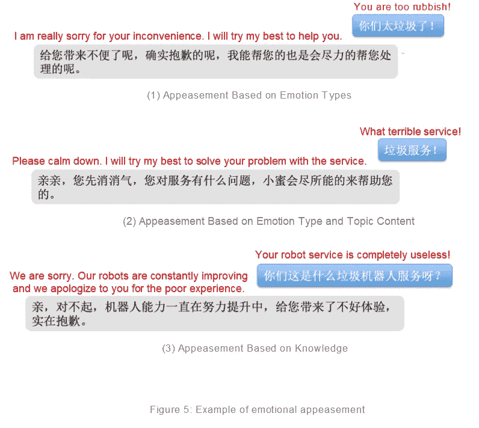

图 5 显示了在线情绪安抚的三个例子，它们对应于前面的三种响应方法。

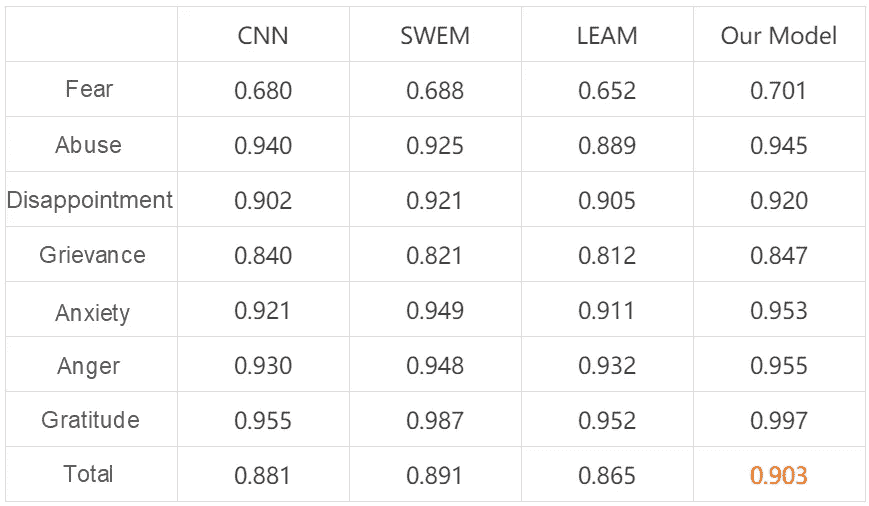

表 2:情感分类性能比较

表 2 比较了情感分类模型的性能，包括每个情感类别的个体性能和最终的整体性能。表 3 比较了主题分类模型的性能。表 4 比较了针对几种负面情绪添加情绪安抚前后用户满意度的提高。表 5 比较了在为感激情绪添加情绪安抚之前和之后的用户满意度提高。

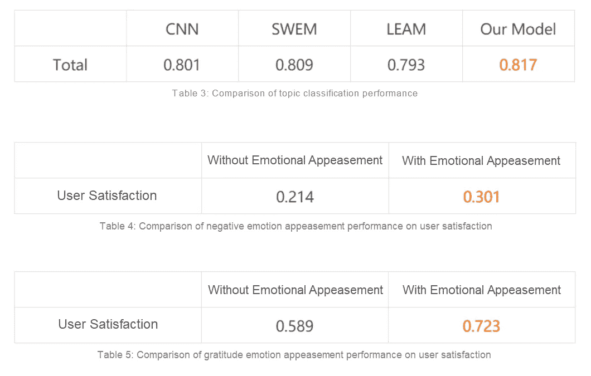

# 维度 3:产生情感的语音聊天

## (1)情感语音模型

图 6 显示了智能客户服务系统中的情感语音模型。如图 6 所示，源 RNN 充当编码器，它将源序列映射到中间语义向量。目标 RNN 充当解码器，它可以基于语义编码以及我们设置的情感表示(E)和话题表示(T)对目标序列(y)进行解码。这里，s 和 y 对应的是图 6 中由词序列组成的句子“我今天心情很好”和“我好开心”。

通常，编码器的最后状态将作为初始状态传递给解码器，允许解码器保留来自编码器的信息。此外，编码器和解码器通常使用不同的 rnn 来捕获包含不同问题和答案的表达式。公式如下:

虽然基于 Seq2Seq 的对话生成模型取得了良好的效果，但在实际应用中可能会生成安全但无意义的响应。原因是该模型中的解码器只接收编码器输出的最后一个状态。这种机制不擅长处理长期相关性，因为随着新字的不断产生，解码器的状态记忆将逐渐减弱甚至丢失源序列信息。一个有效的方法是利用注意机制[2]。

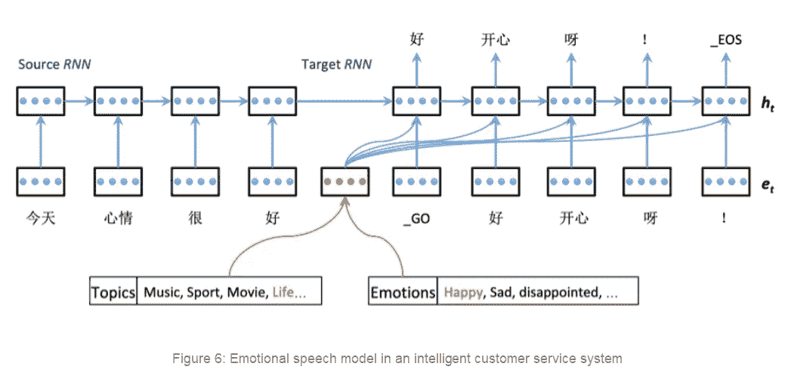

在使用注意机制的 Seq2Seq 框架中，解码器的输出层基于输入预测单词的概率如下:

其中， *ht* 是解码器在时间 *t* 的隐藏状态输出。计算*ht’*的公式如下:

对于编码器的每个输出 *ht* ，使用不同的权重如下:

每个隐藏状态 *hj* 的权重 *atj* 的计算公式如下:

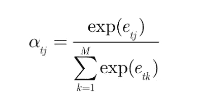

训练过程的目标函数和预测过程的搜索策略与传统 RNN 中的相同。

## (2)情感语音模型的结果

在模型被训练之后，它在真实的用户问题上被测试，并且结果被商业专家审查。最终，它在 72%的情况下产生了令人满意的答案。此外，响应文本的平均长度为 8.8 个字符，符合 AliMe 在语音聊天场景中对响应文本长度的要求。表 6 比较了本文提出的基于注意力的情绪和话题(AET) Seq2Seq 模型和传统 Seq2Seq 模型的效果。这种比较侧重于内容通过率和响应长度。加入情感信息后，响应内容比传统 Seq2Seq 模型中的更加丰富。此外，机器人将在语音聊天场景中输出更高比例的最佳长度(5 至 20 个字符)的响应。最终，这将显著提高回复的整体通过率。

图 7 显示了 AliMe 中情感语音模型的应用。在图 7 中，两种反应都是由情绪模型产生的。当用户输入“你真傻。不好玩。”我们的模型可以根据主题和情感产生不同的响应，这使得它的响应更加多样化。图 7 中的两个响应是基于情绪“委屈”和“后悔”生成的。

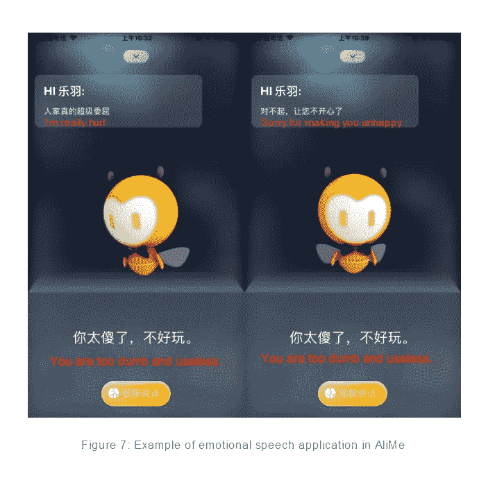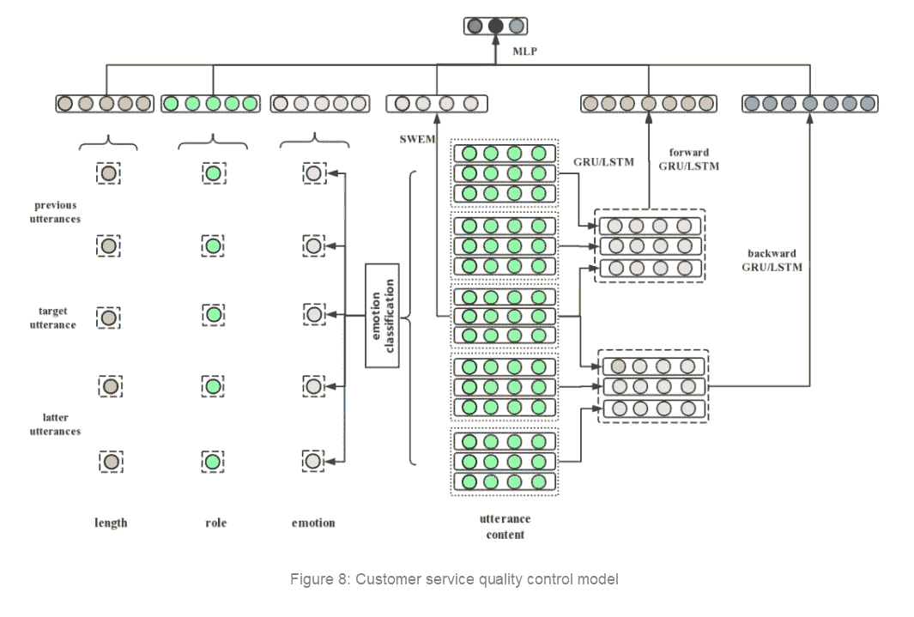

# 维度 4:客户服务质量控制

## (1)定义

本文中描述的客户服务质量控制功能用于检测在人工客户服务人员和客户之间的对话中可能导致问题的服务内容。它旨在更好地识别人工客户服务过程中出现的问题，并帮助客户服务代表改进。最终，这将有助于提高客户服务质量并提高客户满意度。据作者所知，目前在客户服务系统中还没有公开实现的与人工智能相关的客户服务质量控制算法模型。

与人机对话不同，客服人员和客户之间的对话不是一对一的形式，而是可以包含任意一方连续的多个句子。我们的目标是检测员工的任何言论是否涉及“负面”或“态度差”的质量问题。

## (2)客户服务质量控制模型

为了检查客户服务的质量，我们必须考虑上下文，包括用户的问题和员工使用的语言。我们必须考虑文本长度、说话人角色和文本内容等特征。对于文本内容，我们使用 SWEM 模型从人类工作人员的话语中提取特征，并在考虑上下文的同时检测每一轮对话中的情感。将检测到的用户情感类别和客服人员情感类别作为模型特征。此处使用的情绪识别模型与第 2 节中描述的相同。我们还使用了两种结构(图 8 中的模型 1 和图 9 中的模型 2)来基于上下文内容提取文本序列的语义特征。

模型 1 对当前客户服务人员的话语及其上下文中的每个句子执行基于 GRU 或 LSTM 的编码。然后，模型使用正向和反向 GRU 或 LSTM 对前面和后面文本编码的编码结果执行序列化编码。这样，两个序列化编码结果都将当前话语作为最后一句，能够更好地表达当前话语的语义信息。图 8 显示了客户服务质量控制模型的结构。

模型 2 依次对当前客户服务话语及其上下文的编码结果执行基于前向 GRU 或 LSTM 的编码。结果被用作最终的语义特征。图 9 显示了模型结构的一部分。模型 1 强调当前客户服务话语的语义信息，而模型 2 输出更多的序列化语义信息以更好地描述整体上下文。

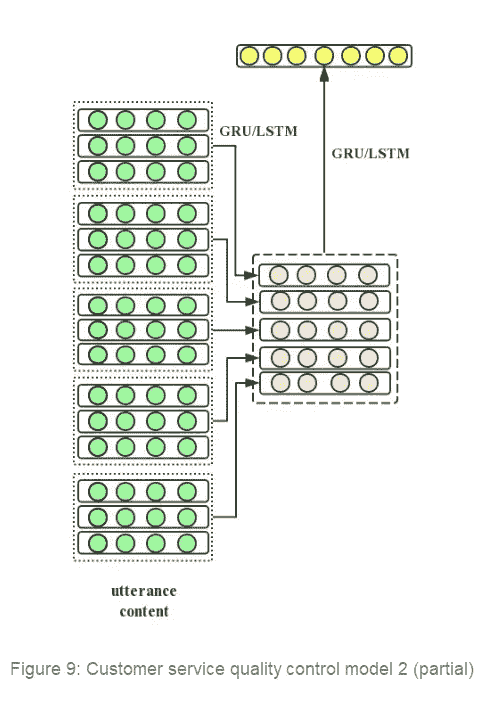

## (3)客户服务质量控制实验结果

表 7 比较了两种上下文语义信息提取模型的性能。结果表明，模型 1 的性能优于模型 2。根据结果，我们需要更加重视当前客户服务话语的语义信息。这样，我们可以利用上下文的语义信息来帮助识别。在实际的模型训练中，GRU 和 LSTM 方法的结果差别不大。然而，GRU 方法比 LSTM 方法快。因此，所有的模型试验都采用 GRU 方法。

除了模型级的模型度量，我们还分析了系统级的模型度量，包括质量检查效率和召回率。我们通过比较我们的模型和以前的人工服务质量检查的结果来获得这两个度量。如表 8 所示，质检效率和召回率都有显著提高。人工质检的召回率更低，因为不可能人工检查所有的客服记录。

# 维度 5:会议满意度评估

## (1)会议满意度

目前，评估智能客户服务系统性能的最重要指标是用户会话满意度。据我们所知，目前还没有关于在智能客户服务系统中自动评估用户会话满意度的研究结果。

为了解决智能客服系统中的用户会话满意度评估问题，提出了一种会话满意度分析模型，以更好地反映当前用户对智能客服的满意度。由于不同的用户有不同的评价标准，当会话内容、答案来源、情感信息完全相同时，可能会出现很多情感类别不一致的情况。因此，我们使用了两种模型训练方法:一种方法是训练分类模型来拟合情感类别(满意、中立和不满意)。另一种方法是训练回归模型来拟合会话中的情绪分布。最后，我们比较了两种方法的性能。

## (2)会话满意度特征的选择

会话满意度模型考虑各种维度:语义信息(用户话语)、情感信息(通过情感检测模型获得)和答案来源信息(当前话语中答案的来源)。

语义信息是用户与智能客服系统交流过程中表达的内容信息。该信息允许我们基于用户话语更好地表示当前用户满意度。我们在模型中使用的语义信息是来自会话的多轮话语信息。为了确保模型每次都能在同一回合中处理话语，我们在实验期间只使用会话中的最后四个句子。这是因为会话数据分析显示，会话结束时的用户语义信息与总体满意度更相关。例如，如果用户在会话结束时表示感谢，这表明用户基本上是满意的。如果用户表达了批评意见，这表明用户不满意。

通常，情感信息作为用户满意度的重要参考。当用户表现出愤怒、谩骂等极端情绪时，用户会举报不满的概率极高。这里，情感信息被一一对应地映射到语义信息中的话语。然后，我们可以从选择的几轮话语中识别情感，以获得情感类别信息。

答案来源信息可以反映用户遇到的问题。不同的答案来源代表不同的业务场景，不同场景下用户满意度差异显著。比如用户在投诉和维权场景下比在咨询场景下更容易表达不满。

## (3)会话满意度模型

本文提出了一个基于语义、情感和回答源特征的会话满意度评估模型。该模型充分考虑会话中的语义信息，通过数据压缩充分表达情感信息和答案来源信息。图 10 显示了模型结构。

语义特征的提取:使用分层 GRU 或 LSTM 来提取语义信息。第一层用于获得每个话语的句子表达(图 10 中的第一层 GRU/LSTM)。第二层用于基于第一层的句子表达结果获得多轮话语的高阶表达(图 10 中的第二层 GRU/LSTM)。

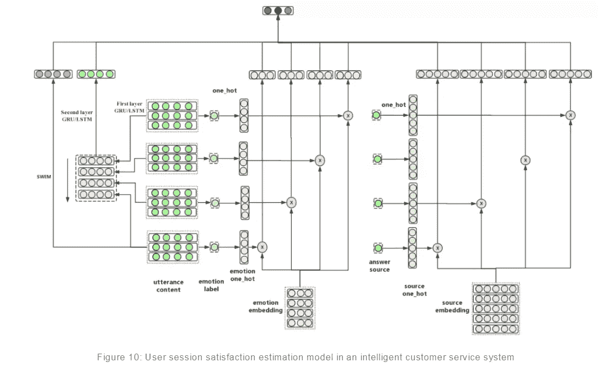

这充分利用了用户话语的序列信息。此外，还获得了最后一个话语的 SWEM 特征，以增强最后一个话语的语义特征影响。

情感特征的提取:获得的情感特征是一热型的，其特点是数据稀疏，无法表达情感之间的直接关系。因此，我们学习了情感嵌入，以更好地表达情感特征。

答案源特征的提取:初始答案源特征也是一热式的，但是稀疏数据是由 50 多种答案源造成的。因此，必须对特征进行压缩。我们还学习了答案源嵌入来表达答案源特征。

模型预测层:我们分别尝试了满意度类别预测和满意度分布预测。前一种方法使用分类模型，后一种方法使用回归模型。

## (4)会话满意度评估的实验结果

图 11 显示了实验结果。根据实验结果，该分类模型的满意度估计性能较差，结果平均比实际用户反馈高 4%以上。回归模型在预测用户反馈方面更好，并且减少了由于少量样本而导致的结果波动。因此，回归模型符合我们的预期。如表 9 所示，回归模型的平均值和来自用户反馈的结果之间的差异仅为 0.007。这将以前的方差减少了三分之一，证明了回归模型的有效性。

# 摘要

本文总结了情感分析能力在智能客服系统中的应用，介绍了相关模型，并展示了它们的性能。虽然情感分析功能已经广泛应用于智能客服系统的人机对话中，但这仅仅代表了一个良好的开端。情感分析需要在赋予智能客服系统类似人类的能力方面发挥更大的作用。

# 原始来源:

 [## 情绪分析技术:让自动化客户服务更加智能

### Samuel _ Song 年 12 月 9 日 428 由宋双勇、王超、、在回答客户的…

www.alibabacloud.com](https://www.alibabacloud.com/blog/emotion-analysis-technology-making-automated-customer-service-more-intelligent_596986)  [## 医生管理工作量增加时的深度学习|数据驱动的投资者

### 行政工作量是我们这个时代大多数医生所经历的众多负担之一。医生，尤其是…

www.datadriveninvestor.com](https://www.datadriveninvestor.com/2020/11/27/deep-learning-amid-increased-physician-administrative-workload/) 

**进入专家视角—** [**订阅 DDI 英特尔**](https://datadriveninvestor.com/ddi-intel)