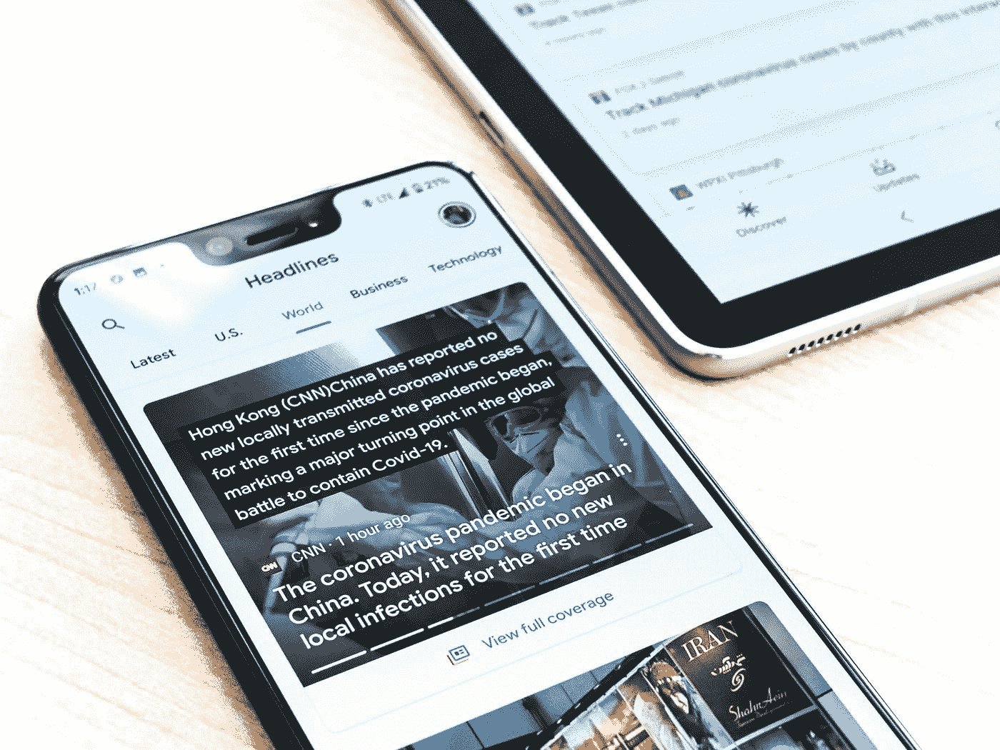

# 情商与媒体

> 原文：<https://medium.datadriveninvestor.com/emotional-intelligence-and-the-media-ec7f2b1e694a?source=collection_archive---------10----------------------->

## 情商

## 我们胃里的结是第一世界的问题吗？

Photo by [Obi Onyeador](https://unsplash.com/@thenewmalcolm?utm_source=medium&utm_medium=referral) on [Unsplash](https://unsplash.com?utm_source=medium&utm_medium=referral)

在[变得情绪聪明](https://medium.com/swlh/becoming-emotionally-intelligent-4970101af3ce)和[一个情绪学校](https://medium.com/swlh/a-school-of-emotion-cbfb91c612de)中，我们探索了当与更有形的成就相比时，情绪智力通常是如何被置于次要位置的。我们下意识地被劝阻不要去挑刺我们的情感结，前提是它们不值得我们去烦恼，并且会随着时间的推移自行解决。

> “忽视情感上的痛苦，并希望它们会自行解决，这是一条危险的道路。这就像推迟一个重大的救命手术，希望我们的身体会奇迹般地自我修复。”

虽然时间确实有治愈的作用，但是忽视情感上的痛苦并希望它们会自己解决是一条危险的道路。这就像推迟一个重大的、拯救生命的手术，并希望我们的身体会奇迹般地自我修复。虽然我不会说这是不可能的，但积极的结果是不太可能的。那么，为什么我们要推迟治愈自己的情绪呢？虽然我们都有个人的激励因素，但一个共同的趋势是把它们当作第一世界的问题而不予考虑。

大众媒体非常有效地用任何发生在我们星球上任何地方的不愉快的、痛苦的或可怕的事情来轰炸我们。无论是森林火灾、恐怖袭击，还是偶尔发生的疫情，我们的新闻频道和信息流将确保我们了解所有的事情。当我们(下意识地)将我们的情感问题与我们周围的物质困难相比较时，它们可能显得微不足道——几乎无足轻重。

有没有听过有人抱怨自己的充电线太短，或者永远找不到自己的 AirPods 的事实？无论他们提出多么有力的理由，与饥饿或绝对贫困的概念相比，这些第一世界的问题听起来总是微不足道的(除非我们是抱怨的人)。同样适用于我们的情绪状态；我们觉得我们胃里的结不应该和更紧迫的公共灾难一样重要。

> “大众媒体非常有效地用我们星球上任何地方发生的任何不愉快、令人痛苦或可怕的事情来轰炸我们。”

所以我们应该顺其自然吗？我们应该把我们的孤独、焦虑、愤怒和屈辱的感觉和不正确冷冻的葡萄酒一样对待吗？这样做将是一个严重的错误。正如我们在[之前的一篇文章](https://danielcaruanasmith.medium.com/who-to-turn-to-c13067f92a67)中强调的，人类总是感觉需要发泄；安全释放压抑情绪的地方。这可能采取了不同的形式；然而，宗教或文化等等，它一直存在。

允许媒体间接说服我们，生活中有比我们个人审判更重要的事情，可能会产生非常严重的后果。不断上升的抑郁、焦虑和自杀率都表明了这一点。

> “我们觉得，我们心里的疙瘩不应该得到与更紧迫的公共灾难同等的重视。”

这个问题与我们当前社会对经济增长的不断推动毫无关系。我们被引导去相信，要想在生活中取得成功，我们需要财务稳定，能够生活，而不仅仅是生存。具有讽刺意味的是，只有当我们感到满足时，我们争取经济安全的斗争才是有价值的，否则，我们将冒着既不能生存也不能幸存的风险——仅仅是生存而已。

我们周围相对富足的环境往往是我们最大的敌人，让我们更加努力地工作，只是为了与周围的人保持“一致”(损害我们的情感自我)。

> “我们应该把我们的孤独、焦虑、愤怒和屈辱的感觉和不正确冷冻的葡萄酒一样对待吗？这样做将是一个严重的错误。”

那么这里的寓意是什么呢？我们应该忽视物质财富，依赖大量的情感和精神指导吗？事实上，即使这篇文章是货币化倾向于乞求相反。

我们最好的办法是感知情感考验的本质；与全球灾难相比，这或许是次要问题，但也不是不可忽视的问题。

承认这样一个事实，即我们的情感存在需要和我们的身体一样多的关心和关注，这是把我们自己建设成更有情感弹性和更聪明的存在的良好开端。

*原文链接:*

 [## 情感教育？

### 我们在学校没学过的东西。

medium.com](https://medium.com/swlh/emotional-education-3913af04a2a1) 

*链接到下一篇文章:*

 [## 感情完美？

### 我们的祖先更清楚

danielcaruanasmith.medium.com](https://danielcaruanasmith.medium.com/emotional-perfection-11fff04549e0) 

丹尼尔是马耳他的作家、高级教师和地理学家。他的主要热情是让学生实现他们的愿望和达到他们的目标。

