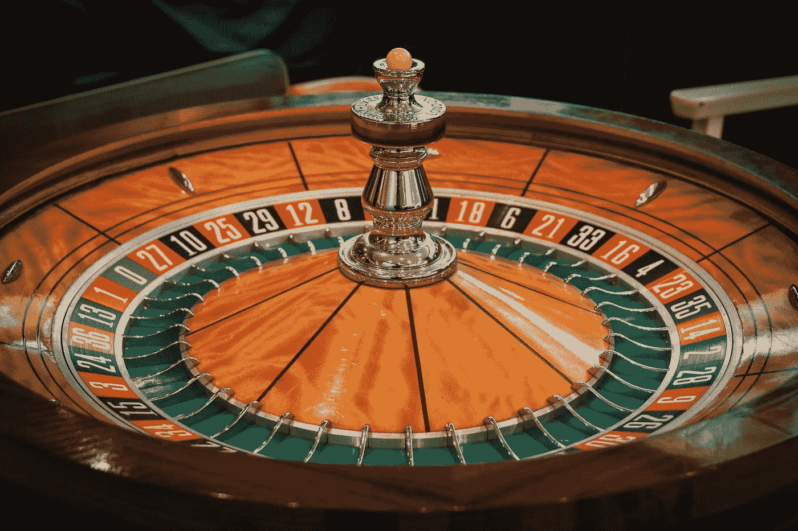

# 情绪和投资

> 原文：<https://medium.datadriveninvestor.com/emotions-and-investing-c6f1a8049bd?source=collection_archive---------5----------------------->

Photo by [JESHOOTS.COM](https://unsplash.com/@jeshoots?utm_source=medium&utm_medium=referral) on [Unsplash](https://unsplash.com?utm_source=medium&utm_medium=referral)

## 我们不能把两者分开，但我们需要尝试

当我们在投资上赔钱时，感觉很糟糕。我们会想到可能会发生什么(如果我只投资了另一只股票，我会涨 20%，而不是跌 30%！).或者，我们会因为在几分钟内失去了相当于一块美味牛排的美元而自责，或者在不幸的一周中痛饮一次假期。

然后情绪开始流动。首先我们感到沮丧和困惑:

> “刚刚发生了什么？”

接下来，我们变得固执、骄傲和愤怒。人们讨厌犯错——我敢打赌，我们讨厌犯错的程度甚至超过我们讨厌赔钱的程度:

> “我没有错。这个市场是错误的。最终每个人都会同意我的观点。我只需要坚持下去，直到我被证明是正确的。”

与此同时，随着我们变得越来越固执(损失越来越多的钱)，我们也越来越渴望扭转局面。最重要的是——担心我们卖出的第二笔交易就会出现转机:

> “我现在不能卖。我只知道这只该死的股票会在我按下卖出按钮的那一刻反弹。如果发生这种情况，我会崩溃的。”

这就是小损失膨胀成大损失的原因。

 [## 投资区块链前要问的三个简单问题(也是一个困难的问题)|数据…

### 现在是了解区块链的最佳时机。不同货币之间的增长率，比如…

www.datadriveninvestor.com](https://www.datadriveninvestor.com/2020/03/12/three-simple-questions-and-one-difficult-one-to-ask-before-investing-in-a-blockchain/) 

# 投资的情感方面

我认为我们的情绪和投资组合的表现之间的反馈回路没有得到足够的重视。这个反馈回路在上升和下降的过程中都影响着我们。

当事情进展顺利，我们开始赚钱时，我们会觉得自己是天才。我们放松了研究和尽职调查。更不知不觉地，我们变得贪婪。你有多少次想过，“如果我的投资组合能达到这么多，我就很开心了。”然后你终于到达那里，你甚至几乎没有花时间去欣赏你的成就——你已经在寻找下一个里程碑的冲刺了。我知道我对此感到内疚。这是 FOMO(害怕错过)和贪婪的奇怪混合，让我们对每一个新的里程碑的欣赏都比上一个少；然而讽刺的是，这让我们更加渴望下一个里程碑。

> 实际上，这是一种上瘾。

这就是危险所在。我所描述的情绪和想法可以很容易地描述一个赌徒和一个投资者。

当事情不顺利的时候，那就更可怕了。亏损让我们承受巨大的精神压力，这影响了我们的决策。我们开始做出情绪化的决定，比如双倍下注或继续持有，尽管有迹象表明投资可能会归零。我们甚至会猛烈抨击那些与我们意见相左的人，或者那些试图阻止我们走上这条路的我们所爱的人。在这一点上，客观和理性的思考和分析变得几乎不可能。如果我们让事情变得复杂，投资失误的负面影响甚至可能开始渗透到我们的职业和个人生活中。

Photo by [Macau Photo Agency](https://unsplash.com/@macauphotoagency?utm_source=medium&utm_medium=referral) on [Unsplash](https://unsplash.com?utm_source=medium&utm_medium=referral)

# 那么投资是赌博吗？

如果我说投资和赌博没有任何共同之处，那我就是在撒谎。投资是对未来两件事之一会发生的押注——(1)你投资的公司的利润增长速度将快于预期，或者(2)投资者持有股票所需的回报下降(全面提高股票估值)。

尽管我们的分析可能很完整，但我们最终结果的一个巨大驱动力永远是机遇。我们可以成为精明的分析师，找出一批我们有 60%机会赚钱的投资(每笔投资的赔率都对我们有利)。然而，如果我们非常不幸，这些投资中有足够多的零回报，我们仍可能以亏损告终。

此外，不可能知道每一次投硬币的几率是多少。我们掷的是有利的硬币、公平的硬币还是不公平的硬币(胜算对我们不利)？我们无法确定。所以我们每项投资都是在下两个赌注:

1.  我们打赌我们实际上有才能和资源来识别有利的投资(即有超过 50%的机会为我们赚钱的投资)。
2.  并且投资硬币会正面朝上(即使一枚硬币有 90%的机会正面朝上，但仍有 10%的机会反面朝上)。

所以本质上，作为一个投资者，要想在短期内赚钱，你必须既能以一种给你优势的方式分析信息(累积对你有利的赔率),又能在你下注时幸运地掷硬币。

让我们将这与赌博进行对比。在赌博中，无论是二十一点还是轮盘赌，赔率都对你不利(但要事先知道)。假设我们玩得最优(一个很大的假设)，那么唯一驱动我们游戏结果差异的是运气。本质上，我们是在一次又一次地投掷一枚不公平的硬币，并希望获得幸运。相比之下，在投资中(在理想的情况下)，我们一次又一次地投掷有利的硬币——我们越是能够这样做，大数法则就越有利于我们(我们成为赌场而不是赌徒)。

所以我们识别优势投资(有利币)的能力决定了我们是投资还是赌博。

# 那么情绪从何而来呢？

回想一下，最优赌博和最优投资都要求我们能够根据情况进行分析和执行。例如，在玩 21 点时，因为已经输了几手牌而害怕出手，或者越来越多地下注试图赢回我们输的钱，这两种情况都是破产的必然选择。但即使知道这一点，在赔钱的压力下也很难保持冷静。

投资也是一样。投资策略需要一致的行为和风险敞口——在每次抛硬币时下注相对恒定的金额，这样就不会有一次下注让我们破产，随着时间的推移，我们可以利用大数法则。这听起来像是一个简单的计划——不管怎样，只要一遍又一遍地下同样的赌注就行了。).但是当损失开始增加，你周围的每个人都开始紧张和恐慌(并质疑你的行为)，实际上很难不屈服于我们的情绪，做一些愚蠢的事情。

此外，当我们承受压力并情绪化投资时，我们进行客观和理性分析的能力会下降。不管实际价值如何，我们倾向于偏重证实我们偏见和投资定位的证据——这样做，我们就失去了做出正确决策的能力。

真的，我想得越多，投资的情感方面听起来越像赌博:

*   贪婪，毫无根据的乐观，以及看着别人赢而产生的 FOMO 把我们吸进去，让我们赌得比我们输不起的还要多。
*   恐惧、后悔、愤怒和固执导致我们将投资归零(或者更糟的是负债)，一掷千金，或者最终在最不合适的时候恐慌性抛售。

# 那我们该怎么办？

这里没有简单的答案。处理你的情绪是困难的，控制情绪的能力因人而异。最简单的方法是通过自动算法进行投资，比如机器人顾问，定期根据商定的资产配置进行再平衡。对于大多数人来说，这可能是最好的方法，尤其是那些既没有时间也没有兴趣学习理财的细节的人。

Photo by [Glenn Carstens-Peters](https://unsplash.com/@glenncarstenspeters?utm_source=medium&utm_medium=referral) on [Unsplash](https://unsplash.com?utm_source=medium&utm_medium=referral)

但是，如果你像我一样，只是喜欢在资本市场中或周围活动，那该怎么办呢？我们如何才能最好地防止我们的情绪破坏我们的投资组合，使我们与我们的血汗钱分离？以下是对我有效的方法的清单，没有特别的顺序(很多都是多年来在赔钱的时候学到的):

*   认识并尊重机会和运气在你投资结果中的作用。当你赚钱时，你永远不会像你认为的那样聪明；当你亏损时，你永远不会像你认为的那样愚蠢。
*   诚实地面对你是否真的有优势。真正差异化的见解很少。不要在高估了自己投资优势的投资上押下重注。
*   不要全进或全出。转移你的整个投资组合(即使不是很大的投资组合)在精神上是很费力的。如果你在错误的时间这么做(即在市场大幅上涨前卖出，或在崩盘前买入)，它会让你精神混乱，让你拼命追逐你错过的东西(几乎肯定会亏钱)。
*   相反，在有利和容易的时候，逐步增加或减少仓位。当投资上升时卖出一点，当投资下降时买入一点。
*   如果它已经出现在新闻中或社交媒体上，那么容易获得的东西就没有了。不要追。
*   在高度紧张和波动的时期，最难做的投资或交易通常是正确的。我们的勇气通常会把我们推向人群奔向的任何地方。在压力大的时候，人群通常是错误的。
*   不要太依赖某个特定的投资组合数字。这就像在赌场里，当人们太在乎赢回他们最初的美元金额时，他们往往会输掉所有的钱。如果晚上不顺心，最好带着 300 美元离开，然后输掉所有的钱，试图赚回最初的 500 美元。
*   关注你可能会失去多少，而不是你可能会得到多少(有各种各样的计算器可以估算，只需谷歌搜索一下就可以了)。如果你对损失金额不满意，减少你的赌注。
*   不要看得太频繁。如果你投资了财务健康、竞争力强的公司，时间就是你的朋友。你检查得越少，让时间流逝得越多，你就越有可能看到利润——绿色比红色压力小得多。

干杯，投资愉快！